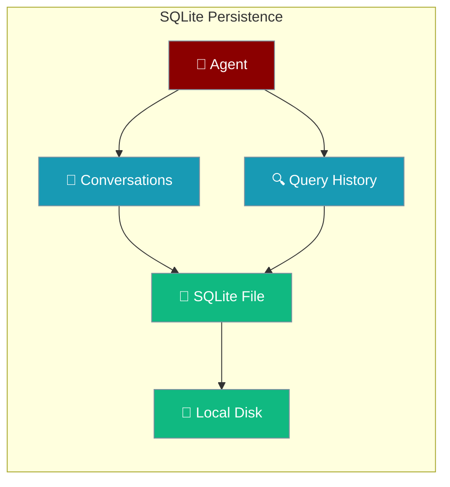
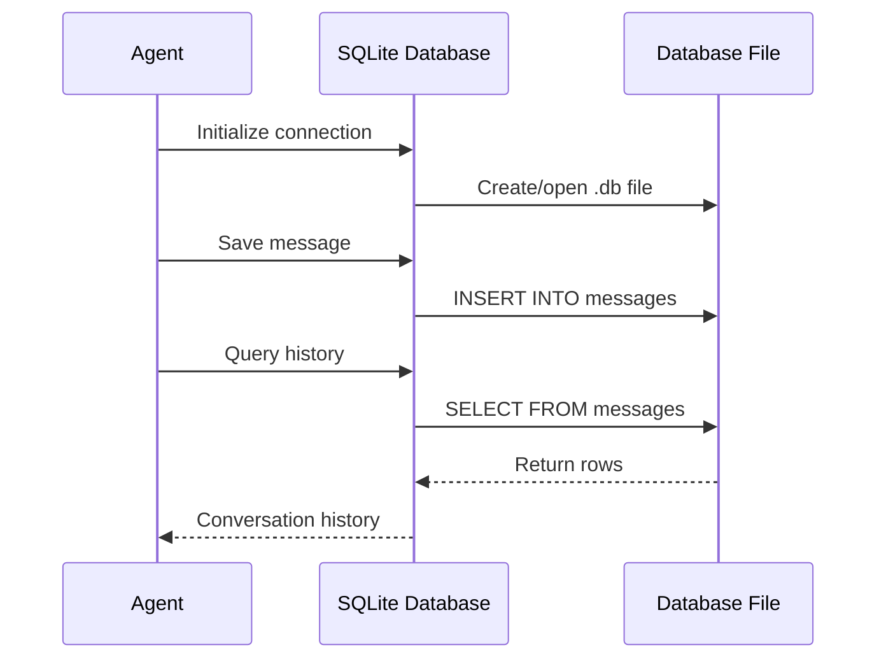

SQLite provides local file-based SQL database persistence, perfect for development, prototypes, and single-instance applications that need reliable data storage without external dependencies. Choose between sync and async implementations based on your use case.



## Sync vs Async

Choose the right SQLite implementation for your needs:

```mermaid
graph TB
    Q1{Plain Python script<br/>or multi-agent?} -->|Sync script / multi-thread| SYNC[sync_sqlite<br/>mode="sync"]
    Q1 -->|Inside FastAPI / asyncio| ASYNC[async_sqlite<br/>mode="async"]
    Q1 -->|Not sure| AUTO[mode="auto"<br/>legacy behaviour]

    classDef sync fill:#10B981,stroke:#7C90A0,color:#fff
    classDef async fill:#189AB4,stroke:#7C90A0,color:#fff
    classDef auto fill:#F59E0B,stroke:#7C90A0,color:#fff

    class SYNC sync
    class ASYNC async
    class AUTO auto
```

## Quick Start

<Steps>
<Step title="Sync - Multi-Agent Safe">
```python
from praisonai.persistence.factory import create_conversation_store

store = create_conversation_store(
    "sqlite",
    path="./conversations.db",
    mode="sync",
)
```
</Step>

<Step title="Async - FastAPI/Asyncio">
```python
store = create_conversation_store(
    "sqlite",
    path="./conversations.db",
    mode="async",
)
```
</Step>

<Step title="Auto (Legacy)">
```python
store = create_conversation_store(
    "sqlite",
    path="./conversations.db",
)
```
</Step>
</Steps>

<Warning>
Before PR #1763, `AsyncSQLiteConversationStore` exposed sync wrappers like `get_session(...)` you could call from a regular function. Those wrappers were removed. If you were calling the async SQLite store from sync code, switch to `mode="sync"` (the new `sync_sqlite` backend) — it's purpose-built for that.
</Warning>

---

## How It Works



SQLite stores conversation data in tables within a single file:

| Table | Content | Purpose |
|-------|---------|---------|
| `sessions` | Session metadata | Track conversation sessions |
| `messages` | User and agent messages | Complete conversation history |
| `runs` | Agent execution runs | Track agent processing steps |
| `tool_calls` | Tool usage | Record function calls and results |

---

## Configuration Options

### Mode Parameter

| Option | Type | Default | Description |
|---|---|---|---|
| `mode` | `"sync" \| "async" \| "auto"` | `"auto"` | Pick the sync (`sync_sqlite`) or async (`async_sqlite`) implementation. `"auto"` preserves pre-#1763 behaviour. Invalid values raise `ValueError`. |
| `path` (sync store) | `str` | `"praisonai_conversations.db"` | SQLite file path. Falls back to `url` if both are passed. |
| `table_prefix` (sync store) | `str` | `"praison_"` | Validated identifier; rejected if non-alphanumeric. |

### Database URL Format
```python
# Simple file path
db(database_url="sqlite:///conversations.db")

# Absolute path
db(database_url="sqlite:////absolute/path/to/database.db")

# Relative path with subdirectory
db(database_url="sqlite:///data/agent_storage.db")

# In-memory database (temporary)
db(database_url="sqlite:///:memory:")
```

### Advanced Configuration
```python
from praisonai.persistence.factory import create_conversation_store

# Sync store with custom table prefix
store = create_conversation_store(
    "sqlite",
    path="./data/agents.db",
    mode="sync",
    table_prefix="custom_"
)

# Async store
store = create_conversation_store(
    "sqlite", 
    path="./data/agents.db",
    mode="async"
)
```

---

## Session Resume Example

```python
from praisonaiagents import Agent, db

# First conversation
agent1 = Agent(
    name="Assistant",
    db=db(database_url="sqlite:///memory.db"),
    session_id="user-alice"
)

agent1.chat("My favorite color is blue")
agent1.chat("I work as a software engineer")

# Simulate application restart
agent1 = None

# Resume conversation - automatically loads history
agent2 = Agent(
    name="Assistant", 
    db=db(database_url="sqlite:///memory.db"),
    session_id="user-alice"  # Same session ID
)

response = agent2.chat("What's my favorite color and job?")
print(response)  # Will reference blue color and software engineering
```

---

## Direct Database Access

For advanced use cases, query the SQLite database directly:

```python
import sqlite3
from praisonaiagents import Agent, db

# Create agent and have conversation
agent = Agent(
    name="DataBot",
    db=db(database_url="sqlite:///analytics.db"),
    session_id="data-session"
)

agent.chat("Analyze quarterly sales data")

# Direct database access for reporting
conn = sqlite3.connect("analytics.db")
cursor = conn.cursor()

# Query conversation history
cursor.execute("""
    SELECT role, content, created_at 
    FROM messages 
    WHERE session_id = 'data-session'
    ORDER BY created_at
""")

messages = cursor.fetchall()
for role, content, timestamp in messages:
    print(f"[{timestamp}] {role}: {content}")

conn.close()
```

---

## Production Considerations

<AccordionGroup>
<Accordion title="File Permissions and Location">
- Ensure the application has write permissions to the database directory
- Use absolute paths for production deployments
- Consider using environment variables for database paths
- Back up the .db file regularly
</Accordion>

<Accordion title="Concurrent Access">
- SQLite supports multiple readers but only one writer
- The `sync_sqlite` backend (`mode="sync"`) provides per-call connection locking (`threading.RLock`) for multi-agent scenarios
- Use WAL mode for better concurrency: `PRAGMA journal_mode=WAL`
- Consider connection pooling for multi-threaded applications
- For high concurrency, migrate to PostgreSQL or MySQL
</Accordion>

<Accordion title="Database Maintenance">
- Monitor database file size growth
- Use `VACUUM` periodically to reclaim space
- Implement log rotation for old conversations
- Set up automated backups of the .db file
</Accordion>

<Accordion title="Migration Path">
- Start with SQLite for development and MVP
- SQLite can handle thousands of conversations efficiently
- Migrate to PostgreSQL when you need multi-instance deployment
- Export data using SQL dumps for migration
</Accordion>
</AccordionGroup>

---

## Related

<CardGroup cols={2}>
<Card title="PostgreSQL Persistence" icon="elephant" href="/docs/features/persistence-postgres">
  Scale up to production PostgreSQL when you outgrow SQLite
</Card>
<Card title="Database Persistence Overview" icon="database" href="/docs/features/persistence">
  Compare all available persistence backends
</Card>
</CardGroup>