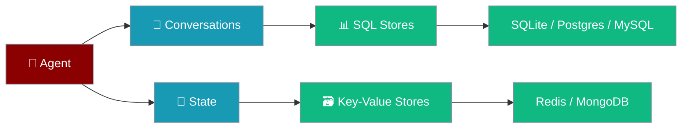
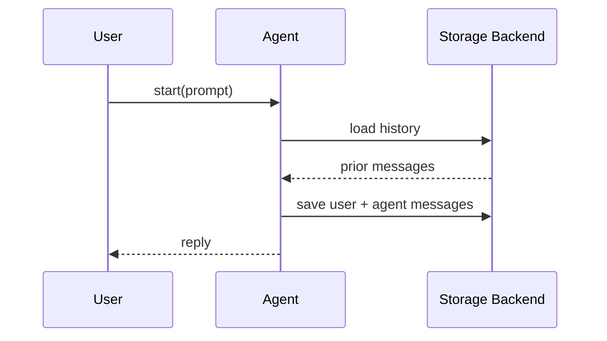

Database persistence keeps conversation history and state across restarts — pick a backend for your scale.

```python
from praisonaiagents import Agent, db

agent = Agent(
    name="Assistant",
    instructions="You are a helpful assistant.",
    db=db(database_url="sqlite:///conversations.db"),
    session_id="my-session",
)
agent.start("Hello — saved automatically")
```



## Quick Start

<Steps>
<Step title="Simple Usage">

```python
from praisonaiagents import Agent, db

agent = Agent(
    name="Assistant",
    db=db(database_url="sqlite:///conversations.db"),
    session_id="session-1",
)
agent.start("Hello!")
```

</Step>

<Step title="With Configuration">

Hybrid setup — SQL for conversations, Redis for state:

```python
import os
from praisonaiagents import Agent, db

agent = Agent(
    name="Assistant",
    db=db(
        database_url=os.getenv("PRAISON_CONVERSATION_URL", "sqlite:///conversations.db"),
        state_url=os.getenv("PRAISON_STATE_URL", "redis://localhost:6379"),
    ),
    session_id="hybrid-session",
)
agent.start("Conversations in SQL, state in Redis")
```

</Step>
</Steps>

---

## How It Works



| Component | Purpose | Example backends |
|-----------|---------|------------------|
| **ConversationStore** | Messages, sessions, metadata | SQLite, PostgreSQL, MySQL |
| **StateStore** | Application state, key-value data | Redis, MongoDB |
| **DefaultSessionStore** | File-based sessions | JSON files on disk |

---

## Storage Backend Options

<CardGroup cols={2}>
<Card title="SQLite" icon="database" href="/docs/features/persistence-sqlite">
  Local file database for development and single-instance apps
</Card>
<Card title="PostgreSQL" icon="elephant" href="/docs/features/persistence-postgres">
  Production SQL with JSONB and connection pooling
</Card>
<Card title="MySQL" icon="database" href="/docs/features/persistence-mysql">
  Popular SQL database with broad tooling support
</Card>
<Card title="Redis" icon="cubes-stacked" href="/docs/features/persistence-redis">
  Fast in-memory state store
</Card>
<Card title="MongoDB" icon="leaf" href="/docs/features/persistence-mongodb">
  Flexible document store for complex state
</Card>
<Card title="ClickHouse" icon="chart-line" href="/docs/features/persistence-clickhouse">
  Analytics database for large-scale data
</Card>
<Card title="JSON Files" icon="file-code" href="/docs/features/persistence-json">
  Simple file-based storage with cross-platform locking
</Card>
</CardGroup>

---

## Configuration Options

| Parameter | Description |
|-----------|-------------|
| `database_url` | Conversation store URL |
| `state_url` | State / run history store |
| `knowledge_url` | Vector or knowledge store |

```python
import os
from praisonaiagents import Agent, MemoryConfig, db

agent = Agent(
    name="Researcher",
    memory=MemoryConfig(
        db=db(
            database_url=os.getenv("PRAISON_CONVERSATION_URL"),
            state_url=os.getenv("PRAISON_STATE_URL"),
        ),
        session_id="research-42",
    ),
)
agent.start("Continue our research thread")
```

<Note>
Database backends require the `praisonai` wrapper (`pip install praisonai`). The core SDK defines `DbAdapter`; implementations live in `praisonai.persistence`.
</Note>

---

## Best Practices

<AccordionGroup>
<Accordion title="Choose the right backend">
SQLite for development; PostgreSQL or MySQL for multi-user production; Redis for fast state; JSON files for minimal dependencies.
</Accordion>
<Accordion title="Use meaningful session IDs">
Set `session_id="user-123"` so conversations resume reliably across restarts.
</Accordion>
<Accordion title="Read credentials from the environment">
Never hardcode database URLs — use `os.getenv("PRAISON_CONVERSATION_URL")`.
</Accordion>
<Accordion title="Separate stores by concern">
Conversation history, run traces, and vectors scale differently — configure each URL independently.
</Accordion>
</AccordionGroup>

---

## Related

<CardGroup cols={2}>
<Card title="Database Persistence (Advanced)" icon="database" href="/docs/features/database-persistence">
  MemoryConfig, CLI commands, and Docker setup
</Card>
<Card title="Session Persistence" icon="floppy-disk" href="/docs/features/session-persistence">
  JSON file sessions without a database
</Card>
</CardGroup>
