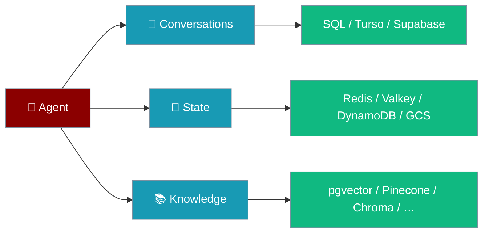
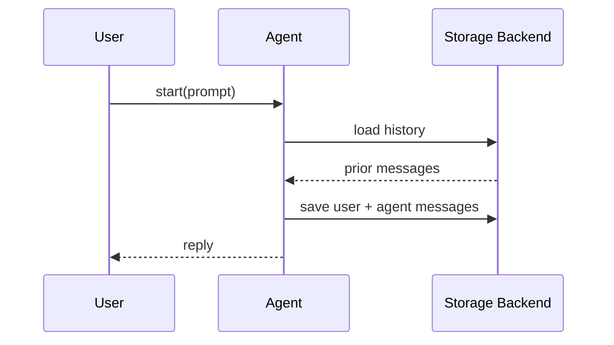

Database persistence keeps conversation history and state across restarts — pick a backend for your scale.

```python
from praisonaiagents import Agent, db

agent = Agent(
    name="Assistant",
    instructions="You are a helpful assistant.",
    db=db(database_url="sqlite:///conversations.db"),
    session_id="my-session",
)
agent.start("Hello — saved automatically")
```


The user returns later; the configured backend restores conversation history and agent state.



## Quick Start

<Steps>
<Step title="Simple Usage">

```python
from praisonaiagents import Agent, db

agent = Agent(
    name="Assistant",
    db=db(database_url="sqlite:///conversations.db"),
    session_id="session-1",
)
agent.start("Hello!")
```

</Step>

<Step title="With Configuration">

Hybrid setup — SQL for conversations, Redis for state:

```python
import os
from praisonaiagents import Agent, db

agent = Agent(
    name="Assistant",
    db=db(
        database_url=os.getenv("PRAISON_CONVERSATION_URL", "sqlite:///conversations.db"),
        state_url=os.getenv("PRAISON_STATE_URL", "redis://localhost:6379"),
    ),
    session_id="hybrid-session",
)
agent.start("Conversations in SQL, state in Redis")
```

</Step>
</Steps>

---

## How It Works



| Component | Purpose | Example backends |
|-----------|---------|------------------|
| **ConversationStore** | Messages, sessions, metadata | SQLite, PostgreSQL, MySQL |
| **StateStore** | Application state, key-value data | Redis, MongoDB |
| **DefaultSessionStore** | File-based sessions | JSON files on disk |

---

## Storage Backend Options

The registry supports 12 conversation, 9 state, and 20 knowledge backends — configure each store by URL scheme.

<Tabs>
<Tab title="Conversation">

| Backend | Aliases | Best for |
|---------|---------|----------|
| `sqlite` | — | Local development, single instance |
| `sync_sqlite` | `sqlite_sync` | Synchronous file access |
| `async_sqlite` | `aiosqlite`, `sqlite_async` | Async file access |
| `postgres` | `neon`, `cockroachdb`, `crdb`, `cockroach`, `xata` | Production SQL |
| `async_postgres` | `asyncpg`, `postgres_async` | Async Postgres |
| `mysql` | — | Existing MySQL infrastructure |
| `async_mysql` | `aiomysql`, `mysql_async` | Async MySQL |
| `turso` | `libsql` | Serverless SQLite over the network |
| `supabase` | — | Managed Postgres platform |
| `singlestore` | — | Distributed SQL |
| `surrealdb` | — | Multi-model database |
| `json` | — | Zero-dependency file storage |

</Tab>
<Tab title="State">

| Backend | Aliases | Best for |
|---------|---------|----------|
| `memory` | — | In-process, non-persistent |
| `redis` | — | Sub-millisecond in-memory state |
| `valkey` | — | Redis-compatible OSS fork |
| `upstash` | — | Serverless cloud KV |
| `dynamodb` | — | AWS-managed KV |
| `firestore` | — | Google Cloud document store |
| `mongodb` | — | Document-based state |
| `async_mongodb` | `motor`, `mongodb_async` | Async MongoDB |
| `gcs` | — | Object storage (requires `bucket_name`) |

</Tab>
<Tab title="Knowledge">

| Backend | Aliases | Best for |
|---------|---------|----------|
| `chroma` | `chromadb` | Embedded vector store |
| `qdrant` | — | Managed vector search |
| `pinecone` | — | Serverless vector database |
| `weaviate` | — | Hybrid search |
| `lancedb` | — | Embedded columnar vectors |
| `milvus` | — | Scalable vector search |
| `pgvector` | — | Postgres vector extension |
| `redis` | — | Redis vector index |
| `valkey` | — | Valkey vector index |
| `cassandra` | — | Wide-column vectors |
| `clickhouse` | — | Analytics-backed vectors |
| `mongodb_vector` | `mongodb_atlas`, `mongo_vector` | MongoDB Atlas vectors |
| `couchbase` | — | Distributed document vectors |
| `singlestore_vector` | `singlestore_v` | Distributed SQL vectors |
| `surrealdb_vector` | `surrealdb_v` | Multi-model vectors |
| `upstash_vector` | `upstash_v` | Serverless vector KV |
| `cosmosdb` | `cosmos`, `azure_cosmos`, `cosmosdb_vector` | Azure Cosmos DB vectors |
| `lightrag` | — | Graph-augmented retrieval |
| `langchain` | `langchain_adapter` | LangChain vector adapter |
| `llamaindex` | `llama_index`, `llamaindex_adapter` | LlamaIndex adapter |

</Tab>
</Tabs>

Dedicated guides exist for the most common backends:

<CardGroup cols={2}>
<Card title="SQLite" icon="database" href="/docs/features/persistence-sqlite">
  Local file database for development and single-instance apps
</Card>
<Card title="PostgreSQL" icon="elephant" href="/docs/features/persistence-postgres">
  Production SQL with JSONB and connection pooling
</Card>
<Card title="MySQL" icon="database" href="/docs/features/persistence-mysql">
  Popular SQL database with broad tooling support
</Card>
<Card title="Redis" icon="cubes-stacked" href="/docs/features/persistence-redis">
  Fast in-memory state store
</Card>
<Card title="MongoDB" icon="leaf" href="/docs/features/persistence-mongodb">
  Flexible document store for complex state
</Card>
<Card title="ClickHouse" icon="chart-line" href="/docs/features/persistence-clickhouse">
  Analytics database for large-scale data
</Card>
<Card title="JSON Files" icon="file-code" href="/docs/features/persistence-json">
  Simple file-based storage with cross-platform locking
</Card>
</CardGroup>

<Note>
The registry is the authoritative list, not the docs. Call `list_available_backends()` at runtime to discover the current set:

```python
from praisonai.persistence.config import list_available_backends

print(list_available_backends())
# {"conversation": [...], "state": [...], "knowledge": [...]}
```
</Note>

---

## Backend Aliases

Configure with either name — the registry resolves aliases before instantiating the factory ([PraisonAI PR #2669](https://github.com/MervinPraison/PraisonAI/pull/2669)).

| Alias | Resolves to | Store |
|-------|-------------|-------|
| `neon`, `xata`, `cockroachdb`, `crdb`, `cockroach` | `postgres` | Conversation |
| `asyncpg`, `postgres_async` | `async_postgres` | Conversation |
| `aiomysql`, `mysql_async` | `async_mysql` | Conversation |
| `sqlite_sync` | `sync_sqlite` | Conversation |
| `aiosqlite`, `sqlite_async` | `async_sqlite` | Conversation |
| `libsql` | `turso` | Conversation |
| `motor`, `mongodb_async` | `async_mongodb` | State |
| `mongodb_atlas`, `mongo_vector` | `mongodb_vector` | Knowledge |
| `chromadb` | `chroma` | Knowledge |
| `cosmos`, `azure_cosmos`, `cosmosdb_vector` | `cosmosdb` | Knowledge |
| `llama_index`, `llamaindex_adapter` | `llamaindex` | Knowledge |
| `langchain_adapter` | `langchain` | Knowledge |

`PersistenceConfig(state_store="motor").validate()` now succeeds and resolves to `AsyncMongoDBStateStore`. Unknown names still fail loudly, listing the current registry backends.

---

## Configuration Options

| Parameter | Description |
|-----------|-------------|
| `database_url` | Conversation store URL |
| `state_url` | State / run history store |
| `knowledge_url` | Vector or knowledge store |

```python
import os
from praisonaiagents import Agent, MemoryConfig, db

agent = Agent(
    name="Researcher",
    memory=MemoryConfig(
        db=db(
            database_url=os.getenv("PRAISON_CONVERSATION_URL"),
            state_url=os.getenv("PRAISON_STATE_URL"),
        ),
        session_id="research-42",
    ),
)
agent.start("Continue our research thread")
```

<Note>
Database backends require the `praisonai` wrapper (`pip install praisonai`). The core SDK defines `DbAdapter`; implementations live in `praisonai.persistence`.
</Note>

---

## Best Practices

<AccordionGroup>
<Accordion title="Choose the right backend">
SQLite for development; PostgreSQL or MySQL for multi-user production; Redis for fast state; JSON files for minimal dependencies.
</Accordion>
<Accordion title="Use meaningful session IDs">
Set `session_id="user-123"` so conversations resume reliably across restarts.
</Accordion>
<Accordion title="Read credentials from the environment">
Never hardcode database URLs — use `os.getenv("PRAISON_CONVERSATION_URL")`.
</Accordion>
<Accordion title="Separate stores by concern">
Conversation history, run traces, and vectors scale differently — configure each URL independently.
</Accordion>
</AccordionGroup>

---

## Related

<CardGroup cols={2}>
<Card title="Database Persistence (Advanced)" icon="database" href="/docs/features/database-persistence">
  MemoryConfig, CLI commands, and Docker setup
</Card>
<Card title="Session Persistence" icon="floppy-disk" href="/docs/features/session-persistence">
  JSON file sessions without a database
</Card>
</CardGroup>
