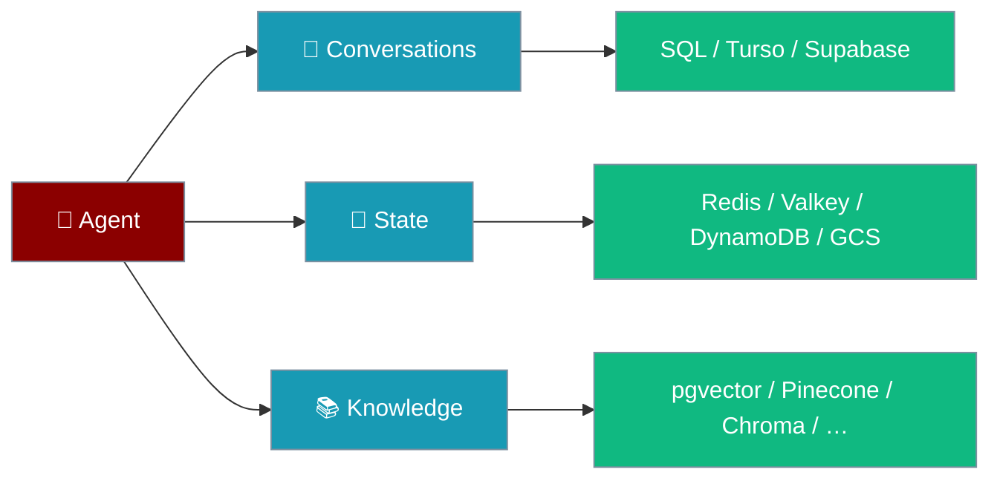
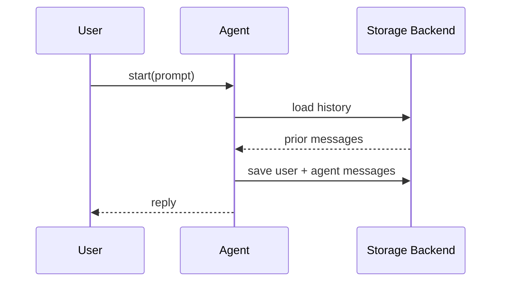
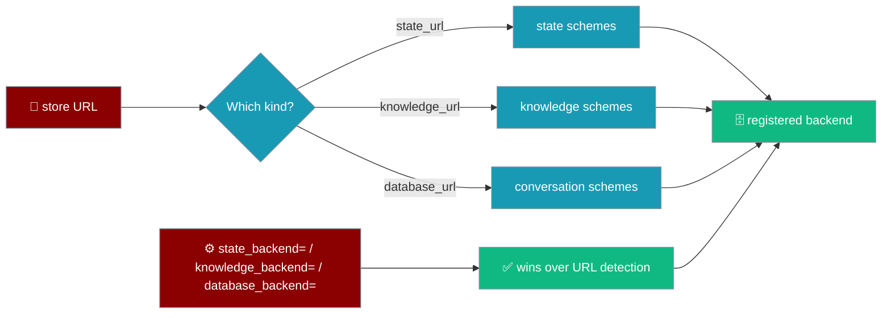

Database persistence keeps conversation history and state across restarts — pick a backend for your scale.

```python
from praisonaiagents import Agent, MemoryConfig
from praisonaiagents import db

agent = Agent(
    name="Assistant",
    instructions="You are a helpful assistant.",
    memory=MemoryConfig(
        db=db(database_url="sqlite:///conversations.db"),
        session_id="my-session",
    ),
)
agent.start("Hello — saved automatically")
```


The user returns later; the configured backend restores conversation history and agent state.


```mermaid
graph LR
    Agent[🤖 Agent] --> Conv[💬 Conversations]
    Agent --> State[🔄 State]
    Agent --> Know[📚 Knowledge]
    Conv --> SQL[SQL / Turso / Supabase]
    State --> KV[Redis / Valkey / DynamoDB / GCS]
    Know --> Vec[pgvector / Pinecone / Chroma / …]

    classDef agent fill:#8B0000,stroke:#7C90A0,color:#fff
    classDef data fill:#189AB4,stroke:#7C90A0,color:#fff
    classDef storage fill:#10B981,stroke:#7C90A0,color:#fff

    class Agent agent
    class Conv,State,Know data
    class SQL,KV,Vec storage
```

## Quick Start

<Steps>
<Step title="Simple Usage">

```python
from praisonaiagents import Agent, MemoryConfig
from praisonaiagents import db

agent = Agent(
    name="Assistant",
    memory=MemoryConfig(
        db=db(database_url="sqlite:///conversations.db"),
        session_id="session-1",
    ),
)
agent.start("Hello!")
```

</Step>

<Step title="With Configuration">

Hybrid setup — SQL for conversations, Redis for state:

```python
import os
from praisonaiagents import Agent, MemoryConfig
from praisonaiagents import db

agent = Agent(
    name="Assistant",
    memory=MemoryConfig(
        db=db(
            database_url=os.getenv("PRAISON_CONVERSATION_URL", "sqlite:///conversations.db"),
            state_url=os.getenv("PRAISON_STATE_URL", "redis://localhost:6379"),
        ),
        session_id="hybrid-session",
    ),
)
agent.start("Conversations in SQL, state in Redis")
```

</Step>
</Steps>

---

## How It Works


```mermaid
sequenceDiagram
    participant User
    participant Agent
    participant Store as Storage Backend

    User->>Agent: start(prompt)
    Agent->>Store: load history
    Store-->>Agent: prior messages
    Agent->>Store: save user + agent messages
    Agent-->>User: reply
```

| Component | Purpose | Example backends |
|-----------|---------|------------------|
| **ConversationStore** | Messages, sessions, metadata | SQLite, PostgreSQL, MySQL |
| **StateStore** | Application state, key-value data | Redis, MongoDB |
| **DefaultSessionStore** | File-based sessions | JSON files on disk |

---

## Storage Backend Options

The registry supports 12 conversation, 9 state, and 20 knowledge backends — configure each store by URL scheme.

<Tabs>
<Tab title="Conversation">

| Backend | Aliases | Best for |
|---------|---------|----------|
| `sqlite` | — | Local development, single instance |
| `sync_sqlite` | `sqlite_sync` | Synchronous file access |
| `async_sqlite` | `aiosqlite`, `sqlite_async` | Async file access |
| `postgres` | `neon`, `cockroachdb`, `crdb`, `cockroach`, `xata` | Production SQL |
| `async_postgres` | `asyncpg`, `postgres_async` | Async Postgres |
| `mysql` | — | Existing MySQL infrastructure |
| `async_mysql` | `aiomysql`, `mysql_async` | Async MySQL |
| `turso` | `libsql` | Serverless SQLite over the network |
| `supabase` | — | Managed Postgres platform |
| `singlestore` | — | Distributed SQL |
| `surrealdb` | — | Multi-model database |
| `json` | — | Zero-dependency file storage |

</Tab>
<Tab title="State">

| Backend | Aliases | Best for |
|---------|---------|----------|
| `memory` | — | In-process, non-persistent |
| `redis` | — | Sub-millisecond in-memory state |
| `valkey` | — | Redis-compatible OSS fork |
| `upstash` | — | Serverless cloud KV |
| `dynamodb` | — | AWS-managed KV |
| `firestore` | — | Google Cloud document store |
| `mongodb` | — | Document-based state |
| `async_mongodb` | `motor`, `mongodb_async` | Async MongoDB |
| `gcs` | — | Object storage (requires `bucket_name`) |

</Tab>
<Tab title="Knowledge">

| Backend | Aliases | Best for |
|---------|---------|----------|
| `chroma` | `chromadb` | Embedded vector store |
| `qdrant` | — | Managed vector search |
| `pinecone` | — | Serverless vector database |
| `weaviate` | — | Hybrid search |
| `lancedb` | — | Embedded columnar vectors |
| `milvus` | — | Scalable vector search |
| `pgvector` | — | Postgres vector extension |
| `redis` | — | Redis vector index |
| `valkey` | — | Valkey vector index |
| `cassandra` | — | Wide-column vectors |
| `clickhouse` | — | Analytics-backed vectors |
| `mongodb_vector` | `mongodb_atlas`, `mongo_vector` | MongoDB Atlas vectors |
| `couchbase` | — | Distributed document vectors |
| `singlestore_vector` | `singlestore_v` | Distributed SQL vectors |
| `surrealdb_vector` | `surrealdb_v` | Multi-model vectors |
| `upstash_vector` | `upstash_v` | Serverless vector KV |
| `cosmosdb` | `cosmos`, `azure_cosmos`, `cosmosdb_vector` | Azure Cosmos DB vectors |
| `lightrag` | — | Graph-augmented retrieval |
| `langchain` | `langchain_adapter` | LangChain vector adapter |
| `llamaindex` | `llama_index`, `llamaindex_adapter` | LlamaIndex adapter |

</Tab>
</Tabs>

Dedicated guides exist for the most common backends:

<CardGroup cols={2}>
<Card title="SQLite" icon="database" href="/features/persistence-sqlite">
  Local file database for development and single-instance apps
</Card>
<Card title="PostgreSQL" icon="elephant" href="/features/persistence-postgres">
  Production SQL with JSONB and connection pooling
</Card>
<Card title="MySQL" icon="database" href="/features/persistence-mysql">
  Popular SQL database with broad tooling support
</Card>
<Card title="Redis" icon="cubes-stacked" href="/features/persistence-redis">
  Fast in-memory state store
</Card>
<Card title="MongoDB" icon="leaf" href="/features/persistence-mongodb">
  Flexible document store for complex state
</Card>
<Card title="ClickHouse" icon="chart-line" href="/features/persistence-clickhouse">
  Analytics database for large-scale data
</Card>
<Card title="JSON Files" icon="file-code" href="/features/persistence-json">
  Simple file-based storage with cross-platform locking
</Card>
</CardGroup>

<Note>
The registry is the authoritative list, not the docs. Call `list_available_backends()` at runtime to discover the current set:

```python
from praisonai.persistence.config import list_available_backends

print(list_available_backends())
# {"conversation": [...], "state": [...], "knowledge": [...]}
```
</Note>

---

## Selecting a backend

The store kind narrows which URL schemes resolve to a registered backend. `database_url=` reaches conversation stores, `state_url=` reaches state stores, and `knowledge_url=` reaches vector stores. Kind-specific schemes take priority over generic `http(s)://` sniffing, so `state_url="mongodb://…"` reaches the MongoDB **state** store rather than falling through to conversation detection.


```mermaid
graph LR
    URL[🔗 store URL] --> Kind{Which kind?}
    Kind -->|state_url| S[state schemes]
    Kind -->|knowledge_url| K[knowledge schemes]
    Kind -->|database_url| C[conversation schemes]
    Override[⚙️ state_backend= / knowledge_backend= / database_backend=] --> Win[✅ wins over URL detection]
    S --> Backend[🗄️ registered backend]
    K --> Backend
    C --> Backend
    Win --> Backend

    classDef input fill:#8B0000,stroke:#7C90A0,color:#fff
    classDef process fill:#189AB4,stroke:#7C90A0,color:#fff
    classDef result fill:#10B981,stroke:#7C90A0,color:#fff

    class URL,Override input
    class Kind,S,K,C process
    class Backend,Win result
```

### URL schemes per store kind

<Tabs>
<Tab title="State schemes">

`state_url=` resolves these schemes to a state backend (from `PraisonAIDB._STATE_URL_SCHEMES`):

| Scheme | Resolves to state backend |
|---|---|
| `redis://`, `rediss://` | `redis` |
| `valkey://` | `valkey` |
| `dynamodb://` | `dynamodb` |
| `firestore://` | `firestore` |
| `mongodb://`, `mongodb+srv://` | `mongodb` |
| `upstash://` | `upstash` |
| `memory://` | `memory` |

</Tab>
<Tab title="Knowledge schemes">

`knowledge_url=` resolves these schemes to a knowledge backend (from `PraisonAIDB._KNOWLEDGE_URL_SCHEMES`):

| Scheme | Resolves to knowledge backend |
|---|---|
| `chroma://`, `chromadb://` | `chroma` |
| `qdrant://` | `qdrant` |
| `weaviate://` | `weaviate` |
| `lancedb://` | `lancedb` |
| `milvus://` | `milvus` |
| `pgvector://` | `pgvector` (rewritten to `postgresql://` before it reaches psycopg2) |
| `surrealdb://` | `surrealdb_vector` |
| `redis://` | `redis` |
| `valkey://` | `valkey` |

</Tab>
</Tabs>

<Note>
`pgvector://` runs over PostgreSQL, so `PraisonAIDB` rewrites `pgvector://host/db` to `postgresql://host/db` before forwarding it to the driver's connection pool. Every other scheme is passed through unchanged.
</Note>

### Explicit backend override

Some registered backends need out-of-band config the URL cannot carry — GCS (`bucket_name`), Cosmos DB (`connection_string` + database + container), and any custom driver whose scheme is not listed above. Reach them by naming the backend explicitly:

```python
from praisonaiagents import Agent, MemoryConfig
from praisonaiagents import db

agent = Agent(
    name="Assistant",
    memory=MemoryConfig(
        db=db(
            state_backend="gcs",            # scheme-less state backend
            state_options={"bucket_name": "my-state-bucket"},
            knowledge_backend="cosmosdb",   # scheme-less knowledge backend
            knowledge_options={
                "connection_string": "AccountEndpoint=…",
                "database": "praison",
                "container": "vectors",
            },
        ),
        session_id="session-1",
    ),
)
agent.start("State in GCS, vectors in Cosmos DB")
```

`database_backend=`, `state_backend=`, and `knowledge_backend=` are **keyword-only** and always win over URL scheme detection — use them to reach any registered backend whose scheme is not auto-inferable (e.g. a private or custom driver).

### Unknown scheme

`PraisonAIDB` fails loudly on a scheme it cannot map, pointing at the override:

```
ValueError: Unable to infer DB backend from URL 'foo://bar';
supported schemes: postgres://, mysql://, sqlite://, redis://, libsql://, http(s)://;
or pass an explicit state_backend= to select a registered state backend
```

---

## Backend Aliases

Configure with either name — the registry resolves aliases before instantiating the factory ([PraisonAI PR #2669](https://github.com/MervinPraison/PraisonAI/pull/2669)).

| Alias | Resolves to | Store |
|-------|-------------|-------|
| `neon`, `xata`, `cockroachdb`, `crdb`, `cockroach` | `postgres` | Conversation |
| `asyncpg`, `postgres_async` | `async_postgres` | Conversation |
| `aiomysql`, `mysql_async` | `async_mysql` | Conversation |
| `sqlite_sync` | `sync_sqlite` | Conversation |
| `aiosqlite`, `sqlite_async` | `async_sqlite` | Conversation |
| `libsql` | `turso` | Conversation |
| `motor`, `mongodb_async` | `async_mongodb` | State |
| `mongodb_atlas`, `mongo_vector` | `mongodb_vector` | Knowledge |
| `chromadb` | `chroma` | Knowledge |
| `cosmos`, `azure_cosmos`, `cosmosdb_vector` | `cosmosdb` | Knowledge |
| `llama_index`, `llamaindex_adapter` | `llamaindex` | Knowledge |
| `langchain_adapter` | `langchain` | Knowledge |

`PersistenceConfig(state_store="motor").validate()` now succeeds and resolves to `AsyncMongoDBStateStore`. Unknown names still fail loudly, listing the current registry backends.

---

## Configuration Options

| Parameter | Description |
|-----------|-------------|
| `database_url` | Conversation store URL |
| `state_url` | State / run history store |
| `knowledge_url` | Vector or knowledge store |
| `database_backend` | Explicit conversation backend name (keyword-only; wins over URL scheme detection) |
| `state_backend` | Explicit state backend name (keyword-only; wins over URL scheme detection) |
| `knowledge_backend` | Explicit knowledge/vector backend name (keyword-only; wins over URL scheme detection) |

See [Selecting a backend](#selecting-a-backend) for the scheme tables and override examples.

```python
import os
from praisonaiagents import Agent, MemoryConfig
from praisonaiagents import db

agent = Agent(
    name="Researcher",
    memory=MemoryConfig(
        db=db(
            database_url=os.getenv("PRAISON_CONVERSATION_URL"),
            state_url=os.getenv("PRAISON_STATE_URL"),
        ),
        session_id="research-42",
    ),
)
agent.start("Continue our research thread")
```

<Note>
Database backends require the `praisonai` wrapper (`pip install praisonai`). The core SDK defines `DbAdapter`; implementations live in `praisonai.persistence`.

`from praisonaiagents import db` binds the callable factory directly. The namespaced `from praisonaiagents.db import db` form still works.
</Note>

---

## Best Practices

<AccordionGroup>
<Accordion title="Choose the right backend">
SQLite for development; PostgreSQL or MySQL for multi-user production; Redis for fast state; JSON files for minimal dependencies.
</Accordion>
<Accordion title="Use meaningful session IDs">
Set `session_id="user-123"` so conversations resume reliably across restarts.
</Accordion>
<Accordion title="Read credentials from the environment">
Never hardcode database URLs — use `os.getenv("PRAISON_CONVERSATION_URL")`.
</Accordion>
<Accordion title="Separate stores by concern">
Conversation history, run traces, and vectors scale differently — configure each URL independently.
</Accordion>
</AccordionGroup>

---

## Related

<CardGroup cols={2}>
<Card title="Database Persistence (Advanced)" icon="database" href="/features/database-persistence">
  MemoryConfig, CLI commands, and Docker setup
</Card>
<Card title="Session Persistence" icon="floppy-disk" href="/features/session-persistence">
  JSON file sessions without a database
</Card>
</CardGroup>
