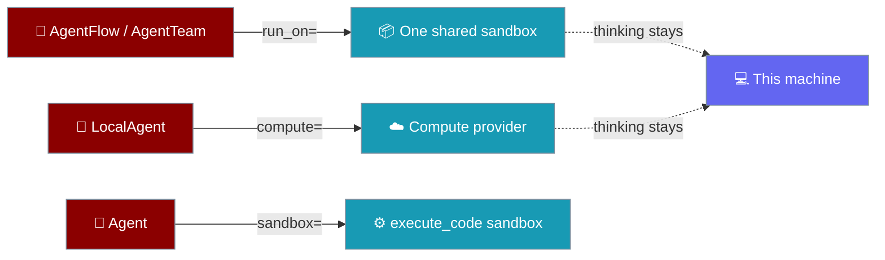
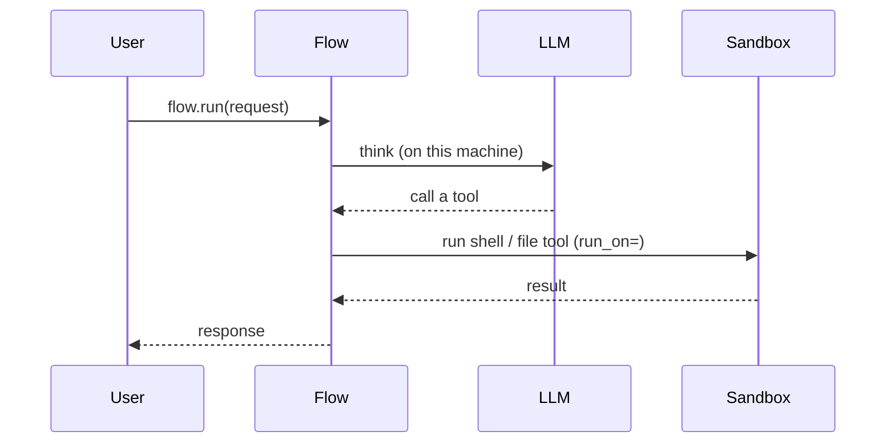
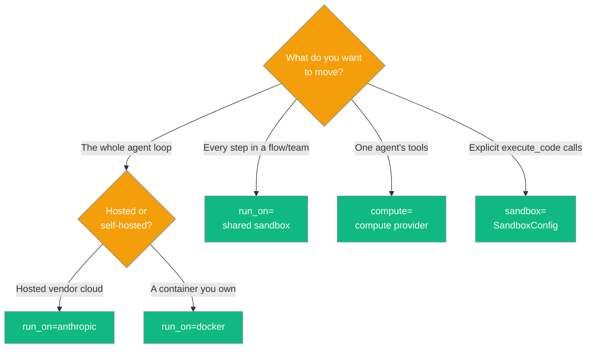

Placement decides where work happens: a whole flow, one agent's tools, and its explicit code calls each answer a different question with a different parameter.

```python
from praisonaiagents import Agent, AgentFlow

writer = Agent(name="writer", instructions="Write /workspace/data.txt")
reader = Agent(name="reader", instructions="Read /workspace/data.txt")

# Every step's tools share one Docker sandbox; thinking stays here
flow = AgentFlow(run_on="docker", steps=[writer, reader])

print(flow.where_does_it_run())
```



## Quick Start

<Steps>
<Step title="Share one sandbox across a flow or team">
Thinking stays on this machine; every step's shell, file and code tools run in one shared Docker sandbox.

```python
from praisonaiagents import Agent, AgentFlow

writer = Agent(name="writer", instructions="Write /workspace/data.txt")
reader = Agent(name="reader", instructions="Read /workspace/data.txt")

flow = AgentFlow(run_on="docker", steps=[writer, reader])
```
</Step>

<Step title="Move one agent's tools">
Give a single `LocalAgent` its own remote compute provider — thinking stays local, tools run on the provider.

```python
from praisonai import LocalAgent

agent = LocalAgent(compute="docker")
```
</Step>

<Step title="Isolate explicit code calls">
`Agent(sandbox=…)` configures the explicit `agent.execute_code()` API. It does not add tools the model can call.

```python
from praisonaiagents import Agent

agent = Agent(name="runner", instructions="Run code", sandbox=True)
agent.execute_code_sync("print(6*7)")
```
</Step>
</Steps>

---

## How It Works

Each parameter moves a different scope, so the choices never overlap.



| Parameter | What it moves | What it accepts | Where it lives |
|---|---|---|---|
| `run_on=` | **every step's tools** in a flow or team, into ONE shared sandbox | compute providers (see below) | `AgentFlow`, `AgentTeam`, YAML top-level `run_on:` |
| `compute=` | **one agent's tools**; thinking stays local | compute providers | `LocalAgent`, `LocalManagedAgent` |
| `sandbox=` | the explicit `agent.execute_code()` calls | `True` / `SandboxConfig` | `Agent(...)` |

---

## Which parameter do I want?

The scope you want to move picks the parameter. On a single `Agent`, `run_on=` hands the **whole** loop to a managed runtime — **hosted** (`anthropic`) or **self-hosted** (`docker`).



<Note>
`docker` legitimately appears under both `run_on=` and `tools_run_on=` — same place, two scopes, carried by the parameter. `run_on="docker"` runs the whole loop in the container; `tools_run_on="docker"` keeps the loop local and moves only the tools. See [Self-Hosted Agent (Docker)](/features/run-on-docker).
</Note>

<Note>
`tools_run_on=` also accepts the aliases the resolver understands (`native` → `sandlock`, and any spelling in `_compute_bridge._ALIASES`). Since [PR #4070](https://github.com/MervinPraison/PraisonAI/pull/4070) these are validated at construction, so `Agent(tools_run_on="native")` no longer raises `TypeError`.
</Note>

---

## Where `run_on=` and `compute=` can point

`run_on=` and `compute=` accept the same seven compute providers.

| Provider | Description |
|---|---|
| `local` | This machine, in a local subprocess — **not a security boundary** |
| `docker` | A Docker container |
| `e2b` | An E2B cloud sandbox |
| `modal` | A Modal cloud sandbox |
| `daytona` | A Daytona cloud sandbox |
| `flyio` | A Fly.io machine |
| `tenki` | A Tenki cloud sandbox |

A typo is rejected at load / call time with the full list of valid names.

`tools_run_on=` reaches additional local backends and aliases the resolver understands — every alias in `_compute_bridge._ALIASES` is accepted at construction as of [PR #4070](https://github.com/MervinPraison/PraisonAI/pull/4070):

| Provider | Description |
|---|---|
| `subprocess` | A separate process on this machine (scrubbed env; **not** a security boundary) |
| `sandlock` | A locked-down process on this machine (Landlock + seccomp-bpf) |
| `native` | Alias — resolves to `sandlock` (accepted at construction since [PR #4070](https://github.com/MervinPraison/PraisonAI/pull/4070)) |
| `novita` | A Novita cloud sandbox |
| `ssh` | A remote machine over SSH |

The explicit `Agent(sandbox=…)` API accepts additional local sandbox backends — `subprocess`, `sandlock`, `docker` — through `SandboxConfig`. See [Sandbox Backends](/features/sandbox-backends).

<Warning>
`local` / `subprocess` is **not** a security boundary. Its blocked-command list is bypassable by ordinary shell syntax (`cat $(echo /etc/passwd)` reads the file). For untrusted code, use `docker`, a cloud provider, or `sandlock` (via `Agent(sandbox=…)`).
</Warning>

---

## Inspect placement

`where_does_it_run()` prints the answer in plain English. It is available on `Agent`, `AgentFlow` and `AgentTeam`, and reports two fields — `thinks_on` (the model calls) and `tools_run_on` (the tools).

```python
from praisonaiagents import Agent, AgentFlow

writer = Agent(name="writer", instructions="Write")
reader = Agent(name="reader", instructions="Read")

flow = AgentFlow(run_on="docker", steps=[writer, reader])
print(flow.where_does_it_run())
```

```text
Thinking (the AI model calls) happens on this machine.
Tools run on a Docker container (shared).
Every step shares that same sandbox, so a file written by one step is visible to the next.
```

A bare local agent reports that nothing is isolated:

```python
print(Agent(name="builder", instructions="Build").where_does_it_run())
```

```text
Thinking (the AI model calls) happens on this machine.
Tools run on this machine.
Nothing is isolated: tools you pass run in this program, with your permissions.
```

<Note>
`thinks_on` and `tools_run_on` are **output fields** from `where_does_it_run()` — they describe where work lands. They are not constructor parameters. Set placement with `run_on=`, `compute=`, or `sandbox=`.
</Note>

<Note>
**Behaviour-change note ([PR #4070](https://github.com/MervinPraison/PraisonAI/pull/4070)).** `repr(agent)` and `where_does_it_run()` now report a managed backend's `LocalCompute` as *"a plain shell on this machine (no policy applied)"* rather than *"a separate process on this machine"*. The runtime behaviour did not change — the previous string understated the shell's freedom and overstated the sandbox's protection. See [Where It Runs](/features/where-does-it-run#the-two-flavors-of-local).
</Note>

---

## Migration

<AccordionGroup>
<Accordion title="Placement parameters at a glance">

| Scope | Parameter | Where |
|---|---|---|
| Whole flow / team → one shared sandbox | `run_on="docker"` | `AgentFlow`, `AgentTeam`, YAML `run_on:` |
| One agent's tools → a compute provider | `compute="docker"` | `LocalAgent`, `LocalManagedAgent` |
| Explicit `execute_code()` calls | `sandbox=True` / `sandbox=SandboxConfig(...)` | `Agent` |

YAML `run_on:` maps directly to the Python `AgentFlow(run_on=…)` kwarg — same name, same providers, validated at load time.

</Accordion>

<Accordion title="ExecutionConfig.code_sandbox_mode is inert">
`ExecutionConfig(code_sandbox_mode="sandbox")` still exists with a `"sandbox"` default and survives `to_dict()` / `from_dict()`, but **no execution path reads it** today. It does not isolate anything on its own. To isolate code the model runs, use `AgentFlow(run_on="docker")` or `Agent(sandbox=…)`. See [Execution Systems](/features/execution-systems).
</Accordion>
</AccordionGroup>

---

## Best Practices

<AccordionGroup>
<Accordion title="Use sandlock for a real local boundary">
`subprocess` separates a process but does not contain it. `sandlock` enforces Landlock + seccomp-bpf, the only kernel-level boundary that runs on this machine. Configure it through `Agent(sandbox=SandboxConfig.native())`.
</Accordion>

<Accordion title="Share one sandbox with run_on= when steps hand off files">
`run_on=` on a flow or team provisions one sandbox for the whole run, so a file written by one step is visible to the next. Leave it unset for zero-overhead local execution.
</Accordion>

<Accordion title="sandbox= isolates only explicit execute_code() calls">
`Agent(sandbox=…)` does not add a model-visible tool and does not protect the host `execute_command` path. For model-driven isolation, run the whole workflow in a real container with `AgentFlow(run_on="docker")`.
</Accordion>
</AccordionGroup>

---

## Related

<CardGroup cols={2}>
<Card title="Self-Hosted Agent (Docker)" icon="docker" href="/features/run-on-docker">
`run_on="docker"` runs the whole agent in a container you own.
</Card>
<Card title="Shared Sandbox" icon="box" href="/features/shared-sandbox">
Run every step's tools in one shared sandbox.
</Card>
<Card title="Sandbox" icon="shield" href="/features/sandbox">
Run tools and code in an isolated environment.
</Card>
<Card title="Sandbox Guarantees" icon="lock" href="/features/sandbox-guarantees">
What each boundary does and does not protect.
</Card>
</CardGroup>
