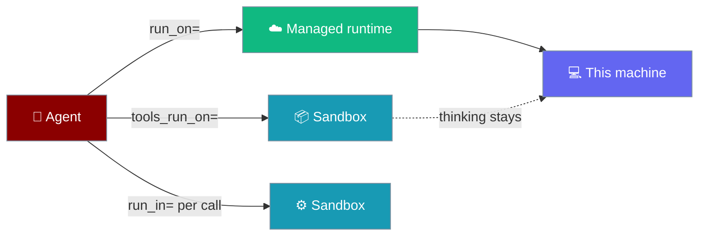
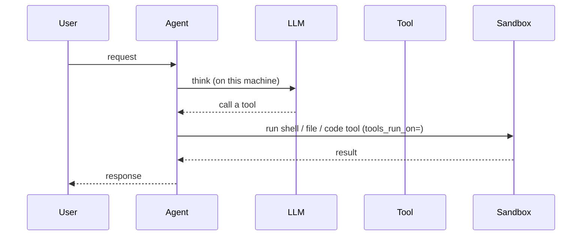
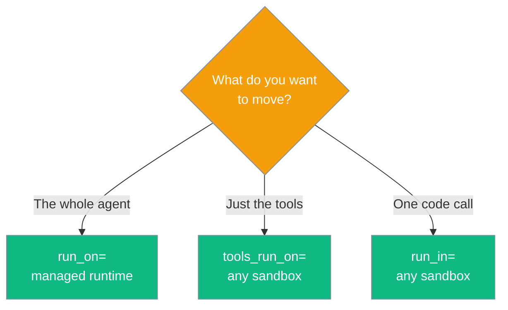

Placement decides where work happens: the thinking, the tools, and a single code call each answer a different question with a different word.

```python
from praisonaiagents import Agent

# Tools move to Docker; thinking stays here
agent = Agent(name="builder", instructions="Build things", tools_run_on="docker")

print(agent.where_does_it_run())
```



## Quick Start

<Steps>
<Step title="Move only the tools">
Thinking stays on this machine; shell, file and code tools run in Docker.

```python
from praisonaiagents import Agent

agent = Agent(name="builder", instructions="Build things", tools_run_on="docker")
```
</Step>

<Step title="Move the whole agent">
Model calls, loop and tools all run on a managed runtime.

```python
from praisonaiagents import Agent

agent = Agent(name="teacher", instructions="Explain things", run_on="anthropic")
```
</Step>

<Step title="Move one code call">
Override placement for a single `execute_code()` call.

```python
from praisonaiagents import Agent

agent = Agent(name="runner", instructions="Run code")
agent.execute_code_sync("print(6*7)", run_in="sandlock")
```
</Step>
</Steps>

---

## How It Works

Each parameter answers a different question, so the answer sets never overlap.



| Parameter | What it moves | What it accepts | Where it lives |
|---|---|---|---|
| `run_on=` | the **whole agent** — model calls, loop, tools | managed runtimes (e.g. `"anthropic"`) | `Agent(...)` |
| `tools_run_on=` | **only the tools**; thinking stays local | 11 places (compute + sandbox) | `Agent`, `AgentFlow`, `AgentTeam`, `LocalAgent`, `LocalManagedAgent` |
| `run_in=` | one `execute_code()` call | any sandbox | `agent.execute_code(...)` / `agent.execute_code_sync(...)` |

---

## Which parameter do I want?

Two questions, disjoint answers — a wrong pairing is a typo, not a preference.



---

## Where `tools_run_on=` can point

Eleven places accept `tools_run_on=` — seven compute providers plus four sandbox-only backends reached through an adapter.

| Place | Description |
|---|---|
| `local` | This machine, in-process |
| `subprocess` | A separate process on this machine — **not a security boundary** |
| `sandlock` | A locked-down process (Landlock + seccomp-bpf) — the only real local boundary |
| `docker` | A Docker container |
| `e2b` | An E2B cloud sandbox |
| `modal` | A Modal cloud sandbox |
| `daytona` | A Daytona cloud sandbox |
| `flyio` | A Fly.io machine |
| `tenki` | A Tenki cloud sandbox |
| `novita` | A Novita cloud sandbox |
| `ssh` | A remote machine over SSH (pass an `SSHSandbox(...)` object for the host) |

Add `"anthropic"` when used with `run_on=` on `Agent` — that hosts the whole agent, not just its tools.

<Warning>
`subprocess` is **not** a security boundary. Its blocked-command list is bypassable by ordinary shell syntax (`cat $(echo /etc/passwd)` reads the file). For untrusted code, use `docker`, a cloud place, or `sandlock`.
</Warning>

---

## Inspect placement

`where_does_it_run()` prints the answer in plain English.

```python
from praisonaiagents import Agent

agent = Agent(name="builder", instructions="Build", tools_run_on="docker")
print(agent.where_does_it_run())
```

```text
Thinking (the AI model calls) happens on this machine.
Tools run on a Docker container.
Your own tools (check_db) still run on this machine -- only shell, file and
code tools move. They read and write this machine's files.
```

---

## Wrong pairings raise a directed error

A place that cannot host a loop raises with the parameter you actually wanted.

```python
>>> Agent(name="x", instructions="i", run_on="docker")
TypeError: Agent(run_on='docker') is not valid: run_on= places the whole agent
-- model calls, loop and tools -- on a managed runtime, and 'docker' runs
commands but cannot host an agent loop.
  To run only the tools there:  Agent(tools_run_on='docker')
```

---

## Migration

<AccordionGroup>
<Accordion title="From compute= and run_on= (old names)">

| Before | After | Notes |
|---|---|---|
| `LocalAgent(compute="docker")` | `LocalAgent(tools_run_on="docker")` | `compute=` still works but emits `FutureWarning`. |
| `Agent(compute="docker")` | `Agent(tools_run_on="docker")` | Same as above. |
| `AgentFlow(run_on="docker")` (Python) | `AgentFlow(tools_run_on="docker")` | **Breaking**: Python `run_on=` on Flow/Team now raises a directed error. |
| `AgentTeam(run_on="docker")` (Python) | `AgentTeam(tools_run_on="docker")` | Same as above. |
| `run_on: docker` in YAML | `run_on: docker` (unchanged) | YAML `run_on:` stays a **silent alias** for `tools_run_on:` — no warning, no breakage. |
| `Agent(sandbox=…)` | `Agent(sandbox=…)` (unchanged) | Kept intentionally as a per-agent default; `run_in=` overrides it per call. |
| `ExecutionConfig(code_sandbox_mode="sandbox")` | Remove | Field was never read; removed in this release. |

</Accordion>
</AccordionGroup>

---

## Best Practices

<AccordionGroup>
<Accordion title="Use sandlock for a real local boundary">
`subprocess` separates a process but does not contain it. `sandlock` enforces Landlock + seccomp-bpf, the only kernel-level boundary that runs on this machine.
</Accordion>

<Accordion title="Keep run_on= and tools_run_on= apart">
`run_on=` hosts the whole agent (managed runtimes only). `tools_run_on=` moves just the tools (any sandbox). Their answer sets never overlap, so mixing them raises rather than silently guessing.
</Accordion>

<Accordion title="Override per call with run_in=">
When one `execute_code()` call needs a different place than the agent's default, pass `run_in=` on that call instead of reconfiguring the agent.
</Accordion>
</AccordionGroup>

---

## Related

<CardGroup cols={2}>
<Card title="Shared Sandbox" icon="box" href="/features/shared-sandbox">
Run every step's tools in one shared sandbox.
</Card>
<Card title="Sandbox" icon="shield" href="/features/sandbox">
Run tools and code in an isolated environment.
</Card>
<Card title="Sandbox Backends" icon="server" href="/features/sandbox-backends">
The 11 places tools can run.
</Card>
<Card title="Sandbox Guarantees" icon="lock" href="/features/sandbox-guarantees">
What each boundary does and does not protect.
</Card>
</CardGroup>
