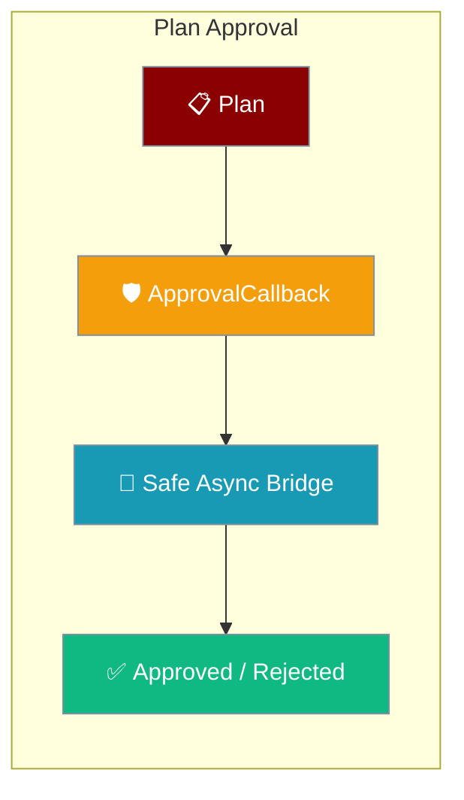
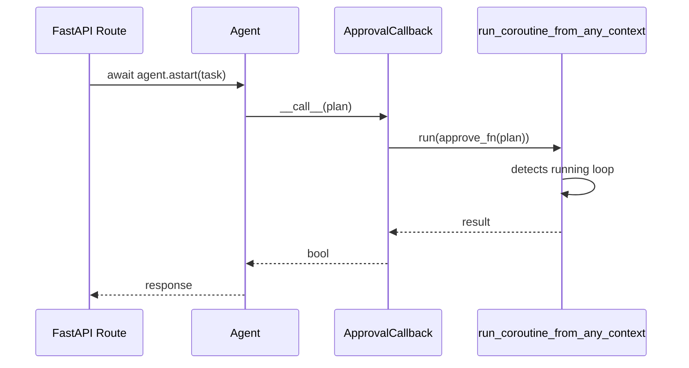

`ApprovalCallback` gates a plan before it runs, and its async `approve_fn` now works even when called from inside a running event loop — such as a FastAPI async route.



<Note>
**Async approval callbacks now work from a running event loop.** As of [MervinPraison/PraisonAI#4533](https://github.com/MervinPraison/PraisonAI/pull/4533), `ApprovalCallback(approve_fn=<async fn>)` can be reached from inside a running loop — a FastAPI async route, a Textual app, a Jupyter cell — without crashing with `RuntimeError: Cannot run the event loop while another loop is running`. The callback routes through the package's shared safe bridge and preserves the caller's loop.
</Note>

## Quick Start

<Steps>

<Step title="Attach an async approval function">
Pass an async `approve_fn` to `ApprovalCallback`. It returns `True` to approve, `False` to reject.

```python
from praisonaiagents.planning import ApprovalCallback

async def review_plan(plan) -> bool:
    # e.g. call a Slack / email / DB check
    return await my_async_approval_check(plan)

approval = ApprovalCallback(approve_fn=review_plan)
```
</Step>

<Step title="Works inside a running loop">
The synchronous `__call__` can now be reached from inside a running loop without crashing — the async `approve_fn` runs on the caller's loop.

```python
import asyncio
from praisonaiagents.planning import ApprovalCallback, Plan

async def review_plan(plan) -> bool:
    return True  # your async check here

approval = ApprovalCallback(approve_fn=review_plan)

async def main():
    plan = Plan(name="Weekly report")
    # Reached from inside a running loop — no new-loop crash.
    approved = approval(plan)
    print("approved" if approved else "rejected")

asyncio.run(main())
```
</Step>

</Steps>

---

## How It Works

The sync `__call__` detects an async `approve_fn` and forwards it through the package's shared safe bridge `run_coroutine_from_any_context`, which detects a running loop and schedules the coroutine on it instead of spinning up a fresh loop.



| Path | Behaviour |
|------|-----------|
| Sync `approve_fn` | Called directly and its result used |
| Async `approve_fn` | Routed through the shared safe bridge — runs on the caller's loop |
| No `approve_fn`, non-interactive | Auto-approves (CI / scripts) |
| No `approve_fn`, interactive TTY | Requires explicit approval |

---

## FastAPI async route

Embed PraisonAI in a FastAPI async endpoint and the plan-approval prompt no longer raises `RuntimeError` when the plan is presented.

```python
from fastapi import FastAPI
from praisonaiagents import Agent, PlanningConfig
from praisonaiagents.planning import ApprovalCallback

app = FastAPI()

async def review_plan(plan) -> bool:
    # e.g. call a Slack / email / DB check
    return await my_async_approval_check(plan)

approval = ApprovalCallback(approve_fn=review_plan)

@app.post("/plan")
async def run_plan():
    agent = Agent(
        name="Planner",
        instructions="Solve step by step",
        planning=PlanningConfig(auto_approve=False),
    )
    # Works inside the route's running loop — no new-loop crash.
    return await agent.astart("Plan the weekly report")
```

### What the user experiences

- A user hits a FastAPI endpoint that runs `await agent.astart("...")`.
- The planning phase produces a plan; `ApprovalCallback` is invoked.
- The user-supplied async `approve_fn` runs on the caller's loop (no new-loop crash).
- The plan proceeds if approved, or halts if the callback returns `False`.

<Warning>
Before PR #4533 the sync `__call__` hand-rolled `asyncio.new_event_loop()` + `run_until_complete()`, which doesn't dodge CPython's thread-global running-loop flag — so reaching it from a running loop crashed with `RuntimeError: Cannot run the event loop while another loop is running`. The dedicated async entry point `async_call` was already correct.
</Warning>

---

## Common Patterns

<Tabs>

<Tab title="Async approval">
Route approval through any async check — a database lookup, an HTTP call, a message-queue round-trip.

```python
from praisonaiagents.planning import ApprovalCallback

async def review_plan(plan) -> bool:
    return await my_async_approval_check(plan)

approval = ApprovalCallback(approve_fn=review_plan)
```
</Tab>

<Tab title="Sync approval">
A plain sync function still works unchanged.

```python
from praisonaiagents.planning import ApprovalCallback

def review_plan(plan) -> bool:
    return len(plan.steps) <= 5

approval = ApprovalCallback(approve_fn=review_plan)
```
</Tab>

<Tab title="Auto-approve">
Skip prompts entirely for trusted, unattended runs.

```python
from praisonaiagents.planning import ApprovalCallback

approval = ApprovalCallback(auto_approve=True)
```
</Tab>

</Tabs>

---

## Best Practices

<AccordionGroup>

<Accordion title="Prefer an async approve_fn for I/O-bound checks">
When your approval decision calls out to Slack, a database, or an HTTP endpoint, use an async `approve_fn` so it runs on the caller's loop without blocking — safe from a FastAPI route as of PR #4533.
</Accordion>

<Accordion title="Return a plain bool from approve_fn">
`approve_fn` must return `True` to approve or `False` to reject. Keep the decision logic inside the function and let `ApprovalCallback` handle the plan's `approve()` transition.
</Accordion>

<Accordion title="Use auto_approve only for unattended runs">
`ApprovalCallback(auto_approve=True)` skips all checks — reserve it for trusted CI or scripted runs where no human is available to review.
</Accordion>

</AccordionGroup>

---

## Related

<CardGroup cols={2}>
  <Card title="Planning Mode" icon="list-check" href="/features/planning-mode">
    Configure planning with PlanningConfig
  </Card>
  <Card title="Planning Concepts" icon="book" href="/concepts/planning">
    Core planning architecture and the ApprovalCallback denial snippet
  </Card>
</CardGroup>
