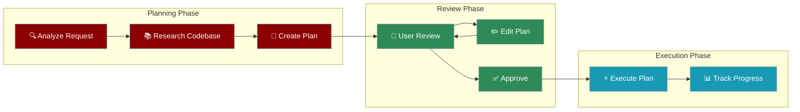

# Planning Mode

Planning Mode is a powerful feature that separates research and analysis from execution. Instead of immediately making changes, the AI first creates a detailed implementation plan that you can review, edit, and approve before any code is modified.



## Why Use Planning Mode?

<CardGroup cols={2}>
  <Card title="Safety" icon="shield">
    Review changes before they happen. No surprises.
  </Card>
  <Card title="Clarity" icon="eye">
    Understand the full scope of changes upfront.
  </Card>
  <Card title="Control" icon="sliders">
    Edit and refine the plan before execution.
  </Card>
  <Card title="Efficiency" icon="bolt">
    Catch issues early, before code is written.
  </Card>
</CardGroup>

## Comparison Across Tools

| Feature | Cursor | Windsurf | Claude Code | Gemini CLI | Codex |
|---------|--------|----------|-------------|------------|-------|
| **Activation** | `Shift+Tab` | Toggle button | `Shift+Tab` (2x) | Custom prompt | `/plan` |
| **Plan Storage** | `.cursor/plans/` | `~/.codeium/windsurf/brain/` | In-memory | `GEMINI.md` | Session |
| **Read-Only Mode** | ✅ | ✅ | ✅ | ✅ | ✅ |
| **Editable Plans** | ✅ Markdown | ✅ Markdown | ✅ | ✅ | ✅ |
| **Todo Lists** | ✅ | ✅ | ✅ | ✅ | ✅ |
| **Queued Messages** | ✅ | ✅ | ❌ | ❌ | ❌ |
| **Availability** | All plans | Pro/Teams/Enterprise | All | All | All |

---

## Cursor Plan Mode

Cursor's Plan Mode creates detailed implementation plans before writing any code. The agent researches your codebase, asks clarifying questions, and generates a reviewable plan.

### How to Activate

Press `Shift+Tab` from the chat input to rotate to Plan Mode. Cursor also suggests it automatically for complex tasks.

### How It Works

1. **Agent asks clarifying questions** to understand your requirements
2. **Researches your codebase** to gather relevant context
3. **Creates a comprehensive implementation plan**
4. **You review and edit** the plan through chat or markdown files
5. **Click to build** the plan when ready

### Plan Storage

Plans open as ephemeral virtual files. To save a plan to your workspace, click "Save to workspace" to store it in `.cursor/plans/` for future reference, team sharing, and documentation.

### Agent To-Dos

Cursor can break down longer tasks into manageable steps with dependencies:

- Agent automatically creates to-do lists for complex tasks
- Each item can have dependencies on other tasks
- The list updates in real-time as work progresses
- Completed tasks are marked off automatically

### Queued Messages

Queue follow-up messages while Agent is working:

1. While Agent is working, type your next instruction
2. Press `Ctrl+Enter` to add it to the queue
3. Messages appear in order below the active task
4. Agent processes them sequentially after finishing

---

## Windsurf Planning Mode

Windsurf's Planning Mode uses persistent markdown files for long-term AI planning. A specialized planning agent continuously refines the plan while your selected model focuses on execution.

### How to Activate

Click the Planning Mode toggle button below the Cascade input box. Planning Mode is enabled by default for Pro, Teams, and Enterprise users.

### How It Works

1. **Enable Planning Mode** via the toggle button
2. **Cascade creates a plan** in a persistent markdown file
3. **Review and edit** the plan directly or ask Cascade to update it
4. **Cascade executes** based on the approved plan
5. **Plan updates automatically** as new information (like Memories) is discovered

### Plan Storage

Plans are saved in `~/.codeium/windsurf/brain/` directory, so they won't be checked into your repository.

### Plans and Todo Lists

Cascade has built-in planning capabilities:

- A specialized planning agent continuously refines the long-term plan
- Your selected model focuses on short-term actions based on that plan
- Cascade creates a Todo list within the conversation to track progress
- Ask Cascade to make updates to the Todo list as needed

### Queued Messages

While waiting for Cascade to finish:

- Type your message and press `Enter` to queue it
- Press `Enter` again on an empty text box to send immediately
- Delete any message from the queue before it's sent

---

## Claude Code Plan Mode

Claude Code's Plan Mode separates research and analysis from execution, significantly improving safety. When activated, Claude will not edit files, run commands, or change anything until you approve the plan.

### How to Activate

Press `Shift+Tab` twice to enter Plan Mode. Press `Shift+Tab` again to exit.

### How It Works

1. **Activate Plan Mode** with `Shift+Tab` twice
2. **Claude researches** your codebase (read-only)
3. **Creates a structured plan** with numbered steps
4. **You review and approve** the plan
5. **Exit Plan Mode** and Claude executes

### Available Tools in Plan Mode

**Allowed (Read-Only):**
- `Read` - Files and content viewing
- `LS` - Directory listings
- `Glob` - File pattern searches
- `Grep` - Content searches
- `Task` - Research agents
- `TodoRead/TodoWrite` - Task management
- `WebFetch` - Web content analysis
- `WebSearch` - Web searches
- `NotebookRead` - Jupyter notebooks

**Restricted:**
- `Edit/MultiEdit` - File edits
- `Write` - File creation
- `Bash` - Command execution
- `NotebookEdit` - Notebook edits
- MCP tools that modify state

### Opus 4.5 Plan Mode

Enhanced interactive planning with Claude Opus 4.5:

1. You describe the task with requirements and context
2. Claude asks clarifying questions about ambiguous requirements
3. Claude creates `plan.md` with task breakdown and dependencies
4. You review and edit the plan as needed
5. Claude executes using Sonnet 4.5

Access via `/model` command: "Use Opus 4.5 in plan mode, Sonnet 4.5 otherwise"

---

## Gemini CLI Plan Mode

Gemini CLI can operate in Plan Mode through custom instructions in your `GEMINI.md` file. This makes Gemini act like a senior engineer: understand the request, investigate the codebase, and present a clear plan for approval.

### How to Activate

Add Plan Mode instructions to your `GEMINI.md` file:

```markdown
# GEMINI.md

You are operating in Plan Mode. Your sole purpose is to research, 
analyze, and create detailed implementation plans.

## Core Principles
- Strictly Read-Only: Inspect files, navigate code, search the web
- No Modifications: Do not edit, create, or delete files
- No Commands: Do not run shell commands that make changes

## Steps
1. Acknowledge and analyze the user's request
2. Output your reasoning before the plan
3. Create a detailed, step-by-step implementation plan
4. Present for approval before any execution
```

### Output Format

Your plan should include:

1. **Analysis**: Findings and reasoning behind your strategy
2. **Plan**: Numbered list of precise implementation steps
3. **Approval Request**: Final step asking for user confirmation

### Best Practices

- Keep the plan focused and actionable
- Include file paths and specific changes
- Note dependencies between steps
- Estimate complexity for each step

---

## OpenAI Codex Plan Mode

Codex CLI includes a `/plan` slash command for creating implementation plans. It also supports approval modes that control how much Codex can do without confirmation.

### How to Activate

Use the `/plan` slash command in the interactive session, or use the `--approval` flag when launching.

### Approval Modes

| Mode | Description |
|------|-------------|
| **Auto** (default) | Read, edit, and run commands within working directory |
| **Read Only** | Browse files but won't make changes until you approve |
| **Full Access** | Work across your machine without asking |

Switch modes with `/approvals` inside an interactive session.

### How It Works

1. **Launch Codex** with `codex` command
2. **Use `/plan`** to enter planning mode
3. **Codex explains its plan** before making changes
4. **Approve or reject** steps inline
5. **Review transcript** of all actions

### Resuming Plans

Codex stores transcripts locally for resuming:

```bash
# Resume most recent session
codex resume --last

# Resume specific session
codex resume <SESSION_ID>

# Resume with new instructions
codex exec resume --last "Implement the plan"
```

---

## PraisonAI Planning Mode

PraisonAI supports planning mode through the `PlanManager` class, allowing you to create, review, and execute structured plans programmatically.

### Quick Start

```python
from praisonaiagents import Agent
from praisonaiagents.memory import PlanManager

agent = Agent(name="Planner")
plan_manager = PlanManager()

# Create a plan
plan = plan_manager.create_plan(
    name="Feature Implementation",
    description="Add user authentication",
    steps=[
        {"name": "Research", "action": "Analyze existing auth patterns"},
        {"name": "Design", "action": "Create authentication flow diagram"},
        {"name": "Implement", "action": "Write authentication code"},
        {"name": "Test", "action": "Add unit and integration tests"}
    ]
)

# Execute with approval
result = plan_manager.execute(
    plan.name,
    executor=lambda prompt: agent.chat(prompt),
    require_approval=True  # Pause for approval before each step
)
```

### Plan File Format

Plans are stored as markdown files in `.praison/plans/`:

```markdown
---
name: Feature Implementation
description: Add user authentication
status: pending
created: 2024-01-15T10:00:00Z
---

## Step 1: Research
Analyze existing auth patterns in the codebase.

```action
Search for authentication-related files and patterns.
Document current implementation approach.
```

## Step 2: Design
Create authentication flow diagram.

```action
Design the authentication flow.
Identify required components and dependencies.
```

## Step 3: Implement
Write authentication code.

```action
Implement the designed authentication flow.
Follow existing code patterns.
```

## Step 4: Test
Add unit and integration tests.

```action
Write comprehensive tests for the new authentication.
Ensure all edge cases are covered.
```
```

### Programmatic API

```python
from praisonaiagents.memory import PlanManager

manager = PlanManager(workspace_path="/path/to/project")

# List all plans
plans = manager.list_plans()

# Get a specific plan
plan = manager.get_plan("Feature Implementation")

# Update plan status
manager.update_step_status(plan.name, step_index=0, status="completed")

# Get plan statistics
stats = manager.get_stats()
print(f"Total plans: {stats['total_plans']}")
print(f"Pending: {stats['pending']}")
print(f"In Progress: {stats['in_progress']}")
print(f"Completed: {stats['completed']}")
```

## Best Practices

<AccordionGroup>
  <Accordion title="Start with clear requirements">
    Describe your end goal clearly. The AI creates more accurate plans when it understands the full scope.
  </Accordion>
  <Accordion title="Review before approving">
    Always review the generated plan. Check for missing steps, incorrect assumptions, or potential issues.
  </Accordion>
  <Accordion title="Edit plans iteratively">
    Don't hesitate to ask for plan modifications. It's cheaper to fix a plan than to fix code.
  </Accordion>
  <Accordion title="Use for complex tasks">
    Planning mode shines for multi-step tasks. For simple changes, direct execution may be faster.
  </Accordion>
  <Accordion title="Save important plans">
    Save plans to your workspace for documentation, team sharing, and future reference.
  </Accordion>
</AccordionGroup>

## See Also

<CardGroup cols={2}>
  <Card title="Workflows" icon="diagram-project" href="/features/workflows">
    Create reusable multi-step workflows
  </Card>
  <Card title="Rules & Instructions" icon="scroll" href="/features/rules">
    Auto-discover and apply persistent rules
  </Card>
  <Card title="Agent Memory" icon="memory" href="/features/memory">
    Persistent memory for agents
  </Card>
  <Card title="Hooks" icon="plug" href="/features/hooks">
    Pre/post operation hooks for custom actions
  </Card>
</CardGroup>
