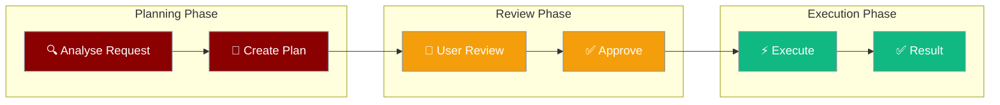
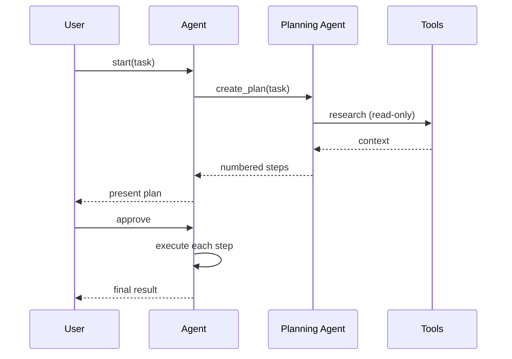

Planning Mode separates research from execution so agents create a reviewable plan before taking action.

```python
from praisonaiagents import Agent

agent = Agent(
    name="Planner",
    instructions="Research and write about topics",
    planning=True,
)
agent.start("Research AI trends in 2025 and write a summary")
```


```mermaid
graph LR
    subgraph "Planning Phase"
        ANALYZE[🔍 Analyse Request]
        PLAN[📝 Create Plan]
    end

    subgraph "Review Phase"
        REVIEW[👀 User Review]
        APPROVE[✅ Approve]
    end

    subgraph "Execution Phase"
        EXECUTE[⚡ Execute]
        RESULT[✅ Result]
    end

    ANALYZE --> PLAN
    PLAN --> REVIEW
    REVIEW --> APPROVE
    APPROVE --> EXECUTE
    EXECUTE --> RESULT

    classDef agent fill:#8B0000,stroke:#7C90A0,color:#fff
    classDef process fill:#F59E0B,stroke:#7C90A0,color:#fff
    classDef success fill:#10B981,stroke:#7C90A0,color:#fff

    class ANALYZE,PLAN agent
    class REVIEW,APPROVE process
    class EXECUTE,RESULT success
    classDef agent fill:#8B0000,color:#fff
    classDef tool fill:#189AB4,color:#fff
```

## Quick Start

<Steps>
<Step title="Simple Usage">

```python
from praisonaiagents import Agent

agent = Agent(
    name="Planner",
    instructions="Research and write about topics",
    planning=True,
)
agent.start("Research AI trends in 2025 and write a summary")
```

</Step>

<Step title="With Configuration">

```python
from praisonaiagents import Agent, PlanningConfig

def search_web(query: str) -> str:
    return f"Search results for: {query}"

agent = Agent(
    name="Planner",
    instructions="Research and write about topics",
    planning=PlanningConfig(
        llm="gpt-4o",
        tools=[search_web],
        reasoning=True,
        auto_approve=True,
    ),
)
agent.start("Research AI trends in 2025 and write a summary")
```

</Step>
</Steps>

---

## How It Works


```mermaid
sequenceDiagram
    participant User
    participant Agent
    participant Planner as Planning Agent
    participant Tools

    User->>Agent: start(task)
    Agent->>Planner: create_plan(task)
    Planner->>Tools: research (read-only)
    Tools-->>Planner: context
    Planner-->>Agent: numbered steps
    Agent-->>User: present plan
    User->>Agent: approve
    Agent->>Agent: execute each step
    Agent-->>User: final result
```

| Step | What Happens |
|------|-------------|
| 1. Analyse | Agent reads the request and gathers context |
| 2. Plan | A dedicated planning agent creates numbered steps |
| 3. Review | Plan is presented to the user (or auto-approved) |
| 4. Execute | Agent runs each step sequentially |

---

## Configuration Options

| Option | Type | Default | Description |
|--------|------|---------|-------------|
| `llm` | `str` | `None` | LLM for planning (defaults to agent's LLM) |
| `tools` | `List` | `None` | Tools available during planning research |
| `reasoning` | `bool` | `False` | Chain-of-thought reasoning during planning |
| `auto_approve` | `bool` | `False` | Skip user review and approve automatically |
| `read_only` | `bool` | `False` | Restrict planning to read-only tools |

```python
agent = Agent(planning=True)                          # bool — safe defaults
agent = Agent(planning=PlanningConfig(llm="gpt-4o"))  # config — full control
```

---

## Common Patterns

### Read-only planning

```python
from praisonaiagents import Agent, PlanningConfig

agent = Agent(
    name="SafeResearcher",
    instructions="Investigate and report findings",
    planning=PlanningConfig(read_only=True, reasoning=True),
)
agent.start("Analyse the codebase and suggest improvements")
```

### Auto-approved pipeline

```python
agent = Agent(
    name="AutoPlanner",
    planning=PlanningConfig(llm="gpt-4o", auto_approve=True),
)
agent.start("Write and test a Python script to sort files by date")
```

### Multi-agent with planning

```python
from praisonaiagents import Agent, AgentTeam, Task

researcher = Agent(name="Researcher", instructions="Research topics thoroughly")
writer = Agent(name="Writer", instructions="Write clear articles")

team = AgentTeam(
    agents=[researcher, writer],
    tasks=[
        Task(description="Research AI in healthcare", agent=researcher),
        Task(description="Write a summary article", agent=writer),
    ],
    planning=True,
)
team.start()
```

---

## Best Practices

<AccordionGroup>
<Accordion title="Use planning for complex multi-step tasks">
Planning shines when the path to a solution is unclear. For simple one-step tasks, direct execution is faster.
</Accordion>
<Accordion title="Enable read_only for safe exploration">
Set `read_only=True` when the agent should research code or documents without risk of modification.
</Accordion>
<Accordion title="Provide research tools during planning">
Pass `tools=[search_web, read_file]` so the planning phase has relevant context.
</Accordion>
<Accordion title="Enable reasoning for complex requests">
Set `reasoning=True` for chain-of-thought analysis in the plan.
</Accordion>
</AccordionGroup>

---

## Related

<CardGroup cols={2}>
<Card title="Workflows" icon="diagram-project" href="/docs/features/workflows">
  Create reusable multi-step workflows
</Card>
<Card title="Hooks" icon="webhook" href="/docs/features/hooks">
  Intercept agent behaviour at lifecycle points
</Card>
</CardGroup>
