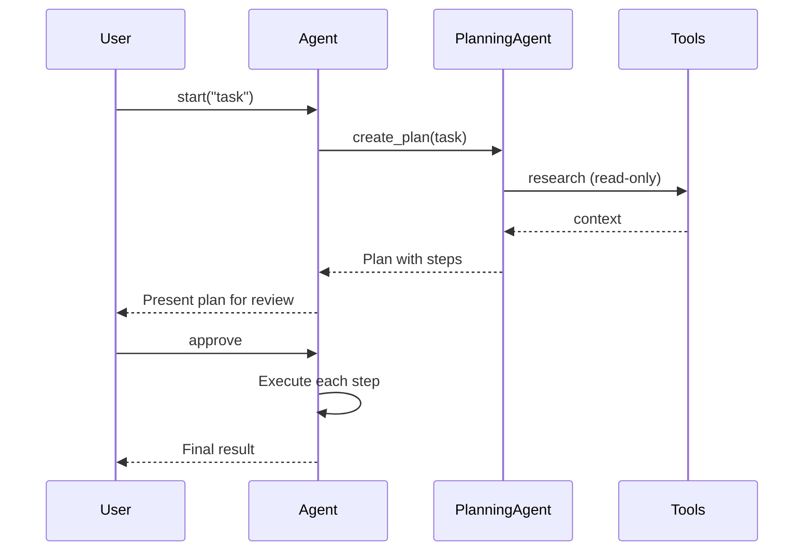

Planning Mode separates research from execution so agents create a reviewable plan before taking any action.


```mermaid
graph LR
    subgraph "Planning Phase"
        ANALYZE["🔍 Analyze Request"]
        PLAN["📝 Create Plan"]
    end

    subgraph "Review Phase"
        REVIEW["👀 User Review"]
        APPROVE["✅ Approve"]
    end

    subgraph "Execution Phase"
        EXECUTE["⚡ Execute"]
        RESULT["✅ Result"]
    end

    ANALYZE --> PLAN
    PLAN --> REVIEW
    REVIEW --> APPROVE
    APPROVE --> EXECUTE
    EXECUTE --> RESULT

    classDef agent fill:#8B0000,stroke:#7C90A0,color:#fff
    classDef process fill:#F59E0B,stroke:#7C90A0,color:#fff
    classDef success fill:#10B981,stroke:#7C90A0,color:#fff
    classDef config fill:#6366F1,stroke:#7C90A0,color:#fff

    class ANALYZE,PLAN agent
    class REVIEW,APPROVE process
    class EXECUTE,RESULT success
```

## Quick Start

<Steps>
<Step title="Simple Usage">
Enable planning with a single parameter:

```python
from praisonaiagents import Agent

agent = Agent(
    name="Planner",
    instructions="Research and write about topics",
    planning=True
)

result = agent.start("Research AI trends in 2025 and write a summary")
```
</Step>

<Step title="With Configuration">
Control the planning LLM, tools, and approval flow:

```python
from praisonaiagents import Agent, PlanningConfig

def search_web(query: str) -> str:
    return f"Search results for: {query}"

agent = Agent(
    name="Planner",
    instructions="Research and write about topics",
    planning=PlanningConfig(
        llm="gpt-4o",
        tools=[search_web],
        reasoning=True,
        auto_approve=True,
    )
)

result = agent.start("Research AI trends in 2025 and write a summary")
```
</Step>
</Steps>

---

## How It Works


```mermaid
sequenceDiagram
    participant User
    participant Agent
    participant PlanningAgent
    participant Tools

    User->>Agent: start("task")
    Agent->>PlanningAgent: create_plan(task)
    PlanningAgent->>Tools: research (read-only)
    Tools-->>PlanningAgent: context
    PlanningAgent-->>Agent: Plan with steps
    Agent-->>User: Present plan for review
    User->>Agent: approve
    Agent->>Agent: Execute each step
    Agent-->>User: Final result
```

| Step | What Happens |
|------|-------------|
| 1. Analyze | Agent reads the request and gathers context |
| 2. Plan | A dedicated PlanningAgent creates numbered steps |
| 3. Review | Plan is presented to the user (or auto-approved) |
| 4. Execute | Agent runs each step sequentially |

---

## Configuration Options

`PlanningConfig` is exported from `praisonaiagents`:

```python
from praisonaiagents import Agent, PlanningConfig

agent = Agent(
    instructions="...",
    planning=PlanningConfig(
        llm="gpt-4o",
        tools=[my_tool],
        reasoning=True,
        auto_approve=False,
        read_only=False,
    )
)
```

| Option | Type | Default | Description |
|--------|------|---------|-------------|
| `llm` | `str` | `None` | LLM for the planning step (defaults to agent's LLM) |
| `tools` | `List` | `None` | Tools available during planning research |
| `reasoning` | `bool` | `False` | Enable chain-of-thought reasoning during planning |
| `auto_approve` | `bool` | `False` | Skip user review and approve plans automatically |
| `read_only` | `bool` | `False` | Restrict planning agent to read-only tools |

### Configuration Precedence

```python
agent = Agent(planning=True)                          # Bool — safe defaults
agent = Agent(planning=PlanningConfig(llm="gpt-4o"))  # Config — full control
```

---

## Common Patterns

### Read-Only Planning (Safe Research)

```python
from praisonaiagents import Agent, PlanningConfig

agent = Agent(
    name="SafeResearcher",
    instructions="Investigate and report findings",
    planning=PlanningConfig(
        read_only=True,
        reasoning=True,
    )
)

result = agent.start("Analyze the codebase and suggest improvements")
```

### Auto-Approved Pipeline

```python
from praisonaiagents import Agent, PlanningConfig

agent = Agent(
    name="AutoPlanner",
    instructions="Handle complex multi-step tasks",
    planning=PlanningConfig(
        llm="gpt-4o",
        auto_approve=True,
    )
)

result = agent.start("Write and test a Python script to sort files by date")
```

### Multi-Agent with Planning

```python
from praisonaiagents import Agent, Task, PraisonAIAgents

researcher = Agent(name="Researcher", instructions="Research topics thoroughly")
writer = Agent(name="Writer", instructions="Write clear articles")

task1 = Task(description="Research AI in healthcare", agent=researcher)
task2 = Task(description="Write a summary article", agent=writer)

agents = PraisonAIAgents(
    agents=[researcher, writer],
    tasks=[task1, task2],
    planning=True
)

result = agents.start()
```

---

## Best Practices

<AccordionGroup>
  <Accordion title="Use planning for complex multi-step tasks">
    Planning shines when the path to a solution is unclear. For simple one-step tasks, direct execution is faster.
  </Accordion>
  <Accordion title="Enable read_only for safe exploration">
    Set `read_only=True` when you want the agent to research your codebase or documents without risk of modification.
  </Accordion>
  <Accordion title="Provide research tools during planning">
    Pass `tools=[search_web, read_file]` to `PlanningConfig` so the planning phase has access to relevant context.
  </Accordion>
  <Accordion title="Enable reasoning for complex requests">
    Set `reasoning=True` to get chain-of-thought analysis in the plan. Useful for debugging and understanding agent decisions.
  </Accordion>
</AccordionGroup>

---

## Related

<CardGroup cols={2}>
  <Card title="Workflows" icon="diagram-project" href="/docs/features/workflows">
    Create reusable multi-step workflows
  </Card>
  <Card title="Hooks" icon="webhook" href="/docs/features/hooks">
    Intercept and modify agent behavior at lifecycle points
  </Card>
</CardGroup>
