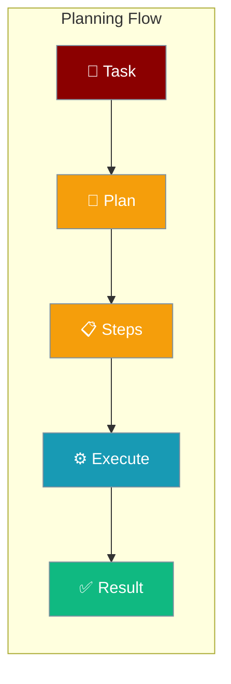
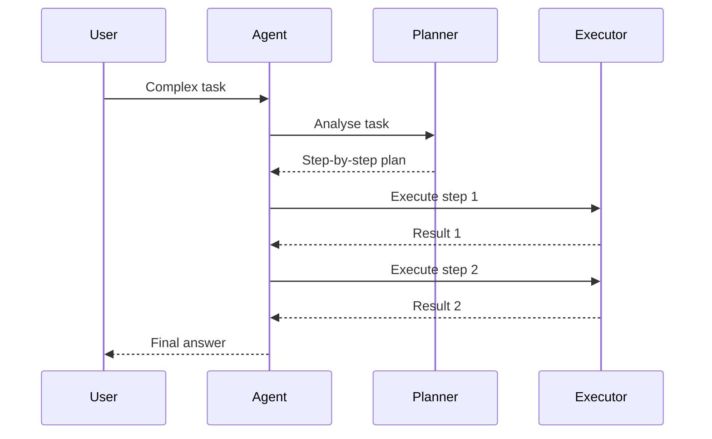
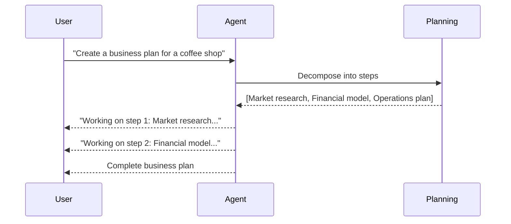

Planning enables agents to reason through complex tasks step-by-step before executing, improving accuracy and reliability.



## Quick Start

<Steps>
<Step title="Enable Planning">
Add `planning=True` to any agent to activate planning mode:

```python
from praisonaiagents import Agent

agent = Agent(
    name="Research Agent",
    instructions="Research and summarize the given topic",
    planning=True
)

agent.start("Explain quantum computing for beginners")
```
</Step>

<Step title="With Configuration">
Fine-tune planning behaviour with `PlanningConfig`:

```python
from praisonaiagents import Agent, PlanningConfig

agent = Agent(
    name="Research Agent",
    instructions="Research and summarize the given topic",
    planning=PlanningConfig(
        llm="gpt-4o",
        reasoning=True,
        auto_approve=True,
    )
)

agent.start("Write a report on climate change solutions")
```
</Step>

<Step title="Multi-Agent Planning">
Use planning across an agent team:

```python
from praisonaiagents import Agent, Task, PraisonAIAgents

researcher = Agent(
    name="Researcher",
    instructions="Research the topic thoroughly",
    planning=True
)

writer = Agent(
    name="Writer",
    instructions="Write a clear summary based on research"
)

task = Task(
    description="Research and write about renewable energy",
    agent=researcher
)

agents = PraisonAIAgents(agents=[researcher, writer], tasks=[task])
agents.start()
```
</Step>
</Steps>

---

## How It Works



| Stage | What happens |
|-------|-------------|
| **Analyse** | Planner reads the task and identifies sub-goals |
| **Plan** | Ordered list of steps is created before any action |
| **Execute** | Each step runs in sequence, informed by previous results |
| **Respond** | Agent returns the final consolidated answer |

---

## User Interaction Flow



---

## Configuration Options

| Option | Type | Default | Description |
|--------|------|---------|-------------|
| `llm` | `str` | `None` | LLM model for planning (defaults to agent's model) |
| `tools` | `list` | `None` | Tools available during the planning phase |
| `reasoning` | `bool` | `False` | Enable extended reasoning during planning |
| `auto_approve` | `bool` | `False` | Auto-approve plans without user confirmation |
| `read_only` | `bool` | `False` | Read-only plan mode — no write operations allowed |

### Precedence Ladder

```python
# Level 1: Bool (simplest)
agent = Agent(planning=True)

# Level 2: Config class
agent = Agent(planning=PlanningConfig(llm="gpt-4o", reasoning=True))
```

---

## Common Patterns

### Read-Only Planning Mode

```python
from praisonaiagents import Agent, PlanningConfig

agent = Agent(
    name="Safe Planner",
    instructions="Analyse the codebase and suggest improvements",
    planning=PlanningConfig(read_only=True)
)

agent.start("Review the authentication module")
```

### Planning with Tools

```python
from praisonaiagents import Agent, PlanningConfig
from praisonaiagents.tools import duckduckgo

agent = Agent(
    name="Research Agent",
    instructions="Research the topic and create a detailed report",
    planning=PlanningConfig(
        tools=[duckduckgo],
        reasoning=True,
    )
)

agent.start("Research the latest AI trends in 2025")
```

### Planning with Custom Model

```python
from praisonaiagents import Agent, PlanningConfig

agent = Agent(
    name="Advanced Planner",
    instructions="Solve complex problems step by step",
    planning=PlanningConfig(
        llm="gpt-4o",
        reasoning=True,
        auto_approve=True,
    )
)

agent.start("Design a scalable microservices architecture")
```

---

## Best Practices

<AccordionGroup>
<Accordion title="Use planning for complex, multi-step tasks">
Planning shines when tasks require more than 2-3 steps. For simple Q&A, skip planning to reduce latency.

```python
# Good — complex task
agent = Agent(planning=True, instructions="Design and implement a REST API")

# Not needed — simple task
agent = Agent(instructions="Translate this sentence to French")
```
</Accordion>

<Accordion title="Enable reasoning for analytical tasks">
Set `reasoning=True` when tasks require deep analysis or evaluation of trade-offs.

```python
agent = Agent(
    planning=PlanningConfig(reasoning=True),
    instructions="Evaluate the security implications of this architecture"
)
```
</Accordion>

<Accordion title="Use read_only mode for analysis tasks">
When the agent should only read and analyse (not modify files or call write APIs), use `read_only=True` to prevent accidental changes.

```python
agent = Agent(
    planning=PlanningConfig(read_only=True),
    instructions="Audit the codebase for performance issues"
)
```
</Accordion>

<Accordion title="Auto-approve for automated pipelines">
In CI/CD or automated workflows where human review is not possible, set `auto_approve=True`.

```python
agent = Agent(
    planning=PlanningConfig(auto_approve=True),
    instructions="Process and categorise incoming support tickets"
)
```
</Accordion>
</AccordionGroup>

---

## Related

<CardGroup cols={2}>
<Card title="Reflection" icon="rotate" href="/docs/features/selfreflection">
  Agents that review and improve their own outputs
</Card>
<Card title="Autonomy" icon="robot" href="/docs/features/autonomy">
  Full autonomous agent operation with safety controls
</Card>
<Card title="Multi-Agent Patterns" icon="users" href="/docs/features/multi-agent-patterns">
  Coordinate multiple agents working together
</Card>
<Card title="Guardrails" icon="shield-halved" href="/docs/features/guardrails">
  Validate and control agent output quality
</Card>
</CardGroup>
