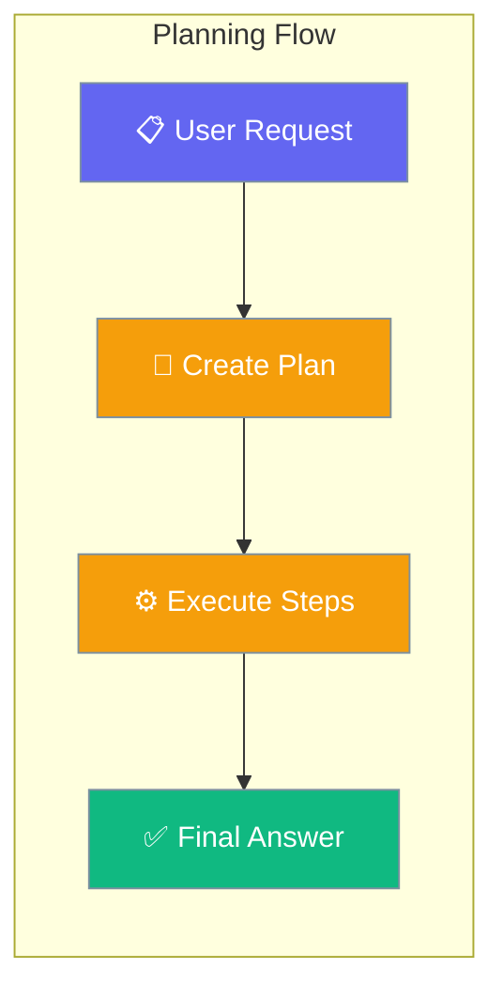
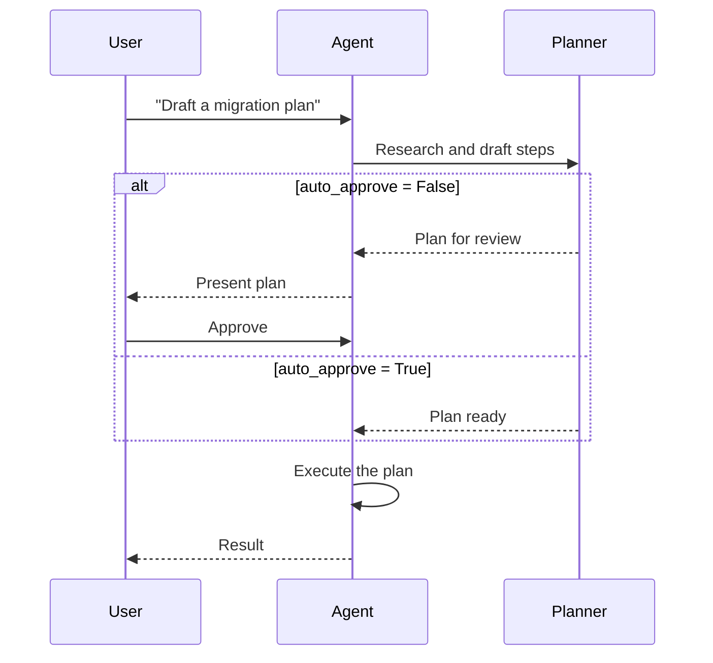
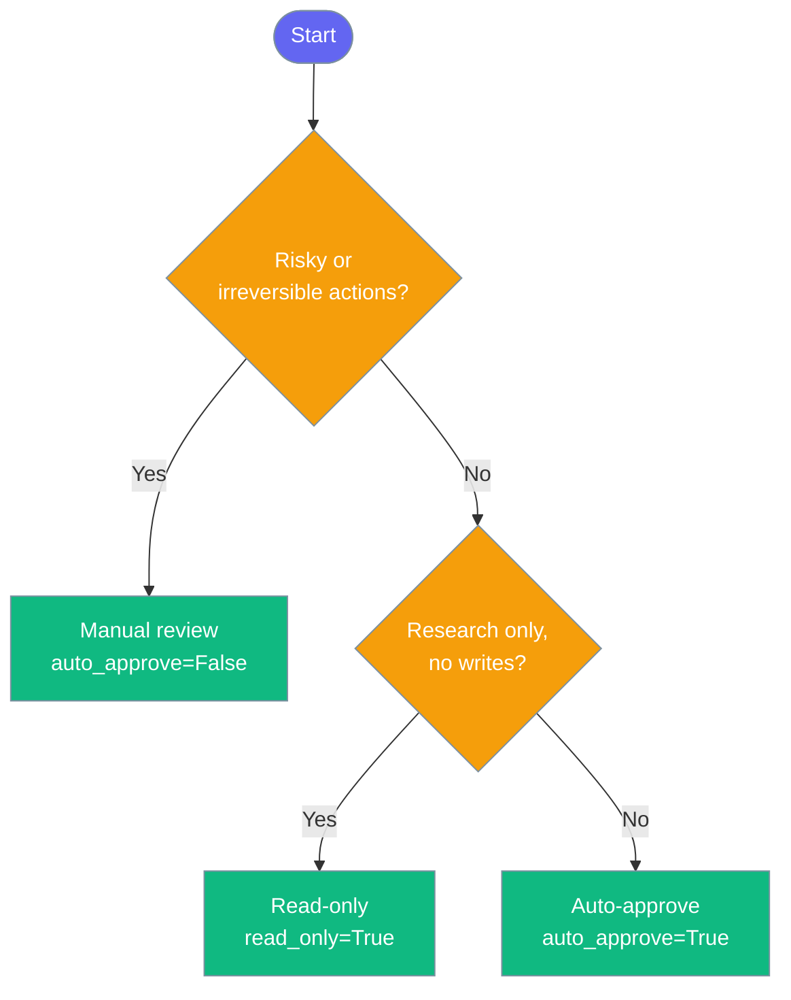

Planning makes agents create a step-by-step plan before executing, improving accuracy on complex multi-step tasks.

```python
from praisonaiagents import Agent

agent = Agent(
    name="Assistant",
    instructions="You help users with research and analysis tasks.",
    planning=True,
)

agent.start("Research the top 5 electric vehicle manufacturers and compare their market share.")
```



## Quick Start

<Steps>
<Step title="Simple Usage">

Enable planning with a single parameter — the agent drafts a plan before acting.

```python
from praisonaiagents import Agent

agent = Agent(
    instructions="You research before acting.",
    planning=True,
)
agent.start("Compare React and Vue for a dashboard.")
```
</Step>

<Step title="With Configuration">

Use `PlanningConfig` to pick the planning LLM, tools, and approval behavior.

```python
from praisonaiagents import Agent, PlanningConfig

agent = Agent(
    name="Planner",
    instructions="Research and write about topics.",
    planning=PlanningConfig(
        llm="gpt-4o",
        reasoning=True,
        auto_approve=False,
    ),
)
agent.start("Draft a migration plan from REST to GraphQL.")
```
</Step>
</Steps>

---

## How It Works



| Phase | What happens |
|---|---|
| 1. Research | The agent gathers context and drafts a step-by-step plan |
| 2. Review | With `auto_approve=False`, the plan is shown for your approval before any action |
| 3. Execute | Once approved (or auto-approved), the agent runs the plan step by step |

---

## Choosing Your Planning Mode



---

## Configuration Options

<Card icon="code" href="/docs/configuration/planning-config">
  Full list of `PlanningConfig` options, types, and defaults.
</Card>

<AccordionGroup>
<Accordion title="All PlanningConfig fields">

| Field | Type | Default | What it does |
|---|---|---|---|
| `llm` | `str \| None` | `None` | Planning LLM when different from the agent's main LLM |
| `tools` | `list \| None` | `None` | Tools available during the planning phase |
| `reasoning` | `bool` | `False` | Enable reasoning while drafting the plan |
| `auto_approve` | `bool` | `False` | Run the plan without asking for your approval |
| `read_only` | `bool` | `False` | Restrict planning to read-only operations |

</Accordion>
</AccordionGroup>

---

## Common Patterns

### Pattern 1 — Auto-approve a safe task

For low-risk, repeatable tasks, skip the review step and run the plan straight through.

```python
from praisonaiagents import Agent, PlanningConfig

agent = Agent(
    name="Outliner",
    instructions="Turn notes into a structured outline.",
    planning=PlanningConfig(auto_approve=True),
)
outline = agent.start("Structure these meeting notes into an outline.")
```

### Pattern 2 — Read-only research mode

Restrict the agent to reads during planning so it can investigate without side effects.

```python
from praisonaiagents import Agent, PlanningConfig

agent = Agent(
    name="Researcher",
    instructions="Investigate the codebase and report findings.",
    planning=PlanningConfig(read_only=True, reasoning=True),
)
report = agent.start("Find where auth tokens are validated.")
```

### Pattern 3 — Separate planning LLM with tools

Use a cheaper model to draft the plan and give the planning phase its own tools.

```python
from praisonaiagents import Agent, PlanningConfig
from praisonaiagents.tools import duckduckgo

agent = Agent(
    name="Strategist",
    instructions="Plan a content calendar.",
    llm="anthropic/claude-sonnet-4-20250514",
    planning=PlanningConfig(llm="gpt-4o", tools=[duckduckgo]),
)
agent.start("Plan a month of blog posts on AI agents.")
```

---

## Best Practices

<AccordionGroup>
<Accordion title="Start with planning=True">

Turn planning on with the default config before reaching for `PlanningConfig`. The default already separates drafting from execution, so you see the plan before it runs. Add config only when you need a different LLM or approval behavior.
</Accordion>

<Accordion title="Keep auto_approve=False for irreversible actions">

Anything that writes files, sends messages, or makes API calls is hard to undo. Leave `auto_approve=False` for those tasks so the plan lands in front of you before any change happens. Reserve `auto_approve=True` for read-heavy or idempotent work.
</Accordion>

<Accordion title="Use a cheaper planning LLM">

Drafting a plan is lighter work than executing it. Set `llm` to a cheaper model (for example `gpt-4o-mini`) for the planning phase, and keep your stronger model on the agent for execution.
</Accordion>

<Accordion title="Reach for read_only on investigations">

When you only need answers — not changes — set `read_only=True`. The agent can explore and report without the risk of writing or calling mutating tools during planning.
</Accordion>
</AccordionGroup>

---

## Related

<CardGroup cols={2}>
  <Card icon="list-check" href="/docs/features/planning-mode">
    Planning Mode — the review and approval workflow in depth.
  </Card>
  <Card icon="code" href="/docs/configuration/planning-config">
    PlanningConfig — full options, types, and defaults.
  </Card>
</CardGroup>
