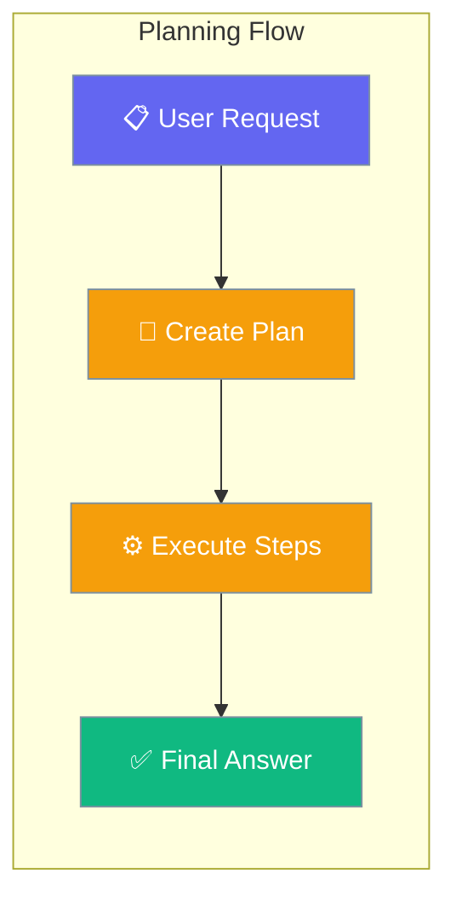
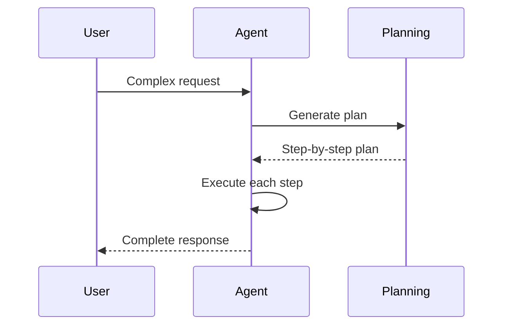

Planning makes agents create a step-by-step plan before executing, improving accuracy on complex multi-step tasks.

```python
from praisonaiagents import Agent

agent = Agent(
    name="Assistant",
    instructions="You help users with research and analysis tasks.",
    planning=True,
)

agent.start("Research the top 5 electric vehicle manufacturers and compare their market share.")
```



## Quick Start

<Steps>
<Step title="Simple Usage">
```python
from praisonaiagents import Agent

agent = Agent(instructions="You are a research assistant.", planning=True)
agent.start("Write a detailed report on renewable energy trends.")
```
</Step>

<Step title="With Configuration">
```python
from praisonaiagents import Agent, PlanningConfig

agent = Agent(
    instructions="You are a research assistant.",
    planning=PlanningConfig(
        llm="gpt-4o",
        reasoning=True,
        auto_approve=True,
    ),
)
agent.start("Analyze the pros and cons of remote work policies.")
```
</Step>
</Steps>

---

## How It Works



| Phase | What happens |
|---|---|
| 1. Plan | Agent breaks the request into ordered steps |
| 2. Approve | User confirms the plan (if `auto_approve=False`) |
| 3. Execute | Agent follows the plan step by step |
| 4. Respond | Comprehensive answer delivered |

---

## Configuration Options

<Card icon="code" href="/docs/sdk/reference/python/PlanningConfig">
  Full list of options, types, and defaults — `PlanningConfig`
</Card>

| Option | Type | Default | Description |
|---|---|---|---|
| `llm` | `str \| None` | `None` | LLM for planning (defaults to agent's LLM) |
| `tools` | `list \| None` | `None` | Tools available during planning |
| `reasoning` | `bool` | `False` | Enable extended reasoning during planning |
| `auto_approve` | `bool` | `False` | Skip user confirmation of plans |
| `read_only` | `bool` | `False` | Only allow read operations during planning |

---

## Common Patterns

### Pattern 1 — Auto-approve for autonomous agents
```python
from praisonaiagents import Agent, PlanningConfig

agent = Agent(
    instructions="You are an autonomous research agent.",
    planning=PlanningConfig(auto_approve=True, reasoning=True),
)
response = agent.start("Create a market analysis for electric vehicles.")
print(response)
```

### Pattern 2 — Separate planning LLM
```python
from praisonaiagents import Agent, PlanningConfig

agent = Agent(
    instructions="You are a code review assistant.",
    llm="gpt-4o-mini",
    planning=PlanningConfig(
        llm="gpt-4o",
        auto_approve=True,
    ),
)
agent.start("Review this Python codebase for security vulnerabilities.")
```

---

## Best Practices

<AccordionGroup>
<Accordion title="When to use planning">
Enable planning for tasks with 3+ distinct steps, tasks requiring research + synthesis, or any workflow where the order of operations matters. Single-question lookups don't need planning.
</Accordion>

<Accordion title="Set auto_approve for production">
In automated workflows, set `auto_approve=True` so the agent doesn't wait for human confirmation. In interactive setups, leave it `False` to review plans before execution.
</Accordion>

<Accordion title="Use a stronger LLM for planning">
If your main agent uses a fast/cheap model, set `planning=PlanningConfig(llm="gpt-4o")` to use a more capable model just for planning. Execution can remain with the cheaper model.
</Accordion>
</AccordionGroup>

---

## Related

<CardGroup cols={2}>
<Card icon="rotate" href="/docs/features/reflection">
  Reflection — self-check responses for quality
</Card>
<Card icon="diagram-project" href="/docs/features/planning-mode">
  Planning Mode — deep dive into planning behavior
</Card>
</CardGroup>
