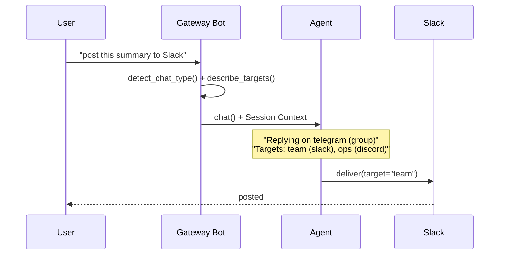

Gateway agents automatically know where a message came from and which channels they can deliver to — no extra code required.

```python
from praisonai.bots import Bot
from praisonaiagents import Agent

agent = Agent(
    name="gateway",
    instructions="Help users across platforms.",
)

bot = Bot("telegram", agent=agent)
bot.run()
```


## Quick Start

<Steps>
<Step title="Simple Usage">

```python
from praisonai.bots import Bot
from praisonaiagents import Agent

agent = Agent(
    name="gateway",
    instructions="Help users across platforms.",
)

# Token from TELEGRAM_BOT_TOKEN env var
bot = Bot("telegram", agent=agent)
bot.run()
```

The agent's system prompt automatically includes the source platform, chat type, and reachable delivery targets.

</Step>

<Step title="With Configuration">

Add a channel directory for cross-platform delivery:

```python
from praisonai.bots import Bot
from praisonai.bots.delivery import ChannelDirectory
from praisonaiagents import Agent

agent = Agent(
    name="gateway",
    instructions="Help users and post summaries to Slack when asked.",
)

directory = ChannelDirectory()
directory.set_home_channel("slack", "C0123456")
directory.add_alias("team", "slack", "C0123456")
directory.add_alias("ops", "discord", "987654321")

bot = Bot("telegram", agent=agent, channel_directory=directory)
bot.run()
```

</Step>
</Steps>

---

## How It Works



| Step | What Happens |
|------|-------------|
| **Origin detection** | `detect_chat_type(platform, chat_id)` classifies as group, direct, channel, or unknown |
| **Target listing** | `ChannelDirectory.describe_targets()` lists home channels and aliases |
| **Prompt injection** | A `## Session Context` block is appended per turn |
| **Agent responds** | The agent uses context to reply here or deliver elsewhere |

<Note>
Prompt injection happens after the system prompt cache boundary — the per-turn `## Session Context` block is never cached.
</Note>

---

## Configuration Options

### BotSessionManager

| Option | Type | Default | Description |
|--------|------|---------|-------------|
| `channel_directory` | `ChannelDirectory` | `None` | Named aliases and home channels for delivery |
| `inject_session_context` | `bool` | `True` | When `False`, suppress per-turn prompt injection |

### BotConfig media

| Option | Type | Default | Description |
|--------|------|---------|-------------|
| `max_inbound_media_bytes` | `int` | `20971520` | Max inbound media size; set `0` to disable |

### Chat-type detection

| Platform | Pattern | Type |
|----------|---------|------|
| `telegram` | starts with `-100` | `"unknown"` |
| `telegram` | starts with `-` | `"group"` |
| `telegram` | otherwise | `"direct"` |
| `slack` | starts with `C` / `G` / `D` | channel / group / direct |
| `whatsapp` | contains `@g.us` / `@c.us` | group / direct |

---

## Common Patterns

### Cross-platform delivery

```python
directory = ChannelDirectory()
directory.set_home_channel("slack", "C0123456")
directory.add_alias("team", "slack", "C0123456")

agent = Agent(
    name="cross-platform",
    instructions="When asked to post somewhere, use delivery targets from Session Context.",
)
bot = Bot("telegram", agent=agent, channel_directory=directory)
```

### Disable injection for privacy

```python
bot = Bot("telegram", agent=agent, inject_session_context=False)
```

Context still flows to tools via `get_session_context()` — only the visible prompt block is suppressed.

---

## Best Practices

<AccordionGroup>
<Accordion title="Per-turn data is never cached">
The `## Session Context` block is injected after the cache boundary — each turn gets fresh context without invalidating prior cache entries.
</Accordion>
<Accordion title="Use friendly alias names">
Prefer `"team"` or `"ops"` over raw channel IDs — the model matches user intent to alias names.
</Accordion>
<Accordion title="Set home channels before aliases">
`set_home_channel(platform, channel_id)` designates the default delivery target; agents refer to it as `"<platform>:home"`.
</Accordion>
<Accordion title="Disable injection for privacy-sensitive deployments">
Set `inject_session_context=False` when platform metadata should not appear in the system prompt.
</Accordion>
</AccordionGroup>

---

## Related

<CardGroup cols={2}>
<Card title="Cross-Platform Sessions" icon="users" href="/docs/features/cross-platform-mirror">
  Unified conversation history across platforms
</Card>
<Card title="Channels Gateway" icon="comments" href="/docs/features/channels-gateway">
  Connect agents to Telegram, Discord, Slack, and WhatsApp
</Card>
<Card title="Bot Message Routing" icon="route" href="/docs/features/bot-routing">
  Route messages to different agents by channel
</Card>
<Card title="Gateway Tool Policy" icon="shield-check" href="/docs/features/gateway-tool-policy">
  Scope the toolset per route
</Card>
</CardGroup>
