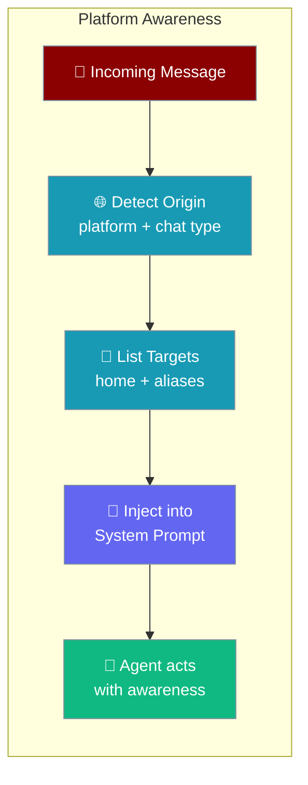
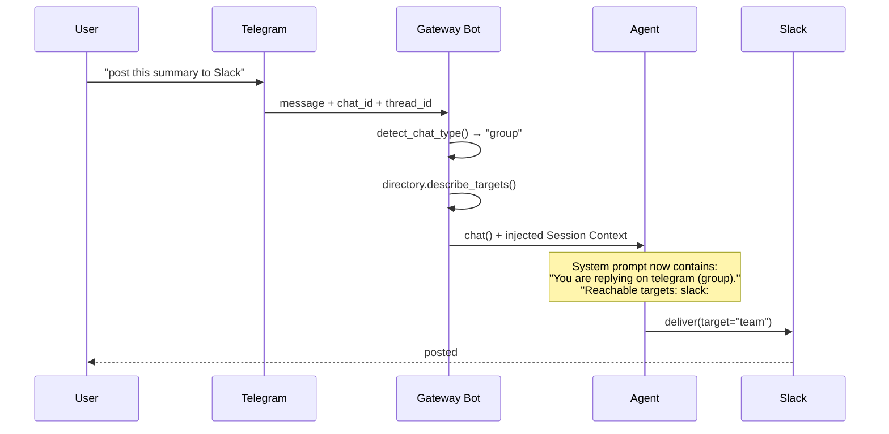

Gateway agents are automatically told where a message came from and which channels they can deliver to — no extra code required.



## Quick Start

<Steps>
<Step title="Basic Bot (Platform Awareness On by Default)">

```python
from praisonai.bots import TelegramBot
from praisonaiagents import Agent

agent = Agent(
    name="gateway",
    instructions="Help users across platforms.",
)

bot = TelegramBot(
    token="your-telegram-token",
    agent=agent,
)

import asyncio
asyncio.run(bot.start())
```

The agent's system prompt automatically includes:
- Which platform the message came from
- What chat type (DM, group, channel)
- Which channels it can reach
</Step>

<Step title="With Channel Directory (Cross-Platform Delivery)">

Configure named aliases so the agent can deliver to other platforms by friendly name:

```python
from praisonai.bots import TelegramBot
from praisonai.bots.delivery import ChannelDirectory
from praisonaiagents import Agent

agent = Agent(
    name="gateway",
    instructions="Help users and post summaries to Slack when asked.",
)

directory = ChannelDirectory()
directory.set_home_channel("slack", "C0123456")
directory.add_alias("team", "slack", "C0123456")
directory.add_alias("ops", "discord", "987654321")

bot = TelegramBot(
    token="your-telegram-token",
    agent=agent,
    channel_directory=directory,
)

import asyncio
asyncio.run(bot.start())
```

The agent now sees in its system prompt:
```
## Session Context
You are replying on telegram (group "Project Alpha") in thread 123.
Reachable delivery targets: slack:home (slack, home channel), team (slack:C0123456), ops (discord:987654321).
```
</Step>
</Steps>

---

## How It Works

Each incoming message triggers a per-turn context injection into the agent's system prompt.



| Step | What Happens |
|------|-------------|
| **Origin detection** | `detect_chat_type(platform, chat_id)` classifies the chat as `"group"`, `"direct"`, `"channel"`, or `"unknown"` |
| **Target listing** | `ChannelDirectory.describe_targets()` lists home channels and named aliases |
| **Prompt injection** | A `## Session Context` block is appended to the system prompt for this turn only |
| **Agent responds** | The agent uses the context to make decisions (e.g. reply here vs. post there) |

<Note>
Prompt injection happens **after** the system prompt is cached. The per-turn `## Session Context` block is never stored in the cache — this keeps the cache valid across turns while still giving the agent fresh context every time.
</Note>

---

## Configuration Options

### `Origin`

Describes where the incoming message came from. Populated automatically by the bot runtime.

| Option | Type | Default | Description |
|--------|------|---------|-------------|
| `platform` | `str` | `""` | Platform name (`"telegram"`, `"discord"`, `"slack"`, `"whatsapp"`, …) |
| `chat_type` | `str` | `""` | `"group"`, `"direct"`, `"channel"`, or `"unknown"` |
| `display_name` | `str` | `""` | Channel name, group name, or user name |
| `thread_id` | `str` | `""` | Thread / topic id |

### `ReachableTarget`

Represents a channel the agent can deliver to. Built from the `ChannelDirectory`.

| Option | Type | Default | Description |
|--------|------|---------|-------------|
| `name` | `str` | — | Friendly name or alias |
| `platform` | `str` | — | Target platform |
| `channel_id` | `str` | — | Platform channel id |
| `kind` | `str` | `"alias"` | `"home"` or `"alias"` |

### `BotSessionManager` Parameters

| Option | Type | Default | Description |
|--------|------|---------|-------------|
| `channel_directory` | `Optional[ChannelDirectory]` | `None` | Directory of reachable channels; if set, `describe_targets()` populates `reachable_targets` |
| `inject_session_context` | `bool` | `True` | When `False`, suppress per-turn prompt injection (origin + targets are still passed to tools) |

---

## Chat-Type Detection

`detect_chat_type(platform, chat_id)` returns a string classifying the chat context. Used to fill `Origin.chat_type`.

| Platform | Pattern | Returned Type |
|---|---|---|
| `telegram` | `chat_id` starts with `-100` | `"unknown"` (supergroup/channel ambiguous) |
| `telegram` | `chat_id` starts with `-` | `"group"` |
| `telegram` | otherwise | `"direct"` |
| `discord` | any | `"channel"` |
| `slack` | starts with `C` | `"channel"` |
| `slack` | starts with `G` | `"group"` |
| `slack` | starts with `D` or `U` | `"direct"` |
| `whatsapp` | contains `@g.us` | `"group"` |
| `whatsapp` | contains `@c.us` | `"direct"` |
| anything else | — | `"unknown"` |

---

## Choosing Your Setup

```mermaid
graph TB
    Start([Start]) --> Q1{Need cross-platform<br/>delivery?}
    Q1 -->|No| Simple[Basic bot<br/>no ChannelDirectory needed]
    Q1 -->|Yes| Q2{Agent should refer<br/>to channels by name?}
    Q2 -->|Yes| Alias[Add aliases via<br/>directory.add_alias()]
    Q2 -->|No| Home[Set home channels via<br/>directory.set_home_channel()]
    Home --> Q3{Privacy-sensitive<br/>deployment?}
    Alias --> Q3
    Q3 -->|Yes| Disable[Set inject_session_context=False<br/>context still passed to tools]
    Q3 -->|No| Default[Leave inject_session_context=True<br/>default]

    classDef decision fill:#189AB4,stroke:#7C90A0,color:#fff
    classDef action fill:#10B981,stroke:#7C90A0,color:#fff
    classDef start fill:#8B0000,stroke:#7C90A0,color:#fff

    class Q1,Q2,Q3 decision
    class Simple,Alias,Home,Disable,Default action
    class Start start
```

---

## Common Patterns

### Cross-Platform Delivery via Natural Language

The agent can deliver to another platform when the user says "post this to Slack":

```python
from praisonai.bots import TelegramBot
from praisonai.bots.delivery import ChannelDirectory
from praisonaiagents import Agent

directory = ChannelDirectory()
directory.set_home_channel("slack", "C0123456")
directory.add_alias("team", "slack", "C0123456")

agent = Agent(
    name="cross-platform",
    instructions="""
    Help users. When asked to post somewhere, use the delivery targets listed
    in your Session Context. Targets are available by their friendly names.
    """,
)

bot = TelegramBot(
    token="your-telegram-token",
    agent=agent,
    channel_directory=directory,
)
```

### Referring to "Here"

The agent knows what "here" means because `Origin` includes the current platform and chat type:

```python
agent = Agent(
    name="location-aware",
    instructions="""
    You know which platform you are on and whether you are in a DM or group.
    When users say 'post it here', use the current platform and chat from your
    Session Context.
    """,
)
```

### Disabling Injection for Privacy

Keep context away from the agent's visible system prompt (it still flows to tools via `get_session_context()`):

```python
bot = TelegramBot(
    token="your-telegram-token",
    agent=agent,
    inject_session_context=False,
)
```

---

## Best Practices

<AccordionGroup>
<Accordion title="Per-turn data is never cached">
The `## Session Context` block is injected after the system prompt cache boundary. Changing the origin or reachable targets never invalidates the cache for previous turns — each turn gets a fresh block without paying a re-cache penalty.
</Accordion>

<Accordion title="Use friendly alias names the model can guess">
Prefer short, descriptive names like `"team"`, `"ops"`, or `"alerts"` over raw channel IDs like `"C0123456"`. The model matches user intent to alias names — the closer the alias is to how users talk, the more reliably it routes.
</Accordion>

<Accordion title="Disable injection for privacy-sensitive deployments">
Set `inject_session_context=False` when you don't want the agent to see platform metadata in its system prompt. The context is still available to tools via `get_session_context()` — only the visible prompt block is suppressed.
</Accordion>

<Accordion title="Set home channels before adding aliases">
`set_home_channel(platform, channel_id)` designates the default delivery target for a platform. Agents can refer to it as `"<platform>:home"`. Add aliases for any additional channels that need friendly names.
</Accordion>
</AccordionGroup>

---

## Related

<CardGroup cols={2}>
<Card title="Cross-Platform Sessions" icon="users" href="/features/cross-platform-mirror">
  Unified conversation history across platforms — same human, one history.
</Card>
<Card title="Channels Gateway" icon="comments" href="/features/channels-gateway">
  Connect agents to Telegram, Discord, Slack, and WhatsApp.
</Card>
<Card title="Bot Message Routing" icon="route" href="/features/bot-routing">
  Route messages from DMs, groups, and channels to different agents.
</Card>
<Card title="Messaging Bots" icon="robot" href="/features/messaging-bots">
  Deploy AI agents to messaging platforms.
</Card>
</CardGroup>
