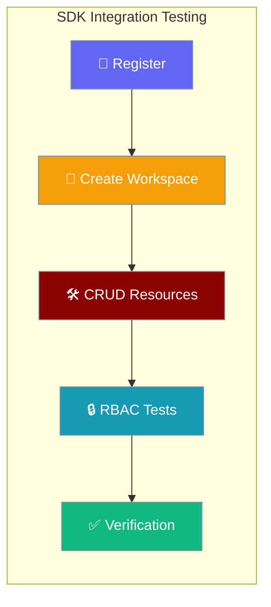
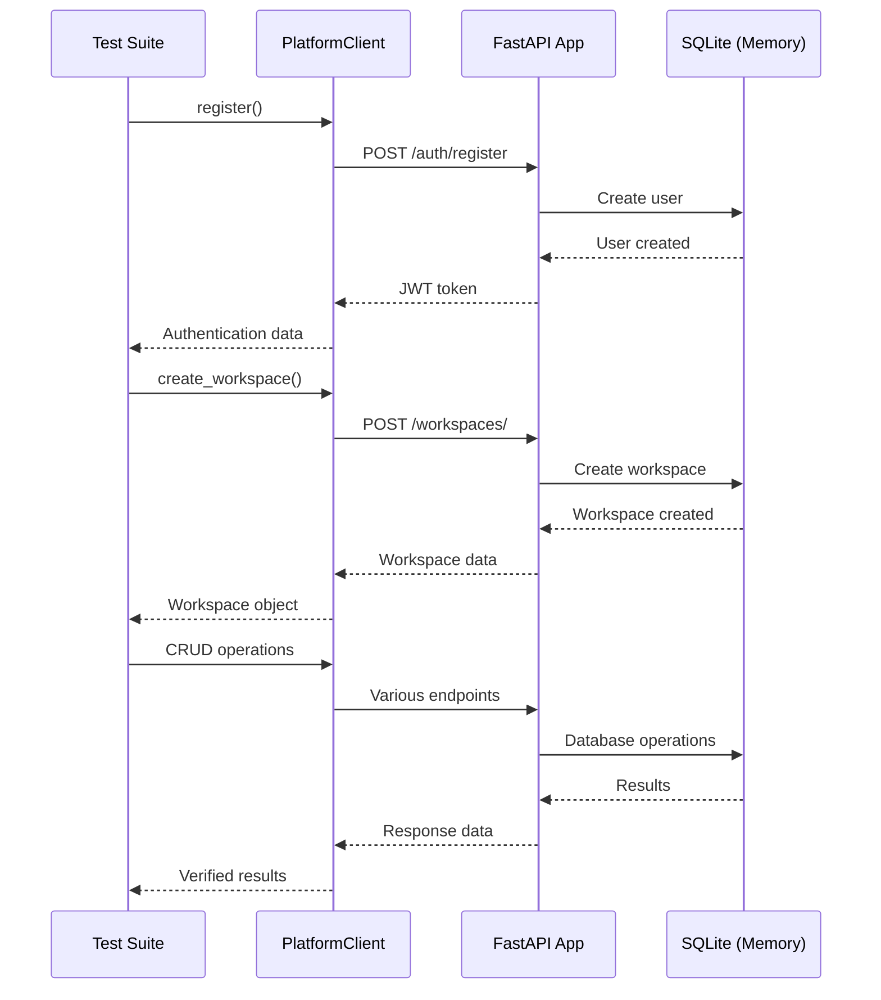
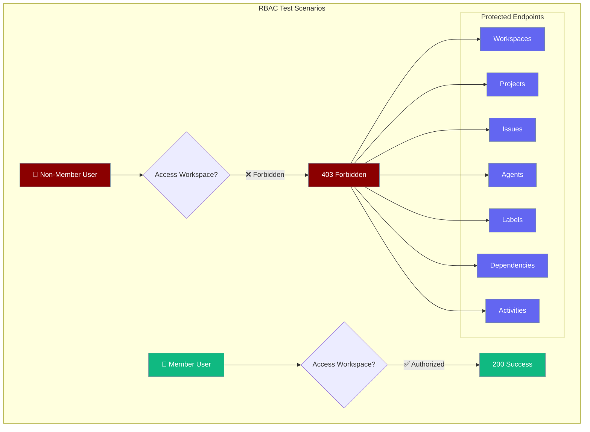

Platform Client SDK integration tests verify all API endpoints including authentication, workspaces, projects, issues, agents, and RBAC enforcement.



## Quick Start

<Steps>
<Step title="Basic SDK Test">
```python
from praisonai_platform.client import PlatformClient

# Test authentication and basic operations
async def test_basic_flow():
    client = PlatformClient("http://localhost:8000")
    
    # Register and authenticate
    user = await client.register("test@example.com", "password")
    
    # Create workspace and resources
    workspace = await client.create_workspace("Test Workspace")
    project = await client.create_project(
        workspace["id"], "Test Project"
    )
    
    # Verify operations
    workspaces = await client.list_workspaces()
    assert len(workspaces) >= 1
```
</Step>

<Step title="Integration Test Suite">
```python
import pytest
import httpx
from httpx import ASGITransport
from praisonai_platform.api.app import app
from praisonai_platform.client import PlatformClient

@pytest.mark.asyncio
async def test_full_sdk_lifecycle():
    # Use ASGITransport for testing against real FastAPI app
    async with httpx.AsyncClient(
        transport=ASGITransport(app=app),
        base_url="http://test"
    ) as client:
        sdk = PlatformClient("http://test")
        
        # Test complete workflow
        await test_auth_workflow(sdk)
        await test_workspace_management(sdk)
        await test_rbac_enforcement(sdk)
```
</Step>
</Steps>

---

## How It Works



| Component | Purpose | Technology |
|-----------|---------|-------------|
| **Test Suite** | Comprehensive integration tests | pytest-asyncio |
| **SDK Client** | HTTP client for platform API | httpx.AsyncClient |
| **ASGI Transport** | In-memory testing against real app | ASGITransport |
| **Database** | Isolated test storage | SQLite (in-memory) |

---

## Test Coverage Matrix

### Authentication Tests

| Test Case | Endpoint | Verification |
|-----------|----------|-------------|
| User registration | `POST /auth/register` | User created, JWT returned |
| User login | `POST /auth/login` | Authentication successful |
| Get current user | `GET /auth/me` | User data retrieved |

### Workspace Management

| Test Case | Endpoint | Verification |
|-----------|----------|-------------|
| Create workspace | `POST /workspaces/` | Workspace created with owner |
| List workspaces | `GET /workspaces/` | User's workspaces returned |
| Get workspace | `GET /workspaces/{id}` | Workspace details retrieved |
| Update workspace | `PATCH /workspaces/{id}` | Workspace modified |
| Delete workspace | `DELETE /workspaces/{id}` | Workspace removed |

### Project Operations

| Test Case | Endpoint | Verification |
|-----------|----------|-------------|
| Create project | `POST /workspaces/{id}/projects/` | Project created in workspace |
| List projects | `GET /workspaces/{id}/projects/` | Workspace projects returned |
| Get project | `GET /workspaces/{id}/projects/{id}` | Project details retrieved |
| Update project | `PATCH /workspaces/{id}/projects/{id}` | Project modified |
| Delete project | `DELETE /workspaces/{id}/projects/{id}` | Project removed |
| Project statistics | `GET /workspaces/{id}/projects/{id}/stats` | Issue counts returned |

### Issue Management

| Test Case | Endpoint | Verification |
|-----------|----------|-------------|
| Create issue | `POST /workspaces/{id}/issues/` | Issue created with number |
| List issues | `GET /workspaces/{id}/issues/` | Workspace issues returned |
| Get issue | `GET /workspaces/{id}/issues/{id}` | Issue details retrieved |
| Update issue | `PATCH /workspaces/{id}/issues/{id}` | Issue modified |
| Delete issue | `DELETE /workspaces/{id}/issues/{id}` | Issue removed |

---

## RBAC Enforcement Tests



### RBAC Test Implementation

```python
@pytest.mark.asyncio
async def test_rbac_enforcement():
    # Create workspace with member user
    member_client = PlatformClient()
    await member_client.register("member@test.com", "password")
    workspace = await member_client.create_workspace("RBAC Test")
    
    # Create non-member user
    nonmember_client = PlatformClient()
    await nonmember_client.register("nonmember@test.com", "password")
    
    # Test: Non-member should get 403 on workspace access
    with pytest.raises(httpx.HTTPStatusError) as exc_info:
        await nonmember_client.get_workspace(workspace["id"])
    assert exc_info.value.response.status_code == 403
    
    # Test: Non-member blocked on all workspace-scoped endpoints
    endpoints_to_test = [
        lambda: nonmember_client.list_projects(workspace["id"]),
        lambda: nonmember_client.list_issues(workspace["id"]),
        lambda: nonmember_client.list_agents(workspace["id"]),
        lambda: nonmember_client.list_labels(workspace["id"]),
    ]
    
    for endpoint_call in endpoints_to_test:
        with pytest.raises(httpx.HTTPStatusError) as exc:
            await endpoint_call()
        assert exc.value.response.status_code == 403
```

---

## Common Patterns

### Test Data Setup

```python
# Pattern: Create isolated test environment
async def setup_test_data(client: PlatformClient):
    """Create common test data structure"""
    user = await client.register("test@example.com", "password")
    workspace = await client.create_workspace("Test Workspace")
    project = await client.create_project(
        workspace["id"], 
        "Test Project"
    )
    return user, workspace, project
```

### Error Handling Tests

```python
# Pattern: Verify proper error responses
async def test_error_handling(client: PlatformClient):
    # Test 404 for non-existent resources
    with pytest.raises(httpx.HTTPStatusError) as exc:
        await client.get_workspace("nonexistent-id")
    assert exc.value.response.status_code == 404
    
    # Test 422 for invalid data
    with pytest.raises(httpx.HTTPStatusError) as exc:
        await client.create_workspace("")  # Empty name
    assert exc.value.response.status_code == 422
```

### End-to-End Workflows

```python
# Pattern: Test complete user journey
async def test_complete_workflow(client: PlatformClient):
    # Authentication
    await client.register("user@test.com", "password")
    
    # Workspace setup  
    workspace = await client.create_workspace("My Workspace")
    project = await client.create_project(workspace["id"], "My Project")
    
    # Issue management
    issue = await client.create_issue(
        workspace["id"], 
        "Fix bug",
        project_id=project["id"]
    )
    
    # Add comments and labels
    await client.add_comment(workspace["id"], issue["id"], "Working on it")
    
    # Verify final state
    issues = await client.list_issues(workspace["id"])
    assert len(issues) == 1
    assert issues[0]["title"] == "Fix bug"
```

---

## Best Practices

<AccordionGroup>
<Accordion title="Use In-Memory Database">
Configure SQLite with in-memory database for fast, isolated tests:

```python
# conftest.py
@pytest.fixture
async def session():
    engine = create_async_engine("sqlite+aiosqlite:///:memory:")
    async with engine.begin() as conn:
        await conn.run_sync(Base.metadata.create_all)
    
    async_session = async_sessionmaker(engine)
    async with async_session() as session:
        yield session
```
</Accordion>

<Accordion title="Test Against Real FastAPI App">
Use ASGITransport to test against the actual FastAPI application:

```python
async with httpx.AsyncClient(
    transport=ASGITransport(app=app),
    base_url="http://test"
) as http_client:
    # Tests run against real app logic
    client = PlatformClient("http://test")
```
</Accordion>

<Accordion title="Verify RBAC Comprehensively">
Test authorization on every workspace-scoped endpoint:

```python
# Test all protected endpoints systematically
protected_endpoints = [
    "workspaces", "projects", "issues", 
    "agents", "labels", "dependencies"
]

for endpoint in protected_endpoints:
    await verify_403_for_nonmember(endpoint)
```
</Accordion>

<Accordion title="Clean Test Isolation">
Each test should create its own data to avoid conflicts:

```python
@pytest.mark.asyncio
async def test_isolated_data():
    # Use unique email for each test
    email = f"test-{uuid.uuid4()}@example.com"
    client = PlatformClient()
    await client.register(email, "password")
```
</Accordion>
</AccordionGroup>

---

## Related

<CardGroup cols={2}>
<Card title="Platform API Reference" icon="code" href="/docs/features/platform-api">
  Complete API endpoint documentation
</Card>
<Card title="Authentication & RBAC" icon="shield" href="/docs/features/platform-auth">
  Security and access control details
</Card>
</CardGroup>