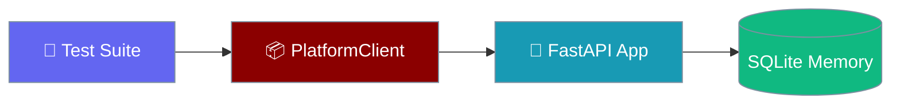
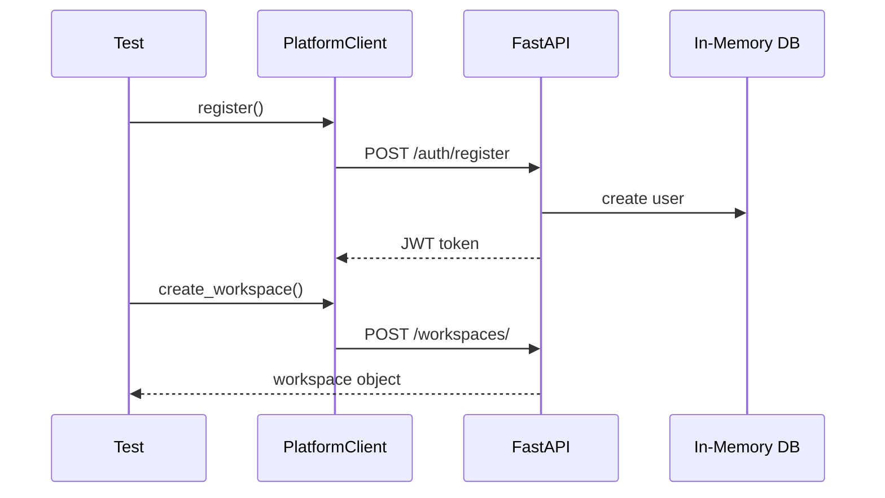

```python
from praisonaiagents import Agent

agent = Agent(name="test-agent", instructions="Run platform client SDK tests.")
agent.start("Run the full SDK test suite and report results.")
```


Run integration tests against the real FastAPI app to verify every PlatformClient endpoint and RBAC rule.

```bash
pip install praisonai-platform pytest pytest-asyncio httpx
pytest praisonai_platform/tests/ -v
```

```python
import pytest
from praisonai_platform.client import PlatformClient

@pytest.mark.asyncio
async def test_register_and_workspace():
    client = PlatformClient("http://localhost:8000")
    await client.register("test@example.com", "password")
    workspace = await client.create_workspace("Test Workspace")
    assert workspace["name"] == "Test Workspace"
```



## Quick Start

<Steps>
<Step title="Simple Usage">

Start the platform server, then run client tests:

```bash
python -m praisonai_platform --port 8000 &
pytest praisonai_platform/tests/test_client.py -v
```

</Step>

<Step title="With Configuration">

Test against the in-process FastAPI app with ASGITransport — no server required:

```python
import pytest
import httpx
from httpx import ASGITransport
from praisonai_platform.api.app import create_app
from praisonai_platform.client import PlatformClient

@pytest.mark.asyncio
async def test_full_lifecycle():
    app = create_app()
    transport = ASGITransport(app=app)

    async with httpx.AsyncClient(transport=transport, base_url="http://test") as http:
        client = PlatformClient("http://test")
        await client.register("user@test.com", "password")
        workspace = await client.create_workspace("My Workspace")
        assert workspace["name"] == "My Workspace"
```

</Step>
</Steps>

---

## How It Works



| Layer | Purpose |
|-------|---------|
| **pytest-asyncio** | Async test runner |
| **ASGITransport** | In-memory requests against the real app |
| **PlatformClient** | HTTP wrapper with auto-authentication |
| **SQLite memory** | Isolated database per test run |

---

## Test Coverage

| Area | Endpoints | Verification |
|------|-----------|-------------|
| **Authentication** | `/auth/register`, `/auth/login`, `/auth/me` | JWT returned, user retrieved |
| **Workspaces** | CRUD on `/workspaces/` | Owner membership enforced |
| **Projects** | CRUD on `/workspaces/{id}/projects/` | Scoped to workspace |
| **Issues** | CRUD on `/workspaces/{id}/issues/` | Issue numbers assigned |
| **RBAC** | All workspace-scoped routes | Non-members receive 403 |

---

## RBAC enforcement test

```python
import pytest
import httpx
from praisonai_platform.client import PlatformClient

@pytest.mark.asyncio
async def test_nonmember_blocked():
    member = PlatformClient("http://localhost:8000")
    await member.register("member@test.com", "password")
    workspace = await member.create_workspace("RBAC Test")

    outsider = PlatformClient("http://localhost:8000")
    await outsider.register("outsider@test.com", "password")

    with pytest.raises(httpx.HTTPStatusError) as exc:
        await outsider.get_workspace(workspace["id"])
    assert exc.value.response.status_code == 403
```

---

## Best Practices

<AccordionGroup>
<Accordion title="Use in-memory database for speed">
Configure SQLite with `:memory:` in test fixtures for fast, isolated runs.
</Accordion>
<Accordion title="Test against the real FastAPI app">
Use `ASGITransport(app=create_app())` so tests exercise actual route logic and dependencies.
</Accordion>
<Accordion title="Verify RBAC on every workspace route">
Assert 403 for non-members on projects, issues, agents, labels, and dependencies.
</Accordion>
<Accordion title="Isolate test data with unique emails">
Use `f"test-{uuid.uuid4()}@example.com"` per test to avoid collisions.
</Accordion>
</AccordionGroup>

---

## Related

<CardGroup cols={2}>
<Card title="Platform SDK Client" icon="code" href="/docs/features/platform/sdk-client">
  Complete PlatformClient API reference
</Card>
<Card title="RBAC Enforcement" icon="shield" href="/docs/features/platform/rbac-enforcement">
  Workspace membership and role checks
</Card>
</CardGroup>
