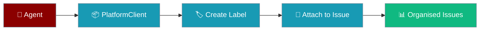
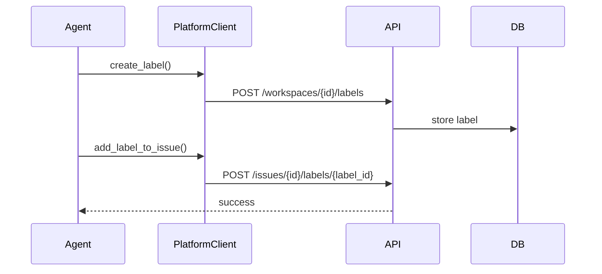

Colour-coded labels organise platform issues by type, priority, or team — attach them from an agent or the SDK.

```python
import os
from praisonaiagents import Agent
from praisonai_platform.client import PlatformClient

agent = Agent(
    name="label-manager",
    instructions="Categorise issues with workspace labels (bug, feature, urgent).",
)

async with PlatformClient(
    os.getenv("PLATFORM_URL", "http://localhost:8000"),
    token=os.getenv("PLATFORM_TOKEN"),
) as client:
    label = await client.create_label("ws-123", name="bug", color="#dc2626")
    await client.add_label_to_issue("ws-123", "issue-456", label["id"])
```



## Quick Start

<Steps>
<Step title="Simple Usage">

Create a label and attach it to an issue:

```python
import os
import asyncio
from praisonai_platform.client import PlatformClient

async def tag_issue():
    async with PlatformClient(
        os.getenv("PLATFORM_URL", "http://localhost:8000"),
        token=os.getenv("PLATFORM_TOKEN"),
    ) as client:
        label = await client.create_label(
            "ws-123",
            name="bug",
            color="#dc2626",
        )
        await client.add_label_to_issue("ws-123", "issue-456", label["id"])

asyncio.run(tag_issue())
```

</Step>

<Step title="With Configuration">

List labels, update colours, and remove labels from issues:

```python
import os
import asyncio
from praisonai_platform.client import PlatformClient

async def manage_labels():
    async with PlatformClient(
        os.getenv("PLATFORM_URL", "http://localhost:8000"),
        token=os.getenv("PLATFORM_TOKEN"),
    ) as client:
        labels = await client.list_labels("ws-123")
        await client.update_label("ws-123", labels[0]["id"], color="#991b1b")
        await client.remove_label_from_issue("ws-123", "issue-456", labels[0]["id"])

asyncio.run(manage_labels())
```

</Step>
</Steps>

---

## How It Works



| Component | Purpose |
|-----------|---------|
| **Labels** | Reusable, workspace-scoped tags with hex colours |
| **Issue links** | Many-to-many — one issue can carry several labels |
| **PlatformClient** | Async CRUD for labels and issue attachments |

---

## Configuration Options

| Field | Type | Default | Description |
|-------|------|---------|-------------|
| `name` | `str` | — | Label name (unique per workspace) |
| `color` | `str` | `#6B7280` | Hex colour for UI display |
| `description` | `str` | `None` | Optional label description |

---

## Best Practices

<AccordionGroup>
<Accordion title="Use semantic colours">
Keep colours consistent — red for bugs, green for features, orange for urgent items.
</Accordion>
<Accordion title="Limit label sprawl">
Aim for 10–20 labels per workspace; use prefixes like `type:` or `priority:` when needed.
</Accordion>
<Accordion title="Read tokens from the environment">
Use `os.getenv("PLATFORM_TOKEN")` — never hardcode JWT values in source.
</Accordion>
<Accordion title="Batch with a context manager">
Reuse one `PlatformClient` session when tagging many issues in a loop.
</Accordion>
</AccordionGroup>

---

## Related

<CardGroup cols={2}>
<Card title="Platform Issues" icon="circle-exclamation" href="/docs/features/platform/issues">
  Create and manage issues that labels attach to
</Card>
<Card title="Platform SDK Client" icon="code" href="/docs/features/platform-sdk">
  Full PlatformClient API reference
</Card>
</CardGroup>
