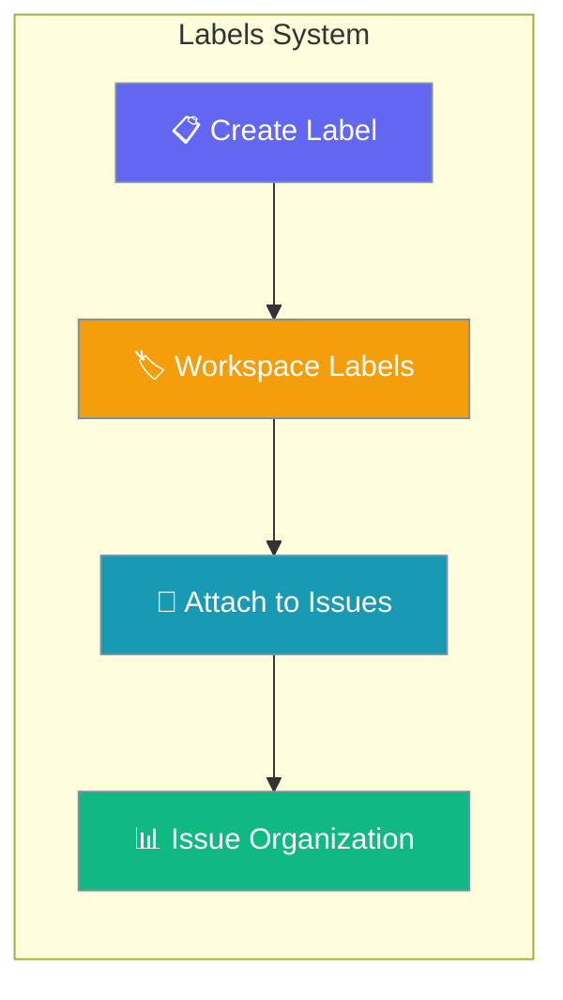
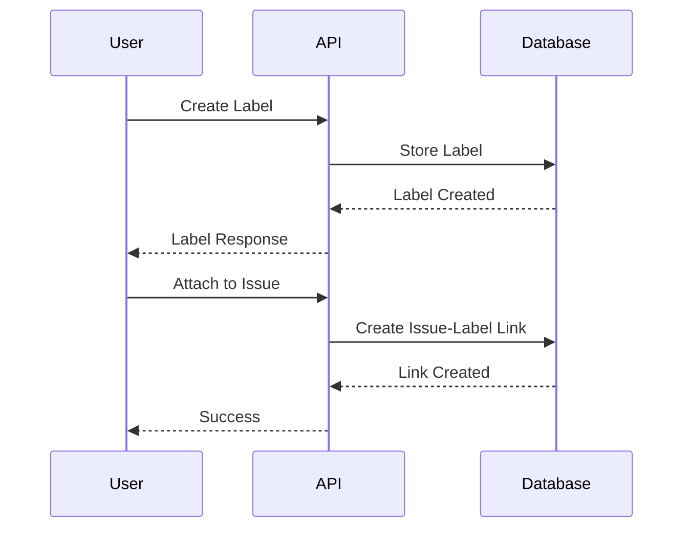
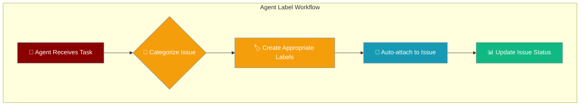
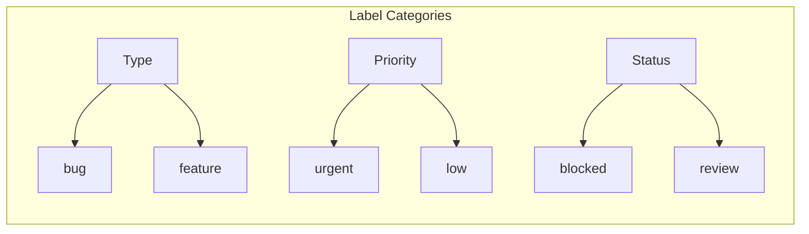

Platform Labels provide color-coded tags scoped to a workspace for categorizing issues with labels like "bug", "feature", or "urgent".



## Quick Start

<Steps>
<Step title="Create Agent with Platform Client">
```python
from praisonaiagents import Agent
import httpx

agent = Agent(
    name="Label Manager",
    instructions="Create and manage workspace labels",
    platform_url="http://localhost:8000/api/v1"
)

# Platform client setup
base_url = "http://localhost:8000/api/v1"
headers = {"Authorization": "Bearer YOUR_TOKEN"}
```
</Step>

<Step title="Create and Use Labels">
```python
import asyncio

async def manage_labels():
    async with httpx.AsyncClient() as client:
        # Create a label
        response = await client.post(
            f"{base_url}/workspaces/ws-123/labels",
            json={"name": "bug", "color": "#FF0000"},
            headers=headers
        )
        label = response.json()
        
        # Attach to issue
        await client.post(
            f"{base_url}/workspaces/ws-123/issues/issue-456/labels/{label['id']}",
            headers=headers
        )

asyncio.run(manage_labels())
```
</Step>
</Steps>

---

## How It Works



| Component | Purpose | Scope |
|-----------|---------|-------|
| **Labels** | Color-coded categorization tags | Workspace-scoped, reusable |
| **Issue Links** | Many-to-many relationships | One issue can have multiple labels |
| **Color Coding** | Visual organization | Hex color codes (default #6B7280) |

---

## API Endpoints

| Method | Endpoint | Description |
|--------|----------|-------------|
| `POST` | `/workspaces/{ws_id}/labels` | Create workspace label |
| `GET` | `/workspaces/{ws_id}/labels` | List workspace labels |
| `PATCH` | `/workspaces/{ws_id}/labels/{label_id}` | Update label |
| `DELETE` | `/workspaces/{ws_id}/labels/{label_id}` | Delete label |
| `POST` | `/workspaces/{ws_id}/issues/{issue_id}/labels/{label_id}` | Add label to issue |
| `DELETE` | `/workspaces/{ws_id}/issues/{issue_id}/labels/{label_id}` | Remove label from issue |
| `GET` | `/workspaces/{ws_id}/issues/{issue_id}/labels` | List labels on issue |

---

## Request/Response Schemas

### Create Label
```json
{
  "name": "bug",
  "color": "#FF0000"
}
```

### Update Label
```json
{
  "name": "critical-bug", 
  "color": "#CC0000"
}
```

### Label Response
```json
{
  "id": "label-abc123",
  "workspace_id": "ws-abc123", 
  "name": "bug",
  "color": "#FF0000"
}
```

---

## Code Examples

### curl Examples

<Tabs>
<Tab title="Create Label">
```bash
TOKEN="your-jwt-token"
WS_ID="workspace-id"

curl -s -X POST http://localhost:8000/api/v1/workspaces/$WS_ID/labels \
  -H "Authorization: Bearer $TOKEN" \
  -H "Content-Type: application/json" \
  -d '{"name":"bug","color":"#FF0000"}' \
  --max-time 10
```
</Tab>

<Tab title="List Labels">
```bash
curl -s http://localhost:8000/api/v1/workspaces/$WS_ID/labels \
  -H "Authorization: Bearer $TOKEN" \
  --max-time 10
```
</Tab>

<Tab title="Attach to Issue">
```bash
curl -s -X POST http://localhost:8000/api/v1/workspaces/$WS_ID/issues/ISSUE_ID/labels/LABEL_ID \
  -H "Authorization: Bearer $TOKEN" \
  --max-time 10
```
</Tab>

<Tab title="Update Label">
```bash
curl -s -X PATCH http://localhost:8000/api/v1/workspaces/$WS_ID/labels/LABEL_ID \
  -H "Authorization: Bearer $TOKEN" \
  -H "Content-Type: application/json" \
  -d '{"name":"critical-bug","color":"#CC0000"}' \
  --max-time 10
```
</Tab>
</Tabs>

### Python SDK Examples

<Tabs>
<Tab title="Label Management">
```python
import asyncio
import httpx

async def label_management():
    base = "http://localhost:8000/api/v1"
    headers = {"Authorization": "Bearer YOUR_TOKEN"}
    ws_id = "your-workspace-id"

    async with httpx.AsyncClient() as client:
        # Create multiple labels
        labels = [
            {"name": "bug", "color": "#FF0000"},
            {"name": "feature", "color": "#00FF00"},
            {"name": "urgent", "color": "#FFA500"}
        ]
        
        created_labels = []
        for label_data in labels:
            resp = await client.post(
                f"{base}/workspaces/{ws_id}/labels",
                json=label_data, 
                headers=headers
            )
            created_labels.append(resp.json())
            
        return created_labels

asyncio.run(label_management())
```
</Tab>

<Tab title="Issue Labeling">
```python
async def issue_labeling():
    base = "http://localhost:8000/api/v1"
    headers = {"Authorization": "Bearer YOUR_TOKEN"}
    ws_id = "your-workspace-id"
    issue_id = "your-issue-id"

    async with httpx.AsyncClient() as client:
        # Get available labels
        resp = await client.get(
            f"{base}/workspaces/{ws_id}/labels",
            headers=headers
        )
        labels = resp.json()
        
        # Add multiple labels to issue
        for label in labels[:2]:  # Add first 2 labels
            await client.post(
                f"{base}/workspaces/{ws_id}/issues/{issue_id}/labels/{label['id']}",
                headers=headers
            )
        
        # List labels on issue
        resp = await client.get(
            f"{base}/workspaces/{ws_id}/issues/{issue_id}/labels",
            headers=headers
        )
        return resp.json()

asyncio.run(issue_labeling())
```
</Tab>
</Tabs>

---

## Agent Integration



### Agent-Powered Label Management

```python
from praisonaiagents import Agent

def create_label_manager_agent():
    return Agent(
        name="Label Manager",
        instructions="""
        You manage workspace labels and categorize issues automatically.
        
        When given an issue:
        1. Analyze the content and determine appropriate labels
        2. Check if required labels exist in the workspace
        3. Create missing labels with appropriate colors
        4. Attach relevant labels to the issue
        
        Use these color conventions:
        - Bug: #FF0000 (red)
        - Feature: #00FF00 (green) 
        - Enhancement: #0000FF (blue)
        - Urgent: #FFA500 (orange)
        - Documentation: #800080 (purple)
        """,
        tools=["web_search", "api_request"]
    )

# Usage
agent = create_label_manager_agent()
result = agent.start("Categorize this bug report and apply appropriate labels")
```

---

## Best Practices

<AccordionGroup>
<Accordion title="Color Conventions">
Establish consistent color schemes across your workspace for better visual organization. Use semantic colors that teams can easily recognize.

```json
{
  "bug": "#FF0000",      // Red for bugs
  "feature": "#00FF00",   // Green for features  
  "urgent": "#FFA500",    // Orange for urgency
  "blocked": "#800080"    // Purple for blocked items
}
```
</Accordion>

<Accordion title="Label Naming">
Use clear, consistent naming conventions. Keep label names short but descriptive. Consider using prefixes for categories like "priority:", "type:", "status:".

```python
# Good label names
labels = ["bug", "feature-request", "urgent", "needs-review"]

# Avoid unclear names
avoid = ["thing", "fix-this", "important", "asap"]
```
</Accordion>

<Accordion title="Workspace Organization">
Limit the number of labels per workspace to avoid clutter. Group related labels and consider using a hierarchical naming system for complex projects.


</Accordion>

<Accordion title="Many-to-Many Relationships">
Remember that issues can have multiple labels and labels can be attached to multiple issues. Design your labeling strategy with this flexibility in mind.

```python
# An issue can have multiple labels
issue_labels = ["bug", "urgent", "backend", "needs-review"]

# A label can be on multiple issues  
bug_issues = ["issue-1", "issue-2", "issue-3"]
```
</Accordion>
</AccordionGroup>

---

## Testing

Run these tests to verify label functionality:

```bash
# Test label service
pytest tests/test_new_gaps.py::TestLabelService -v

# Test label API routes  
pytest tests/test_new_api_integration.py::TestLabelRoutes -v
```

---

## Related

<CardGroup cols={2}>
<Card title="Platform Issues" icon="circle-exclamation" href="/docs/features/platform-issues">
  Manage issues that labels can be attached to
</Card>
<Card title="Platform Workspaces" icon="building" href="/docs/features/platform-workspaces">
  Workspace-scoped label management
</Card>
</CardGroup>