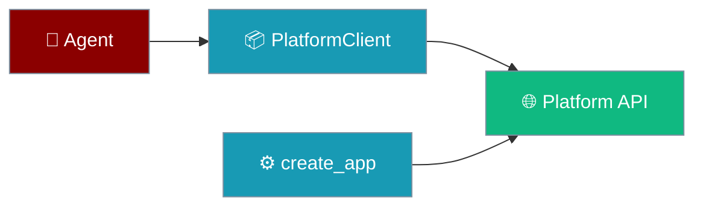
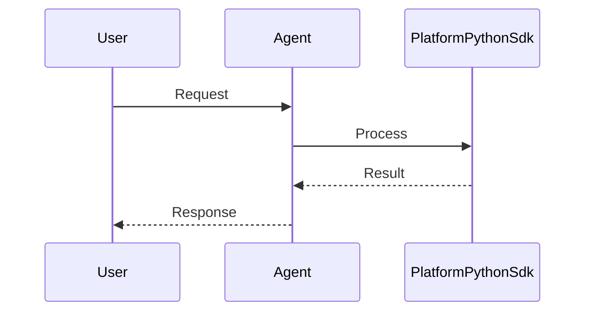
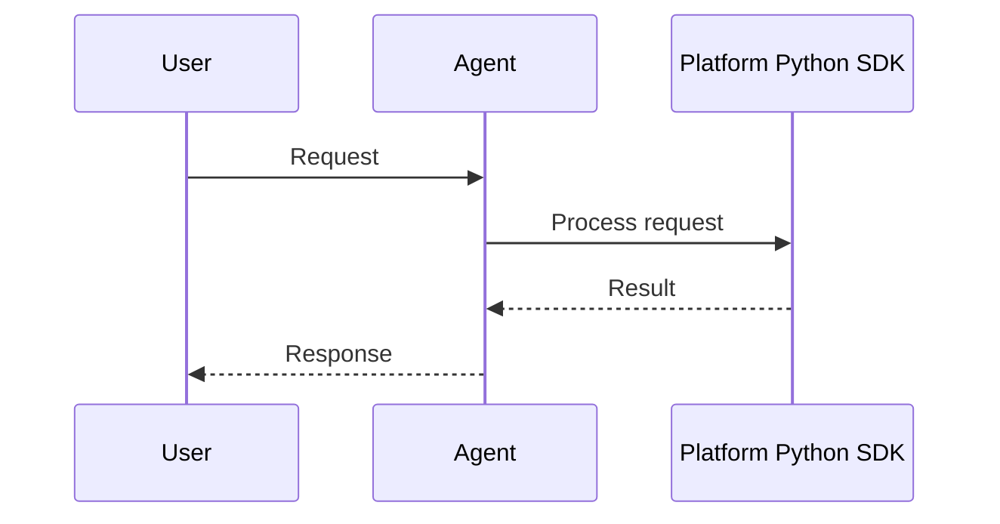

The Platform Python SDK wraps authentication, workspaces, and issues in a few importable symbols.

```python
import os
from praisonaiagents import Agent
from praisonai_platform import PlatformClient, create_app

agent = Agent(
    name="platform-assistant",
    instructions="Help users manage workspace issues.",
)

async with PlatformClient(
    os.getenv("PLATFORM_URL", "http://localhost:8000"),
    token=os.getenv("PLATFORM_TOKEN"),
) as client:
    workspace = await client.create_workspace("My Team")
```

The user manages team work; the agent creates workspaces and issues via the platform SDK.




## How It Works




## Quick Start

<Steps>
<Step title="Simple Usage">

Install and register a user:

```bash
pip install praisonai-platform
```

```python
import asyncio
from praisonai_platform import PlatformClient

async def main():
    async with PlatformClient("http://localhost:8000") as client:
        await client.register("user@example.com", "password")
        workspaces = await client.list_workspaces()
        print(workspaces)

asyncio.run(main())
```

</Step>

<Step title="With Configuration">

Deploy the API server and connect with a stored token:

```python
import os
from praisonai_platform import PlatformClient, create_app

# Run the server (uvicorn praisonai_platform:app)
app = create_app()

client = PlatformClient(
    base_url=os.getenv("PLATFORM_URL", "http://localhost:8000"),
    token=os.getenv("PLATFORM_TOKEN"),
)
```

</Step>
</Steps>

---

## How It Works




| Export | Purpose |
|--------|---------|
| `create_app()` | FastAPI factory for self-hosted Platform API |
| `PlatformClient` | Async HTTP client with JWT handling |
| `__version__` | Package version string |

```python
from praisonai_platform import __version__
print(__version__)
```

---

## Configuration Options

| Parameter | Type | Default | Description |
|-----------|------|---------|-------------|
| `base_url` | `str` | — | Platform API base URL |
| `token` | `str` | `None` | JWT bearer token (auto-set after login) |

---

## Best Practices

<AccordionGroup>
<Accordion title="Prefer async context managers">
`async with PlatformClient(...)` reuses a connection pool for multiple calls.
</Accordion>
<Accordion title="Let login set the token">
After `register()` or `login()`, the client stores the JWT automatically.
</Accordion>
<Accordion title="Configure via environment variables">
Set `PLATFORM_URL` and `PLATFORM_TOKEN` in production — avoid hardcoded URLs.
</Accordion>
<Accordion title="Check version compatibility">
Import `__version__` at startup when you depend on specific API behaviour.
</Accordion>
</AccordionGroup>

---

## Related

<CardGroup cols={2}>
<Card title="Platform SDK Client" icon="cloud" href="/docs/features/platform-sdk">
  Complete PlatformClient method reference
</Card>
<Card title="Platform Authentication" icon="shield" href="/docs/features/platform/authentication">
  Register, login, and JWT management
</Card>
</CardGroup>
