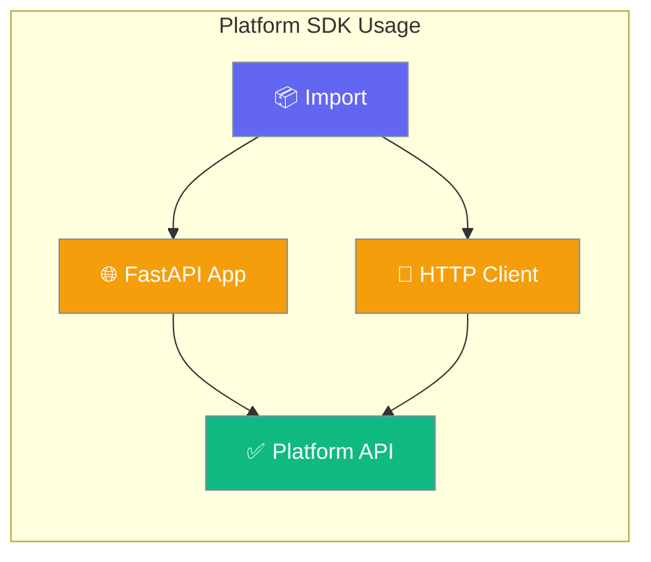
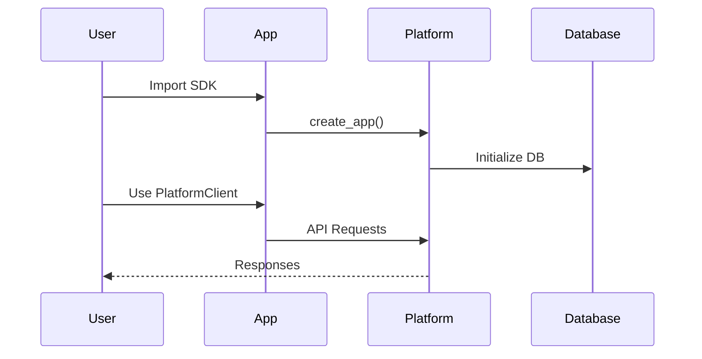
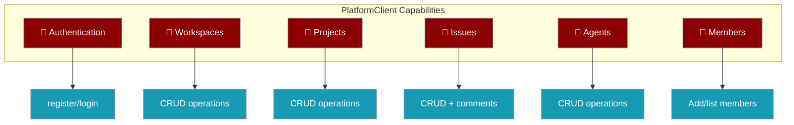

Platform Python SDK provides clean public API exports for seamless integration with PraisonAI Platform features.



## Quick Start

<Steps>
<Step title="Simple Import">
```python
from praisonai_platform import PlatformClient, create_app

# Create FastAPI app
app = create_app()

# Use HTTP client
async with PlatformClient("http://localhost:8000") as client:
    await client.register("user@example.com", "password")
```
</Step>

<Step title="With Authentication">
```python
from praisonai_platform import PlatformClient

# Client with token
client = PlatformClient(
    base_url="http://localhost:8000",
    token="your-jwt-token"
)

workspaces = await client.list_workspaces()
```
</Step>
</Steps>

---

## How It Works



| Component | Purpose | Usage |
|-----------|---------|-------|
| `create_app()` | FastAPI factory | Server deployment |
| `PlatformClient` | HTTP client | API integration |
| `__version__` | Package version | Version checking |

---

## API Exports

The package exports three main components:

<Tabs>
<Tab title="create_app">
```python
from praisonai_platform import create_app

# Create FastAPI application instance
app = create_app()

# Run with uvicorn
if __name__ == "__main__":
    import uvicorn
    uvicorn.run(app, host="0.0.0.0", port=8000)
```
</Tab>

<Tab title="PlatformClient">
```python
from praisonai_platform import PlatformClient

# Initialize client
client = PlatformClient("http://localhost:8000")

# Authenticate
await client.register("user@example.com", "pass")

# Create workspace
workspace = await client.create_workspace("My Team")

# Create issue
issue = await client.create_issue(
    workspace_id=workspace["id"],
    title="Bug Report",
    description="System crashes on startup"
)
```
</Tab>

<Tab title="Version Info">
```python
from praisonai_platform import __version__

print(f"Platform SDK version: {__version__}")
# Output: Platform SDK version: 0.1.0
```
</Tab>
</Tabs>

---

## Client Features



<CardGroup cols={2}>
<Card title="Authentication" icon="key" href="/docs/features/platform/authentication">
  Register, login, and manage JWT tokens
</Card>
<Card title="Workspaces" icon="building" href="/docs/features/platform/workspaces">
  Multi-tenant workspace management
</Card>
<Card title="Issues" icon="ticket" href="/docs/features/platform/issues">
  Issue tracking and project management
</Card>
<Card title="Agents" icon="robot" href="/docs/features/platform/agents">
  AI agent lifecycle management
</Card>
</CardGroup>

---

## Common Patterns

### Server Deployment
```python
from praisonai_platform import create_app

def deploy_server():
    """Deploy Platform API server"""
    app = create_app()
    
    # Add custom middleware if needed
    # app.add_middleware(...)
    
    return app

# For production
app = deploy_server()
```

### SDK Integration
```python
from praisonai_platform import PlatformClient

class AgentWorkflow:
    def __init__(self, platform_url: str, token: str):
        self.client = PlatformClient(platform_url, token)
    
    async def setup_workspace(self):
        """Create workspace and project"""
        workspace = await self.client.create_workspace("AI Project")
        project = await self.client.create_project(
            workspace["id"], 
            "Agent Tasks"
        )
        return workspace, project
```

### Version Checking
```python
from praisonai_platform import __version__
import sys

def check_compatibility():
    """Ensure compatible Platform SDK version"""
    required = "0.1.0"
    if __version__ < required:
        sys.exit(f"Platform SDK {required}+ required, got {__version__}")
```

---

## Best Practices

<AccordionGroup>
<Accordion title="Use Context Managers">
Always use async context managers for HTTP clients to ensure proper cleanup:

```python
async with PlatformClient("http://localhost:8000") as client:
    workspaces = await client.list_workspaces()
# Client automatically closes
```
</Accordion>

<Accordion title="Handle Authentication">
Store and reuse JWT tokens for multiple requests:

```python
client = PlatformClient("http://localhost:8000")
auth_data = await client.register("user@example.com", "pass")
# Token is automatically stored in client._token
```
</Accordion>

<Accordion title="Error Handling">
Wrap API calls in try-catch for HTTP errors:

```python
try:
    workspace = await client.create_workspace("Duplicate Name")
except httpx.HTTPStatusError as e:
    if e.response.status_code == 409:
        print("Workspace name already exists")
```
</Accordion>

<Accordion title="Environment Configuration">
Use environment variables for configuration:

```python
import os
from praisonai_platform import PlatformClient

client = PlatformClient(
    base_url=os.getenv("PLATFORM_URL", "http://localhost:8000"),
    token=os.getenv("PLATFORM_TOKEN")
)
```
</Accordion>
</AccordionGroup>

---

## Related

<CardGroup cols={2}>
<Card title="Platform Architecture" icon="sitemap" href="/docs/features/platform/sdk-client">
  Complete Platform SDK reference
</Card>
<Card title="Authentication Guide" icon="shield" href="/docs/features/platform/authentication">
  JWT token management
</Card>
</CardGroup>