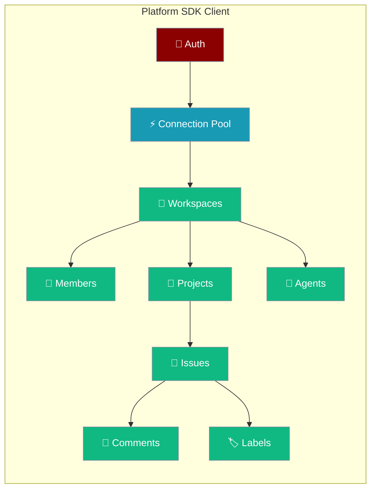
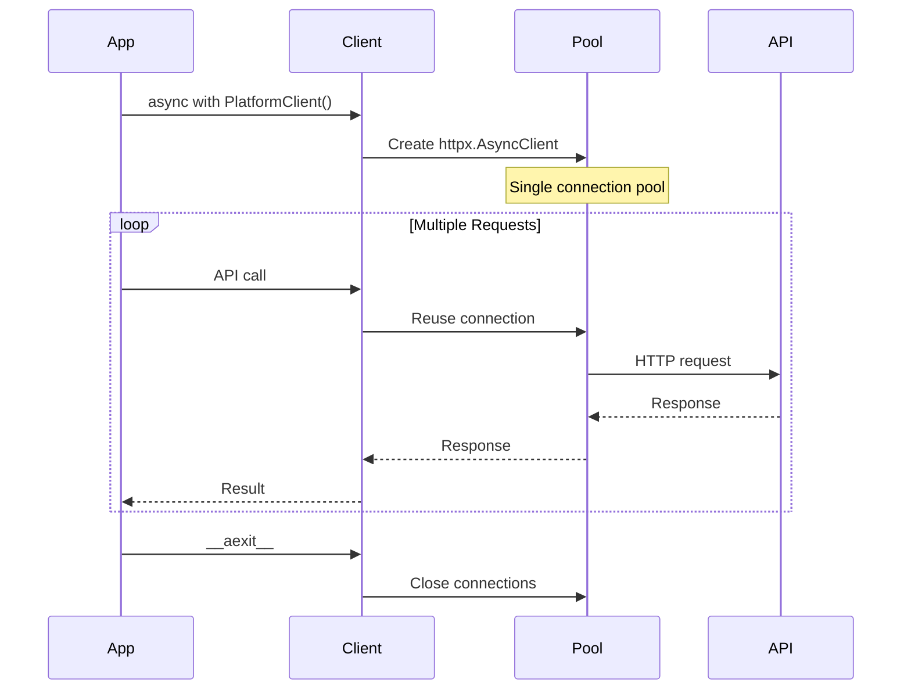

The Platform SDK provides a complete async Python client for interacting with the PraisonAI Platform API, featuring connection pooling for optimal performance and comprehensive CRUD operations for all platform resources.



## Quick Start

<Steps>
<Step title="Install Package">
```bash
pip install praisonai-platform
```
</Step>

<Step title="Basic Usage">
```python
from praisonai_platform import PlatformClient

# Context manager (recommended - uses connection pooling)
async with PlatformClient("http://localhost:8000") as client:
    # Register and auto-set token
    await client.register("user@example.com", "password123")
    
    # Create workspace and project
    workspace = await client.create_workspace("My Team")
    project = await client.create_project(workspace["id"], "Sprint 1")
    
    # Create and manage issues
    issue = await client.create_issue(
        workspace["id"], 
        "Fix login bug", 
        project_id=project["id"]
    )
```
</Step>

<Step title="Standalone Usage">
```python
# Without context manager (creates client per request)
client = PlatformClient("http://localhost:8000", token="your-jwt-token")
workspaces = await client.list_workspaces()
```
</Step>
</Steps>

---

## Connection Pooling

The client supports two usage patterns with automatic connection pooling optimization:



| Pattern | Connection Strategy | Performance | Use Case |
|---------|-------------------|-------------|----------|
| **Context Manager** | Single pooled client | ⚡ High | Multiple API calls |
| **Standalone** | Client per request | 🔄 Standard | Single API calls |

---

## API Methods

### Authentication

<Tabs>
<Tab title="Register">
```python
async with PlatformClient("http://localhost:8000") as client:
    user_data = await client.register(
        email="user@example.com",
        password="secure123",
        name="John Doe"  # optional
    )
    # Token automatically set for future requests
```
</Tab>

<Tab title="Login">
```python
async with PlatformClient("http://localhost:8000") as client:
    auth_data = await client.login("user@example.com", "secure123")
    # Token automatically set for future requests
```
</Tab>

<Tab title="Get Current User">
```python
user_info = await client.get_me()
```
</Tab>
</Tabs>

### Workspaces

<Tabs>
<Tab title="Create & List">
```python
# Create workspace
workspace = await client.create_workspace("Development Team", slug="dev-team")

# List all workspaces
workspaces = await client.list_workspaces()

# Get specific workspace
workspace = await client.get_workspace("workspace-id")
```
</Tab>

<Tab title="Update & Delete">
```python
# Update workspace
updated = await client.update_workspace("workspace-id", name="New Name")

# Delete workspace
await client.delete_workspace("workspace-id")
```
</Tab>
</Tabs>

### Members

<Tabs>
<Tab title="Add & List">
```python
# Add member to workspace
member = await client.add_member(
    workspace_id="ws-123",
    user_id="user-456", 
    role="admin"  # admin, member, viewer
)

# List workspace members
members = await client.list_members("ws-123")
```
</Tab>

<Tab title="Update & Remove">
```python
# Update member role
await client.update_member_role("ws-123", "user-456", "viewer")

# Remove member
await client.remove_member("ws-123", "user-456")
```
</Tab>
</Tabs>

### Projects

<Tabs>
<Tab title="Create & List">
```python
# Create project
project = await client.create_project(
    workspace_id="ws-123",
    title="Q1 Sprint",
    description="First quarter development sprint"
)

# List projects
projects = await client.list_projects("ws-123")

# Get project details
project = await client.get_project("ws-123", "project-456")
```
</Tab>

<Tab title="Update & Stats">
```python
# Update project
await client.update_project("ws-123", "project-456", status="active")

# Get project statistics
stats = await client.get_project_stats("ws-123", "project-456")

# Delete project
await client.delete_project("ws-123", "project-456")
```
</Tab>
</Tabs>

### Issues

<Tabs>
<Tab title="Create & List">
```python
# Create issue
issue = await client.create_issue(
    workspace_id="ws-123",
    title="Fix authentication bug",
    description="Users cannot log in with SSO",
    project_id="project-456",
    priority="high",  # none, low, medium, high, urgent
    assignee_type="user",
    assignee_id="user-789"
)

# List issues with filters
issues = await client.list_issues(
    workspace_id="ws-123",
    status="open",
    project_id="project-456"
)
```
</Tab>

<Tab title="Update & Get">
```python
# Get issue details
issue = await client.get_issue("ws-123", "issue-789")

# Update issue
await client.update_issue(
    workspace_id="ws-123", 
    issue_id="issue-789",
    status="in_progress",
    priority="urgent"
)

# Delete issue
await client.delete_issue("ws-123", "issue-789")
```
</Tab>
</Tabs>

### Comments

<Tabs>
<Tab title="Add & List">
```python
# Add comment to issue
comment = await client.add_comment(
    workspace_id="ws-123",
    issue_id="issue-789",
    content="I'm investigating this bug now"
)

# List all comments on issue
comments = await client.list_comments("ws-123", "issue-789")
```
</Tab>
</Tabs>

### Agents

<Tabs>
<Tab title="Create & List">
```python
# Create agent
agent = await client.create_agent(
    workspace_id="ws-123",
    name="Code Reviewer",
    runtime_mode="cloud",  # local, cloud
    instructions="Review all code changes for security issues"
)

# List agents
agents = await client.list_agents("ws-123")

# Get agent details
agent = await client.get_agent("ws-123", "agent-456")
```
</Tab>

<Tab title="Update & Delete">
```python
# Update agent
await client.update_agent(
    workspace_id="ws-123",
    agent_id="agent-456", 
    instructions="Focus on performance optimization"
)

# Delete agent
await client.delete_agent("ws-123", "agent-456")
```
</Tab>
</Tabs>

### Labels

<Tabs>
<Tab title="Create & List">
```python
# Create label
label = await client.create_label(
    workspace_id="ws-123",
    name="bug",
    color="#ff0000",
    description="Bug reports"
)

# List labels
labels = await client.list_labels("ws-123")
```
</Tab>

<Tab title="Manage Issue Labels">
```python
# Add label to issue
await client.add_label_to_issue("ws-123", "issue-789", "label-123")

# Remove label from issue
await client.remove_label_from_issue("ws-123", "issue-789", "label-123")

# List issue labels
issue_labels = await client.list_issue_labels("ws-123", "issue-789")

# Update label
await client.update_label("ws-123", "label-123", color="#00ff00")

# Delete label
await client.delete_label("ws-123", "label-123")
```
</Tab>
</Tabs>

### Dependencies

<Tabs>
<Tab title="Create & List">
```python
# Create dependency between issues
dependency = await client.create_dependency(
    workspace_id="ws-123",
    blocker_id="issue-123",  # Issue that blocks
    blocked_id="issue-456"   # Issue that is blocked
)

# List dependencies for workspace
dependencies = await client.list_dependencies("ws-123")
```
</Tab>

<Tab title="Delete">
```python
# Remove dependency
await client.delete_dependency("ws-123", "dependency-789")
```
</Tab>
</Tabs>

### Activity Tracking

<Tabs>
<Tab title="Workspace Activity">
```python
# Get workspace activity feed
activities = await client.list_workspace_activity(
    workspace_id="ws-123",
    limit=50,
    offset=0
)
```
</Tab>

<Tab title="Issue Activity">
```python
# Get activity for specific issue
issue_activities = await client.list_issue_activity(
    workspace_id="ws-123",
    issue_id="issue-789"
)
```
</Tab>
</Tabs>

---

## Error Handling

The client raises `httpx.HTTPStatusError` for HTTP errors:

```python
import httpx

try:
    async with PlatformClient("http://localhost:8000") as client:
        workspace = await client.get_workspace("invalid-id")
except httpx.HTTPStatusError as e:
    if e.response.status_code == 404:
        print("Workspace not found")
    elif e.response.status_code == 401:
        print("Authentication required")
    else:
        print(f"API error: {e.response.status_code}")
```

---

## Best Practices

<AccordionGroup>

<Accordion title="Use Connection Pooling">
Always prefer the context manager pattern for multiple API calls to benefit from connection pooling:

```python
# ✅ Good - Connection pooling
async with PlatformClient(base_url) as client:
    for workspace in await client.list_workspaces():
        projects = await client.list_projects(workspace["id"])

# ❌ Avoid - New connection per request  
client = PlatformClient(base_url)
for workspace in await client.list_workspaces():
    projects = await client.list_projects(workspace["id"])
```
</Accordion>

<Accordion title="Handle Token Management">
The client automatically manages tokens after `register()` or `login()`. For existing tokens:

```python
# Set token explicitly
client = PlatformClient("http://localhost:8000", token="your-jwt-token")

# Or let register/login set it automatically
async with PlatformClient("http://localhost:8000") as client:
    await client.login(email, password)  # Token auto-set
    # All subsequent requests use this token
```
</Accordion>

<Accordion title="Batch Related Operations">
Group related API calls within the same context manager for optimal performance:

```python
async with PlatformClient(base_url) as client:
    # Batch workspace setup
    workspace = await client.create_workspace("Team A")
    await client.add_member(workspace["id"], "user-1", "admin")
    await client.add_member(workspace["id"], "user-2", "member")
    
    # Batch project creation
    project = await client.create_project(workspace["id"], "Sprint 1")
    await client.create_issue(workspace["id"], "Setup CI/CD", project_id=project["id"])
    await client.create_issue(workspace["id"], "Write tests", project_id=project["id"])
```
</Accordion>

<Accordion title="Environment Configuration">
Use environment variables for configuration in production:

```python
import os

client = PlatformClient(
    base_url=os.getenv("PRAISON_PLATFORM_URL", "http://localhost:8000"),
    token=os.getenv("PRAISON_PLATFORM_TOKEN")
)
```
</Accordion>

</AccordionGroup>

---

## Related

<CardGroup cols={2}>
<Card title="Platform API Reference" icon="api" href="/docs/platform/api">
  Complete REST API documentation
</Card>
<Card title="Agent Platform Integration" icon="robot" href="/docs/features/platform-integration">
  Connect agents to platform resources
</Card>
</CardGroup>