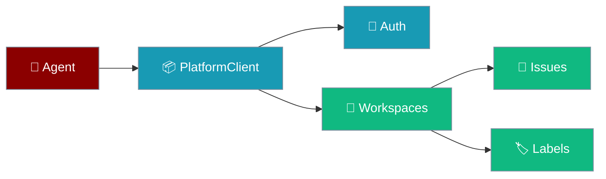
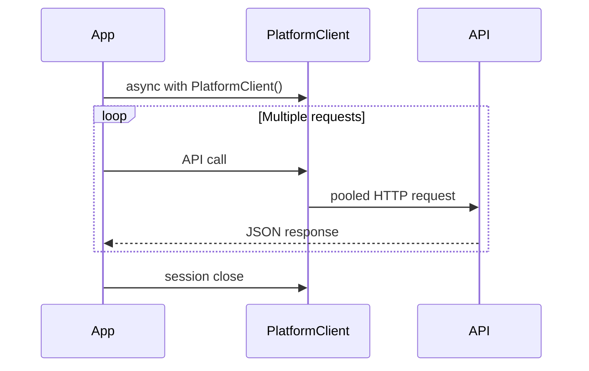

`PlatformClient` gives agents and scripts full CRUD access to workspaces, issues, labels, and agents over the Platform API.

```python
import os
from praisonaiagents import Agent
from praisonai_platform.client import PlatformClient

agent = Agent(
    name="platform-bot",
    instructions="Track and update workspace issues.",
)

async with PlatformClient(
    os.getenv("PLATFORM_URL", "http://localhost:8000"),
    token=os.getenv("PLATFORM_TOKEN"),
) as client:
    workspace = await client.create_workspace("My Team")
    issue = await client.create_issue(workspace["id"], "Fix login bug")
```



## Quick Start

<Steps>
<Step title="Simple Usage">

```bash
pip install praisonai-platform
```

```python
import asyncio
from praisonai_platform.client import PlatformClient

async def main():
    async with PlatformClient("http://localhost:8000") as client:
        await client.register("user@example.com", "password123")
        workspace = await client.create_workspace("My Team")
        project = await client.create_project(workspace["id"], "Sprint 1")
        await client.create_issue(
            workspace["id"],
            "Fix login bug",
            project_id=project["id"],
        )

asyncio.run(main())
```

</Step>

<Step title="With Configuration">

Pass an existing token and batch related calls in one session:

```python
import os
import asyncio
from praisonai_platform.client import PlatformClient

async def setup_workspace():
    client = PlatformClient(
        os.getenv("PLATFORM_URL", "http://localhost:8000"),
        token=os.getenv("PLATFORM_TOKEN"),
    )
    workspace = await client.create_workspace("Dev Team")
    await client.add_member(workspace["id"], "user-456", role="admin")
    await client.create_project(workspace["id"], "Q1 Sprint")

asyncio.run(setup_workspace())
```

</Step>
</Steps>

---

## How It Works



| Pattern | When to use |
|---------|-------------|
| **Context manager** | Multiple API calls — reuses connections |
| **Standalone client** | Single request with a known token |

---

## API Areas

| Area | Key methods |
|------|-------------|
| **Auth** | `register`, `login`, `get_me` |
| **Workspaces** | `create_workspace`, `list_workspaces`, `add_member` |
| **Projects** | `create_project`, `list_projects`, `get_project_stats` |
| **Issues** | `create_issue`, `list_issues`, `update_issue` |
| **Comments** | `add_comment`, `list_comments` |
| **Agents** | `create_agent`, `list_agents`, `update_agent` |
| **Labels** | `create_label`, `add_label_to_issue`, `list_issue_labels` |
| **Dependencies** | `create_dependency`, `list_dependencies` |

See [Platform SDK Client](/docs/features/platform/sdk-client) for endpoint-level detail.

---

## Error Handling

```python
import httpx
from praisonai_platform.client import PlatformClient

try:
    async with PlatformClient("http://localhost:8000") as client:
        await client.get_workspace("invalid-id")
except httpx.HTTPStatusError as e:
    if e.response.status_code == 404:
        print("Workspace not found")
    elif e.response.status_code == 401:
        print("Authentication required")
```

---

## Best Practices

<AccordionGroup>
<Accordion title="Use connection pooling">
Keep related calls inside one `async with PlatformClient(...)` block.
</Accordion>
<Accordion title="Handle token lifecycle">
Call `register()` or `login()` once; the client stores the JWT for later requests.
</Accordion>
<Accordion title="Scope calls to a workspace">
Pass `workspace_id` on every resource method — RBAC enforces membership.
</Accordion>
<Accordion title="Read config from the environment">
Use `os.getenv("PLATFORM_URL")` and `os.getenv("PLATFORM_TOKEN")` in production.
</Accordion>
</AccordionGroup>

---

## Related

<CardGroup cols={2}>
<Card title="Platform SDK Reference" icon="api" href="/docs/features/platform/sdk-client">
  REST endpoints and request schemas
</Card>
<Card title="Platform Client SDK Testing" icon="vial" href="/docs/features/platform-client-sdk-testing">
  Integration tests with ASGITransport
</Card>
</CardGroup>
