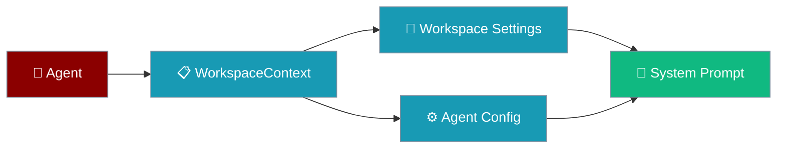
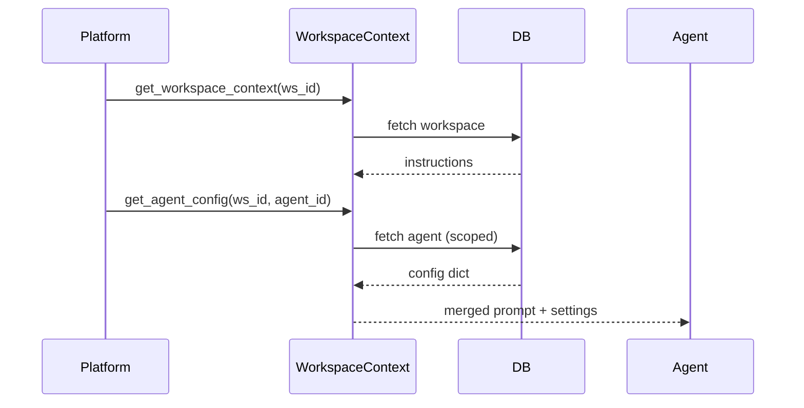

Workspace context lets platform-hosted agents load settings and instructions scoped to a workspace.

```python
from praisonaiagents import Agent
from praisonaiagents.auth import WorkspaceContextProtocol

class PlatformWorkspaceContext:
    async def get_workspace_context(self, workspace_id: str) -> str | None:
        # Load workspace instructions from your database
        return "You support the Acme Corp workspace."

    async def get_agent_config(self, workspace_id: str, agent_id: str) -> dict | None:
        return {
            "system_prompt": "Be concise and professional.",
            "model": "gpt-4o-mini",
            "tools": ["web_search"],
            "max_concurrent_tasks": 3,
        }

agent = Agent(
    name="workspace-assistant",
    instructions="Help users in their workspace.",
)
```

The user opens a workspace thread; the agent loads scoped instructions from platform context.




## Quick Start

<Steps>
<Step title="Simple Usage">

Implement `WorkspaceContextProtocol` with workspace-level instructions:

```python
from praisonaiagents.auth import WorkspaceContextProtocol

class PlatformWorkspaceContext:
    def __init__(self, db):
        self.db = db

    async def get_workspace_context(self, workspace_id: str) -> str | None:
        workspace = await self.db.get_workspace(workspace_id)
        if not workspace:
            return None
        return workspace.instructions

    async def get_agent_config(self, workspace_id: str, agent_id: str) -> dict | None:
        agent = await self.db.get_agent(workspace_id, agent_id)
        if not agent:
            return None
        return {
            "system_prompt": agent.system_prompt,
            "model": agent.model,
            "tools": agent.tools,
            "max_concurrent_tasks": agent.max_concurrent_tasks,
        }
```

</Step>

<Step title="With Configuration">

Merge workspace and agent settings before starting the agent:

```python
from praisonaiagents import Agent

async def start_platform_agent(ctx: PlatformWorkspaceContext, workspace_id: str, agent_id: str):
    workspace_text = await ctx.get_workspace_context(workspace_id)
    config = await ctx.get_agent_config(workspace_id, agent_id) or {}

    instructions = config.get("system_prompt", "You are a helpful assistant.")
    if workspace_text:
        instructions = f"{workspace_text}\n\n{instructions}"

    agent = Agent(
        name=config.get("name", "assistant"),
        instructions=instructions,
        llm=config.get("model"),
    )
    return agent
```

</Step>
</Steps>

---

## How It Works



| Method | Returns |
|--------|---------|
| `get_workspace_context(workspace_id)` | Workspace instructions string, or `None` |
| `get_agent_config(workspace_id, agent_id)` | Config dict with `system_prompt`, `model`, `tools`, `max_concurrent_tasks` |

---

## Configuration Options

| Protocol field | Type | Description |
|----------------|------|-------------|
| `get_workspace_context` | `async (workspace_id) → str \| None` | Workspace-level instructions |
| `get_agent_config` | `async (workspace_id, agent_id) → dict \| None` | Per-agent runtime settings |

Expected keys in the agent config dict: `system_prompt`, `model`, `tools`, `max_concurrent_tasks`.

---

## Best Practices

<AccordionGroup>
<Accordion title="Always scope agent queries">
Filter by both `agent_id` and `workspace_id` — never fetch agents globally.
</Accordion>
<Accordion title="Return None for missing resources">
Missing workspace or agent records should return `None`, not raise.
</Accordion>
<Accordion title="Inject database sessions">
Pass `AsyncSession` via constructor — do not create sessions inside the context provider.
</Accordion>
<Accordion title="Keep return values JSON-serialisable">
Convert UUIDs and datetimes to strings before returning config dicts.
</Accordion>
</AccordionGroup>

---

## Related

<CardGroup cols={2}>
<Card title="Platform Auth Configuration" icon="shield" href="/docs/features/platform/auth-configuration">
  Authentication and authorisation setup
</Card>
<Card title="Platform Agents" icon="robot" href="/docs/features/platform/agents">
  Register and manage platform-hosted agents
</Card>
</CardGroup>
