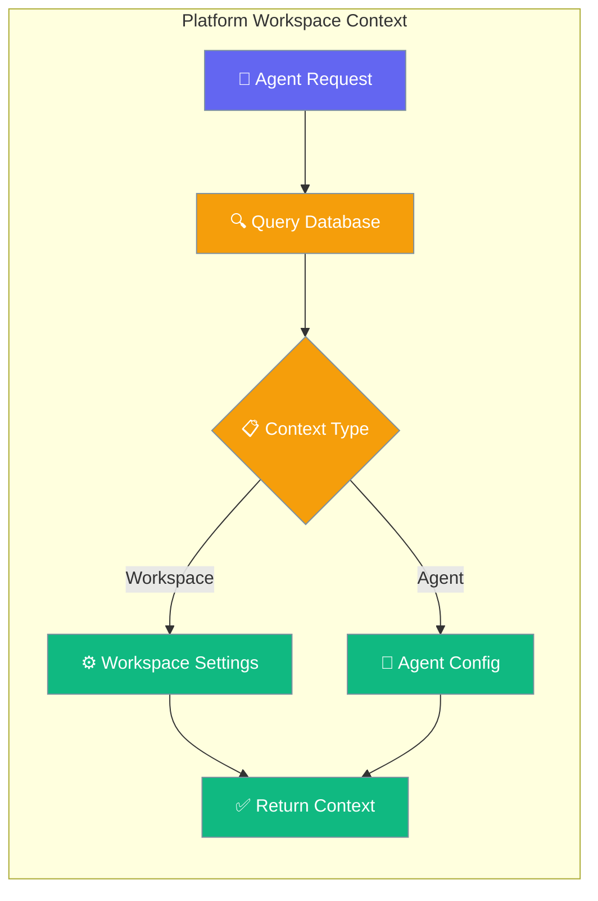
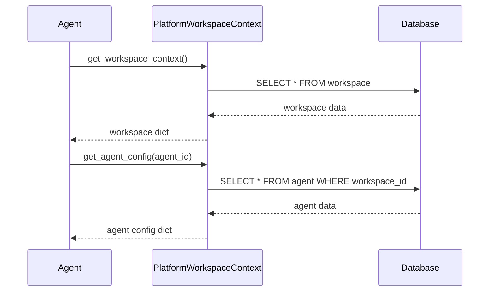

Platform Workspace Context enables agents to access workspace-specific settings, instructions, and configurations from the platform database.



## Quick Start

<Steps>
<Step title="Basic Workspace Context">
Create a workspace context provider that implements the `WorkspaceContextProtocol`:

```python
from praisonaiagents.auth.protocols import WorkspaceContextProtocol
from sqlalchemy.ext.asyncio import AsyncSession

class PlatformWorkspaceContext:
    def __init__(self, workspace_id: str, session: AsyncSession):
        self.workspace_id = workspace_id
        self.session = session
    
    async def get_workspace_context(self) -> dict:
        # Query workspace from database
        workspace = await self.session.get(Workspace, self.workspace_id)
        if not workspace:
            return None
        
        return {
            "id": workspace.id,
            "name": workspace.name,
            "slug": workspace.slug,
            "description": workspace.description,
            "settings": workspace.settings
        }
```
</Step>

<Step title="Agent Configuration">
Add agent-specific configuration retrieval:

```python
async def get_agent_config(self, agent_id: str) -> dict:
    # Query agent scoped to workspace
    query = select(Agent).where(
        Agent.id == agent_id,
        Agent.workspace_id == self.workspace_id
    )
    result = await self.session.execute(query)
    agent = result.scalar_one_or_none()
    
    if not agent:
        return None
    
    return {
        "id": agent.id,
        "name": agent.name,
        "runtime_mode": agent.runtime_mode,
        "instructions": agent.instructions,
        "config": agent.config,
        "max_concurrent_tasks": agent.max_concurrent_tasks
    }
```
</Step>
</Steps>

---

## How It Works



| Component | Purpose | Returns |
|-----------|---------|---------|
| `get_workspace_context()` | Retrieve workspace settings | Workspace metadata and configuration |
| `get_agent_config()` | Get agent configuration | Agent-specific runtime settings |

---

## Configuration Options

The `PlatformWorkspaceContext` class supports the following configuration:

| Option | Type | Description |
|--------|------|-------------|
| `workspace_id` | `str` | Unique workspace identifier |
| `session` | `AsyncSession` | Database session for queries |

### Workspace Context Data

| Field | Type | Description |
|-------|------|-------------|
| `id` | `str` | Workspace unique identifier |
| `name` | `str` | Human-readable workspace name |
| `slug` | `str` | URL-friendly workspace identifier |
| `description` | `str` | Workspace description |
| `settings` | `dict` | Workspace-specific settings |

### Agent Configuration Data

| Field | Type | Description |
|-------|------|-------------|
| `id` | `str` | Agent unique identifier |
| `name` | `str` | Agent display name |
| `runtime_mode` | `str` | Agent execution mode |
| `instructions` | `str` | Agent system instructions |
| `config` | `dict` | Agent configuration parameters |
| `max_concurrent_tasks` | `int` | Maximum parallel task limit |

---

## Common Patterns

### Workspace-Scoped Agent Query

Query agents that belong to a specific workspace:

```python
async def get_workspace_agents(self) -> list:
    query = select(Agent).where(Agent.workspace_id == self.workspace_id)
    result = await self.session.execute(query)
    return [
        {
            "id": agent.id,
            "name": agent.name,
            "status": agent.status
        }
        for agent in result.scalars().all()
    ]
```

### Conditional Context Loading

Return different context based on workspace type:

```python
async def get_workspace_context(self) -> dict:
    workspace = await self.session.get(Workspace, self.workspace_id)
    if not workspace:
        return None
    
    context = {
        "id": workspace.id,
        "name": workspace.name,
        "settings": workspace.settings
    }
    
    # Add premium features for enterprise workspaces
    if workspace.type == "enterprise":
        context["advanced_features"] = await self._get_premium_features()
    
    return context
```

### Error Handling

Handle database connection and query errors:

```python
from praisonaiagents.errors import PraisonAIError

async def get_agent_config(self, agent_id: str) -> dict:
    try:
        query = select(Agent).where(
            Agent.id == agent_id,
            Agent.workspace_id == self.workspace_id
        )
        result = await self.session.execute(query)
        agent = result.scalar_one_or_none()
        
        if not agent:
            return None
        
        return {
            "id": agent.id,
            "name": agent.name,
            "config": agent.config
        }
    except Exception as e:
        raise PraisonAIError(f"Failed to get agent config: {e}")
```

---

## Best Practices

<AccordionGroup>
<Accordion title="Database Session Management">
Always use dependency injection for database sessions:

```python
# Good: Dependency injection
class PlatformWorkspaceContext:
    def __init__(self, workspace_id: str, session: AsyncSession):
        self.workspace_id = workspace_id
        self.session = session

# Avoid: Creating sessions inside the class
class BadWorkspaceContext:
    async def get_context(self):
        session = create_session()  # Don't do this
```
</Accordion>

<Accordion title="Error Handling">
Return `None` for missing resources, raise exceptions for system errors:

```python
async def get_workspace_context(self) -> dict:
    try:
        workspace = await self.session.get(Workspace, self.workspace_id)
        return workspace.to_dict() if workspace else None
    except SQLAlchemyError as e:
        raise PraisonAIError(f"Database error: {e}")
```
</Accordion>

<Accordion title="Data Serialization">
Ensure returned data is JSON-serializable:

```python
async def get_agent_config(self, agent_id: str) -> dict:
    agent = await self._get_agent(agent_id)
    if not agent:
        return None
    
    return {
        "id": str(agent.id),  # Convert UUID to string
        "created_at": agent.created_at.isoformat(),  # Convert datetime
        "config": dict(agent.config)  # Ensure dict serialization
    }
```
</Accordion>

<Accordion title="Workspace Scoping">
Always scope agent queries to the workspace for security:

```python
# Good: Workspace-scoped query
query = select(Agent).where(
    Agent.id == agent_id,
    Agent.workspace_id == self.workspace_id  # Security check
)

# Bad: Global agent query
query = select(Agent).where(Agent.id == agent_id)  # Security risk
```
</Accordion>
</AccordionGroup>

---

## Related

<CardGroup cols={2}>
<Card title="Auth Protocols" icon="shield" href="/docs/concepts/auth">
  Authentication and authorization protocols
</Card>
<Card title="Database Integration" icon="database" href="/docs/features/persistence">
  Database persistence and session management
</Card>
</CardGroup>