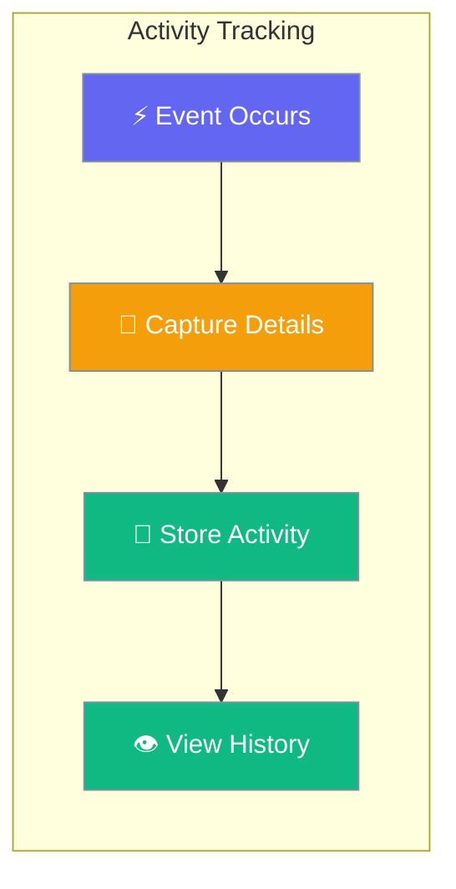
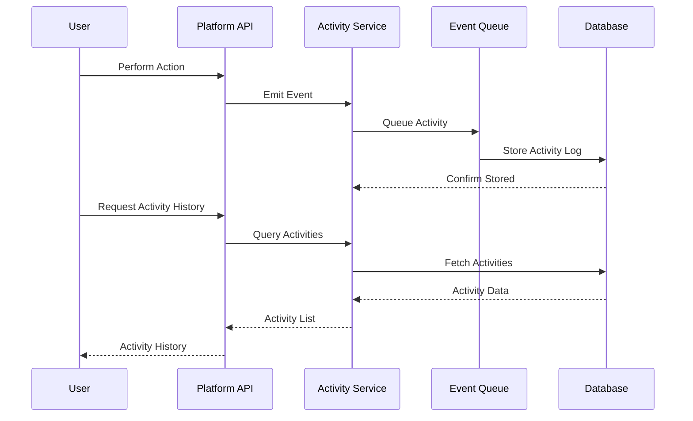

Activity Log provides comprehensive audit trail and event tracking for all workspace activities, enabling team transparency, debugging, and compliance monitoring.



## Quick Start

<Steps>
<Step title="View Recent Activity">
```python
import asyncio
from praisonai_platform.client import PlatformClient

async def view_activity():
    client = PlatformClient("http://localhost:8000", token="your-jwt-token")
    ws_id = "your-workspace-id"

    # Get recent workspace activity
    activities = await client.get_workspace_activity(
        ws_id,
        limit=50,  # Last 50 activities
        include_system=True  # Include system events
    )
    
    for activity in activities:
        print(f"[{activity['timestamp']}] {activity['actor']['name']}")
        print(f"  {activity['action']} {activity['resource_type']}: {activity['description']}")
        print()

asyncio.run(view_activity())
```
</Step>

<Step title="Filter Activity by Type">
```python
async def filter_activity():
    client = PlatformClient("http://localhost:8000", token="your-jwt-token")
    ws_id = "your-workspace-id"
    
    # Filter by specific activity types
    issue_activities = await client.get_workspace_activity(
        ws_id,
        resource_types=["issue"],
        actions=["created", "updated", "assigned"],
        start_date="2025-01-01T00:00:00Z",
        end_date="2025-01-31T23:59:59Z"
    )
    
    print(f"Found {len(issue_activities)} issue activities in January")
    
    # Filter by specific user
    user_activities = await client.get_workspace_activity(
        ws_id,
        actor_id="user-123",
        limit=25
    )
    
    print(f"User performed {len(user_activities)} activities")

asyncio.run(filter_activity())
```
</Step>
</Steps>

---

## How It Works



| Component | Purpose | Data Captured |
|-----------|---------|---------------|
| **Activity Event** | Single workspace action | Actor, timestamp, action, resource |
| **Resource Context** | What was affected | Resource type, ID, name, metadata |
| **Actor Information** | Who performed action | User ID, name, role, IP address |
| **Change Details** | What changed | Before/after values, diff summary |

---

## Activity Types

### Core Platform Events

| Action | Resource Type | Description | Example |
|--------|---------------|-------------|---------|
| `created` | `issue`, `project`, `label` | Resource creation | "Created issue ISS-123" |
| `updated` | `issue`, `project`, `user` | Resource modification | "Updated issue status to 'done'" |
| `deleted` | `issue`, `label`, `comment` | Resource deletion | "Deleted comment on ISS-123" |
| `assigned` | `issue` | Assignment change | "Assigned issue to @john" |

### Workspace Events

| Action | Resource Type | Description | Example |
|--------|---------------|-------------|---------|
| `member_added` | `workspace` | New member joined | "Added @sarah to workspace" |
| `member_removed` | `workspace` | Member removed | "Removed @john from workspace" |
| `role_changed` | `workspace_member` | Permission change | "Changed @sarah role to admin" |
| `settings_updated` | `workspace` | Workspace configuration | "Updated workspace settings" |

### Agent Events

| Action | Resource Type | Description | Example |
|--------|---------------|-------------|---------|
| `agent_assigned` | `issue` | Agent assignment | "Assigned AI agent to ISS-123" |
| `agent_completed` | `issue` | Agent task completion | "Agent completed issue analysis" |
| `agent_failed` | `issue` | Agent task failure | "Agent failed to process issue" |
| `agent_created` | `agent` | New agent created | "Created agent 'Code Reviewer'" |

---

## API Reference

### Activity Endpoints

| Method | Endpoint | Purpose | Authentication |
|--------|----------|---------|----------------|
| `GET` | `/api/v1/workspaces/{ws_id}/activity` | List workspace activity | Bearer Token |
| `GET` | `/api/v1/workspaces/{ws_id}/activity/{activity_id}` | Get activity details | Bearer Token |
| `GET` | `/api/v1/issues/{issue_id}/activity` | List issue-specific activity | Bearer Token |
| `GET` | `/api/v1/users/me/activity` | List user's activity across workspaces | Bearer Token |

### Query Parameters

| Parameter | Type | Description | Example |
|-----------|------|-------------|---------|
| `limit` | integer | Max activities to return | `?limit=50` |
| `offset` | integer | Skip activities for pagination | `?offset=100` |
| `actor_id` | string | Filter by specific user | `?actor_id=user-123` |
| `resource_types` | string[] | Filter by resource types | `?resource_types=issue,project` |
| `actions` | string[] | Filter by action types | `?actions=created,updated` |
| `start_date` | ISO date | Activity after date | `?start_date=2025-01-01T00:00:00Z` |
| `end_date` | ISO date | Activity before date | `?end_date=2025-01-31T23:59:59Z` |
| `include_system` | boolean | Include system events | `?include_system=true` |

---

## Common Patterns

<AccordionGroup>
<Accordion title="Activity Feed Dashboard">
Build a real-time activity dashboard for team visibility:

```python
async def activity_dashboard():
    client = PlatformClient("http://localhost:8000", token="your-jwt-token")
    ws_id = "your-workspace-id"
    
    # Get different activity types for dashboard
    recent_activity = await client.get_workspace_activity(ws_id, limit=20)
    issue_activity = await client.get_workspace_activity(
        ws_id, 
        resource_types=["issue"], 
        limit=10
    )
    member_activity = await client.get_workspace_activity(
        ws_id,
        actions=["member_added", "member_removed", "role_changed"],
        limit=5
    )
    
    # Format for display
    dashboard_data = {
        "recent_activities": recent_activity,
        "issue_updates": issue_activity,
        "team_changes": member_activity,
        "summary": {
            "total_activities_today": len([
                a for a in recent_activity 
                if a['timestamp'].startswith('2025-01-15')  # Today
            ]),
            "active_users": len(set(a['actor']['id'] for a in recent_activity)),
            "issues_updated": len([
                a for a in issue_activity 
                if a['action'] == 'updated'
            ])
        }
    }
    
    return dashboard_data
```
</Accordion>

<Accordion title="Audit Trail Export">
Export activity logs for compliance and audit purposes:

```python
async def export_audit_trail():
    client = PlatformClient("http://localhost:8000", token="your-jwt-token")
    ws_id = "your-workspace-id"
    
    # Export all activities for a date range
    import csv
    from datetime import datetime, timedelta
    
    # Get last 30 days of activity
    end_date = datetime.utcnow()
    start_date = end_date - timedelta(days=30)
    
    all_activities = []
    offset = 0
    limit = 100
    
    while True:
        activities = await client.get_workspace_activity(
            ws_id,
            start_date=start_date.isoformat(),
            end_date=end_date.isoformat(),
            offset=offset,
            limit=limit,
            include_system=True
        )
        
        if not activities:
            break
            
        all_activities.extend(activities)
        offset += limit
    
    # Export to CSV
    with open('audit_trail.csv', 'w', newline='') as csvfile:
        fieldnames = ['timestamp', 'actor', 'action', 'resource_type', 'resource_id', 'description']
        writer = csv.DictWriter(csvfile, fieldnames=fieldnames)
        writer.writeheader()
        
        for activity in all_activities:
            writer.writerow({
                'timestamp': activity['timestamp'],
                'actor': activity['actor']['name'],
                'action': activity['action'],
                'resource_type': activity['resource_type'],
                'resource_id': activity['resource_id'],
                'description': activity['description']
            })
    
    print(f"Exported {len(all_activities)} activities to audit_trail.csv")
```
</Accordion>

<Accordion title="Real-time Activity Monitoring">
Monitor workspace activity in real-time using webhooks:

```python
async def monitor_workspace_activity():
    client = PlatformClient("http://localhost:8000", token="your-jwt-token")
    ws_id = "your-workspace-id"
    
    # Set up webhook for real-time activity notifications
    webhook_config = {
        "url": "https://your-app.com/webhooks/activity",
        "events": ["activity.created"],
        "filters": {
            "workspace_id": ws_id,
            "resource_types": ["issue", "project"],
            "actions": ["created", "updated", "assigned"]
        }
    }
    
    webhook = await client.create_webhook(ws_id, webhook_config)
    print(f"Created webhook: {webhook['id']}")
    
    # Alternative: Long-polling for activity updates
    last_activity_id = None
    while True:
        activities = await client.get_workspace_activity(
            ws_id,
            limit=10,
            after_id=last_activity_id  # Only get new activities
        )
        
        for activity in activities:
            print(f"New activity: {activity['description']}")
            last_activity_id = activity['id']
            
            # Process activity (send notifications, update caches, etc.)
            await process_activity_notification(activity)
        
        # Wait before checking again
        await asyncio.sleep(5)

async def process_activity_notification(activity):
    """Process new activity for notifications or integrations"""
    if activity['action'] == 'created' and activity['resource_type'] == 'issue':
        # Notify team of new issue
        print(f"🆕 New issue created: {activity['description']}")
    elif activity['action'] == 'assigned':
        # Notify assigned user
        print(f"📋 Issue assigned: {activity['description']}")
```
</Accordion>
</AccordionGroup>

---

## Best Practices

<AccordionGroup>
<Accordion title="Performance Optimization">
- **Pagination**: Always use pagination for large activity queries
- **Date filtering**: Use specific date ranges to reduce query scope
- **Resource filtering**: Filter by specific resource types when possible
- **Caching**: Cache frequently accessed activity data
</Accordion>

<Accordion title="Privacy and Security">
- **Access control**: Ensure users only see activities they have permission for
- **Sensitive data**: Avoid logging sensitive information in activity descriptions
- **Retention policies**: Implement data retention policies for old activities
- **Audit compliance**: Maintain activity logs for required compliance periods
</Accordion>

<Accordion title="User Experience">
- **Meaningful descriptions**: Use clear, human-readable activity descriptions
- **Relevant context**: Include enough context to understand the activity
- **Grouping**: Group related activities to reduce noise
- **Real-time updates**: Provide real-time activity feeds where appropriate
</Accordion>

<Accordion title="Integration Patterns">
- **Webhook integration**: Use webhooks for real-time external integrations
- **Batch processing**: Process activities in batches for performance
- **Event sourcing**: Consider activity logs as event source for state reconstruction
- **Analytics**: Aggregate activity data for workspace insights and metrics
</Accordion>
</AccordionGroup>

---

## Related

<CardGroup cols={2}>
<Card title="Workspace Management" icon="building" href="/docs/features/platform/workspaces">
  Comprehensive workspace administration
</Card>

<Card title="Team Members" icon="users" href="/docs/features/platform/members">
  User management and permissions
</Card>
</CardGroup>