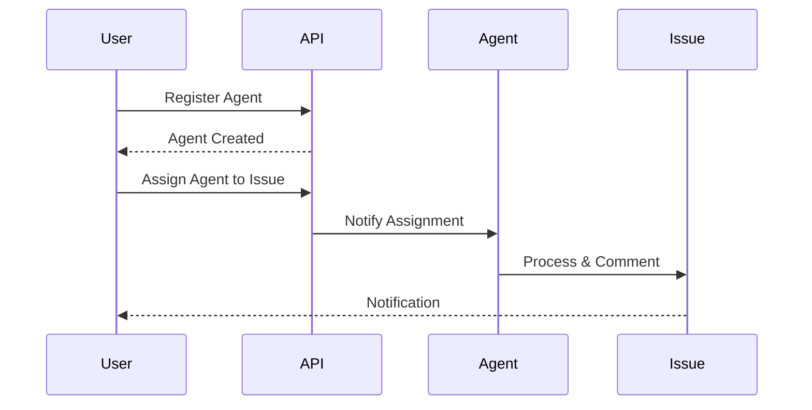

Platform agents are AI workers registered in a workspace that can be assigned to issues and create comments automatically.

```mermaid
graph LR
    subgraph "Agent Management Flow"
        Register[📝 Register Agent] --> List[📋 List Agents]
        List --> Assign[🔄 Assign to Issue]
        Assign --> Work[🤖 Agent Works]
        Work --> Comment[💬 Create Comment]
    end
    
    classDef register fill:#6366F1,stroke:#7C90A0,color:#fff
    classDef manage fill:#F59E0B,stroke:#7C90A0,color:#fff
    classDef result fill:#10B981,stroke:#7C90A0,color:#fff
    
    class Register register
    class List,Assign manage  
    class Work,Comment result
```

## Quick Start

<Steps>
<Step title="Register Agent">
Register a new agent in your workspace with basic settings.

```bash
curl -X POST http://localhost:8000/api/v1/workspaces/$WS_ID/agents/ \
  -H "Authorization: Bearer $TOKEN" \
  -H "Content-Type: application/json" \
  -d '{
    "name": "CodeReviewBot",
    "runtime_mode": "local",
    "instructions": "Review all PRs for security issues.",
    "max_concurrent_tasks": 3
  }'
```
</Step>

<Step title="List Your Agents">
View all agents in your workspace with filtering options.

```bash
curl "http://localhost:8000/api/v1/workspaces/$WS_ID/agents/?status=idle&limit=10" \
  -H "Authorization: Bearer $TOKEN"
```
</Step>
</Steps>

---

## How It Works



| Component | Purpose | Status Options |
|-----------|---------|----------------|
| **Agent** | AI worker in workspace | `offline`, `idle`, `busy` |
| **Runtime Mode** | How agent executes | `local` (default) |
| **Instructions** | System prompt/behavior | Custom text instructions |
| **Concurrency** | Max simultaneous tasks | 1-100 tasks |

---

## Configuration Options

### Agent Properties

| Property | Type | Default | Description |
|----------|------|---------|-------------|
| `name` | `string` | *required* | Agent display name |
| `runtime_mode` | `string` | `"local"` | How the agent runs |
| `instructions` | `string` | `""` | System prompt for agent behavior |
| `max_concurrent_tasks` | `int` | `1` | Maximum simultaneous tasks (1-100) |
| `runtime_config` | `object` | `{}` | Agent-specific settings (model, temperature) |
| `status` | `string` | `"offline"` | Current agent status |

### Status Values

| Status | Description |
|--------|-------------|
| `offline` | Agent is not available (default for new agents) |
| `idle` | Agent is available and ready to work |
| `busy` | Agent is currently working on tasks |

---

## Common Patterns

### Basic Agent Registration

```bash
# Register with minimal configuration
curl -X POST http://localhost:8000/api/v1/workspaces/$WS_ID/agents/ \
  -H "Authorization: Bearer $TOKEN" \
  -H "Content-Type: application/json" \
  -d '{
    "name": "BasicBot",
    "instructions": "Help with general tasks"
  }'
```

### Advanced Agent with Custom Configuration

```bash
# Register with runtime configuration
curl -X POST http://localhost:8000/api/v1/workspaces/$WS_ID/agents/ \
  -H "Authorization: Bearer $TOKEN" \
  -H "Content-Type: application/json" \
  -d '{
    "name": "AdvancedBot", 
    "runtime_mode": "local",
    "instructions": "Advanced code review with security focus",
    "max_concurrent_tasks": 5,
    "runtime_config": {
      "model": "gpt-4o",
      "temperature": 0.1,
      "max_tokens": 2000
    }
  }'
```

### Assigning Agent to Issue

```bash
# Update issue to assign agent
curl -X PATCH http://localhost:8000/api/v1/workspaces/$WS_ID/issues/$ISSUE_ID \
  -H "Authorization: Bearer $TOKEN" \
  -H "Content-Type: application/json" \
  -d '{
    "assignee_type": "agent",
    "assignee_id": "agent-abc123"
  }'
```

---

## Best Practices

<AccordionGroup>
<Accordion title="Agent Naming Convention">
Use descriptive names that indicate the agent's purpose:
- `CodeReviewBot` for code review tasks
- `DocumentationAssistant` for documentation help  
- `SecurityAuditor` for security-focused reviews
- `TestingAgent` for automated testing tasks
</Accordion>

<Accordion title="Concurrency Management">
Set appropriate concurrency limits based on agent capabilities:
- **1-2 tasks**: For complex, resource-intensive work
- **3-5 tasks**: For moderate complexity tasks
- **5-10 tasks**: For simple, quick tasks only
- Monitor agent performance and adjust limits accordingly
</Accordion>

<Accordion title="Instruction Guidelines">
Write clear, specific instructions for consistent behavior:
- Define the agent's role and responsibilities
- Specify output format preferences
- Include quality standards and criteria
- Mention any tools or resources the agent should use
</Accordion>

<Accordion title="Status Monitoring">
Regularly monitor and update agent status:
- Set to `idle` when agent should accept new tasks
- Monitor for agents stuck in `busy` status
- Use `offline` for maintenance or when agent shouldn't work
- Check agent performance metrics regularly
</Accordion>
</AccordionGroup>

---

## API Reference

### Endpoints

| Method | Path | Description |
|--------|------|-------------|
| `POST` | `/api/v1/workspaces/{ws_id}/agents/` | Register new agent |
| `GET` | `/api/v1/workspaces/{ws_id}/agents/` | List agents with filters |
| `GET` | `/api/v1/workspaces/{ws_id}/agents/{agent_id}` | Get specific agent |
| `PATCH` | `/api/v1/workspaces/{ws_id}/agents/{agent_id}` | Update agent |
| `DELETE` | `/api/v1/workspaces/{ws_id}/agents/{agent_id}` | Delete agent |

### Query Parameters

| Parameter | Type | Description |
|-----------|------|-------------|
| `status` | `string` | Filter by status: `offline`, `idle`, `busy` |
| `limit` | `int` | Max results (1-200, default: 50) |
| `offset` | `int` | Skip N results (default: 0) |

### Request Examples

<Tabs>
<Tab title="Create Agent">
```bash
curl -X POST http://localhost:8000/api/v1/workspaces/$WS_ID/agents/ \
  -H "Authorization: Bearer $TOKEN" \
  -H "Content-Type: application/json" \
  -d '{
    "name": "CodeReviewBot",
    "runtime_mode": "local", 
    "instructions": "Review PRs for security issues.",
    "max_concurrent_tasks": 3,
    "runtime_config": {"model": "gpt-4o"}
  }'
```
</Tab>

<Tab title="Update Agent">
```bash
curl -X PATCH http://localhost:8000/api/v1/workspaces/$WS_ID/agents/$AGENT_ID \
  -H "Authorization: Bearer $TOKEN" \
  -H "Content-Type: application/json" \
  -d '{
    "status": "idle",
    "instructions": "Updated instructions here",
    "max_concurrent_tasks": 5
  }'
```
</Tab>

<Tab title="List Agents">
```bash
curl "http://localhost:8000/api/v1/workspaces/$WS_ID/agents/?status=idle&limit=10" \
  -H "Authorization: Bearer $TOKEN"
```
</Tab>
</Tabs>

### Response Format

```json
{
  "id": "agent-abc123",
  "workspace_id": "ws-abc123", 
  "name": "CodeReviewBot",
  "avatar_url": null,
  "runtime_mode": "local",
  "instructions": "Review all PRs for security issues.",
  "status": "offline",
  "max_concurrent_tasks": 3,
  "runtime_config": {"model": "gpt-4o"},
  "owner_id": "user-abc123",
  "created_at": "2025-01-01T00:00:00"
}
```

---

## Python SDK Usage

```python
import asyncio
from praisonai_platform.client import PlatformClient

async def main():
    client = PlatformClient("http://localhost:8000", token="your-jwt-token")
    ws_id = "your-workspace-id"

    # Register agent
    agent = await client.create_agent(
        ws_id, "CodeReviewBot",
        runtime_mode="local",
        instructions="Review PRs for security issues.",
        max_concurrent_tasks=3
    )
    print(f"Created agent: {agent['id']} with status: {agent['status']}")

    # List agents
    agents = await client.list_agents(ws_id, status="idle")
    for agent in agents:
        print(f"Agent: {agent['name']} - Status: {agent['status']}")

    # Get specific agent
    agent_details = await client.get_agent(ws_id, agent["id"])
    
    # Update agent
    updated = await client.update_agent(
        ws_id, agent["id"],
        status="idle",
        instructions="New instructions"
    )
    
    # Delete agent when no longer needed
    await client.delete_agent(ws_id, agent["id"])

asyncio.run(main())
```

---

## Testing

Run these tests to verify agent management functionality:

```bash
# Test agent service
pytest tests/test_new_gaps.py::TestAgentService -v

# Test agent instructions
pytest tests/test_new_gaps.py::TestAgentInstructions -v

# Test agent API routes  
pytest tests/test_new_api_integration.py::TestAgentRoutes -v
```

---

## Related

<CardGroup cols={2}>
<Card title="Issue Management" icon="bug" href="/docs/features/platform/issues">
  Assign agents to issues and track their work
</Card>
<Card title="Workspace Settings" icon="gear" href="/docs/features/platform/workspaces">
  Configure workspace-level agent policies
</Card>
</CardGroup>