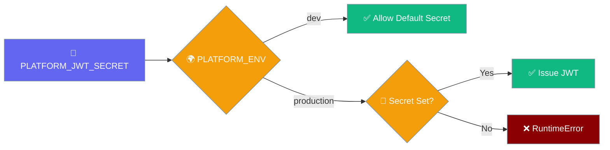
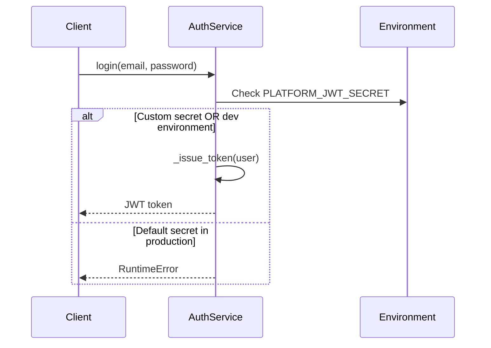

Platform authentication requires proper JWT secret configuration for security in production environments.

Platform authentication requires proper JWT secret configuration for security in production environments.

```python
import os
from praisonaiagents import Agent

agent = Agent(name="platform-admin", instructions="Configure JWT secrets for the platform.")
os.environ.setdefault("PLATFORM_JWT_SECRET", "change-me-in-production")
agent.start("Verify JWT settings before go-live.")
```

The user sets JWT secrets and token lifetimes so issued tokens validate correctly in every environment.



## Quick Start

<Steps>
<Step title="Set JWT Secret for Production">
```bash
# Generate a secure secret
python -c "import secrets; print(secrets.token_urlsafe(64))"
# Example output: kV8fTqZ2Jm5nR9sQ3xW8vY1bN7pL4dF6hG0jK9sA2cE5mZ8xW...

# Set the environment variable
export PLATFORM_JWT_SECRET="your-generated-secret-here"
```
</Step>

<Step title="Start Platform Service">
```bash
# With custom secret (production)
export PLATFORM_JWT_SECRET="kV8fTqZ2Jm5nR9sQ3xW8vY1bN7pL4dF6..."
praisonai-platform start

# Or for development (allows default secret)
export PLATFORM_ENV=dev
praisonai-platform start
```
</Step>
</Steps>

---

## Configuration

### Required Environment Variables

| Variable | Purpose | Required |
|----------|---------|----------|
| `PLATFORM_JWT_SECRET` | Secret for JWT token signing | **Yes** (except dev) |
| `PLATFORM_ENV` | Environment mode (`dev` or production) | Optional (defaults to production) |
| `PLATFORM_JWT_TTL` | Token TTL in seconds | Optional (default: 30 days) |

### JWT Secret Security

<Warning>
**Breaking Change**: The platform now refuses to issue JWTs when running with the default secret outside `PLATFORM_ENV=dev`.
</Warning>

```bash
# ✅ Valid configurations
export PLATFORM_JWT_SECRET="your-secure-secret"  # Production with custom secret
export PLATFORM_ENV=dev                          # Development (default secret OK)

# ❌ Invalid configuration (will fail)
# No PLATFORM_JWT_SECRET set and PLATFORM_ENV != "dev"
```

---

## How It Works

The `AuthService._issue_token` method enforces JWT secret validation:

```python
def _issue_token(self, user: User) -> str:
    """Issue a JWT for a user."""
    if JWT_SECRET == _DEFAULT_SECRET and os.environ.get("PLATFORM_ENV", "dev") != "dev":
        raise RuntimeError(
            "Refusing to issue JWT with default PLATFORM_JWT_SECRET outside dev"
        )
    # ... issue JWT
```

### Token Issuance Flow



---

## Production Deployment

### Docker Configuration

```dockerfile
FROM python:3.11-slim

# Set JWT secret via environment
ENV PLATFORM_JWT_SECRET="your-secure-secret-from-secrets-manager"

# Install and run platform
RUN pip install praisonai-platform
CMD ["praisonai-platform", "start"]
```

### Kubernetes Secret

```yaml
apiVersion: v1
kind: Secret
metadata:
  name: platform-auth
type: Opaque
data:
  jwt-secret: eW91ci1zZWN1cmUtc2VjcmV0LWJhc2U2NC1lbmNvZGVk
---
apiVersion: apps/v1
kind: Deployment
metadata:
  name: praisonai-platform
spec:
  template:
    spec:
      containers:
      - name: platform
        image: praisonai/platform:latest
        env:
        - name: PLATFORM_JWT_SECRET
          valueFrom:
            secretKeyRef:
              name: platform-auth
              key: jwt-secret
```

### Environment Variable Best Practices

```bash
# Use a secrets manager
export PLATFORM_JWT_SECRET="$(aws secretsmanager get-secret-value --secret-id prod/jwt-secret --query SecretString --output text)"

# Or read from file
export PLATFORM_JWT_SECRET="$(cat /var/secrets/jwt-secret)"

# Verify it's set
echo ${PLATFORM_JWT_SECRET:0:10}...  # Show first 10 characters only
```

---

## Migration

### Upgrading from Previous Versions

<Warning>
If you're upgrading from a version without JWT secret validation, set `PLATFORM_JWT_SECRET` before restarting, or you'll get a RuntimeError when users try to log in.
</Warning>

<Steps>
<Step title="Generate Secret">
```bash
# Generate a cryptographically secure secret
python -c "import secrets; print('PLATFORM_JWT_SECRET=' + secrets.token_urlsafe(64))"
```
</Step>

<Step title="Update Configuration">
```bash
# Add to your environment/config
export PLATFORM_JWT_SECRET="your-generated-secret"

# Or for temporary local development
export PLATFORM_ENV=dev  # NOT for production
```
</Step>

<Step title="Restart Platform">
```bash
# Restart with new configuration
praisonai-platform restart
```
</Step>
</Steps>

### Error Handling

When `login()` is called with misconfigured production deployment:

```
RuntimeError: Refusing to issue JWT with default PLATFORM_JWT_SECRET outside dev
```

This error occurs during token issuance, not service startup, so the platform will start successfully but fail when users attempt to authenticate.

---

## Development vs Production

### Development Mode

```bash
# Allow default secret (insecure, development only)
export PLATFORM_ENV=dev
praisonai-platform start

# Default secret warning will be logged but service continues
```

### Production Mode

```bash
# Require custom secret (secure, production)
export PLATFORM_JWT_SECRET="$(python -c 'import secrets; print(secrets.token_urlsafe(64))')"
unset PLATFORM_ENV  # Defaults to production mode
praisonai-platform start
```

| Mode | Default Secret | Custom Secret | Notes |
|------|----------------|---------------|-------|
| Development (`PLATFORM_ENV=dev`) | ✅ Allowed | ✅ Allowed | For local development only |
| Production (any other `PLATFORM_ENV`) | ❌ Rejected | ✅ Required | Enforced at token issuance |

---

## Best Practices

<AccordionGroup>
<Accordion title="Use Strong Secrets">
Generate secrets with at least 256 bits of entropy using `secrets.token_urlsafe(64)` or equivalent. Never use predictable values.
</Accordion>

<Accordion title="Rotate Secrets Regularly">
Implement secret rotation every 90 days. When rotating, issue new tokens gradually to avoid service disruption.
</Accordion>

<Accordion title="Store Secrets Securely">
Use dedicated secret management systems (AWS Secrets Manager, HashiCorp Vault, etc.) rather than plain environment variables.
</Accordion>

<Accordion title="Monitor Authentication Failures">
Log and alert on RuntimeError exceptions during login to detect misconfigured deployments quickly.
</Accordion>
</AccordionGroup>

---

## Related

<CardGroup cols={2}>
  <Card title="RBAC Enforcement" icon="shield-check" href="/docs/features/platform/rbac-enforcement">
    Workspace membership and role-based access control
  </Card>
  <Card title="Platform SDK" icon="code" href="/docs/features/platform-python-sdk">
    Python SDK for platform integration
  </Card>
</CardGroup>