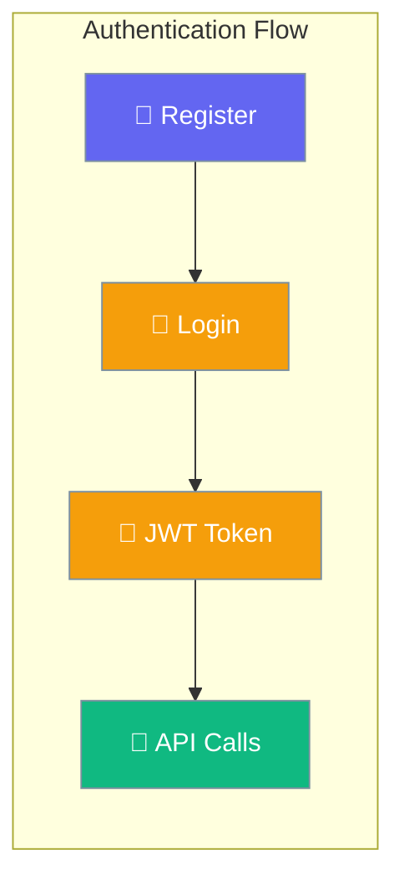
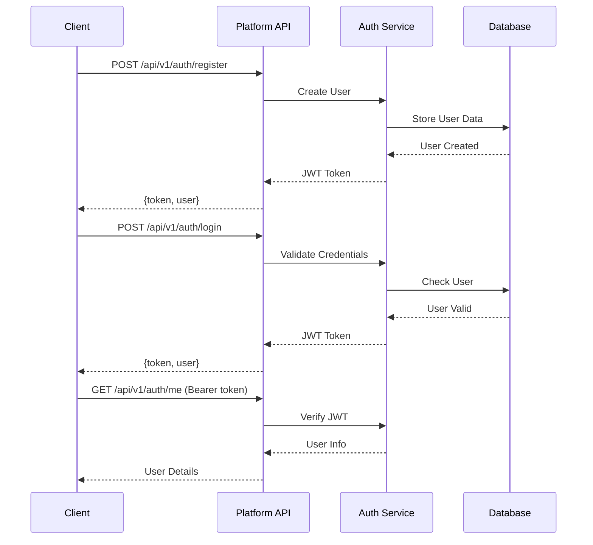

Platform Authentication enables secure access to the PraisonAI Platform using JWT tokens for API authentication.



## Quick Start

<Steps>
<Step title="Start Platform Server">
Install and start the PraisonAI Platform server to enable authentication endpoints:

```python
from praisonai_platform.client import PlatformClient
import asyncio

async def setup_auth():
    # Initialize platform client
    client = PlatformClient("http://localhost:8000")
    
    # Register new user (auto-stores token)
    result = await client.register(
        email="user@example.com",
        password="securepassword", 
        name="John Doe"
    )
    
    print(f"User registered with ID: {result['user']['id']}")
    return client

# Run the authentication setup
client = asyncio.run(setup_auth())
```
</Step>

<Step title="Authenticate and Use Token">
Once registered, use the JWT token for authenticated API requests:

```python
import httpx
import asyncio

async def authenticated_request():
    # Login to get token
    async with httpx.AsyncClient(base_url="http://localhost:8000") as client:
        # Authenticate user
        auth_response = await client.post("/api/v1/auth/login", json={
            "email": "user@example.com",
            "password": "securepassword"
        })
        
        token = auth_response.json()["token"]
        
        # Use token for authenticated requests
        headers = {"Authorization": f"Bearer {token}"}
        user_info = await client.get("/api/v1/auth/me", headers=headers)
        
        print(f"Authenticated as: {user_info.json()['name']}")

asyncio.run(authenticated_request())
```
</Step>
</Steps>

---

## How It Works



| Component | Purpose | Security |
|-----------|---------|----------|
| **JWT Token** | Stateless authentication | Signed with secret key |
| **Bearer Header** | Token transmission | Standard HTTP authorization |
| **Password Hash** | Secure storage | Bcrypt hashing |
| **TTL Expiry** | Token lifespan | Configurable timeout |

---

## API Reference

### Authentication Endpoints

| Method | Endpoint | Purpose | Authentication |
|--------|----------|---------|----------------|
| `POST` | `/api/v1/auth/register` | Register new user | None |
| `POST` | `/api/v1/auth/login` | Login existing user | None |
| `GET` | `/api/v1/auth/me` | Get current user | Bearer Token |

### Request/Response Schemas

<Tabs>
<Tab title="Register Request">
```json
{
  "email": "user@example.com",
  "password": "securepassword",
  "name": "John Doe"
}
```
</Tab>

<Tab title="Login Request">
```json
{
  "email": "user@example.com", 
  "password": "securepassword"
}
```
</Tab>

<Tab title="Auth Response">
```json
{
  "token": "eyJhbGciOiJIUzI1NiIs...",
  "user": {
    "id": "abc123",
    "name": "John Doe", 
    "email": "user@example.com",
    "created_at": "2025-01-01T00:00:00"
  }
}
```
</Tab>

<Tab title="User Info Response">
```json
{
  "id": "abc123",
  "name": "John Doe",
  "email": "user@example.com", 
  "created_at": "2025-01-01T00:00:00"
}
```
</Tab>
</Tabs>

---

## Configuration Options

Configure JWT authentication using environment variables:

| Variable | Default | Description |
|----------|---------|-------------|
| `PLATFORM_JWT_SECRET` | `dev-secret-change-me` | JWT signing secret (**MUST change in production**) |
| `PLATFORM_JWT_TTL` | `2592000` (30 days) | Token time-to-live in seconds |
| `PLATFORM_ENV` | `dev` | Set to non-dev to enforce strong JWT secret |

<Warning>
**Security Notice**: Always change `PLATFORM_JWT_SECRET` in production environments. Using the default secret poses a security risk.
</Warning>

---

## Client Examples

<Tabs>
<Tab title="curl Commands">
```bash
# Start the platform server
pip install praisonai-platform
uvicorn praisonai_platform.api.app:create_app --factory --port 8000

# Register new user
curl -s -X POST http://localhost:8000/api/v1/auth/register \
  -H "Content-Type: application/json" \
  -d '{"email":"user@example.com","password":"mypassword","name":"John Doe"}' \
  --max-time 10

# Login with credentials  
curl -s -X POST http://localhost:8000/api/v1/auth/login \
  -H "Content-Type: application/json" \
  -d '{"email":"user@example.com","password":"mypassword"}' \
  --max-time 10

# Get current user info (replace YOUR_TOKEN_HERE with actual token)
curl -s http://localhost:8000/api/v1/auth/me \
  -H "Authorization: Bearer YOUR_TOKEN_HERE" \
  --max-time 10
```
</Tab>

<Tab title="Python SDK">
```python
import asyncio
from praisonai_platform.client import PlatformClient

async def authentication_example():
    client = PlatformClient("http://localhost:8000")

    # Register new user (auto-stores token)
    register_result = await client.register(
        "user@example.com", 
        "mypassword", 
        "John Doe"
    )
    print(f"Registered user ID: {register_result['user']['id']}")

    # Login existing user (if already registered)
    login_result = await client.login(
        "user@example.com", 
        "mypassword"
    )
    print(f"Login token: {login_result['token'][:20]}...")

asyncio.run(authentication_example())
```
</Tab>

<Tab title="httpx Direct">
```python
import httpx
import asyncio

async def direct_auth_example():
    async with httpx.AsyncClient(base_url="http://localhost:8000") as client:
        # Register new user
        register_resp = await client.post("/api/v1/auth/register", json={
            "email": "user@example.com",
            "password": "mypassword", 
            "name": "John Doe"
        })
        token = register_resp.json()["token"]
        
        # Use token for authenticated requests
        headers = {"Authorization": f"Bearer {token}"}
        me_resp = await client.get("/api/v1/auth/me", headers=headers)
        user_info = me_resp.json()
        
        print(f"Authenticated as: {user_info['name']}")
        print(f"Email: {user_info['email']}")

asyncio.run(direct_auth_example())
```
</Tab>
</Tabs>

---

## Common Patterns

<AccordionGroup>
<Accordion title="Token Storage and Reuse">
Store JWT tokens securely for reuse across requests:

```python
import os
import asyncio
from praisonai_platform.client import PlatformClient

async def persistent_auth():
    client = PlatformClient("http://localhost:8000")
    
    # Check for existing token in environment
    stored_token = os.getenv('PLATFORM_AUTH_TOKEN')
    
    if not stored_token:
        # Register or login to get new token
        result = await client.login("user@example.com", "password")
        stored_token = result['token']
        
        # Store token for future use
        os.environ['PLATFORM_AUTH_TOKEN'] = stored_token
    
    # Use stored token for requests
    client.set_token(stored_token)
    user_info = await client.get_current_user()
    print(f"Authenticated as: {user_info['name']}")

asyncio.run(persistent_auth())
```
</Accordion>

<Accordion title="Error Handling for Auth Failures">
Handle common authentication errors gracefully:

```python
import httpx
import asyncio

async def robust_auth():
    async with httpx.AsyncClient(base_url="http://localhost:8000") as client:
        try:
            # Attempt login
            resp = await client.post("/api/v1/auth/login", json={
                "email": "user@example.com",
                "password": "mypassword"
            })
            resp.raise_for_status()
            
            token = resp.json()["token"]
            print(f"Authentication successful")
            
        except httpx.HTTPStatusError as e:
            if e.response.status_code == 401:
                print("Invalid credentials - check email/password")
            elif e.response.status_code == 404:
                print("User not found - register first")
            else:
                print(f"Authentication failed: {e}")
        except Exception as e:
            print(f"Network error: {e}")

asyncio.run(robust_auth())
```
</Accordion>

<Accordion title="Multi-User Session Management">
Manage authentication for multiple users in the same application:

```python
import asyncio
from typing import Dict
from praisonai_platform.client import PlatformClient

class MultiUserAuth:
    def __init__(self, base_url: str):
        self.base_url = base_url
        self.user_tokens: Dict[str, str] = {}
    
    async def authenticate_user(self, email: str, password: str):
        client = PlatformClient(self.base_url)
        
        # Check if user is already authenticated
        if email in self.user_tokens:
            return self.user_tokens[email]
        
        # Login and store token
        result = await client.login(email, password)
        self.user_tokens[email] = result['token']
        
        return result['token']
    
    async def get_user_client(self, email: str) -> PlatformClient:
        if email not in self.user_tokens:
            raise ValueError(f"User {email} not authenticated")
        
        client = PlatformClient(self.base_url)
        client.set_token(self.user_tokens[email])
        return client

async def multi_user_example():
    auth_manager = MultiUserAuth("http://localhost:8000")
    
    # Authenticate multiple users
    await auth_manager.authenticate_user("admin@example.com", "admin_pass")
    await auth_manager.authenticate_user("user@example.com", "user_pass")
    
    # Use clients for different users
    admin_client = await auth_manager.get_user_client("admin@example.com")
    user_client = await auth_manager.get_user_client("user@example.com")
    
    admin_info = await admin_client.get_current_user()
    user_info = await user_client.get_current_user()
    
    print(f"Admin: {admin_info['name']}")
    print(f"User: {user_info['name']}")

asyncio.run(multi_user_example())
```
</Accordion>
</AccordionGroup>

---

## Testing

Verify authentication functionality with comprehensive tests:

```bash
# Install test dependencies
pip install praisonai-platform[test]

# Run authentication service tests
pytest tests/test_services.py::TestAuthService -v

# Run API integration tests  
pytest tests/test_api_integration.py::TestAuthErrors -v

# Run all authentication tests
pytest tests/ -k "auth" -v
```

<Note>
Tests require a running platform server instance. Start the server before running tests:
```bash
uvicorn praisonai_platform.api.app:create_app --factory --port 8000
```
</Note>

---

## Best Practices

<AccordionGroup>
<Accordion title="Secure Token Management">
- **Never log tokens**: Avoid printing or logging JWT tokens in production
- **Environment variables**: Store tokens in environment variables, not source code
- **Token rotation**: Implement token refresh for long-running applications
- **Secure transport**: Always use HTTPS in production to protect token transmission
</Accordion>

<Accordion title="Password Security">
- **Strong passwords**: Enforce minimum password complexity requirements
- **Password hashing**: Platform uses bcrypt for secure password storage
- **Rate limiting**: Implement rate limiting on authentication endpoints
- **Account lockout**: Consider implementing account lockout after failed attempts
</Accordion>

<Accordion title="Production Configuration">
- **Change JWT secret**: Always set a strong, unique `PLATFORM_JWT_SECRET` in production
- **Token expiry**: Set appropriate `PLATFORM_JWT_TTL` based on security requirements  
- **Environment validation**: Set `PLATFORM_ENV` to non-dev to enable production security checks
- **HTTPS only**: Never expose authentication endpoints over HTTP in production
</Accordion>

<Accordion title="Error Handling">
- **Graceful degradation**: Handle authentication failures gracefully
- **Clear error messages**: Provide helpful error messages for common auth issues
- **Retry logic**: Implement exponential backoff for transient failures
- **Fallback mechanisms**: Consider offline capabilities when authentication is unavailable
</Accordion>
</AccordionGroup>

---

## Related

<CardGroup cols={2}>
<Card title="Platform API" icon="api" href="/docs/features/platform/api">
  Complete platform API documentation
</Card>

<Card title="Security Features" icon="shield" href="/docs/features/security">
  Advanced security and protection features
</Card>
</CardGroup>