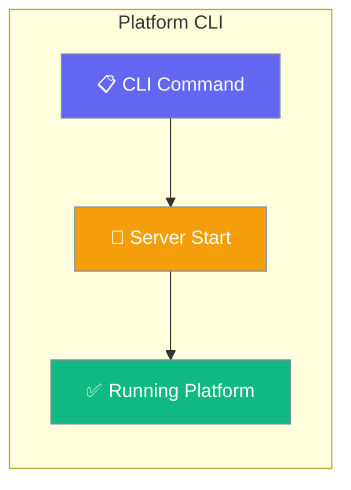
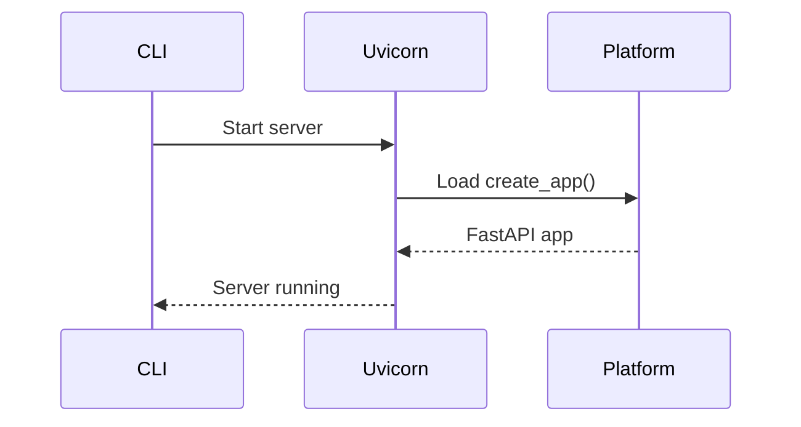

Start the PraisonAI platform server with `python -m praisonai_platform` for local development and production deployment.

```python
from praisonaiagents import Agent

agent = Agent(name="dev-assistant", instructions="Run the local platform server.")
agent.start("Start the platform on port 8000 for local testing.")
```

The user runs `python -m praisonai_platform`; the CLI boots the API server for development or production.



## Quick Start

<Steps>
<Step title="Basic Usage">
Start the platform server with default settings:

```bash
python -m praisonai_platform
```

This starts the server on `http://127.0.0.1:8000` (localhost only) with automatic reload disabled.
Set `PLATFORM_HOST=0.0.0.0` or pass `--host 0.0.0.0` to listen on all interfaces.
</Step>

<Step title="Development Mode">
Start with auto-reload for development:

```bash
python -m praisonai_platform --port 9000 --reload
```

This enables automatic restart when code changes are detected.
</Step>
</Steps>

---

## How It Works



| Component | Purpose |
|-----------|---------|
| **CLI Entry Point** | `python -m praisonai_platform` command |
| **Uvicorn** | ASGI server with factory mode |
| **Platform App** | FastAPI application with routes |

### Environment Variables

| Env Var | Default | Description |
|---------|---------|-------------|
| `PLATFORM_HOST` | `127.0.0.1` | Default bind address; overridden by `--host` flag if both are set |

---

## Configuration Options

<Card title="CLI Arguments" icon="sliders" href="#cli-arguments">
  Command line flags and options
</Card>

### CLI Arguments

| Flag | Type | Default | Description |
|------|------|---------|-------------|
| `--host` | `str` | `"127.0.0.1"` (or `$PLATFORM_HOST`) | Server bind address |
| `--port` | `int` | `8000` | Server port number |
| `--reload` | `bool` | `False` | Enable auto-reload on changes |

---

## Common Patterns

### Production Deployment

```bash
# Bind to specific host and port
python -m praisonai_platform --host 127.0.0.1 --port 8080
```

### Development Server

```bash
# Auto-reload with custom port
python -m praisonai_platform --port 9000 --reload
```

### Docker Container

```bash
# Bind to all interfaces for container access
python -m praisonai_platform --host 0.0.0.0 --port 8000
```

<Warning>
The default bind address changed from `0.0.0.0` to `127.0.0.1` for security (advisory GHSA-h8q5-cp56-rr65). This prevents accidental exposure to the public internet on development machines. Use `--host 0.0.0.0` explicitly for container deployments or when remote access is needed.
</Warning>

---

## Best Practices

<AccordionGroup>
<Accordion title="Use auto-reload for development only">
The `--reload` flag monitors file changes and restarts the server automatically. Only use this during development as it adds overhead and can cause issues in production.
</Accordion>

<Accordion title="Use localhost binding by default">
The new default `--host 127.0.0.1` only accepts connections from localhost, preventing accidental exposure on public networks. Use `--host 0.0.0.0` only when you specifically need remote access, preferably behind a reverse proxy like nginx.
</Accordion>

<Accordion title="Choose appropriate ports">
Use standard ports like `8000` or `8080` for HTTP services. Ensure the port is available and not blocked by firewalls.
</Accordion>
</AccordionGroup>

---

## Related

<CardGroup cols={2}>
<Card title="Platform Authentication" icon="shield-check" href="/docs/features/platform/authentication">
  Set up authentication for your platform server
</Card>
<Card title="Platform SDK Client" icon="plug" href="/docs/features/platform/sdk-client">
  Connect to platform programmatically
</Card>
</CardGroup>