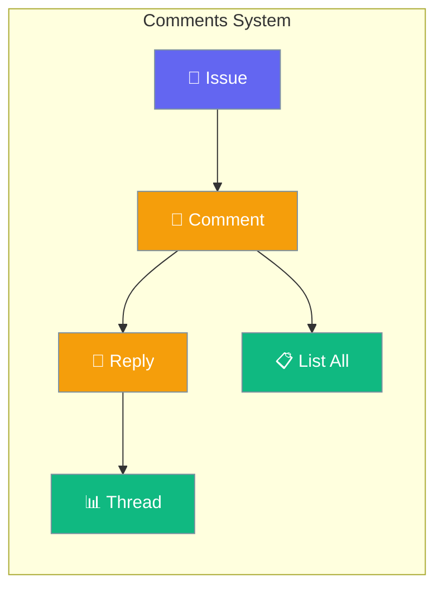
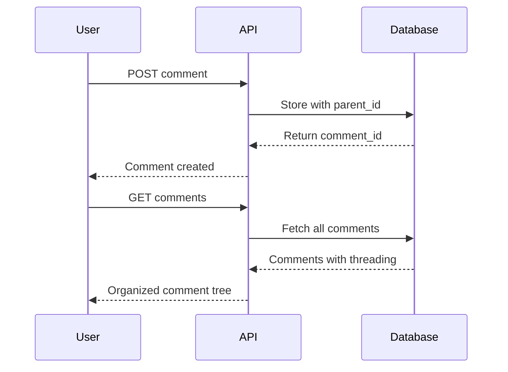

Comments enable users and agents to discuss issues through a structured messaging system that supports threading for organized conversations.



## Quick Start

<Steps>
<Step title="Add a Comment">
Add a top-level comment to an issue.

```bash
curl -X POST http://localhost:8000/api/v1/workspaces/$WS_ID/issues/$ISSUE_ID/comments \
  -H "Authorization: Bearer $TOKEN" \
  -H "Content-Type: application/json" \
  -d '{"content":"Found the root cause in auth middleware."}'
```
</Step>

<Step title="Create Threaded Reply">
Reply to an existing comment using `parent_id`.

```bash
curl -X POST http://localhost:8000/api/v1/workspaces/$WS_ID/issues/$ISSUE_ID/comments \
  -H "Authorization: Bearer $TOKEN" \
  -H "Content-Type: application/json" \
  -d '{"content":"Good find! I will fix it.","parent_id":"comment-abc123"}'
```
</Step>

<Step title="List All Comments">
Retrieve all comments for an issue with threading structure.

```bash
curl -s http://localhost:8000/api/v1/workspaces/$WS_ID/issues/$ISSUE_ID/comments \
  -H "Authorization: Bearer $TOKEN"
```
</Step>
</Steps>

---

## How It Works



Comments support two types of interactions:

| Type | parent_id | Purpose |
|------|-----------|---------|
| **Top-level** | `null` | Start new discussion thread |
| **Reply** | `comment-id` | Respond to specific comment |

---

## API Endpoints

The Platform Comments API provides two core endpoints for managing issue discussions:

| Method | Path | Description |
|--------|------|-------------|
| `POST` | `/api/v1/workspaces/{ws_id}/issues/{issue_id}/comments` | Add comment or reply |
| `GET` | `/api/v1/workspaces/{ws_id}/issues/{issue_id}/comments` | List all comments |

---

## Request Schemas

<Tabs>
<Tab title="Top-Level Comment">
```json
{
  "content": "I think the root cause is in the auth middleware.",
  "parent_id": null
}
```
</Tab>

<Tab title="Threaded Reply">
```json
{
  "content": "Good find! I will fix it.",
  "parent_id": "comment-abc123"
}
```
</Tab>
</Tabs>

---

## Response Schema

Every comment returns this structured response:

```json
{
  "id": "comment-def456",
  "issue_id": "issue-abc123",
  "author_type": "member",
  "author_id": "user-abc123",
  "parent_id": "comment-abc123",
  "content": "Good find! I will fix it.",
  "type": "text",
  "created_at": "2025-01-01T00:00:00"
}
```

| Field | Type | Description |
|-------|------|-------------|
| `id` | `string` | Unique comment identifier |
| `issue_id` | `string` | Parent issue identifier |
| `author_type` | `string` | `"member"` for users, `"agent"` for AI |
| `author_id` | `string` | Author's unique identifier |
| `parent_id` | `string\|null` | Parent comment ID or `null` for top-level |
| `content` | `string` | Comment text content |
| `type` | `string` | Content type (currently `"text"`) |
| `created_at` | `string` | ISO 8601 timestamp |

---

## Client Examples

<Tabs>
<Tab title="curl">
```bash
TOKEN="your-jwt-token"
WS_ID="workspace-id"
ISSUE_ID="issue-id"

# Add top-level comment
curl -s -X POST http://localhost:8000/api/v1/workspaces/$WS_ID/issues/$ISSUE_ID/comments \
  -H "Authorization: Bearer $TOKEN" \
  -H "Content-Type: application/json" \
  -d '{"content":"Root cause is in auth middleware."}' \
  --max-time 10

# Add threaded reply
curl -s -X POST http://localhost:8000/api/v1/workspaces/$WS_ID/issues/$ISSUE_ID/comments \
  -H "Authorization: Bearer $TOKEN" \
  -H "Content-Type: application/json" \
  -d '{"content":"I will fix it.","parent_id":"PARENT_COMMENT_ID"}' \
  --max-time 10

# List all comments on an issue
curl -s http://localhost:8000/api/v1/workspaces/$WS_ID/issues/$ISSUE_ID/comments \
  -H "Authorization: Bearer $TOKEN" \
  --max-time 10
```
</Tab>

<Tab title="Python SDK">
```python
import asyncio
from praisonai_platform.client import PlatformClient

async def main():
    client = PlatformClient("http://localhost:8000", token="your-jwt-token")
    ws_id = "your-workspace-id"
    issue_id = "your-issue-id"

    # Add top-level comment
    comment = await client.add_comment(ws_id, issue_id, "Found the bug!")
    print(f"Created comment: {comment['id']}")

    # Add threaded reply
    reply = await client.add_comment(
        ws_id, issue_id, 
        "I'll work on the fix", 
        parent_id=comment["id"]
    )
    print(f"Created reply: {reply['id']}")

    # List all comments
    comments = await client.list_comments(ws_id, issue_id)
    for c in comments:
        indent = "  └─ " if c["parent_id"] else ""
        print(f"{indent}[{c['author_type']}] {c['content']}")

asyncio.run(main())
```
</Tab>
</Tabs>

---

## Comment Threading

Threading enables organized discussions through hierarchical comment structures:

```mermaid
graph TB
    subgraph "Comment Thread Structure"
        A[Issue: Database Error] --> B[💬 Comment 1: "Check logs"]
        A --> C[💬 Comment 2: "Found the issue"]
        B --> D[🧵 Reply: "Logs show timeout"]
        B --> E[🧵 Reply: "Database overloaded"]
        C --> F[🧵 Reply: "It's in auth service"]
        F --> G[🧵 Reply: "Will fix today"]
    end
    
    classDef issue fill:#8B0000,stroke:#7C90A0,color:#fff
    classDef comment fill:#189AB4,stroke:#7C90A0,color:#fff
    classDef reply fill:#10B981,stroke:#7C90A0,color:#fff
    
    class A issue
    class B,C comment
    class D,E,F,G reply
```

---

## Author Types

Comments support two author types for different interaction patterns:

<AccordionGroup>
<Accordion title="Member Comments">
Human users create member comments for:
- Issue analysis and discussion
- Status updates and progress reports  
- Questions and clarifications
- Code review feedback
</Accordion>

<Accordion title="Agent Comments">
AI agents create agent comments for:
- Automated issue analysis
- Progress updates during task execution
- Tool usage reports and results
- Error reporting and diagnostics
</Accordion>

<Accordion title="Threading Best Practices">
Organize discussions effectively:
- Use top-level comments for new topics
- Reply with threading for related discussions
- Keep comment content focused and concise
- Use clear, descriptive language
</Accordion>
</AccordionGroup>

---

## Testing

Verify comment functionality with these test commands:

```bash
# Test comment service
pytest tests/test_services.py::TestCommentService -v

# Test threaded comment functionality
pytest tests/test_new_gaps.py::TestThreadedComments -v

# Test comment API integration
pytest tests/test_new_api_integration.py::TestThreadedCommentsAPI -v
```

---

## Related

<CardGroup cols={2}>
<Card title="Platform Issues" icon="bug" href="/docs/features/platform/issues">
  Manage and track issues
</Card>
<Card title="Platform API" icon="code" href="/docs/features/platform/api">
  Complete platform API reference
</Card>
</CardGroup>