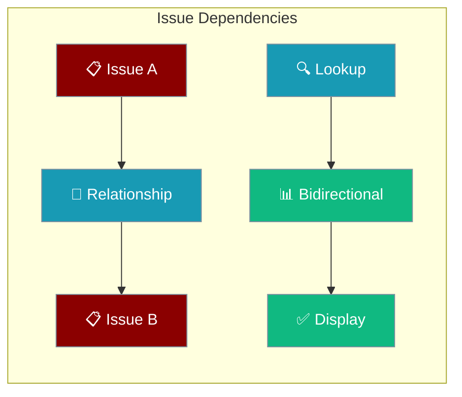
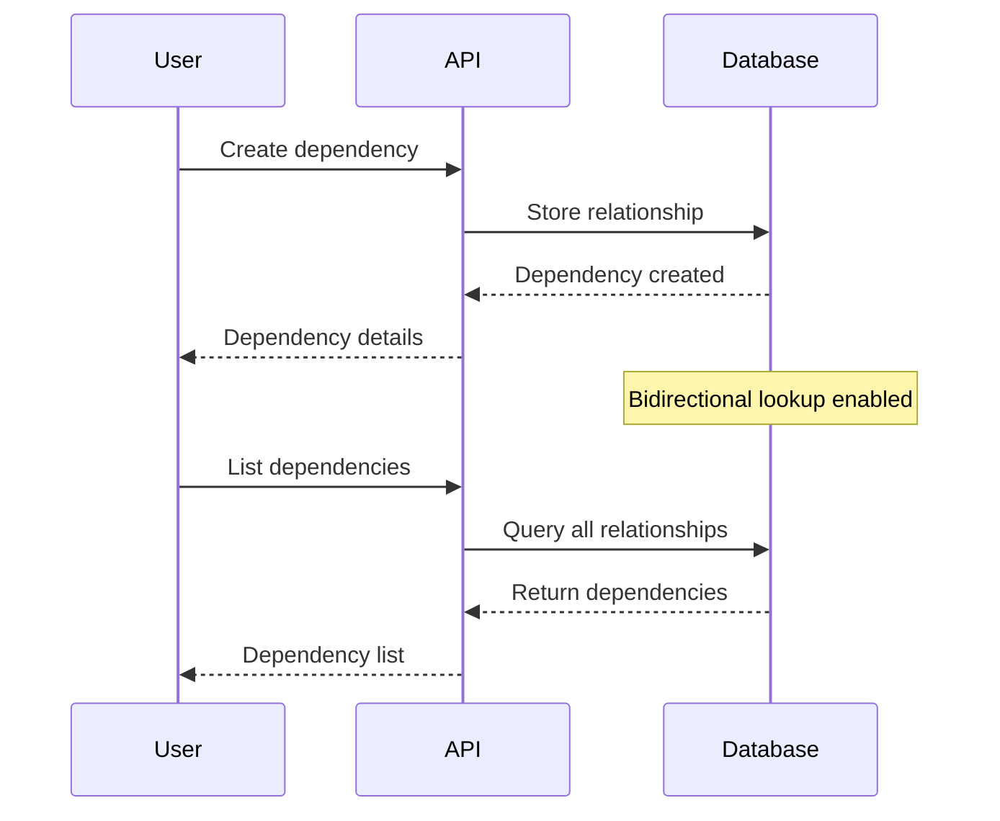
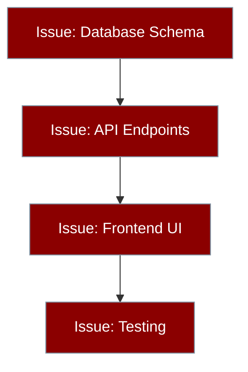
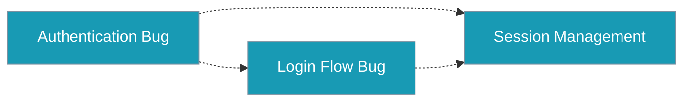

Issue dependencies express relationships between issues to track blocking, related, and duplicate connections in your project.



## Quick Start

<Steps>
<Step title="Create a Dependency">
Link one issue to another with a specific relationship type:

```bash
TOKEN="your-jwt-token"
WS_ID="workspace-id"
ISSUE_ID="issue-id"

curl -s -X POST http://localhost:8000/api/v1/workspaces/$WS_ID/issues/$ISSUE_ID/dependencies/ \
  -H "Authorization: Bearer $TOKEN" \
  -H "Content-Type: application/json" \
  -d '{"depends_on_issue_id":"OTHER_ISSUE_ID","type":"blocks"}' \
  --max-time 10
```
</Step>

<Step title="List Dependencies">
View all dependencies for an issue:

```bash
curl -s http://localhost:8000/api/v1/workspaces/$WS_ID/issues/$ISSUE_ID/dependencies/ \
  -H "Authorization: Bearer $TOKEN" \
  --max-time 10
```
</Step>

<Step title="Delete a Dependency">
Remove a dependency by its ID:

```bash
curl -s -X DELETE http://localhost:8000/api/v1/workspaces/$WS_ID/issues/$ISSUE_ID/dependencies/DEP_ID \
  -H "Authorization: Bearer $TOKEN" \
  --max-time 10
```
</Step>
</Steps>

---

## How It Works



Dependencies are bidirectional - when you create a relationship between Issue A and Issue B, the dependency appears when listing from either issue.

| Operation | Method | Purpose |
|-----------|--------|---------|
| Create | `POST` | Establish new dependency link |
| List | `GET` | View all dependencies for an issue |
| Delete | `DELETE` | Remove specific dependency |

---

## Configuration Options

### API Endpoints

| Method | Endpoint | Description |
|--------|----------|-------------|
| `POST` | `/api/v1/workspaces/{ws_id}/issues/{issue_id}/dependencies/` | Create dependency |
| `GET` | `/api/v1/workspaces/{ws_id}/issues/{issue_id}/dependencies/` | List dependencies |
| `DELETE` | `/api/v1/workspaces/{ws_id}/issues/{issue_id}/dependencies/{dep_id}` | Delete dependency |

### Request Schema

**Create Dependency:**
```json
{
  "depends_on_issue_id": "issue-def456",
  "type": "blocks"
}
```

**Response:**
```json
{
  "id": "dep-abc123",
  "issue_id": "issue-abc123",
  "depends_on_issue_id": "issue-def456",
  "type": "blocks"
}
```

### Dependency Types

| Type | Meaning | Use Case |
|------|---------|----------|
| `blocks` | This issue blocks the other issue | Issue A must be resolved before Issue B can proceed |
| `related` | Issues are related but not blocking | Similar topics or shared components |
| `duplicates` | This issue is a duplicate of the other | Same problem reported multiple times |

---

## Common Patterns

<Tabs>
<Tab title="Python with httpx">
```python
import asyncio
import httpx

async def main():
    base = "http://localhost:8000/api/v1"
    headers = {"Authorization": "Bearer YOUR_TOKEN", "Content-Type": "application/json"}
    ws_id = "your-workspace-id"

    async with httpx.AsyncClient() as client:
        # Create two issues first
        r1 = await client.post(f"{base}/workspaces/{ws_id}/issues/",
            json={"title": "Setup database"}, headers=headers)
        r2 = await client.post(f"{base}/workspaces/{ws_id}/issues/",
            json={"title": "Build API layer"}, headers=headers)
        issue1_id = r1.json()["id"]
        issue2_id = r2.json()["id"]

        # Issue 1 blocks Issue 2
        dep = await client.post(
            f"{base}/workspaces/{ws_id}/issues/{issue1_id}/dependencies/",
            json={"depends_on_issue_id": issue2_id, "type": "blocks"},
            headers=headers)
        print(dep.json())

        # List dependencies
        deps = await client.get(
            f"{base}/workspaces/{ws_id}/issues/{issue1_id}/dependencies/",
            headers=headers)
        print(deps.json())

asyncio.run(main())
```
</Tab>

<Tab title="Bash Scripts">
```bash
#!/bin/bash

TOKEN="your-jwt-token"
WS_ID="workspace-id"
BASE_URL="http://localhost:8000/api/v1/workspaces/$WS_ID"

# Function to create dependency
create_dependency() {
    local from_issue=$1
    local to_issue=$2
    local type=$3
    
    curl -s -X POST "$BASE_URL/issues/$from_issue/dependencies/" \
      -H "Authorization: Bearer $TOKEN" \
      -H "Content-Type: application/json" \
      -d "{\"depends_on_issue_id\":\"$to_issue\",\"type\":\"$type\"}" \
      --max-time 10
}

# Function to list dependencies
list_dependencies() {
    local issue_id=$1
    
    curl -s "$BASE_URL/issues/$issue_id/dependencies/" \
      -H "Authorization: Bearer $TOKEN" \
      --max-time 10
}

# Usage examples
create_dependency "issue-123" "issue-456" "blocks"
list_dependencies "issue-123"
```
</Tab>

<Tab title="JavaScript Fetch">
```javascript
const BASE_URL = "http://localhost:8000/api/v1";
const TOKEN = "your-jwt-token";
const WS_ID = "workspace-id";

const headers = {
    "Authorization": `Bearer ${TOKEN}`,
    "Content-Type": "application/json"
};

// Create dependency
async function createDependency(fromIssueId, toIssueId, type) {
    const response = await fetch(
        `${BASE_URL}/workspaces/${WS_ID}/issues/${fromIssueId}/dependencies/`,
        {
            method: "POST",
            headers,
            body: JSON.stringify({
                depends_on_issue_id: toIssueId,
                type: type
            })
        }
    );
    return response.json();
}

// List dependencies
async function listDependencies(issueId) {
    const response = await fetch(
        `${BASE_URL}/workspaces/${WS_ID}/issues/${issueId}/dependencies/`,
        { headers }
    );
    return response.json();
}

// Usage
createDependency("issue-123", "issue-456", "blocks")
    .then(result => console.log("Created:", result));
```
</Tab>
</Tabs>

**Blocking Chain:**


**Related Issues:**


---

## Best Practices

<AccordionGroup>
<Accordion title="Use Clear Dependency Types">
Choose the appropriate dependency type:
- `blocks`: Use when one issue must be completed before another can start
- `related`: Use for issues that share context but don't block each other  
- `duplicates`: Use when multiple issues report the same problem
</Accordion>

<Accordion title="Avoid Circular Dependencies">
While the API doesn't prevent circular dependencies, avoid creating chains where Issue A blocks Issue B, and Issue B blocks Issue A. This creates deadlock situations in project planning.
</Accordion>

<Accordion title="Leverage Bidirectional Lookup">
Dependencies appear when querying either issue in the relationship. Use this to discover related work when viewing any issue in your project.
</Accordion>

<Accordion title="Clean Up Resolved Dependencies">
Delete dependencies when issues are resolved to keep the dependency graph clean and relevant for active work.
</Accordion>
</AccordionGroup>

---

## Testing

Run the dependency service tests to verify functionality:

```bash
pytest tests/test_new_gaps.py::TestDependencyService -v
pytest tests/test_new_api_integration.py::TestDependencyRoutes -v
```

---

## Related

<CardGroup cols={2}>
<Card title="Issue Management" icon="clipboard" href="/docs/features/platform/issues">
  Core issue creation and management
</Card>
<Card title="Workspace API" icon="building" href="/docs/features/platform/workspaces">
  Workspace-level operations and access
</Card>
</CardGroup>