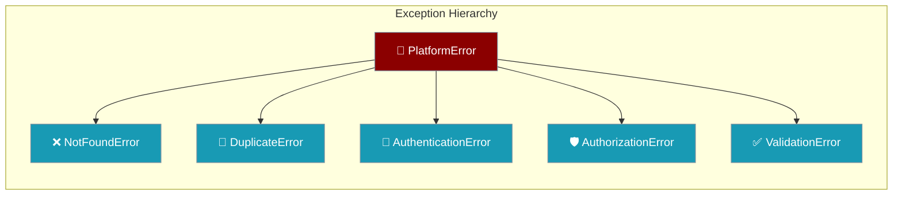
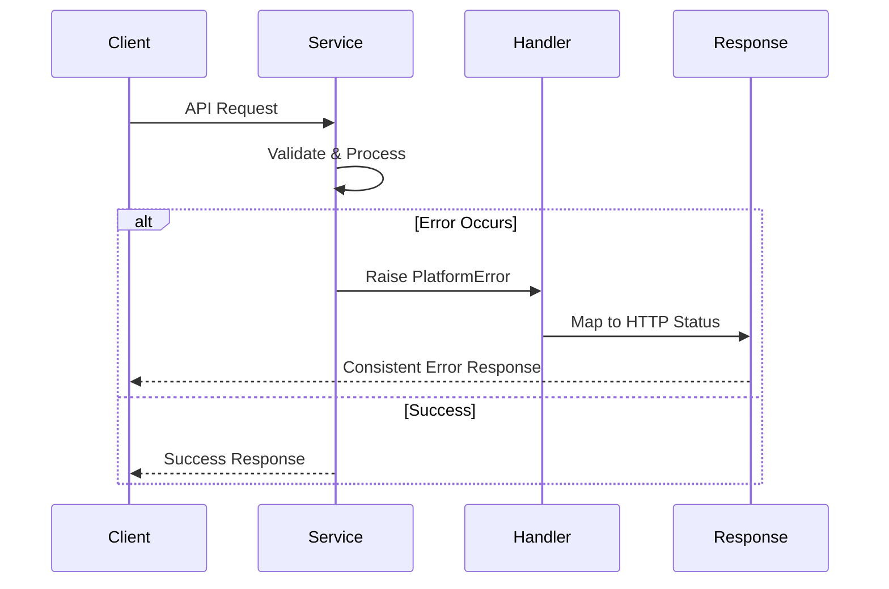

Platform custom exceptions provide domain-specific error handling for services instead of generic Python exceptions.



## Quick Start

<Steps>
<Step title="Import Exceptions">
```python
from praisonai_platform.exceptions import (
    PlatformError,
    NotFoundError, 
    DuplicateError,
    AuthenticationError,
    AuthorizationError,
    ValidationError
)
```
</Step>

<Step title="Raise Domain-Specific Errors">
```python
# In a service
def get_workspace(workspace_id: str):
    if not workspace_exists(workspace_id):
        raise NotFoundError(f"Workspace {workspace_id} not found")
    return workspace

def create_project(project_data):
    if project_exists(project_data.name):
        raise DuplicateError(f"Project {project_data.name} already exists")
    return create_new_project(project_data)
```
</Step>
</Steps>

---

## How It Works



| Exception | Purpose | HTTP Status |
|-----------|---------|-------------|
| `NotFoundError` | Resource not found | 404 |
| `DuplicateError` | Resource already exists | 409 |
| `AuthenticationError` | Invalid credentials | 401 |
| `AuthorizationError` | Insufficient permissions | 403 |
| `ValidationError` | Invalid input data | 422 |

---

## Exception Types

### Base Exception

The `PlatformError` base class provides common functionality:

```python
from praisonai_platform.exceptions import PlatformError

# All platform exceptions inherit from this
try:
    # Platform operations
    pass
except PlatformError as e:
    # Catches any platform-specific error
    logger.error(f"Platform error: {e}")
```

### Resource Errors

Handle resource-related errors with specific exceptions:

```python
from praisonai_platform.exceptions import NotFoundError, DuplicateError

# Resource not found
raise NotFoundError("Workspace ws-123 not found")

# Resource already exists  
raise DuplicateError("Project 'my-project' already exists")
```

### Authentication & Authorization

Secure your platform with auth-specific exceptions:

```python
from praisonai_platform.exceptions import AuthenticationError, AuthorizationError

# Invalid credentials
raise AuthenticationError("Invalid API key provided")

# Insufficient permissions
raise AuthorizationError("User lacks permission to delete workspace")
```

### Data Validation

Validate input with clear error messages:

```python
from praisonai_platform.exceptions import ValidationError

# Invalid input data
raise ValidationError("Project name must be alphanumeric")
```

---

## FastAPI Integration

Handle platform exceptions in FastAPI applications:

<Tabs>
<Tab title="Exception Handlers">
```python
from fastapi import FastAPI, HTTPException
from fastapi.responses import JSONResponse
from praisonai_platform.exceptions import (
    PlatformError,
    NotFoundError,
    DuplicateError,
    AuthenticationError,
    AuthorizationError,
    ValidationError
)

app = FastAPI()

@app.exception_handler(NotFoundError)
async def not_found_handler(request, exc):
    return JSONResponse(
        status_code=404, 
        content={"detail": str(exc)}
    )

@app.exception_handler(DuplicateError)
async def duplicate_handler(request, exc):
    return JSONResponse(
        status_code=409, 
        content={"detail": str(exc)}
    )

@app.exception_handler(AuthenticationError)
async def auth_handler(request, exc):
    return JSONResponse(
        status_code=401, 
        content={"detail": str(exc)}
    )

@app.exception_handler(ValidationError)
async def validation_handler(request, exc):
    return JSONResponse(
        status_code=422, 
        content={"detail": str(exc)}
    )
```
</Tab>

<Tab title="Service Usage">
```python
from praisonai_platform.exceptions import NotFoundError, ValidationError

async def get_workspace(workspace_id: str):
    """Get workspace by ID."""
    if not workspace_id:
        raise ValidationError("Workspace ID is required")
        
    workspace = await workspace_service.get(workspace_id)
    if not workspace:
        raise NotFoundError(f"Workspace {workspace_id} not found")
        
    return workspace

@app.get("/workspaces/{workspace_id}")
async def get_workspace_endpoint(workspace_id: str):
    # Exceptions automatically handled by FastAPI handlers
    return await get_workspace(workspace_id)
```
</Tab>
</Tabs>

---

## Common Patterns

### Service Layer Pattern

Use exceptions consistently across services:

```python
class WorkspaceService:
    def get(self, workspace_id: str):
        workspace = self.db.get_workspace(workspace_id)
        if not workspace:
            raise NotFoundError(f"Workspace {workspace_id} not found")
        return workspace
    
    def create(self, workspace_data):
        if self.db.workspace_exists(workspace_data.name):
            raise DuplicateError(f"Workspace {workspace_data.name} already exists")
        return self.db.create_workspace(workspace_data)
```

### Error Context

Include helpful context in exception messages:

```python
# Good: Specific and actionable
raise NotFoundError(f"Workspace {workspace_id} not found")
raise ValidationError("Project name must be 3-50 characters")

# Avoid: Generic messages
raise NotFoundError("Not found")
raise ValidationError("Invalid input")
```

### Exception Chaining

Chain exceptions to preserve original error context:

```python
try:
    # Database operation
    result = db.create_project(project_data)
except DatabaseError as e:
    raise DuplicateError(f"Project {project_data.name} already exists") from e
```

---

## Best Practices

<AccordionGroup>
<Accordion title="Use Specific Exceptions">
Always use the most specific exception type available. This helps with error handling and debugging.

```python
# Good
raise NotFoundError(f"Workspace {workspace_id} not found")

# Avoid  
raise PlatformError("Workspace not found")
```
</Accordion>

<Accordion title="Include Helpful Messages">
Provide clear, actionable error messages that help users understand what went wrong.

```python
# Good
raise ValidationError("Project name must contain only letters, numbers, and hyphens")

# Avoid
raise ValidationError("Invalid project name")
```
</Accordion>

<Accordion title="Consistent HTTP Mapping">
Each exception type maps to a specific HTTP status code. Use consistent exception handlers in your FastAPI applications.

```python
# Consistent mapping
NotFoundError → 404
DuplicateError → 409  
AuthenticationError → 401
AuthorizationError → 403
ValidationError → 422
```
</Accordion>

<Accordion title="Exception Hierarchy">
Take advantage of the exception hierarchy. Catch `PlatformError` to handle all platform exceptions, or catch specific types for targeted handling.

```python
try:
    workspace_service.get(workspace_id)
except NotFoundError:
    # Handle specific case
    return create_default_workspace()
except PlatformError as e:
    # Handle any other platform error
    logger.error(f"Platform error: {e}")
    raise
```
</Accordion>
</AccordionGroup>

---

## Related

<CardGroup cols={2}>
<Card title="Platform Dependencies" icon="puzzle-piece" href="/docs/features/platform/dependencies">
  Manage platform service dependencies
</Card>
<Card title="API Error Handling" icon="bug" href="/docs/guides/error-handling">
  Best practices for API error handling
</Card>
</CardGroup>