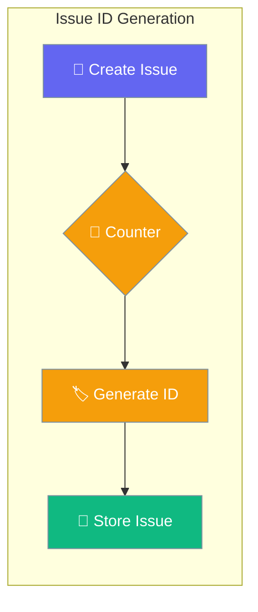
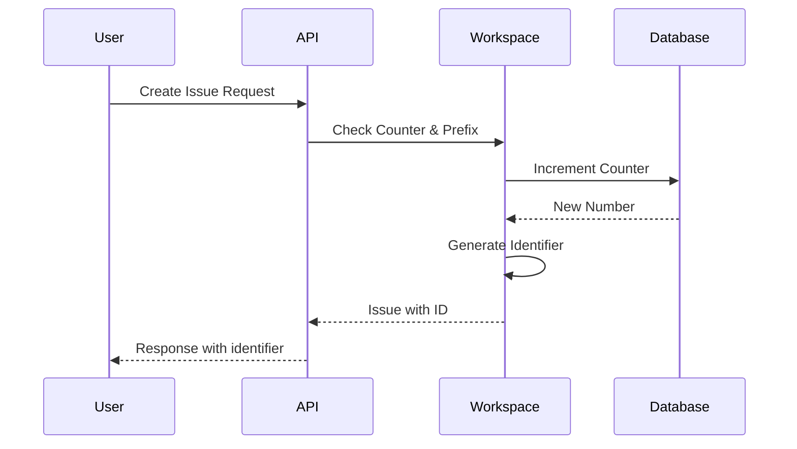
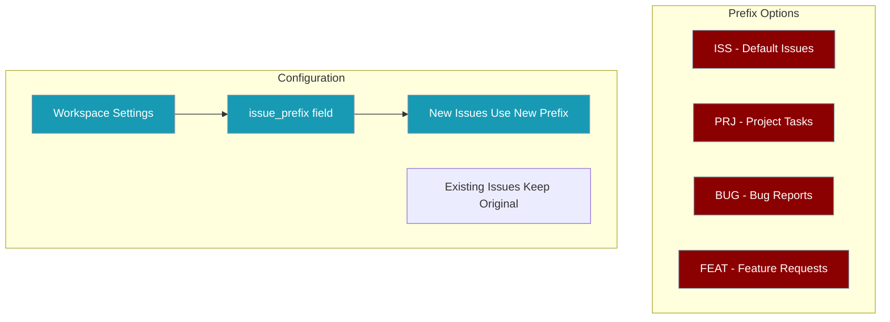

Issues are automatically assigned sequential identifiers like `ISS-1`, `ISS-2` within each workspace for easy reference and tracking.



## Quick Start

<Steps>
<Step title="Create First Issue">
Create an issue and receive automatic ID assignment:

```bash
TOKEN="your-jwt-token"
WS_ID="workspace-id"

curl -X POST http://localhost:8000/api/v1/workspaces/$WS_ID/issues/ \
  -H "Authorization: Bearer $TOKEN" \
  -H "Content-Type: application/json" \
  -d '{"title":"First issue"}' \
  --max-time 10

# Response: {"number": 1, "identifier": "ISS-1", "title": "First issue", ...}
```
</Step>

<Step title="Create Additional Issues">
Subsequent issues get sequential numbers automatically:

```python
import asyncio
from praisonai_platform.client import PlatformClient

async def main():
    client = PlatformClient("http://localhost:8000", token="your-token")
    ws_id = "your-workspace-id"

    issue1 = await client.create_issue(ws_id, "First task")
    print(issue1["identifier"])  # "ISS-1"

    issue2 = await client.create_issue(ws_id, "Second task") 
    print(issue2["identifier"])  # "ISS-2"

    issue3 = await client.create_issue(ws_id, "Third task")
    print(issue3["identifier"])  # "ISS-3"

asyncio.run(main())
```
</Step>
</Steps>

---

## How It Works



| Component | Purpose | Example |
|-----------|---------|---------|
| **Counter** | Tracks next available number | `3` (next issue will be #3) |
| **Prefix** | Customizable identifier prefix | `"ISS"`, `"PRJ"`, `"BUG"` |
| **Number** | Sequential workspace-scoped number | `1`, `2`, `3` |
| **Identifier** | Human-readable combined ID | `ISS-1`, `PRJ-2`, `BUG-3` |

---

## Response Fields

Every issue response includes these auto-generated fields:

```json
{
  "id": "issue-abc123",
  "number": 3,
  "identifier": "ISS-3", 
  "title": "Third issue in workspace",
  "description": "Issue description",
  "status": "open",
  "created_at": "2026-04-14T06:22:51Z",
  "workspace_id": "workspace-xyz"
}
```

| Field | Type | Description |
|-------|------|-------------|
| `number` | `integer` | Sequential number within workspace |
| `identifier` | `string` | Human-readable ID (`{prefix}-{number}`) |
| `id` | `string` | Unique database identifier |

---

## Common Patterns

### Basic Issue Creation

```bash
# Create issue with curl
curl -X POST http://localhost:8000/api/v1/workspaces/$WS_ID/issues/ \
  -H "Authorization: Bearer $TOKEN" \
  -H "Content-Type: application/json" \
  -d '{"title": "Bug in login flow", "description": "Users cannot log in"}'
```

### Python SDK Integration

```python
from praisonai_platform.client import PlatformClient

async def create_issues():
    client = PlatformClient("http://localhost:8000", token="your-token")
    
    # Issues get auto-numbered sequentially
    bug = await client.create_issue("ws-123", "Fix login bug")
    print(f"Created: {bug['identifier']}")  # "ISS-1"
    
    feature = await client.create_issue("ws-123", "Add dark mode")  
    print(f"Created: {feature['identifier']}")  # "ISS-2"
```

### Batch Issue Creation

```python
async def bulk_create():
    client = PlatformClient("http://localhost:8000", token="your-token")
    
    tasks = [
        "Setup development environment",
        "Create user authentication",
        "Implement dashboard",
        "Add notification system"
    ]
    
    for i, task in enumerate(tasks):
        issue = await client.create_issue("ws-123", task)
        print(f"{i+1}. {issue['identifier']}: {task}")
    
    # Output:
    # 1. ISS-1: Setup development environment  
    # 2. ISS-2: Create user authentication
    # 3. ISS-3: Implement dashboard
    # 4. ISS-4: Add notification system
```

---

## Customizing the Prefix



The workspace `issue_prefix` can be customized per workspace. After changing the prefix, new issues use the new prefix while existing issues retain their original identifiers.

```python
# Example: Change prefix to "PRJ" 
# New issues will be: PRJ-4, PRJ-5, etc.
# Existing issues remain: ISS-1, ISS-2, ISS-3
```

---

## Best Practices

<AccordionGroup>
<Accordion title="Choose Meaningful Prefixes">
Use prefixes that clearly identify the workspace or project type:
- `ISS` - General issues
- `BUG` - Bug tracking workspace  
- `FEAT` - Feature request workspace
- `PRJ` - Project management workspace
</Accordion>

<Accordion title="Workspace-Scoped Numbering">
Numbers are unique per workspace, not globally:
- Workspace A: `ISS-1`, `ISS-2`, `ISS-3`
- Workspace B: `ISS-1`, `ISS-2`, `ISS-3` (separate counter)
</Accordion>

<Accordion title="Immutable Identifiers">
Once assigned, issue numbers and identifiers never change:
- Safe to reference in documentation
- Stable for external integrations
- Guaranteed uniqueness within workspace
</Accordion>

<Accordion title="Testing Considerations">
Use test workspaces for development to avoid polluting production counters:
```python
# Use separate workspace for testing
test_ws = "test-workspace-123"
issue = await client.create_issue(test_ws, "Test issue")
```
</Accordion>
</AccordionGroup>

---

## Testing

Run the platform issue numbering tests:

```bash
# Test issue numbering mechanism
pytest tests/test_new_gaps.py::TestIssueNumbering -v

# Test API integration
pytest tests/test_new_api_integration.py::TestIssueNumberingAPI -v
```

---

## Related

<CardGroup cols={2}>
<Card title="Platform API" icon="globe" href="/docs/features/platform/api">
  Complete platform API reference
</Card>
<Card title="Workspace Management" icon="building" href="/docs/features/platform/workspaces">
  Managing workspaces and settings
</Card>
</CardGroup>