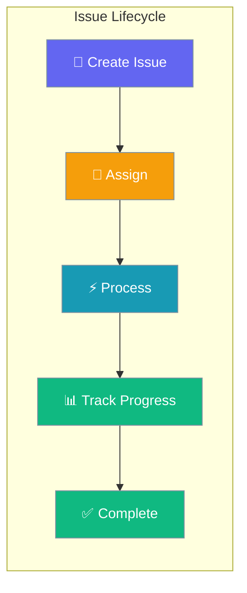
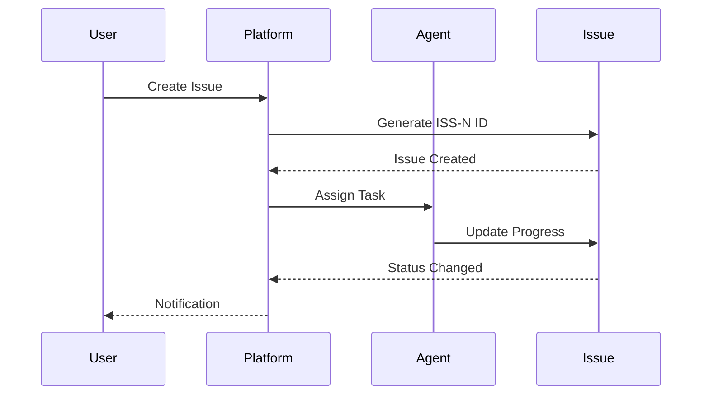
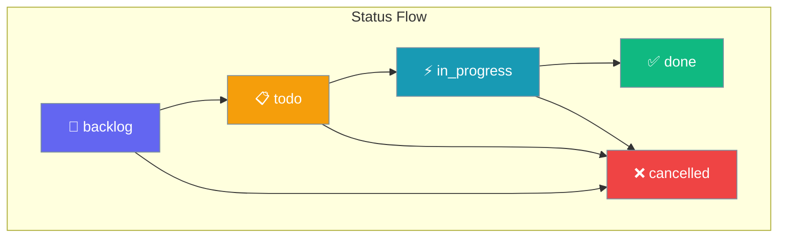
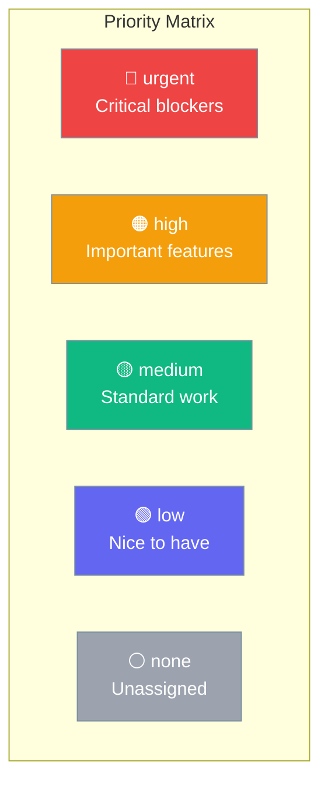
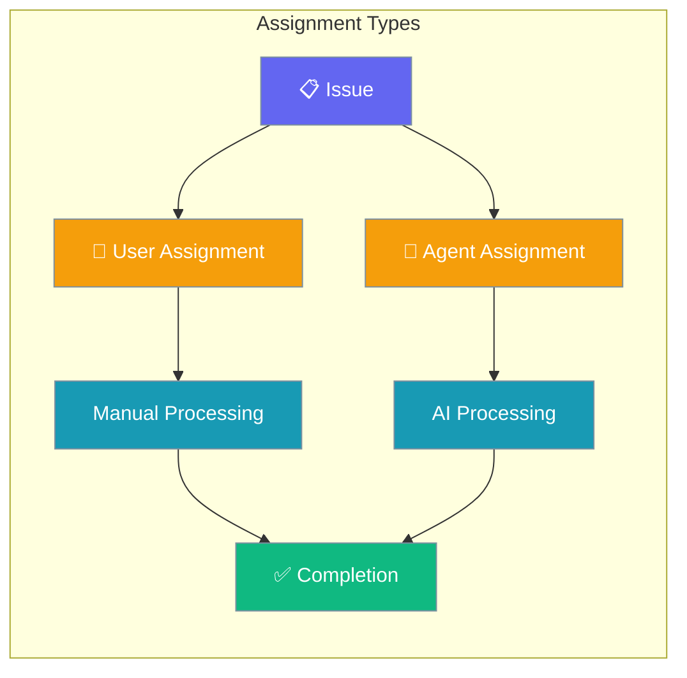
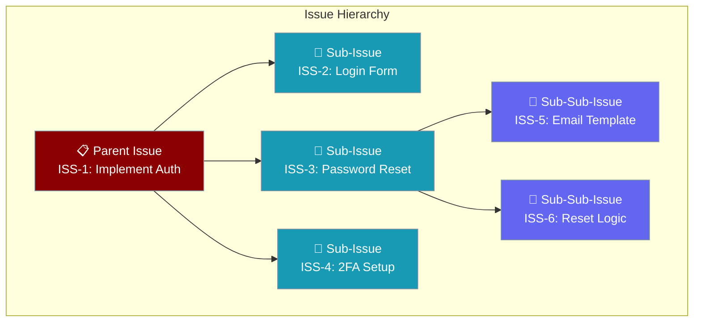

Issues are the core work items in the PraisonAI Platform, supporting comprehensive project management with status workflows, priority levels, agent assignment, and hierarchical organization.



## Quick Start

<Steps>
<Step title="Create an Issue">
```python
import asyncio
from praisonai_platform.client import PlatformClient

async def main():
    client = PlatformClient("http://localhost:8000", token="your-jwt-token")
    ws_id = "your-workspace-id"

    # Create a simple issue
    issue = await client.create_issue(
        ws_id, 
        title="Fix login bug",
        description="Users cannot login with SSO",
        priority="high",
        status="todo"
    )
    print(f"Created issue: {issue['identifier']}")  # "ISS-1"

asyncio.run(main())
```
</Step>

<Step title="Assign to Agent">
```python
# Assign issue to an AI agent
updated = await client.update_issue(
    ws_id, 
    issue["id"],
    assignee_type="agent",
    assignee_id="agent-abc123",
    status="in_progress"
)
print(f"Issue {updated['identifier']} assigned to agent")
```
</Step>
</Steps>

---

## How It Works



Issues follow a structured workflow with automatic ID generation, status tracking, and assignment capabilities to both human users and AI agents.

---

## CRUD Operations

### Create Issue

Create issues with comprehensive metadata and automatic ID generation.

<Tabs>
<Tab title="Python SDK">
```python
import asyncio
from praisonai_platform.client import PlatformClient

async def create_issue():
    client = PlatformClient("http://localhost:8000", token="your-jwt-token")
    
    issue = await client.create_issue(
        workspace_id="ws-abc123",
        title="Fix login bug",
        description="Users cannot login with SSO",
        project_id="proj-abc123",
        status="todo",
        priority="high",
        assignee_type="agent",
        assignee_id="agent-abc123",
        acceptance_criteria=["SSO login works", "Tests pass"]
    )
    return issue

# Returns: {"id": "issue-abc123", "identifier": "ISS-1", ...}
```
</Tab>

<Tab title="curl">
```bash
TOKEN="your-jwt-token"
WS_ID="workspace-id"

curl -s -X POST http://localhost:8000/api/v1/workspaces/$WS_ID/issues/ \
  -H "Authorization: Bearer $TOKEN" \
  -H "Content-Type: application/json" \
  -d '{
    "title": "Fix login bug",
    "description": "Users cannot login with SSO",
    "project_id": "proj-abc123",
    "status": "todo", 
    "priority": "high",
    "assignee_type": "agent",
    "assignee_id": "agent-abc123",
    "acceptance_criteria": ["SSO login works", "Tests pass"]
  }' \
  --max-time 10
```
</Tab>
</Tabs>

### List Issues

Retrieve issues with filtering and pagination support.

<Tabs>
<Tab title="Python SDK">
```python
# List all issues
issues = await client.list_issues(ws_id)

# Filter by status
todo_issues = await client.list_issues(ws_id, status="todo")

# Filter by assignee
agent_issues = await client.list_issues(ws_id, assignee_id="agent-abc123")

# Pagination
page_1 = await client.list_issues(ws_id, limit=10, offset=0)
```
</Tab>

<Tab title="curl">
```bash
# List with filters
curl -s "http://localhost:8000/api/v1/workspaces/$WS_ID/issues/?status=todo&limit=10" \
  -H "Authorization: Bearer $TOKEN" \
  --max-time 10

# Filter by project
curl -s "http://localhost:8000/api/v1/workspaces/$WS_ID/issues/?project_id=proj-123" \
  -H "Authorization: Bearer $TOKEN" \
  --max-time 10
```
</Tab>
</Tabs>

### Update Issue

Modify issue properties including status transitions and reassignment.

<Tabs>
<Tab title="Python SDK">
```python
# Update status and assignee
updated = await client.update_issue(
    ws_id, 
    issue_id,
    status="in_progress",
    assignee_type="user",
    assignee_id="user-abc123"
)

# Change priority
await client.update_issue(ws_id, issue_id, priority="urgent")
```
</Tab>

<Tab title="curl">
```bash
# Update issue status and assignment
curl -s -X PATCH http://localhost:8000/api/v1/workspaces/$WS_ID/issues/ISSUE_ID \
  -H "Authorization: Bearer $TOKEN" \
  -H "Content-Type: application/json" \
  -d '{
    "status": "in_progress",
    "assignee_type": "agent",
    "assignee_id": "agent-new-123"
  }' \
  --max-time 10
```
</Tab>
</Tabs>

### Delete Issue

Remove issues when no longer needed.

<Tabs>
<Tab title="Python SDK">
```python
# Delete issue
await client.delete_issue(ws_id, issue_id)
```
</Tab>

<Tab title="curl">
```bash
curl -s -X DELETE http://localhost:8000/api/v1/workspaces/$WS_ID/issues/ISSUE_ID \
  -H "Authorization: Bearer $TOKEN" \
  --max-time 10
```
</Tab>
</Tabs>

---

## Status Workflow

Issues follow a defined status workflow for clear progress tracking.



| Status | Description | Transitions To |
|--------|-------------|----------------|
| `backlog` | Initial state, not yet planned | `todo`, `cancelled` |
| `todo` | Ready to work on | `in_progress`, `cancelled` |
| `in_progress` | Currently being worked on | `done`, `cancelled` |
| `done` | Completed successfully | None |
| `cancelled` | Work stopped or not needed | None |

---

## Priority Levels

Issues support five priority levels for effective triage and resource allocation.



| Priority | Use Case | Example |
|----------|----------|---------|
| `urgent` | Critical system failures, security issues | Production down, data breach |
| `high` | Important features, significant bugs | Core feature broken, API errors |
| `medium` | Standard development work | New features, improvements |
| `low` | Minor fixes, enhancements | UI polish, documentation |
| `none` | Unassigned priority | Initial triage needed |

---

## Agent Assignment

Issues can be assigned to both human users and AI agents for automated processing.



### Assign to Agent

```python
# Assign to AI agent
issue = await client.update_issue(
    ws_id, 
    issue_id,
    assignee_type="agent",
    assignee_id="coding-agent-123",
    status="in_progress"
)

# Agent receives the issue and can process it automatically
```

### Assign to User

```python
# Assign to human user
issue = await client.update_issue(
    ws_id,
    issue_id, 
    assignee_type="user",
    assignee_id="user-dev-123"
)
```

---

## Sub-Issues

Create hierarchical issue structures for better organization and breakdown of complex work.



### Create Sub-Issue

```python
# Create parent issue
parent = await client.create_issue(
    ws_id,
    title="Implement Authentication System",
    status="todo",
    priority="high"
)

# Create sub-issue
sub_issue = await client.create_issue(
    ws_id,
    title="Design login form",
    parent_issue_id=parent["id"],  # Link to parent
    status="todo",
    priority="medium"
)

print(f"Parent: {parent['identifier']}")    # "ISS-1"
print(f"Sub-issue: {sub_issue['identifier']}")  # "ISS-2"
```

---

## API Reference

### Endpoints

| Method | Endpoint | Description |
|--------|----------|-------------|
| `POST` | `/api/v1/workspaces/{ws_id}/issues/` | Create new issue |
| `GET` | `/api/v1/workspaces/{ws_id}/issues/` | List issues with filters |
| `GET` | `/api/v1/workspaces/{ws_id}/issues/{issue_id}` | Get specific issue |
| `PATCH` | `/api/v1/workspaces/{ws_id}/issues/{issue_id}` | Update issue |
| `DELETE` | `/api/v1/workspaces/{ws_id}/issues/{issue_id}` | Delete issue |

### Request Schema

```json
{
  "title": "string (required)",
  "description": "string (optional)",
  "project_id": "string (optional)",
  "status": "backlog|todo|in_progress|done|cancelled (default: todo)",
  "priority": "none|low|medium|high|urgent (default: none)",
  "assignee_type": "user|agent (optional)",
  "assignee_id": "string (optional)",
  "parent_issue_id": "string (optional)",
  "acceptance_criteria": ["string"] (optional)
}
```

### Response Schema

```json
{
  "id": "string",
  "workspace_id": "string", 
  "project_id": "string",
  "title": "string",
  "description": "string",
  "status": "string",
  "priority": "string",
  "assignee_type": "string",
  "assignee_id": "string", 
  "creator_type": "string",
  "creator_id": "string",
  "number": "integer",
  "identifier": "string",
  "parent_issue_id": "string",
  "created_at": "string (ISO 8601)",
  "updated_at": "string (ISO 8601)"
}
```

### Query Parameters

| Parameter | Type | Description |
|-----------|------|-------------|
| `status` | string | Filter by status |
| `project_id` | string | Filter by project |
| `assignee_id` | string | Filter by assignee |
| `priority` | string | Filter by priority |
| `limit` | integer | Max results (1-200, default 50) |
| `offset` | integer | Skip N results (default 0) |

---

## Common Patterns

### Automated Agent Workflows

```python
async def automate_code_issues():
    """Assign coding issues to AI agents automatically"""
    
    # Get all unassigned coding issues
    issues = await client.list_issues(
        ws_id,
        status="todo",
        project_id="coding-project"
    )
    
    coding_agent = "ai-coder-123"
    
    for issue in issues:
        if not issue.get("assignee_id"):
            # Auto-assign to coding agent
            await client.update_issue(
                ws_id,
                issue["id"],
                assignee_type="agent", 
                assignee_id=coding_agent,
                status="in_progress"
            )
            
            print(f"Auto-assigned {issue['identifier']} to coding agent")
```

### Issue Templates

```python
async def create_bug_report(title, description, severity="medium"):
    """Create standardized bug report"""
    
    priority_map = {
        "critical": "urgent",
        "major": "high", 
        "minor": "medium",
        "trivial": "low"
    }
    
    issue = await client.create_issue(
        ws_id,
        title=f"[BUG] {title}",
        description=f"## Bug Description\n{description}\n\n## Steps to Reproduce\n1. \n\n## Expected Behavior\n\n## Actual Behavior\n",
        priority=priority_map.get(severity, "medium"),
        status="todo",
        acceptance_criteria=[
            "Bug is reproduced",
            "Root cause identified", 
            "Fix is implemented",
            "Tests added to prevent regression"
        ]
    )
    
    return issue
```

### Progress Tracking

```python
async def track_project_progress(project_id):
    """Track completion progress for a project"""
    
    issues = await client.list_issues(ws_id, project_id=project_id)
    
    status_counts = {}
    for issue in issues:
        status = issue["status"]
        status_counts[status] = status_counts.get(status, 0) + 1
    
    total = len(issues)
    completed = status_counts.get("done", 0)
    progress = (completed / total) * 100 if total > 0 else 0
    
    print(f"Project Progress: {progress:.1f}% ({completed}/{total})")
    return {
        "progress_percent": progress,
        "total_issues": total,
        "completed": completed,
        "status_breakdown": status_counts
    }
```

---

## Best Practices

<AccordionGroup>
<Accordion title="Use Descriptive Titles">
Write clear, actionable titles that describe what needs to be done.

**Good**: `"Fix user login timeout on mobile devices"`  
**Bad**: `"Login broken"`

Include context like the component, action, and scope when helpful.
</Accordion>

<Accordion title="Set Appropriate Priorities">
Use priority levels consistently across your team:

- **urgent**: Production issues, security vulnerabilities
- **high**: Core features, important bugs affecting many users  
- **medium**: Standard development work, feature requests
- **low**: Minor improvements, documentation updates
- **none**: Use for initial triage before prioritization
</Accordion>

<Accordion title="Leverage Agent Assignment">
Assign routine tasks to AI agents to free up human time:

- Code reviews and analysis
- Documentation updates
- Test case generation
- Bug reproduction and initial investigation

Keep complex decision-making and creative work for humans.
</Accordion>

<Accordion title="Structure with Sub-Issues">
Break down large issues into manageable sub-issues:

- Create parent issues for epics or major features
- Use sub-issues for individual tasks or components
- Keep sub-issues focused on single deliverables
- Track progress through the parent issue hierarchy
</Accordion>
</AccordionGroup>

---

## Testing

Run the test suite to verify issue tracking functionality:

```bash
# Test issue service
pytest tests/test_services.py::TestIssueService -v

# Test issue numbering
pytest tests/test_new_gaps.py::TestIssueNumbering -v

# Test API integration  
pytest tests/test_new_api_integration.py::TestIssueNumberingAPI -v
```

---

## Related

<CardGroup cols={2}>
<Card title="Project Management" icon="folder" href="/docs/features/platform/projects">
  Organize issues within projects
</Card>

<Card title="Agent Workflows" icon="robot" href="/docs/features/autonomous-workflow">
  Automate issue processing with AI agents
</Card>
</CardGroup>