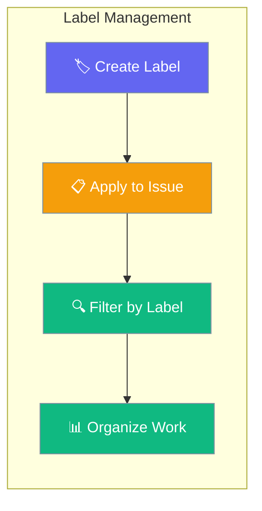
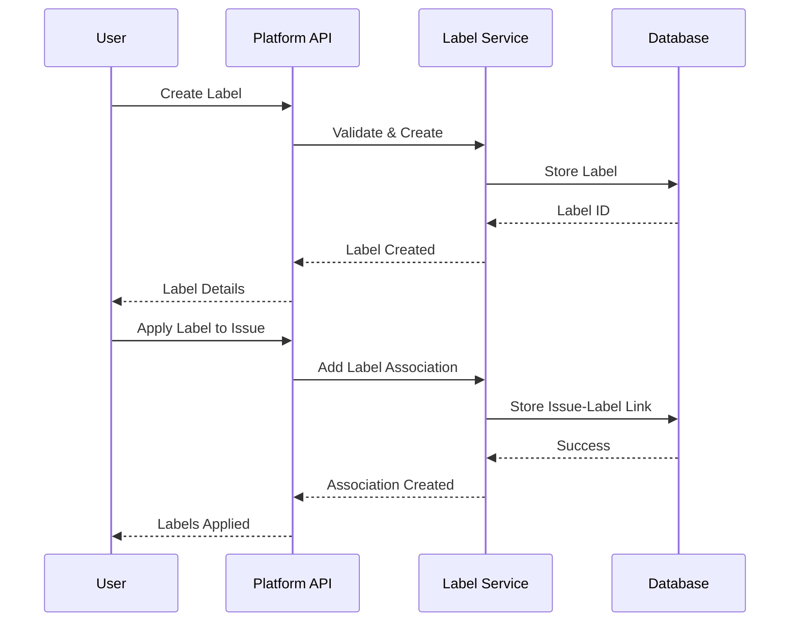

Labels provide a flexible tagging system for organizing issues by categories, priorities, teams, or any custom classification system.



## Quick Start

<Steps>
<Step title="Create Labels">
```python
import asyncio
from praisonai_platform.client import PlatformClient

async def create_labels():
    client = PlatformClient("http://localhost:8000", token="your-jwt-token")
    ws_id = "your-workspace-id"

    # Create category labels
    bug_label = await client.create_label(
        ws_id,
        name="bug",
        color="#dc2626",  # red
        description="Something isn't working"
    )
    
    feature_label = await client.create_label(
        ws_id,
        name="enhancement", 
        color="#059669",  # green
        description="New feature or request"
    )
    
    print(f"Created labels: {bug_label['name']}, {feature_label['name']}")

asyncio.run(create_labels())
```
</Step>

<Step title="Apply Labels to Issues">
```python
async def apply_labels():
    client = PlatformClient("http://localhost:8000", token="your-jwt-token")
    ws_id = "your-workspace-id"
    
    # Add multiple labels to an issue
    await client.add_issue_labels(
        ws_id,
        issue_id="issue-123",
        labels=["bug", "priority-high", "backend"]
    )
    
    # Remove labels from issue
    await client.remove_issue_labels(
        ws_id,
        issue_id="issue-123", 
        labels=["priority-high"]
    )
    
    print("Labels updated successfully")

asyncio.run(apply_labels())
```
</Step>
</Steps>

---

## How It Works



| Component | Purpose | Features |
|-----------|---------|----------|
| **Label** | Categorization tag | Name, color, description |
| **Association** | Issue-label relationship | Many-to-many mapping |
| **Color Coding** | Visual organization | Hex color values |
| **Filtering** | Issue discovery | Query by label combinations |

---

## API Reference

### Label Management Endpoints

| Method | Endpoint | Purpose | Authentication |
|--------|----------|---------|----------------|
| `POST` | `/api/v1/workspaces/{ws_id}/labels` | Create label | Bearer Token |
| `GET` | `/api/v1/workspaces/{ws_id}/labels` | List labels | Bearer Token |
| `PUT` | `/api/v1/workspaces/{ws_id}/labels/{label_id}` | Update label | Bearer Token |
| `DELETE` | `/api/v1/workspaces/{ws_id}/labels/{label_id}` | Delete label | Bearer Token |

### Issue Label Operations

| Method | Endpoint | Purpose | Authentication |
|--------|----------|---------|----------------|
| `POST` | `/api/v1/workspaces/{ws_id}/issues/{issue_id}/labels` | Add labels to issue | Bearer Token |
| `DELETE` | `/api/v1/workspaces/{ws_id}/issues/{issue_id}/labels/{label_name}` | Remove label from issue | Bearer Token |
| `GET` | `/api/v1/workspaces/{ws_id}/issues?labels=tag1,tag2` | Filter issues by labels | Bearer Token |

---

## Common Patterns

<AccordionGroup>
<Accordion title="Label Hierarchy System">
Create hierarchical labels using naming conventions:

```python
async def create_label_hierarchy():
    client = PlatformClient("http://localhost:8000", token="your-jwt-token")
    ws_id = "your-workspace-id"
    
    # Priority hierarchy
    await client.create_label(ws_id, "priority:critical", "#dc2626", "Critical priority")
    await client.create_label(ws_id, "priority:high", "#f97316", "High priority")
    await client.create_label(ws_id, "priority:medium", "#eab308", "Medium priority")
    await client.create_label(ws_id, "priority:low", "#22c55e", "Low priority")
    
    # Team hierarchy
    await client.create_label(ws_id, "team:backend", "#3b82f6", "Backend team")
    await client.create_label(ws_id, "team:frontend", "#8b5cf6", "Frontend team")
    await client.create_label(ws_id, "team:devops", "#06b6d4", "DevOps team")
    
    # Status hierarchy
    await client.create_label(ws_id, "status:blocked", "#ef4444", "Blocked issue")
    await client.create_label(ws_id, "status:ready", "#10b981", "Ready for work")
```
</Accordion>

<Accordion title="Bulk Label Management">
Efficiently manage labels in bulk operations:

```python
async def bulk_label_operations():
    client = PlatformClient("http://localhost:8000", token="your-jwt-token")
    ws_id = "your-workspace-id"
    
    # Bulk create labels
    label_definitions = [
        {"name": "documentation", "color": "#6366f1", "description": "Documentation updates"},
        {"name": "testing", "color": "#8b5cf6", "description": "Testing related work"},
        {"name": "performance", "color": "#f59e0b", "description": "Performance improvements"},
        {"name": "security", "color": "#ef4444", "description": "Security issues"}
    ]
    
    created_labels = []
    for label_def in label_definitions:
        label = await client.create_label(ws_id, **label_def)
        created_labels.append(label)
    
    print(f"Created {len(created_labels)} labels")
    
    # Bulk apply labels to multiple issues
    issue_ids = ["issue-1", "issue-2", "issue-3"]
    common_labels = ["documentation", "testing"]
    
    for issue_id in issue_ids:
        await client.add_issue_labels(ws_id, issue_id, common_labels)
```
</Accordion>

<Accordion title="Dynamic Label Filtering">
Build dynamic filtering interfaces using labels:

```python
async def dynamic_label_filtering():
    client = PlatformClient("http://localhost:8000", token="your-jwt-token")
    ws_id = "your-workspace-id"
    
    # Get all available labels
    all_labels = await client.list_labels(ws_id)
    
    # Filter by multiple labels (AND operation)
    backend_bugs = await client.list_issues(
        ws_id,
        labels=["team:backend", "bug"]
    )
    
    # Filter by label groups (OR within group, AND between groups)
    critical_or_high = await client.list_issues(
        ws_id,
        labels=["priority:critical,priority:high", "team:backend"]
    )
    
    # Exclude certain labels (NOT operation)
    non_blocked_issues = await client.list_issues(
        ws_id,
        exclude_labels=["status:blocked"]
    )
    
    print(f"Backend bugs: {len(backend_bugs)}")
    print(f"High priority backend: {len(critical_or_high)}")
    print(f"Non-blocked issues: {len(non_blocked_issues)}")
```
</Accordion>
</AccordionGroup>

---

## Best Practices

<AccordionGroup>
<Accordion title="Label Naming Conventions">
- **Consistent naming**: Use lowercase, hyphen-separated names (e.g., "priority-high", "team-backend")
- **Descriptive names**: Choose clear, searchable names that indicate purpose
- **Namespace prefixes**: Use prefixes for categories (e.g., "type:", "team:", "priority:")
- **Avoid redundancy**: Don't create similar labels with different names
</Accordion>

<Accordion title="Color Strategy">
- **Semantic colors**: Use colors that match label meaning (red for critical, green for good)
- **Accessibility**: Ensure sufficient contrast for all users
- **Consistency**: Use the same color for related labels across projects
- **Limited palette**: Stick to 8-12 core colors to avoid visual confusion
</Accordion>

<Accordion title="Label Lifecycle">
- **Regular cleanup**: Remove unused labels to keep the system organized
- **Deprecation process**: Mark old labels as deprecated before removing
- **Migration strategy**: Plan label renames and merges carefully
- **Documentation**: Maintain guidelines for label usage in your team
</Accordion>

<Accordion title="Performance Optimization">
- **Index frequently used labels**: Ensure database indexes on common label queries
- **Limit labels per issue**: Keep to 3-5 labels per issue for usability
- **Batch operations**: Use bulk API calls when modifying multiple labels
- **Cache label lists**: Cache workspace labels to reduce API calls
</Accordion>
</AccordionGroup>

---

## Related

<CardGroup cols={2}>
<Card title="Issue Tracking" icon="list-check" href="/docs/features/platform/issues">
  Comprehensive issue management system
</Card>

<Card title="Project Management" icon="folder" href="/docs/features/platform/projects">
  Organize work with projects and workflows
</Card>
</CardGroup>