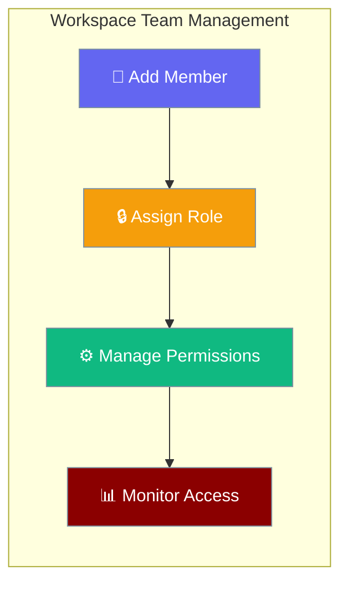
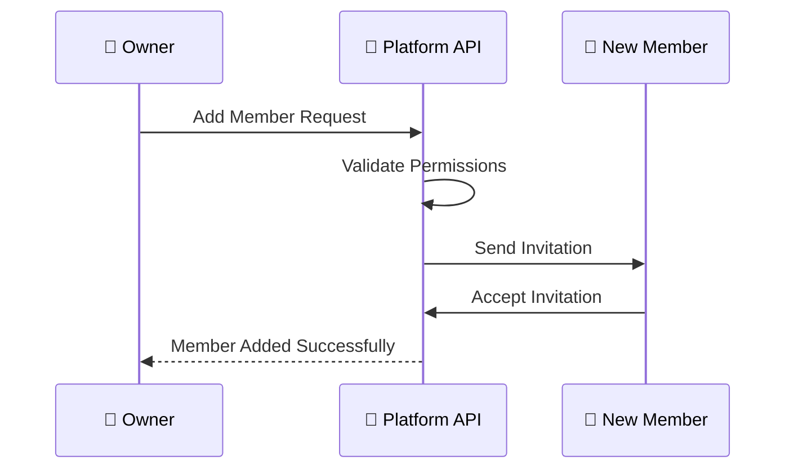
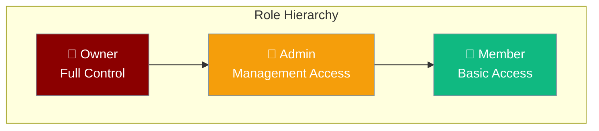

Team members and role-based access control (RBAC) enables workspace collaboration with granular permission management.

Team members and role-based access control (RBAC) enables workspace collaboration with granular permission management.

```python
from praisonaiagents import Agent

agent = Agent(name="admin-assistant", instructions="Manage workspace membership and roles.")
agent.start("Invite Alex as editor on this workspace.")
```

The user invites teammates; RBAC roles control who can read or change workspace resources.



## Quick Start

<Steps>
<Step title="Add a Member">
```bash
# Add a member with basic member role
curl -X POST http://localhost:8000/api/v1/workspaces/{workspace_id}/members \
  -H "Authorization: Bearer $TOKEN" \
  -H "Content-Type: application/json" \
  -d '{"user_id":"user-abc123","role":"member"}'
```
</Step>

<Step title="Update Member Role">
```bash
# Promote member to admin
curl -X PATCH http://localhost:8000/api/v1/workspaces/{workspace_id}/members/{user_id} \
  -H "Authorization: Bearer $TOKEN" \
  -H "Content-Type: application/json" \
  -d '{"role":"admin"}'
```
</Step>

<Step title="List All Members">
```bash
# View all workspace members
curl http://localhost:8000/api/v1/workspaces/{workspace_id}/members \
  -H "Authorization: Bearer $TOKEN"
```
</Step>
</Steps>

---

## How It Works



| Role | Add Members | Manage Settings | Create Issues | Remove Members |
|------|-------------|----------------|---------------|----------------|
| **Owner** | ✅ | ✅ | ✅ | ✅ |
| **Admin** | ✅ | ✅ | ✅ | ✅ |
| **Member** | ❌ | ❌ | ✅ | ❌ |

---

## API Endpoints

### Add Member

Add a new member to the workspace with a specific role.

**Requires owner role:** assigning `role: "admin"` or `role: "owner"` now returns `403 Forbidden` for non-owners with detail `"Only owners can add admin or owner roles"`. Member-to-member role additions still work for admins.

<CodeGroup>
```bash cURL
curl -X POST http://localhost:8000/api/v1/workspaces/{workspace_id}/members \
  -H "Authorization: Bearer $TOKEN" \
  -H "Content-Type: application/json" \
  -d '{
    "user_id": "user-abc123",
    "role": "member"
  }'
```

```python Python SDK
import asyncio
from praisonai_platform.client import PlatformClient

async def add_member():
    client = PlatformClient("http://localhost:8000", token="your-jwt-token")
    
    member = await client.add_member(
        workspace_id="ws-abc123",
        user_id="user-abc123",
        role="member"
    )
    print(f"Added member: {member['user_id']} as {member['role']}")

asyncio.run(add_member())
```
</CodeGroup>

### List Members

Retrieve all members in the workspace.

<CodeGroup>
```bash cURL
curl http://localhost:8000/api/v1/workspaces/{workspace_id}/members \
  -H "Authorization: Bearer $TOKEN"
```

```python Python SDK
import asyncio
from praisonai_platform.client import PlatformClient

async def list_members():
    client = PlatformClient("http://localhost:8000", token="your-jwt-token")
    
    members = await client.list_members("ws-abc123")
    for member in members:
        print(f"{member['user_id']}: {member['role']}")

asyncio.run(list_members())
```
</CodeGroup>

### Update Member Role

Change a member's role within the workspace.

**Requires owner role:** assigning `role: "admin"` or `role: "owner"` now returns `403 Forbidden` for non-owners with detail `"Only owners can assign admin or owner roles"`. Member-to-member role changes still work for admins.

<CodeGroup>
```bash cURL
curl -X PATCH http://localhost:8000/api/v1/workspaces/{workspace_id}/members/{user_id} \
  -H "Authorization: Bearer $TOKEN" \
  -H "Content-Type: application/json" \
  -d '{
    "role": "admin"
  }'
```

```python Python SDK
import asyncio
from praisonai_platform.client import PlatformClient

async def update_role():
    client = PlatformClient("http://localhost:8000", token="your-jwt-token")
    
    member = await client.update_member_role(
        workspace_id="ws-abc123",
        user_id="user-abc123",
        role="admin"
    )
    print(f"Updated {member['user_id']} to {member['role']}")

asyncio.run(update_role())
```
</CodeGroup>

### Remove Member

Remove a member from the workspace.

<CodeGroup>
```bash cURL
curl -X DELETE http://localhost:8000/api/v1/workspaces/{workspace_id}/members/{user_id} \
  -H "Authorization: Bearer $TOKEN"
```

```python Python SDK
import asyncio
from praisonai_platform.client import PlatformClient

async def remove_member():
    client = PlatformClient("http://localhost:8000", token="your-jwt-token")
    
    await client.remove_member(
        workspace_id="ws-abc123",
        user_id="user-abc123"
    )
    print("Member removed successfully")

asyncio.run(remove_member())
```
</CodeGroup>

---

## Role Hierarchy



### Role Capabilities

| Capability | Owner | Admin | Member |
|------------|-------|-------|--------|
| **Member Management** | | | |
| Add members | ✅ | ✅ | ❌ |
| Remove members | ✅ | ✅ | ❌ |
| Update member→member roles | ✅ | ✅ | ❌ |
| Assign admin or owner role | ✅ | ❌ | ❌ |
| **Workspace Settings** | | | |
| Modify workspace settings | ✅ | ✅ | ❌ |
| Delete workspace | ✅ | ❌ | ❌ |
| **Content Management** | | | |
| Create issues/tasks | ✅ | ✅ | ✅ |
| Edit own content | ✅ | ✅ | ✅ |
| Edit others' content | ✅ | ✅ | ❌ |

---

## Schema Reference

### Add Member Request

| Field | Type | Required | Description |
|-------|------|----------|-------------|
| `user_id` | `string` | ✅ | Unique identifier for the user |
| `role` | `string` | ✅ | Role to assign: `owner`, `admin`, or `member` |

```json
{
  "user_id": "user-abc123",
  "role": "member"
}
```

### Update Role Request

| Field | Type | Required | Description |
|-------|------|----------|-------------|
| `role` | `string` | ✅ | New role: `owner`, `admin`, or `member` |

```json
{
  "role": "admin"
}
```

### Member Response

| Field | Type | Description |
|-------|------|-------------|
| `id` | `string` | Unique member ID |
| `workspace_id` | `string` | Workspace identifier |
| `user_id` | `string` | User identifier |
| `role` | `string` | Current role |
| `created_at` | `string` | ISO 8601 timestamp |

```json
{
  "id": "mem-abc123",
  "workspace_id": "ws-abc123",
  "user_id": "user-abc123",
  "role": "admin",
  "created_at": "2025-01-01T00:00:00"
}
```

---

## Best Practices

<AccordionGroup>
<Accordion title="Principle of Least Privilege">
Always assign the minimum role required for a user's responsibilities. Start with `member` role and promote only when necessary for their workspace functions.
</Accordion>

<Accordion title="Regular Role Audits">
Periodically review member roles and permissions. Remove inactive members and adjust roles based on changing responsibilities within the workspace.
</Accordion>

<Accordion title="Owner Role Management">
Limit the number of owners in a workspace. Only owners can promote members to admin or owner roles - this restriction was tightened in security batch 3 to prevent privilege escalation by admin users.
</Accordion>

<Accordion title="Secure Token Management">
Always use secure JWT tokens for API authentication. Store tokens securely and rotate them regularly to maintain workspace security.

See [Authentication Configuration](/docs/features/platform/auth-configuration) for JWT secret setup and security requirements.
</Accordion>
</AccordionGroup>

---

## Testing

Run the member management tests to verify functionality:

```bash
pytest tests/test_services.py::TestMemberService -v
```

Expected test coverage includes:
- Adding members with different roles
- Role hierarchy validation
- Permission enforcement
- Member removal workflows

---

## Related

<CardGroup cols={2}>
<Card title="Workspace Management" icon="building" href="/docs/features/platform/workspaces">
  Learn about workspace creation and management
</Card>
<Card title="Authentication" icon="key" href="/docs/features/platform/authentication">
  Understand JWT token authentication
</Card>
</CardGroup>