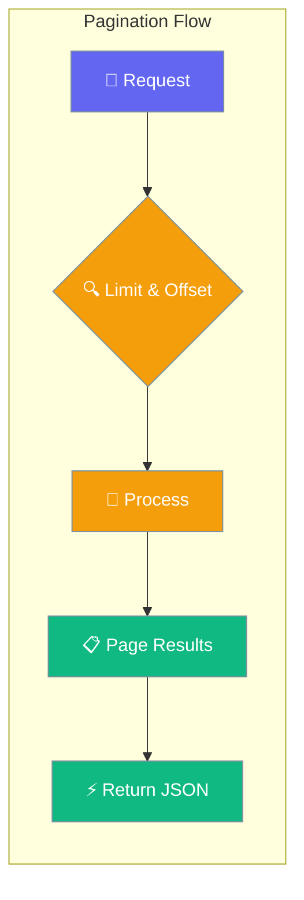
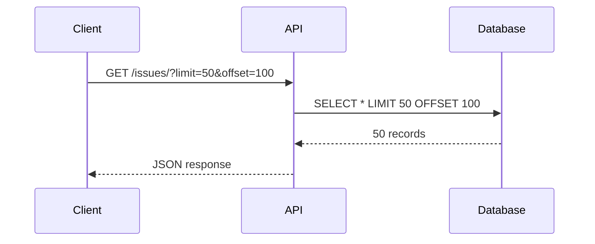

Platform pagination enables efficient retrieval of large datasets through standardized `limit` and `offset` query parameters across all list endpoints.



## Quick Start

<Steps>
<Step title="Simple Page Request">
Get the first 10 items from any list endpoint:

```bash
TOKEN="your-jwt-token"
WS_ID="workspace-id"

curl -s "http://localhost:8000/api/v1/workspaces/$WS_ID/issues/?limit=10&offset=0" \
  -H "Authorization: Bearer $TOKEN"
```
</Step>

<Step title="Iterate Through Pages">
Use offset to get subsequent pages:

```bash
# First page (items 0-9)
curl -s "http://localhost:8000/api/v1/workspaces/$WS_ID/issues/?limit=10&offset=0"

# Second page (items 10-19)
curl -s "http://localhost:8000/api/v1/workspaces/$WS_ID/issues/?limit=10&offset=10"

# Third page (items 20-29)
curl -s "http://localhost:8000/api/v1/workspaces/$WS_ID/issues/?limit=10&offset=20"
```
</Step>
</Steps>

---

## How It Works



| Parameter | Type | Default | Range | Description |
|-----------|------|---------|-------|-------------|
| `limit` | int | 50 | 1–200 | Maximum items to return |
| `offset` | int | 0 | ≥ 0 | Number of items to skip |

---

## Paginated Endpoints

All platform list endpoints support pagination:

| Endpoint | Description | Default Limit | Max Limit |
|----------|-------------|---------------|-----------|
| `GET /api/v1/workspaces/` | List workspaces | 50 | 200 |
| `GET /api/v1/workspaces/{ws_id}/projects/` | List projects | 50 | 200 |
| `GET /api/v1/workspaces/{ws_id}/issues/` | List issues | 50 | 200 |
| `GET /api/v1/workspaces/{ws_id}/agents/` | List agents | 50 | 200 |
| `GET /api/v1/workspaces/{ws_id}/activity` | List activities | 50 | 200 |
| `GET /api/v1/workspaces/{ws_id}/issues/{id}/activity` | List issue activities | 50 | 200 |

---

## Common Patterns

<Tabs>
<Tab title="Python SDK">
```python
import asyncio
import httpx

async def fetch_all_issues(ws_id: str, token: str):
    """Fetch all issues using pagination."""
    base = "http://localhost:8000/api/v1"
    headers = {"Authorization": f"Bearer {token}"}
    all_issues = []
    offset = 0
    page_size = 50

    async with httpx.AsyncClient() as client:
        while True:
            resp = await client.get(
                f"{base}/workspaces/{ws_id}/issues/",
                params={"limit": page_size, "offset": offset},
                headers=headers
            )
            page = resp.json()
            if not page:
                break  # No more results
            all_issues.extend(page)
            if len(page) < page_size:
                break  # Last page
            offset += page_size

    return all_issues

async def main():
    issues = await fetch_all_issues("your-ws-id", "your-token")
    print(f"Total issues: {len(issues)}")

asyncio.run(main())
```
</Tab>

<Tab title="JavaScript">
```javascript
async function fetchAllIssues(wsId, token) {
    const base = "http://localhost:8000/api/v1";
    const headers = { Authorization: `Bearer ${token}` };
    const allIssues = [];
    let offset = 0;
    const pageSize = 50;

    while (true) {
        const response = await fetch(
            `${base}/workspaces/${wsId}/issues/?limit=${pageSize}&offset=${offset}`,
            { headers }
        );
        const page = await response.json();
        
        if (!page.length) break; // No more results
        
        allIssues.push(...page);
        if (page.length < pageSize) break; // Last page
        offset += pageSize;
    }

    return allIssues;
}

// Usage
const issues = await fetchAllIssues("your-ws-id", "your-token");
console.log(`Total issues: ${issues.length}`);
```
</Tab>

<Tab title="cURL Script">
```bash
#!/bin/bash
TOKEN="your-jwt-token"
WS_ID="workspace-id"
BASE_URL="http://localhost:8000/api/v1"

OFFSET=0
PAGE_SIZE=50
ALL_ISSUES=()

while true; do
    RESPONSE=$(curl -s "${BASE_URL}/workspaces/${WS_ID}/issues/?limit=${PAGE_SIZE}&offset=${OFFSET}" \
        -H "Authorization: Bearer ${TOKEN}")
    
    # Check if response is empty array
    if [[ "$RESPONSE" == "[]" ]]; then
        break
    fi
    
    # Count items in response
    ITEM_COUNT=$(echo "$RESPONSE" | jq '. | length')
    
    if [[ $ITEM_COUNT -eq 0 ]]; then
        break
    fi
    
    echo "Fetched $ITEM_COUNT items (offset: $OFFSET)"
    
    # Break if less than page size (last page)
    if [[ $ITEM_COUNT -lt $PAGE_SIZE ]]; then
        break
    fi
    
    OFFSET=$((OFFSET + PAGE_SIZE))
done

echo "Pagination complete"
```
</Tab>
</Tabs>

---

## Best Practices

<AccordionGroup>
<Accordion title="Choose appropriate page sizes">
Use larger page sizes (100-200) for bulk operations, smaller sizes (10-50) for user interfaces. Consider network latency and memory constraints.
</Accordion>

<Accordion title="Handle empty responses">
Always check for empty arrays `[]` to detect the end of results. Don't rely solely on response length being less than the page size.
</Accordion>

<Accordion title="Implement retry logic">
Add exponential backoff for failed requests and timeout handling for reliable pagination in production environments.
</Accordion>

<Accordion title="Cache total counts separately">
Pagination doesn't return total counts. If needed, make separate count requests or cache totals to avoid expensive calculations.
</Accordion>
</AccordionGroup>

---

## Testing

Test pagination behavior with these commands:

```bash
# Test boundary conditions
pytest tests/test_new_gaps.py::TestPagination -v

# Test API integration
pytest tests/test_new_api_integration.py::TestPaginationAPI -v

# Manual testing with curl
curl -s "http://localhost:8000/api/v1/workspaces/test/issues/?limit=1&offset=0"
curl -s "http://localhost:8000/api/v1/workspaces/test/issues/?limit=999&offset=0"  # Should limit to 200
```

---

## Related

<CardGroup cols={2}>
<Card title="API Authentication" icon="key" href="/docs/features/api-auth">
  Learn how to authenticate API requests
</Card>
<Card title="Error Handling" icon="exclamation-triangle" href="/docs/features/error-handling">
  Handle API errors and rate limits
</Card>
</CardGroup>
