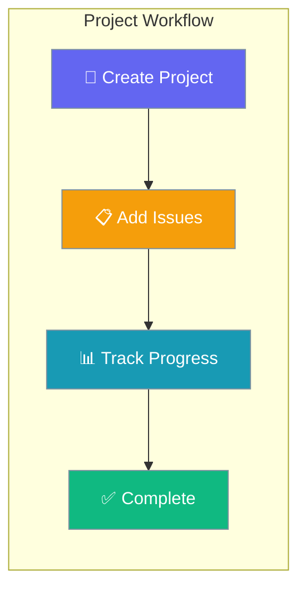
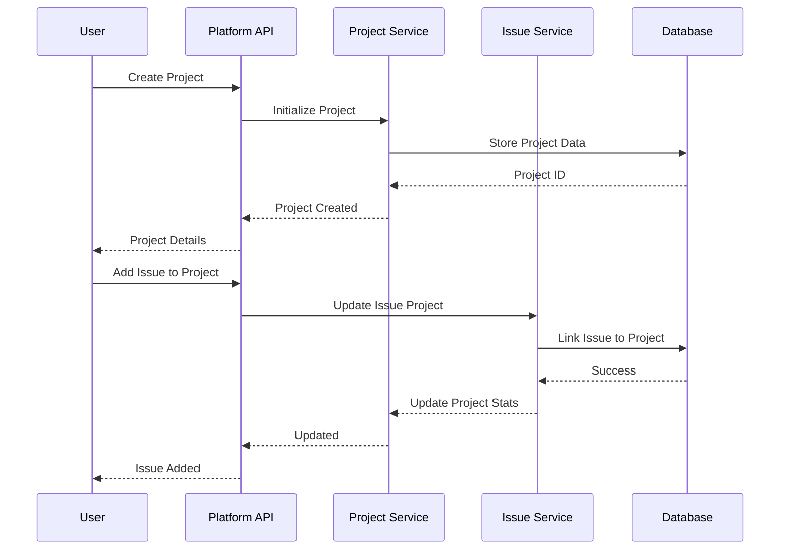
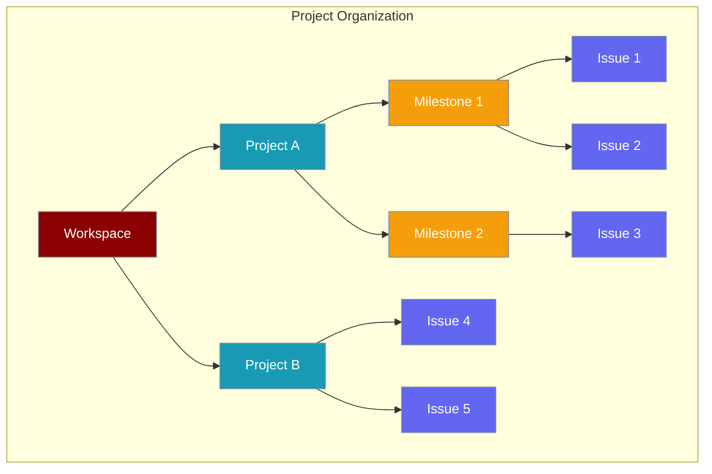

Projects provide hierarchical organization for issues, enabling teams to group related work, track progress, and manage complex workflows with milestones and deadlines.



## Quick Start

<Steps>
<Step title="Create a Project">
```python
import asyncio
from praisonai_platform.client import PlatformClient

async def create_project():
    client = PlatformClient("http://localhost:8000", token="your-jwt-token")
    ws_id = "your-workspace-id"

    # Create a new project
    project = await client.create_project(
        ws_id,
        name="Website Redesign",
        description="Complete redesign of company website",
        start_date="2025-02-01T00:00:00Z",
        due_date="2025-04-30T23:59:59Z",
        status="active"
    )
    
    print(f"Created project: {project['name']} (ID: {project['id']})")
    print(f"Project URL: {project['url']}")

asyncio.run(create_project())
```
</Step>

<Step title="Add Issues to Project">
```python
async def organize_project():
    client = PlatformClient("http://localhost:8000", token="your-jwt-token")
    ws_id = "your-workspace-id"
    project_id = "your-project-id"
    
    # Add existing issues to project
    await client.add_project_issues(
        ws_id,
        project_id,
        issue_ids=["issue-123", "issue-124", "issue-125"]
    )
    
    # Create new issue directly in project
    new_issue = await client.create_issue(
        ws_id,
        title="Design homepage mockups",
        description="Create wireframes and visual mockups for new homepage",
        project_id=project_id,
        priority="high"
    )
    
    print(f"Added issues to project. New issue: {new_issue['identifier']}")

asyncio.run(organize_project())
```
</Step>
</Steps>

---

## How It Works



| Component | Purpose | Features |
|-----------|---------|----------|
| **Project** | Work organization container | Name, description, dates, status |
| **Milestones** | Progress markers | Target dates, completion criteria |
| **Issue Groups** | Categorized work items | Grouped by labels, assignee, or status |
| **Progress Tracking** | Completion metrics | Burndown charts, velocity tracking |

---

## Project Structure

### Project Hierarchy



### Status Workflow

| Status | Description | Actions Available |
|--------|-------------|------------------|
| `planning` | Initial setup phase | Add issues, set milestones |
| `active` | Currently in progress | Track progress, update issues |
| `on_hold` | Temporarily paused | Resume, reassign resources |
| `completed` | All work finished | Archive, generate reports |
| `cancelled` | Project terminated | Archive, document reasons |

---

## API Reference

### Project Management Endpoints

| Method | Endpoint | Purpose | Authentication |
|--------|----------|---------|----------------|
| `POST` | `/api/v1/workspaces/{ws_id}/projects` | Create project | Bearer Token |
| `GET` | `/api/v1/workspaces/{ws_id}/projects` | List projects | Bearer Token |
| `GET` | `/api/v1/workspaces/{ws_id}/projects/{project_id}` | Get project details | Bearer Token |
| `PUT` | `/api/v1/workspaces/{ws_id}/projects/{project_id}` | Update project | Bearer Token |
| `DELETE` | `/api/v1/workspaces/{ws_id}/projects/{project_id}` | Delete project | Bearer Token |

### Project Content Management

| Method | Endpoint | Purpose | Authentication |
|--------|----------|---------|----------------|
| `POST` | `/api/v1/workspaces/{ws_id}/projects/{project_id}/issues` | Add issues to project | Bearer Token |
| `DELETE` | `/api/v1/workspaces/{ws_id}/projects/{project_id}/issues/{issue_id}` | Remove issue from project | Bearer Token |
| `GET` | `/api/v1/workspaces/{ws_id}/projects/{project_id}/progress` | Get project progress | Bearer Token |
| `GET` | `/api/v1/workspaces/{ws_id}/projects/{project_id}/activity` | Get project activity | Bearer Token |

---

## Common Patterns

<AccordionGroup>
<Accordion title="Sprint-Based Project Management">
Organize projects using sprint methodology:

```python
async def setup_sprint_project():
    client = PlatformClient("http://localhost:8000", token="your-jwt-token")
    ws_id = "your-workspace-id"
    
    # Create main project
    main_project = await client.create_project(
        ws_id,
        name="E-commerce Platform v2.0",
        description="Major platform upgrade with new features",
        start_date="2025-01-01T00:00:00Z",
        due_date="2025-06-30T23:59:59Z"
    )
    
    # Create sprint milestones
    sprint_1 = await client.create_milestone(
        ws_id,
        main_project['id'],
        title="Sprint 1 - User Authentication",
        description="Implement OAuth2 and user management",
        due_date="2025-02-15T23:59:59Z"
    )
    
    sprint_2 = await client.create_milestone(
        ws_id,
        main_project['id'],
        title="Sprint 2 - Product Catalog",
        description="Build product browsing and search",
        due_date="2025-03-30T23:59:59Z"
    )
    
    # Add issues to sprints
    sprint_1_issues = [
        {"title": "OAuth2 Integration", "priority": "high"},
        {"title": "User Registration Flow", "priority": "medium"},
        {"title": "Password Reset", "priority": "low"}
    ]
    
    for issue_data in sprint_1_issues:
        issue = await client.create_issue(
            ws_id,
            project_id=main_project['id'],
            milestone_id=sprint_1['id'],
            **issue_data
        )
        print(f"Added to Sprint 1: {issue['title']}")
```
</Accordion>

<Accordion title="Cross-Team Project Coordination">
Manage projects that span multiple teams:

```python
async def cross_team_project():
    client = PlatformClient("http://localhost:8000", token="your-jwt-token")
    ws_id = "your-workspace-id"
    
    # Create project with team assignments
    project = await client.create_project(
        ws_id,
        name="Mobile App Launch",
        description="iOS and Android app development and launch"
    )
    
    # Define team-specific work streams
    team_streams = {
        "backend": {
            "name": "API Development",
            "lead": "backend-lead-id",
            "issues": [
                "Implement REST API endpoints",
                "Set up authentication middleware", 
                "Configure database schemas"
            ]
        },
        "ios": {
            "name": "iOS Development", 
            "lead": "ios-lead-id",
            "issues": [
                "Design iOS app architecture",
                "Implement core navigation",
                "Add push notifications"
            ]
        },
        "android": {
            "name": "Android Development",
            "lead": "android-lead-id", 
            "issues": [
                "Set up Android project structure",
                "Implement material design",
                "Add background sync"
            ]
        }
    }
    
    # Create team-specific milestones and issues
    for team, stream in team_streams.items():
        milestone = await client.create_milestone(
            ws_id,
            project['id'],
            title=stream['name'],
            assignee_id=stream['lead']
        )
        
        for issue_title in stream['issues']:
            await client.create_issue(
                ws_id,
                title=issue_title,
                project_id=project['id'],
                milestone_id=milestone['id'],
                assignee_id=stream['lead'],
                labels=[f"team:{team}"]
            )
    
    print(f"Created cross-team project with {len(team_streams)} workstreams")
```
</Accordion>

<Accordion title="Progress Tracking and Reporting">
Track project progress with automated reporting:

```python
async def project_progress_tracking():
    client = PlatformClient("http://localhost:8000", token="your-jwt-token")
    ws_id = "your-workspace-id"
    project_id = "your-project-id"
    
    # Get comprehensive project metrics
    project_stats = await client.get_project_progress(ws_id, project_id)
    
    # Calculate various progress metrics
    total_issues = project_stats['total_issues']
    completed_issues = project_stats['completed_issues']
    completion_rate = (completed_issues / total_issues) * 100 if total_issues > 0 else 0
    
    # Get burndown data
    burndown_data = await client.get_project_burndown(ws_id, project_id)
    
    # Generate progress report
    report = {
        "project_name": project_stats['name'],
        "completion_percentage": round(completion_rate, 1),
        "issues": {
            "total": total_issues,
            "completed": completed_issues,
            "in_progress": project_stats['in_progress_issues'],
            "blocked": project_stats['blocked_issues']
        },
        "milestones": {
            "total": project_stats['total_milestones'],
            "completed": project_stats['completed_milestones'],
            "overdue": project_stats['overdue_milestones']
        },
        "timeline": {
            "start_date": project_stats['start_date'],
            "due_date": project_stats['due_date'],
            "days_remaining": project_stats['days_remaining'],
            "on_track": project_stats['on_track']
        },
        "velocity": {
            "issues_per_week": burndown_data['velocity'],
            "estimated_completion": burndown_data['projected_completion']
        }
    }
    
    # Send weekly progress email
    await send_project_report_email(report)
    
    return report

async def send_project_report_email(report):
    """Send automated project progress report"""
    # Integration with email service
    pass
```
</Accordion>
</AccordionGroup>

---

## Best Practices

<AccordionGroup>
<Accordion title="Project Planning">
- **Clear scope**: Define project boundaries and deliverables upfront
- **Realistic timelines**: Allow buffer time for unexpected issues
- **Milestone breakdown**: Create 2-week milestones for better tracking
- **Success criteria**: Define measurable completion criteria for each milestone
</Accordion>

<Accordion title="Issue Organization">
- **Consistent labeling**: Use standardized labels across all project issues
- **Priority alignment**: Ensure issue priorities align with project goals
- **Dependency mapping**: Document issue dependencies clearly
- **Regular cleanup**: Remove or reassign stale issues regularly
</Accordion>

<Accordion title="Team Coordination">
- **Clear ownership**: Assign clear owners for each project area
- **Regular updates**: Schedule consistent progress check-ins
- **Communication channels**: Set up dedicated project communication spaces
- **Cross-team sync**: Coordinate dependencies between teams early
</Accordion>

<Accordion title="Progress Monitoring">
- **Automated tracking**: Use automated progress tracking where possible
- **Regular reporting**: Generate consistent progress reports
- **Early warnings**: Set up alerts for projects at risk
- **Post-project review**: Conduct retrospectives for continuous improvement
</Accordion>
</AccordionGroup>

---

## Related

<CardGroup cols={2}>
<Card title="Issue Tracking" icon="list-check" href="/docs/features/platform/issues">
  Comprehensive issue management within projects
</Card>

<Card title="Team Members" icon="users" href="/docs/features/platform/members">
  Project team management and permissions
</Card>
</CardGroup>