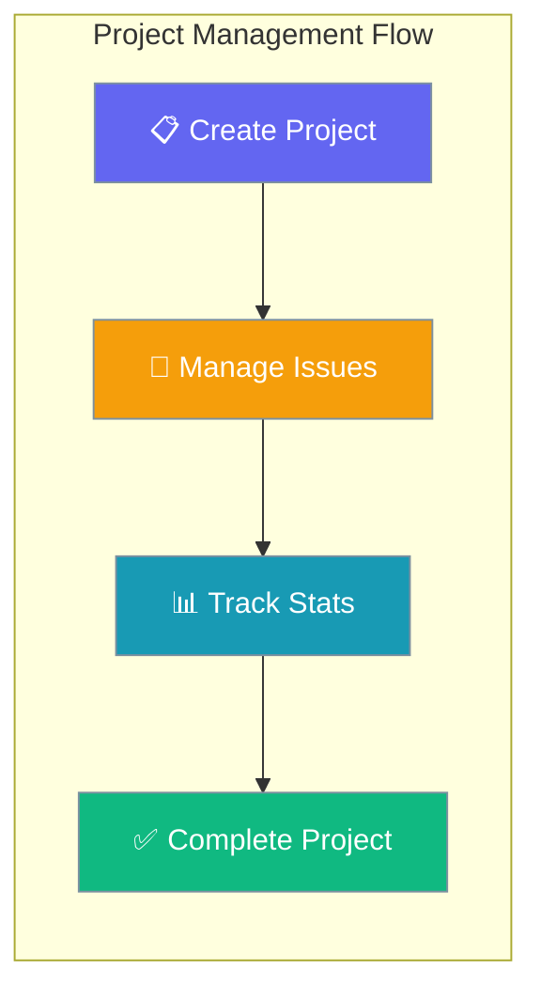
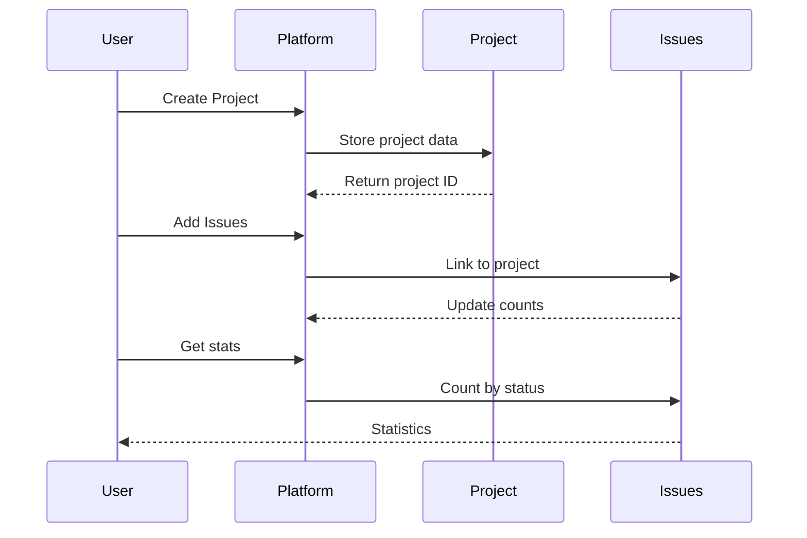

Projects organize issues within a workspace, providing structure for team collaboration and progress tracking.



## Quick Start

<Steps>
<Step title="Create Project">
```python
from praisonai_platform.client import PlatformClient

client = PlatformClient("http://localhost:8000", token="your-jwt-token")
ws_id = "your-workspace-id"

# Create project
project = await client.create_project(
    ws_id, 
    "Backend API", 
    description="All backend development work"
)
print(project["id"])
```
</Step>

<Step title="List Projects">
```python
# List all projects in workspace
projects = await client.list_projects(ws_id)
for project in projects:
    print(f"{project['title']} - {project['status']}")
```
</Step>
</Steps>

---

## How It Works



| Feature | Description |
|---------|-------------|
| **Title** | Project display name |
| **Lead** | User or agent responsible for project |
| **Status** | Project lifecycle stage |
| **Statistics** | Issue counts by status |

---

## API Endpoints

### Project Operations

| Method | Endpoint | Description |
|--------|----------|-------------|
| `POST` | `/api/v1/workspaces/{ws_id}/projects/` | Create new project |
| `GET` | `/api/v1/workspaces/{ws_id}/projects/` | List projects (paginated) |
| `GET` | `/api/v1/workspaces/{ws_id}/projects/{project_id}` | Get specific project |
| `PATCH` | `/api/v1/workspaces/{ws_id}/projects/{project_id}` | Update project |
| `DELETE` | `/api/v1/workspaces/{ws_id}/projects/{project_id}` | Delete project |
| `GET` | `/api/v1/workspaces/{ws_id}/projects/{project_id}/stats` | Get issue statistics |

---

## Configuration Options

### Create Project Schema

```json
{
  "title": "Backend API",
  "description": "All backend development work",
  "icon": "🔧",
  "lead_type": "user",
  "lead_id": "user-abc123"
}
```

| Option | Type | Required | Description |
|--------|------|----------|-------------|
| `title` | `string` | Yes | Project display name |
| `description` | `string` | No | Project description |
| `icon` | `string` | No | Project icon/emoji |
| `lead_type` | `string` | No | Lead type: "user" or "agent" |
| `lead_id` | `string` | No | ID of lead user or agent |

### Response Schema

```json
{
  "id": "proj-abc123",
  "workspace_id": "ws-abc123", 
  "title": "Backend API",
  "description": "All backend development work",
  "icon": "🔧",
  "status": "active",
  "lead_type": "user",
  "lead_id": "user-abc123",
  "created_at": "2025-01-01T00:00:00"
}
```

### Statistics Response

```json
{
  "total": 21,
  "by_status": {
    "backlog": 5,
    "todo": 3, 
    "in_progress": 2,
    "done": 10,
    "cancelled": 1
  }
}
```

---

## Common Patterns

### Full CRUD Operations

```bash
TOKEN="your-jwt-token"
WS_ID="workspace-id"
BASE_URL="http://localhost:8000"

# Create project
curl -s -X POST $BASE_URL/api/v1/workspaces/$WS_ID/projects/ \
  -H "Authorization: Bearer $TOKEN" \
  -H "Content-Type: application/json" \
  -d '{"title":"Backend API","description":"All backend work"}' \
  --max-time 10

# List projects with pagination  
curl -s "$BASE_URL/api/v1/workspaces/$WS_ID/projects/?limit=10&offset=0" \
  -H "Authorization: Bearer $TOKEN" \
  --max-time 10

# Update project status
curl -s -X PATCH $BASE_URL/api/v1/workspaces/$WS_ID/projects/PROJECT_ID \
  -H "Authorization: Bearer $TOKEN" \
  -H "Content-Type: application/json" \
  -d '{"status":"completed"}' \
  --max-time 10

# Delete project  
curl -s -X DELETE $BASE_URL/api/v1/workspaces/$WS_ID/projects/PROJECT_ID \
  -H "Authorization: Bearer $TOKEN" \
  --max-time 10
```

### Project Statistics

```bash
# Get detailed project statistics
curl -s $BASE_URL/api/v1/workspaces/$WS_ID/projects/PROJECT_ID/stats \
  -H "Authorization: Bearer $TOKEN" \
  --max-time 10
```

### Python SDK Usage

```python
import asyncio
from praisonai_platform.client import PlatformClient

async def manage_projects():
    client = PlatformClient("http://localhost:8000", token="your-jwt-token")
    ws_id = "your-workspace-id"

    # Create project with lead
    project = await client.create_project(
        ws_id, 
        "Mobile App",
        description="iOS and Android development"
    )
    
    # List all projects
    projects = await client.list_projects(ws_id)
    for p in projects:
        print(f"Project: {p['title']} (Status: {p['status']})")

asyncio.run(manage_projects())
```

---

## Best Practices

<AccordionGroup>
<Accordion title="Project Organization">
Keep projects focused on specific domains or features rather than creating overly broad projects. Use descriptive titles and include project descriptions for team clarity.
</Accordion>

<Accordion title="Lead Assignment">
Assign project leads to provide clear ownership. Use "user" for human leads and "agent" for AI-managed projects. Update leads as project ownership changes.
</Accordion>

<Accordion title="Status Management">
Regularly update project status to reflect current state. Use consistent status values across your organization. Archive completed projects rather than deleting them for historical tracking.
</Accordion>

<Accordion title="Statistics Monitoring">
Use project statistics to track progress and identify bottlenecks. Monitor issue distribution across statuses to ensure balanced workload and identify stuck issues.
</Accordion>
</AccordionGroup>

---

## Testing

Run the project service tests to verify functionality:

```bash
pytest tests/test_services.py::TestProjectService -v
```

Expected test coverage includes:
- Project creation and validation
- Listing and pagination
- Updates and status changes  
- Deletion and cleanup
- Statistics calculation

---

## Related

<CardGroup cols={2}>
<Card title="Issues Management" icon="bug" href="/docs/features/platform/issues">
  Create and manage issues within projects
</Card>
<Card title="Workspaces" icon="building" href="/docs/features/platform/workspaces">
  Organize projects within workspaces
</Card>
</CardGroup>