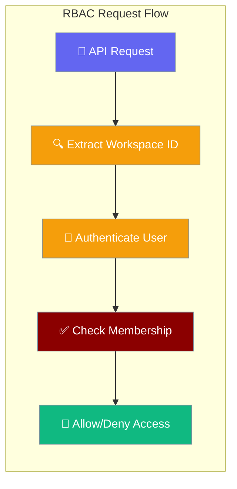
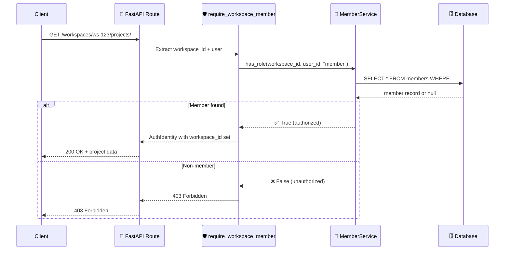
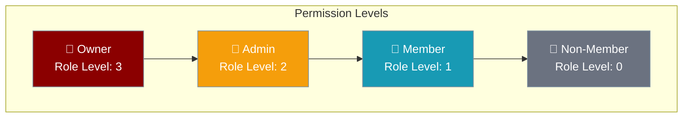
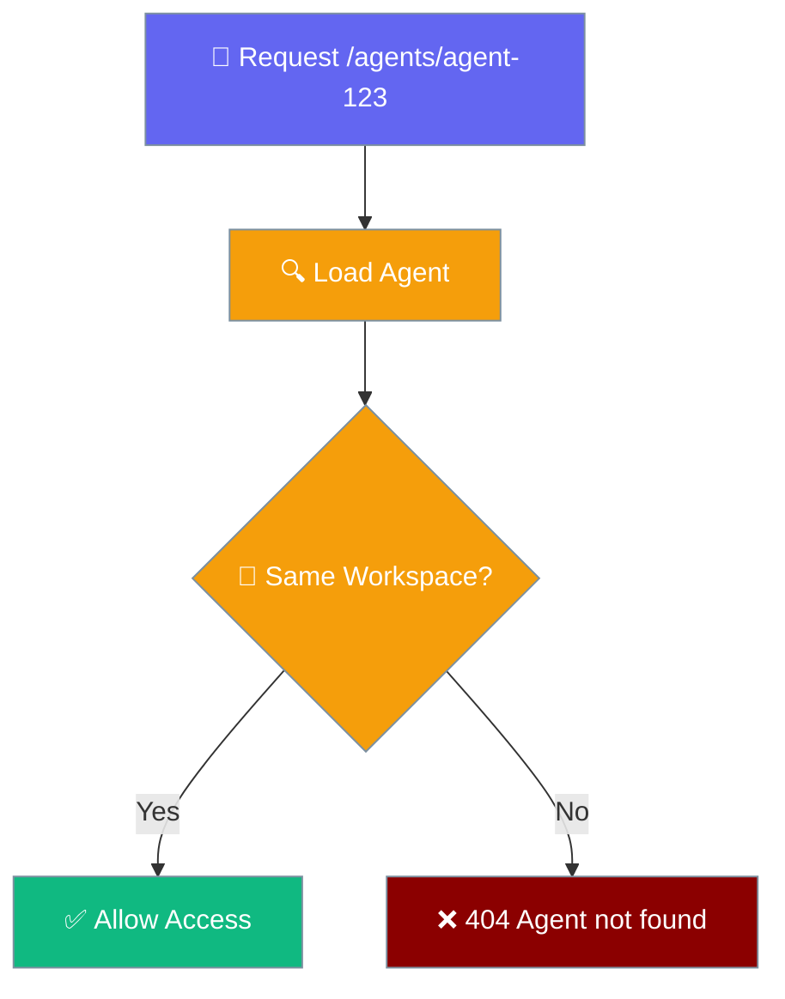

API Route RBAC Enforcement protects workspace-scoped resources by requiring valid membership before allowing access to any workspace endpoints.



## Quick Start

<Steps>
<Step title="Protected Route Access">
```python
from praisonai_platform.client import PlatformClient

# All workspace routes now require membership
client = PlatformClient("http://localhost:8000", token="your-jwt-token")

# This will only succeed if you're a member of the workspace
projects = await client.list_projects("ws-abc123")
```
</Step>

<Step title="Membership Validation">
```python
from praisonai_platform.api.deps import require_workspace_member
from fastapi import Depends

# FastAPI route with RBAC enforcement
@router.get("/{workspace_id}/projects/")
async def list_projects(
    workspace_id: str,
    user: AuthIdentity = Depends(require_workspace_member),  # ← RBAC enforcement
    session: AsyncSession = Depends(get_db),
):
    # User is guaranteed to be a workspace member here
    project_service = ProjectService(session)
    return await project_service.list_for_workspace(workspace_id)
```
</Step>

<Step title="Role-based Access Control">
```python
from praisonai_platform.api.deps import require_workspace_member
from functools import partial

# Require admin role or higher
require_admin = partial(require_workspace_member, min_role="admin")

@router.delete("/{workspace_id}/projects/{project_id}")
async def delete_project(
    workspace_id: str,
    project_id: str,
    user: AuthIdentity = Depends(require_admin),  # ← Admin required
    session: AsyncSession = Depends(get_db),
):
    # User has admin privileges in this workspace
    pass
```
</Step>
</Steps>

---

## How It Works



| Component | Responsibility |
|-----------|----------------|
| **require_workspace_member** | FastAPI dependency that enforces workspace membership |
| **MemberService.has_role()** | Database query to verify user's workspace membership and role |
| **AuthIdentity** | Enhanced with workspace_id for downstream route handlers |
| **403 Forbidden** | Returned to non-members attempting workspace access |

---

## Implementation Details

### RBAC Dependency

The `require_workspace_member` dependency replaces `get_current_user` in all workspace-scoped routes:

```python
# Before (GAP-8): Only authentication
@router.get("/{workspace_id}/projects/")
async def list_projects(
    workspace_id: str,
    user: AuthIdentity = Depends(get_current_user),  # ← Only checks valid token
    session: AsyncSession = Depends(get_db),
):
    pass

# After (GAP-8): Authentication + Authorization
@router.get("/{workspace_id}/projects/")
async def list_projects(
    workspace_id: str,
    user: AuthIdentity = Depends(require_workspace_member),  # ← Checks membership
    session: AsyncSession = Depends(get_db),
):
    # user.workspace_id is now available
    pass
```

### Dependency Configuration

```python
from praisonai_platform.api.deps import require_workspace_member
from functools import partial

# Default: requires "member" role or higher
require_member = require_workspace_member

# Custom: require "admin" role or higher
require_admin = partial(require_workspace_member, min_role="admin")

# Custom: require "owner" role
require_owner = partial(require_workspace_member, min_role="owner")
```

### Role Hierarchy



---

## Protected Routes

All workspace-scoped API routes now enforce membership:

### Core Resources

| Route Pattern | Enforcement | Minimum Role | Notes |
|---------------|-------------|-------------|-------|
| `GET /workspaces/{id}` | ✅ | `member` | |
| `PATCH /workspaces/{id}` | ✅ | `admin` | |
| `DELETE /workspaces/{id}` | ✅ | `owner` | |
| `GET /workspaces/{id}/members` | ✅ | `member` | |
| `POST /workspaces/{id}/members` | ✅ | `admin` | **Extra check:** owner required for admin/owner roles |
| `PATCH /workspaces/{id}/members/{user_id}` | ✅ | `admin` | |
| `DELETE /workspaces/{id}/members/{user_id}` | ✅ | `admin` | |

### Project Management

| Route Pattern | Enforcement | Minimum Role |
|---------------|-------------|-------------|
| `GET /workspaces/{id}/projects/` | ✅ | `member` |
| `POST /workspaces/{id}/projects/` | ✅ | `member` |
| `PATCH /workspaces/{id}/projects/{pid}` | ✅ | `member` |
| `DELETE /workspaces/{id}/projects/{pid}` | ✅ | `admin` |

### Issue Tracking

| Route Pattern | Enforcement | Minimum Role |
|---------------|-------------|-------------|
| `GET /workspaces/{id}/issues/` | ✅ | `member` |
| `POST /workspaces/{id}/issues/` | ✅ | `member` |
| `GET /workspaces/{id}/issues/{iid}` | ✅ | `member` |
| `PATCH /workspaces/{id}/issues/{iid}` | ✅ | `member` |
| `DELETE /workspaces/{id}/issues/{iid}` | ✅ | `admin` |

### Agent Management

| Route Pattern | Enforcement | Minimum Role |
|---------------|-------------|-------------|
| `GET /workspaces/{id}/agents/` | ✅ | `member` |
| `POST /workspaces/{id}/agents/` | ✅ | `member` |
| `PATCH /workspaces/{id}/agents/{aid}` | ✅ | `member` |
| `DELETE /workspaces/{id}/agents/{aid}` | ✅ | `admin` |

---

<Warning>
**Breaking Change**: If you have an existing client that mutates workspaces, members, agents, or issues as a non-admin member, those calls now return 403. Grant the calling user the `admin` (or `owner` where required) role first.
</Warning>

## Owner-only Sub-checks

Beyond the base role requirements, certain operations require additional owner privileges:

### Member Management with Owner Role

| Operation | Requirement | Error Message |
|-----------|-------------|---------------|
| Add member with `role=owner` | Caller must be `owner` | `Only owners can add another owner` |
| Change role to `owner` | Caller must be `owner` | `Only owners can assign the owner role` |
| Change existing `owner` role | Caller must be `owner` | `Only owners can change an owner's role` |
| Remove existing `owner` | Caller must be `owner` | `Only owners can remove an owner` |
| Change your own role | Always forbidden | `Cannot change your own role` |
| Remove yourself | Always forbidden | `Cannot remove yourself from the workspace` |

### Example Owner-only Operations

```python
# These operations require the caller to be an owner:
POST /workspaces/{id}/members {"user_id": "user-123", "role": "owner"}
PATCH /workspaces/{id}/members/user-456 {"role": "owner"}  
PATCH /workspaces/{id}/members/owner-789 {"role": "admin"}
DELETE /workspaces/{id}/members/owner-789

# These are always forbidden regardless of role:
PATCH /workspaces/{id}/members/your-user-id {"role": "member"}  # Self role change
DELETE /workspaces/{id}/members/your-user-id                   # Self removal
```

## Cross-workspace Access (IDOR)

The `ensure_resource_in_workspace` function prevents cross-workspace resource access by returning **404 (not 403)** when a resource exists but belongs to a different workspace.

### Protected Resources

| Resource | Routes | 404 Message |
|----------|--------|-------------|
| Agents | `GET/PATCH/DELETE /agents/{id}` | `Agent not found` |
| Issues | `GET/PATCH/DELETE /issues/{id}` | `Issue not found` |
| Issue Comments | `POST/GET /issues/{id}/comments` | `Issue not found` |



This prevents enumeration of resource IDs across workspaces by making cross-workspace resources appear non-existent.

---

## Error Responses

### 403 Forbidden - Non-Member

When a valid user attempts to access a workspace they're not a member of:

```json
{
  "detail": "User is not a member of this workspace",
  "status_code": 403
}
```

### 403 Forbidden - Insufficient Role

When a member lacks the required role level:

```json
{
  "detail": "Insufficient permissions. Requires admin role or higher",
  "status_code": 403
}
```

### 403 Forbidden - Owner Role Required

When an admin attempts to assign admin or owner roles:

```json
{
  "detail": "Only owners can assign admin or owner roles",
  "status_code": 403
}
```

### 401 Unauthorized

When authentication fails (invalid/missing token):

```json
{
  "detail": "Invalid or expired token",
  "status_code": 401
}
```

---

## API Testing

### Valid Member Access

```bash
# Member accessing their workspace (✅ Success)
curl -H "Authorization: Bearer $MEMBER_TOKEN" \
  http://localhost:8000/api/v1/workspaces/ws-abc123/projects/

# Response: 200 OK with project list
```

### Non-Member Access

```bash
# Non-member attempting access (❌ Forbidden)
curl -H "Authorization: Bearer $OTHER_USER_TOKEN" \
  http://localhost:8000/api/v1/workspaces/ws-abc123/projects/

# Response: 403 Forbidden
```

### Role-based Access

```bash
# Member trying admin action (❌ Forbidden)
curl -X DELETE -H "Authorization: Bearer $MEMBER_TOKEN" \
  http://localhost:8000/api/v1/workspaces/ws-abc123/projects/proj-123

# Response: 403 Forbidden (requires admin)

# Admin performing same action (✅ Success)
curl -X DELETE -H "Authorization: Bearer $ADMIN_TOKEN" \
  http://localhost:8000/api/v1/workspaces/ws-abc123/projects/proj-123

# Response: 204 No Content
```

---

## Migration Impact

### Behavior Changes

| Scenario | Before batch 3 | After batch 3 |
|----------|-------------|-------------|
| **Valid user, non-member** | ✅ Access granted | ❌ 403 Forbidden |
| **Valid user, workspace member** | ✅ Access granted | ✅ Access granted |
| **Invalid token** | ❌ 401 Unauthorized | ❌ 401 Unauthorized |
| **Admin promotes member → admin** | ✅ allowed | ❌ 403 Forbidden |
| **Admin promotes member → owner** | ❌ already blocked | ❌ still blocked |
| **Owner promotes member → admin** | ✅ allowed | ✅ allowed |
| **Cross-workspace resource access via service layer** | Surface IDOR risk | ❌ returns `None`/404 |

### Client Impact

```python
# SDK automatically handles the new authorization requirements
from praisonai_platform.client import PlatformClient

# This client request will now fail if user is not a workspace member
client = PlatformClient("http://localhost:8000", token="user-token")

try:
    projects = await client.list_projects("ws-abc123")
    print("Access granted - user is a member")
except Exception as e:
    print(f"Access denied: {e}")
    # Handle 403 Forbidden appropriately
```

---

## Best Practices

<AccordionGroup>
<Accordion title="Handle Authorization Errors Gracefully">
Always handle 403 Forbidden responses in client applications. Display user-friendly messages when workspace access is denied rather than generic error messages.
</Accordion>

<Accordion title="Use Appropriate Role Requirements">
Configure route dependencies with the minimum required role. Don't require `admin` for operations that `member` can safely perform.
</Accordion>

<Accordion title="Validate Membership Before UI Actions">
Check user workspace membership before displaying UI elements like "Create Project" buttons to prevent unsuccessful API calls.
</Accordion>

<Accordion title="Monitor Failed Authorization Attempts">
Log and monitor 403 responses to identify potential security issues or UX problems with workspace access patterns.
</Accordion>
</AccordionGroup>

---

## Testing

Verify RBAC enforcement with the integration test suite:

```bash
# Run RBAC enforcement tests
pytest tests/test_new_api_integration.py::TestRBACEnforcement -v

# Run specific workspace access tests
pytest tests/test_new_api_integration.py -k "test_workspace_member" -v
```

Expected test scenarios:
- Non-member 403 responses on all workspace routes
- Member access granted for basic operations
- Admin role enforcement for management operations
- Owner role enforcement for destructive operations

---

## Related

<CardGroup cols={2}>
<Card title="Team Members & RBAC" icon="users" href="/docs/features/platform/members">
  Learn about workspace member management
</Card>
<Card title="Authentication" icon="key" href="/docs/features/platform/authentication">
  Understand JWT token authentication
</Card>
</CardGroup>