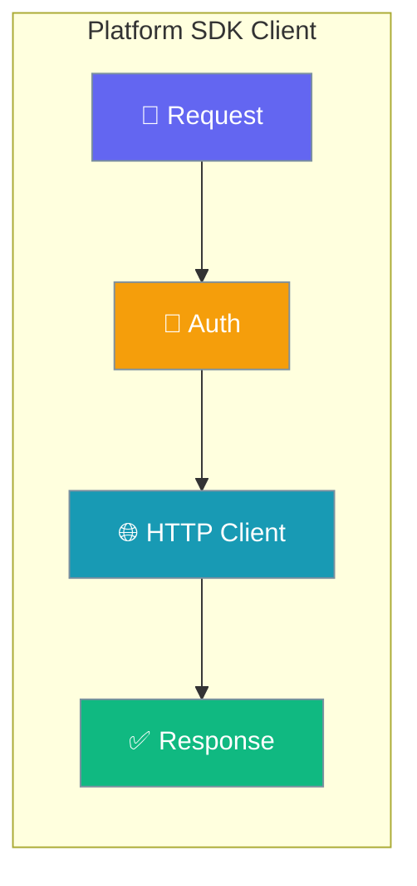
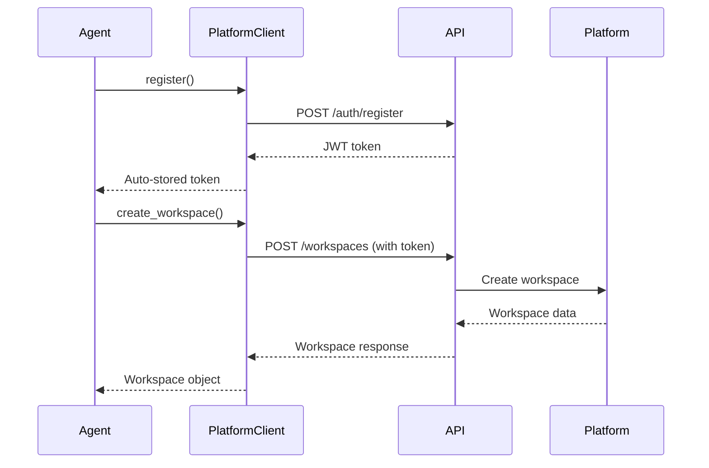

PlatformClient is an async Python SDK that wraps all platform API calls, providing authenticated access to workspaces, projects, issues, and agents.



## Quick Start

<Steps>
<Step title="Install and Setup">
Install the platform SDK and create a client instance:

```python
# Install
pip install praisonai-platform

# Create client
import asyncio
from praisonai_platform.client import PlatformClient

client = PlatformClient("http://localhost:8000")
```
</Step>

<Step title="Agent-Centric Workflow">
Register, create workspace, and set up an agent to handle issues:

```python
from praisonaiagents import Agent
from praisonai_platform.client import PlatformClient

async def setup_platform_agent():
    # Initialize platform client
    client = PlatformClient("http://localhost:8000")
    
    # Register and authenticate
    await client.register("agent@company.com", "password", "Platform Agent")
    
    # Create workspace and project
    ws = await client.create_workspace("AI Team")
    project = await client.create_project(ws["id"], "Backend Tasks")
    
    # Register agent
    agent_info = await client.create_agent(
        ws["id"], "CodeBot",
        runtime_mode="local",
        instructions="Handle platform issues automatically"
    )
    
    # Create agent instance that uses platform client
    agent = Agent(
        name="PlatformAgent",
        instructions="Monitor and handle platform issues",
        platform_client=client,
        workspace_id=ws["id"]
    )
    
    return agent, client, ws["id"]

asyncio.run(setup_platform_agent())
```
</Step>
</Steps>

---

## How It Works



| Component | Purpose | Key Features |
|-----------|---------|-------------|
| **PlatformClient** | HTTP wrapper | Auto-authentication, token storage, async methods |
| **Authentication** | Secure access | JWT tokens, automatic storage, session management |
| **API Methods** | Resource access | Workspaces, projects, issues, agents, comments |

---

## Configuration Options

<Card title="Platform Client API Reference" icon="code" href="/docs/sdk/reference/praisonai-platform/">
  Complete SDK configuration options and method signatures
</Card>

---

## Authentication

### Registration and Login

```python
from praisonai_platform.client import PlatformClient

async def authenticate():
    client = PlatformClient("http://localhost:8000")
    
    # Register new user - automatically stores JWT token
    result = await client.register("user@company.com", "password", "User Name")
    
    # Or login existing user - automatically stores JWT token  
    result = await client.login("user@company.com", "password")
    
    # Token is now stored - all subsequent calls are authenticated
    return client
```

### Custom Configuration

```python
# With pre-existing token
client = PlatformClient(
    base_url="https://api.mycompany.com",
    token="your-jwt-token"
)

# Custom timeout and headers
client = PlatformClient(
    base_url="http://localhost:8000",
    timeout=30,
    headers={"User-Agent": "MyApp/1.0"}
)
```

---

## Workspace Management

### Create and List Workspaces

```python
async def workspace_operations(client):
    # Create new workspace
    workspace = await client.create_workspace(
        name="Engineering Team",
        slug="engineering"
    )
    
    # List all workspaces
    workspaces = await client.list_workspaces()
    
    # Get specific workspace
    workspace = await client.get_workspace(workspace["id"])
    
    return workspace
```

### Add Members

```python
async def manage_members(client, workspace_id):
    # Add member to workspace
    member = await client.add_member(
        workspace_id=workspace_id,
        user_id="user-123",
        role="member"
    )
    
    # List all members
    members = await client.list_members(workspace_id)
    
    return members
```

---

## Project and Issue Management

### Projects

```python
async def project_operations(client, workspace_id):
    # Create project
    project = await client.create_project(
        workspace_id=workspace_id,
        name="Backend API",
        description="All backend development work"
    )
    
    # List projects in workspace
    projects = await client.list_projects(workspace_id)
    
    return project, projects
```

### Issues

```python
async def issue_operations(client, workspace_id):
    # Create issue
    issue = await client.create_issue(
        workspace_id=workspace_id,
        title="Fix authentication timeout",
        description="Auth tokens expire too quickly",
        priority="high",
        assignee_type="agent",
        assignee_id="agent-123"
    )
    
    # List issues with filters
    issues = await client.list_issues(
        workspace_id=workspace_id,
        status="todo",
        project_id="project-123"
    )
    
    # Update issue status
    updated = await client.update_issue(
        workspace_id=workspace_id,
        issue_id=issue["id"],
        status="in_progress"
    )
    
    return issue, issues
```

### Comments

```python
async def comment_operations(client, workspace_id, issue_id):
    # Add comment
    comment = await client.add_comment(
        workspace_id=workspace_id,
        issue_id=issue_id,
        content="Found the root cause - investigating fix"
    )
    
    # List comments
    comments = await client.list_comments(workspace_id, issue_id)
    
    return comment, comments
```

---

## Agent Management

### Register and Configure Agents

```python
async def agent_operations(client, workspace_id):
    # Register new agent
    agent = await client.create_agent(
        workspace_id=workspace_id,
        name="BugFixerBot",
        runtime_mode="local",
        instructions="Automatically analyze and fix reported bugs"
    )
    
    # List agents in workspace
    agents = await client.list_agents(workspace_id)
    
    # Update agent status
    updated = await client.update_agent(
        workspace_id=workspace_id,
        agent_id=agent["id"],
        status="active"
    )
    
    return agent, agents
```

---

## Common Patterns

### End-to-End Agent Workflow

```python
import asyncio
from praisonai_platform.client import PlatformClient
from praisonaiagents import Agent

async def full_agent_workflow():
    # Setup platform connection
    client = PlatformClient("http://localhost:8000")
    await client.register("dev@company.com", "password", "Dev Agent")
    
    # Create workspace and project
    ws = await client.create_workspace("Engineering")
    project = await client.create_project(ws["id"], "Bug Fixes")
    
    # Register platform agent
    platform_agent = await client.create_agent(
        ws["id"], "AutoFixer",
        instructions="Fix bugs automatically when issues are created"
    )
    
    # Create local agent that monitors platform
    agent = Agent(
        name="PlatformMonitor",
        instructions=f"""
        Monitor workspace {ws['id']} for new issues.
        When new issues appear, analyze and provide solutions.
        Update issue status as you progress.
        """,
        platform_client=client
    )
    
    # Create and handle a sample issue
    issue = await client.create_issue(
        ws["id"], "Memory leak in auth service",
        description="Users report session timeouts",
        priority="high",
        assignee_type="agent",
        assignee_id=platform_agent["id"]
    )
    
    # Agent processes the issue
    result = await agent.start(f"Handle issue: {issue['title']}")
    
    # Update issue with solution
    await client.add_comment(ws["id"], issue["id"], 
                           f"Analysis complete: {result}")
    await client.update_issue(ws["id"], issue["id"], status="completed")
    
    return f"Issue {issue['id']} handled successfully"

# Run the workflow
asyncio.run(full_agent_workflow())
```

### Batch Operations

```python
async def batch_operations(client, workspace_id):
    """Handle multiple platform operations efficiently"""
    
    # Create multiple projects
    projects = []
    for name in ["Frontend", "Backend", "DevOps"]:
        project = await client.create_project(workspace_id, name)
        projects.append(project)
    
    # Create issues for each project
    for project in projects:
        await client.create_issue(
            workspace_id=workspace_id,
            title=f"Setup {project['name']} environment",
            project_id=project["id"],
            priority="medium"
        )
    
    return projects
```

### Error Handling

```python
import httpx

async def robust_platform_operations(client):
    """Handle platform operations with proper error handling"""
    
    try:
        workspace = await client.create_workspace("Test Workspace")
        return workspace
        
    except httpx.HTTPStatusError as e:
        if e.response.status_code == 401:
            # Re-authenticate
            await client.login("user@company.com", "password")
            # Retry operation
            workspace = await client.create_workspace("Test Workspace")
            return workspace
        else:
            print(f"HTTP error: {e.response.status_code}")
            raise
            
    except httpx.RequestError as e:
        print(f"Request error: {e}")
        raise
```

---

## Best Practices

<AccordionGroup>
<Accordion title="Token Management">
Always use `register()` or `login()` methods which automatically store JWT tokens. The client handles token persistence across requests without manual intervention.
</Accordion>

<Accordion title="Error Handling">
Use proper exception handling for HTTP errors. The client raises `httpx.HTTPStatusError` for API errors and `httpx.RequestError` for connection issues.
</Accordion>

<Accordion title="Async Context">
Always use `await` with all client methods. The SDK is built for async/await patterns and requires proper async context management.
</Accordion>

<Accordion title="Resource IDs">
Store workspace and project IDs when creating resources. Most operations require these IDs to identify the target workspace or project.
</Accordion>
</AccordionGroup>

---

## Related

<CardGroup cols={2}>
<Card title="Authentication & Security" icon="shield" href="/docs/security">
  Platform security and authentication guides
</Card>
<Card title="Agent Development" icon="robot" href="/docs/concepts/agents">
  Building and configuring agents
</Card>
</CardGroup>