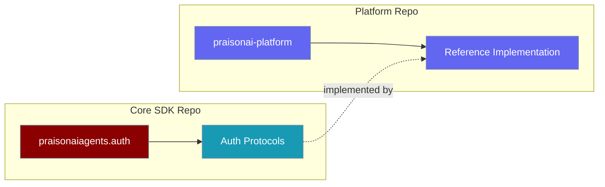

PraisonAI Platform now lives in its own repository, released independently of `praisonaiagents` and `praisonai`.

<Note>
Platform is now a separate repository — install with `pip install praisonai-platform` as before, and see the [PraisonAI-Platform repo](https://github.com/MervinPraison/PraisonAI-Platform) for source and issues.
</Note>



## What Changed

Only the source repository moved. The PyPI package name and Python import path are unchanged.

| Item | Status |
|------|--------|
| PyPI package `praisonai-platform` | Unchanged — `pip install praisonai-platform` still works |
| Python import `from praisonai_platform import ...` | Unchanged |
| Source repository | Moved to [MervinPraison/PraisonAI-Platform](https://github.com/MervinPraison/PraisonAI-Platform) |
| Versioning and releases | Independent of the core SDK |
| Dependency on Platform | None — a self-hosted PraisonAI install does not require it |

## Auth Protocols Stay in the Core SDK

The protocols the platform implements still ship in `praisonaiagents.auth`. Platform is one reference implementation — implement the protocols yourself to back agent configuration with your own store.

```python
from praisonaiagents.auth import (
    AuthIdentity,
    AuthBackendProtocol,
    WorkspaceContextProtocol,
)

class MyWorkspaceContext:
    async def get_workspace_context(self, workspace_id):
        return "Team guidelines and instructions"
```

## Agent Roster Endpoint

The platform agent roster lives at `/api/v1/workspaces/{workspace_id}/agents`.

<Warning>
`/api/v1/agents` is a **different**, unrelated endpoint served by `praisonai serve agents` (see [n8n API](/features/n8n-api)). It is not the platform roster.
</Warning>

## Reporting Vulnerabilities

Report platform vulnerabilities through the platform repository's [security advisories](https://github.com/MervinPraison/PraisonAI-Platform/security/advisories/new), not the main PraisonAI advisories.

## Related

<CardGroup cols={2}>
<Card title="Platform Python SDK" icon="python" href="/features/platform-python-sdk">
  Public API exports for platform integration
</Card>

<Card title="PraisonAI-Platform Repository" icon="github" href="https://github.com/MervinPraison/PraisonAI-Platform">
  Source, releases, and issues for the platform
</Card>
</CardGroup>
