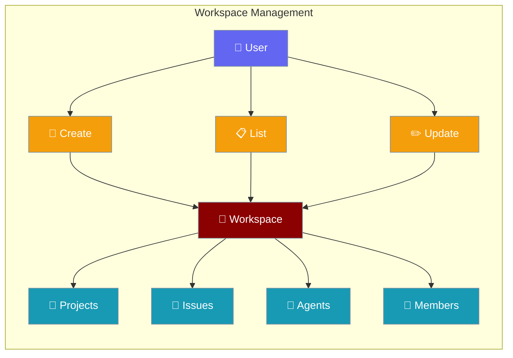
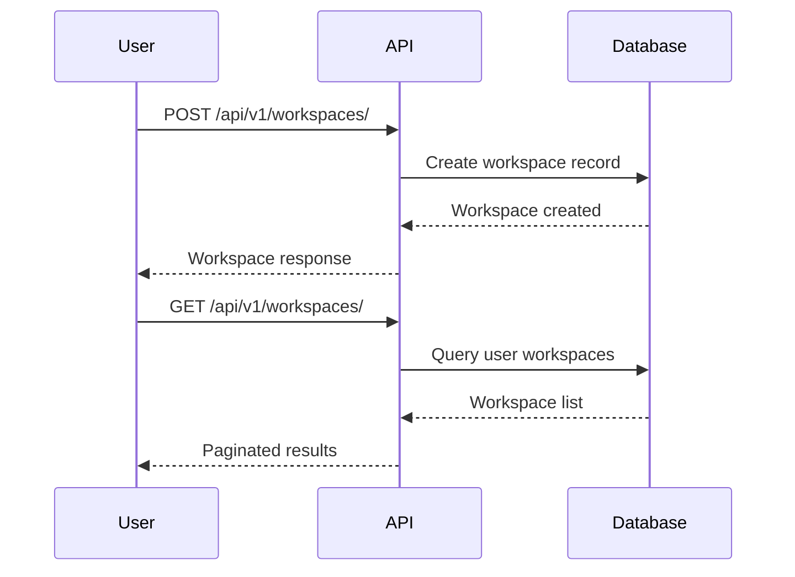

Workspaces are the top-level organizational containers in PraisonAI Platform that hold projects, issues, agents, and team members.



## Quick Start

<Steps>
<Step title="Create Workspace">
```bash
TOKEN="your-jwt-token"

curl -s -X POST http://localhost:8000/api/v1/workspaces/ \
  -H "Authorization: Bearer $TOKEN" \
  -H "Content-Type: application/json" \
  -d '{"name":"My Team","slug":"my-team","description":"Dev workspace"}' \
  --max-time 10
```
</Step>

<Step title="List Workspaces">
```bash
curl -s "http://localhost:8000/api/v1/workspaces/?limit=10&offset=0" \
  -H "Authorization: Bearer $TOKEN" \
  --max-time 10
```
</Step>
</Steps>

---

## How It Works



| Operation | Endpoint | Description |
|-----------|----------|-------------|
| Create | `POST /api/v1/workspaces/` | Create new workspace |
| List | `GET /api/v1/workspaces/` | List user workspaces |
| Get | `GET /api/v1/workspaces/{id}` | Get specific workspace |
| Update | `PATCH /api/v1/workspaces/{id}` | Update workspace |
| Delete | `DELETE /api/v1/workspaces/{id}` | Delete workspace |

---

## API Reference

### Create Workspace

Creates a new workspace with the specified configuration.

```bash
POST /api/v1/workspaces/
```

**Request:**
```json
{
  "name": "My Team",
  "slug": "my-team",
  "description": "Our development workspace"
}
```

**Response:**
```json
{
  "id": "ws-abc123",
  "name": "My Team",
  "slug": "my-team",
  "description": "Our development workspace",
  "settings": {},
  "created_at": "2025-01-01T00:00:00"
}
```

### List Workspaces

Retrieves paginated list of user's workspaces.

```bash
GET /api/v1/workspaces/?limit=10&offset=0
```

**Query Parameters:**
- `limit` (int): Results per page (default: 10, max: 100)
- `offset` (int): Pagination offset (default: 0)

### Update Workspace

Updates workspace properties using partial data.

```bash
PATCH /api/v1/workspaces/{workspace_id}
```

**Request:**
```json
{
  "name": "Updated Name",
  "description": "New description",
  "settings": {"theme": "dark"}
}
```

---

## Python SDK Examples

### Basic Operations

```python
import asyncio
from praisonai_platform.client import PlatformClient

async def main():
    client = PlatformClient("http://localhost:8000", token="your-jwt-token")

    # Create workspace
    workspace = await client.create_workspace("My Team", slug="my-team")
    print(f"Created: {workspace['id']}")

    # List all workspaces
    workspaces = await client.list_workspaces()
    for ws in workspaces:
        print(f"Workspace: {ws['name']} ({ws['slug']})")

    # Get specific workspace
    details = await client.get_workspace(workspace["id"])
    print(f"Description: {details['description']}")

asyncio.run(main())
```

### Advanced Management

```python
async def workspace_management():
    client = PlatformClient("http://localhost:8000", token="your-jwt-token")
    
    # Create with custom settings
    workspace = await client.create_workspace(
        name="Production Team",
        slug="prod-team", 
        description="Production workspace",
        settings={"theme": "dark", "notifications": True}
    )
    
    # Update workspace
    updated = await client.update_workspace(
        workspace["id"],
        description="Updated production workspace"
    )
    
    # Clean up
    await client.delete_workspace(workspace["id"])
```

---

## Key Concepts

<AccordionGroup>
<Accordion title="Workspace Slug">
URL-friendly identifier that's auto-generated from name if not provided. Must be unique across the platform. Used for friendly URLs like `/workspace/my-team`.
</Accordion>

<Accordion title="Multi-tenancy">
Users can own or belong to multiple workspaces. Access control ensures users only see workspaces they have permissions for.
</Accordion>

<Accordion title="Settings Object">
Flexible JSON dictionary for workspace-level configuration like themes, notification preferences, or feature toggles.
</Accordion>

<Accordion title="Organizational Hierarchy">
Workspaces → Projects → Issues/Agents/Tasks. Workspaces provide the top-level boundary for organizing work and team access.
</Accordion>
</AccordionGroup>

---

## Best Practices

<AccordionGroup>
<Accordion title="Naming Convention">
Use descriptive names that reflect the team or purpose. Avoid generic names like "Workspace 1". Good examples: "Marketing Team", "Backend Services", "Client Projects".
</Accordion>

<Accordion title="Slug Management">
Choose memorable slugs for URLs. Use hyphens, not underscores. Keep them short but descriptive: `marketing-team` not `marketing_team_workspace_2024`.
</Accordion>

<Accordion title="Settings Strategy">
Use settings for workspace-wide preferences. Store user preferences separately. Common settings: `theme`, `defaultProject`, `notifications`.
</Accordion>

<Accordion title="Access Control">
Plan member permissions before inviting users. Consider using role-based access with workspace-level roles like `owner`, `admin`, `member`.
</Accordion>
</AccordionGroup>

---

## Testing

Test workspace operations to ensure proper functionality:

```bash
# Test workspace service
pytest tests/test_services.py::TestWorkspaceService -v

# Test API integration  
pytest tests/test_api_integration.py -v

# Test with real database
pytest tests/integration/test_workspace_crud.py -v
```

---

## Related

<CardGroup cols={2}>
<Card title="Projects" icon="folder" href="/docs/features/platform/projects">
  Organize work within workspaces using projects
</Card>
<Card title="Members" icon="users" href="/docs/features/platform/members">
  Manage team access and permissions
</Card>
</CardGroup>