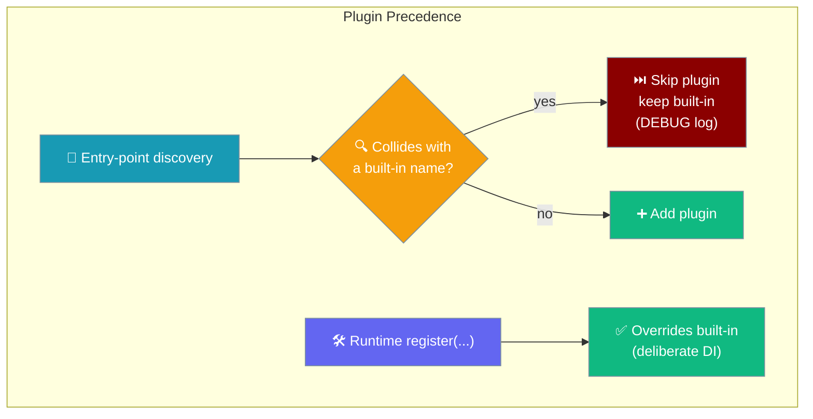
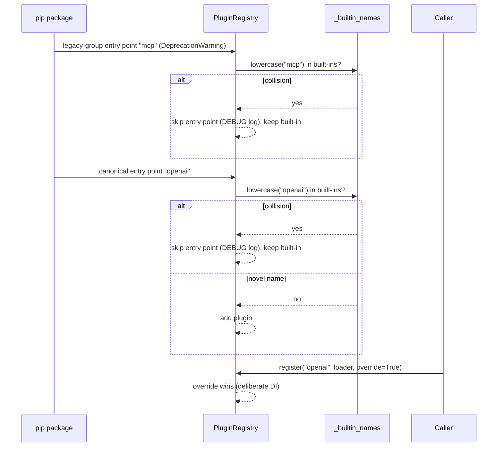

Every PraisonAI registry follows one rule: **a built-in name always wins over an entry-point plugin** — whichever entry-point group the plugin publishes under, canonical or a deprecated legacy spelling. Publishing a pip package with an entry point named `openai`, `docker`, or `aws` has no effect — the built-in resolves. Runtime `register(...)` is the only deliberate override path.

```python
from praisonai.llm.registry import get_default_llm_registry

# A pip plugin named "openai" is silently dropped (DEBUG log).
# The supported override is an explicit, in-process register(...) call:
def _my_openai():
    from my_pkg import MyOpenAI
    return MyOpenAI

get_default_llm_registry().register("openai", _my_openai, override=True)
```

The plugin author does not accidentally hijack a built-in through a `pyproject.toml`; overriding a built-in is always a deliberate, in-process decision.



## Quick Start

<Steps>
<Step title="Pick a name that does not collide">
Names are matched **case-insensitively** against the built-ins of the registry you target. `openai`, `OpenAI`, and `OPENAI` are the same key — pick something novel.

```toml
# pyproject.toml — additive plugin, resolves fine
[project.entry-points."praisonai.llm_providers"]
acme-llm = "acme_llm:AcmeProvider"
```
</Step>

<Step title="Override a built-in deliberately (runtime only)">
The one supported way to replace a built-in is an in-process `register(...)` call:

```python
from praisonai.llm.registry import get_default_llm_registry

def _my_openai():
    from acme_llm import PatchedOpenAI
    return PatchedOpenAI

get_default_llm_registry().register("openai", _my_openai, override=True)
```
</Step>

<Step title="Confirm what resolved">
Turn on `DEBUG` logging to see the collision line noting that a shipped built-in kept its name.

```bash
LOGLEVEL=DEBUG praisonai run "hello"
```
</Step>
</Steps>

---

## How It Works

Since [PraisonAI PR #4176](https://github.com/MervinPraison/PraisonAI/pull/4176) the guard lives in the base `PluginRegistry`, so every registry that subclasses it inherits the behaviour. It is enforced once, not re-asserted per registry.

Some registries also honour **deprecated (legacy) entry-point group spellings** for backward compatibility. Legacy discovery runs **first** (so the canonical spelling wins on a clash), and since [PraisonAI PR #4185](https://github.com/MervinPraison/PraisonAI/pull/4185) it applies the **same built-in check** — you cannot resurrect the old shadowing behaviour by falling back to a deprecated group.



| Path | Outcome |
|------|---------|
| Entry point under the **canonical** group, name collides with a built-in | **Skipped**; built-in kept. A `DEBUG` (not `WARNING`) line notes the collision. |
| Entry point under a **deprecated/legacy** group, name collides with a built-in | **Skipped**; built-in kept (`DEBUG` log) — same rule, applied on the legacy path since PR #4185. |
| Entry point under a legacy group, novel name | Added, **and** emits a `DeprecationWarning` naming the canonical group. |
| Entry point, novel name | Added; resolves and appears in listings. |
| Runtime `register(...)` | **Overrides** a built-in — deliberate dependency injection. |
| Matching | **Case-insensitive** — `OpenAI` and `openai` are the same key. |

<Note>
The log level is `DEBUG`, not `WARNING`. Packages that legitimately re-declare their own built-ins as entry points (for external discoverability) do not spam users' console output.
</Note>

---

## Every Registry Is Guarded

The two groups that matter most decide **where user code executes**: `praisonai.sandbox` and `praisonai.managed_backends`. A pip-installed package cannot silently take over `docker`.

| Entry-point group | Registry class | Runtime accessor | Example guarded built-ins |
|---|---|---|---|
| `praisonai.llm_providers` | `LLMProviderRegistry` | `get_default_llm_registry()` | `openai`, `anthropic`, `google` |
| `praisonai.sandbox` | sandbox registry | (sandbox registry) | `docker`, `local`, `e2b` |
| `praisonai.managed_backends` | `ManagedBackendRegistry` | `get_backend_registry()` | `docker` |
| `praisonai.deploy.providers` | deploy registry | (deploy registry) | `aws`, `azure`, `gcp`, `fly`, `railway`, `render` |
| `praisonai.tools.search` | `SearchProviderRegistry` | (search registry) | `tavily` |
| `praisonai.endpoints.providers` | `EndpointProviderRegistry` | `get_default_registry()` | `mcp` |
| `praisonai.external_agents` | `ExternalAgentRegistry` | `get_default_registry()` | `claude`, `gemini`, `codex`, `cursor` |
| `praisonai.tool_sources` / `praisonai.tools` | `ToolSourceRegistry` | (tool resolver) | all built-in tool sources |
| `praisonai.integrations` | `IntegrationRegistry` | `get_integrations_registry()` | all built-in integration names |
| `praisonai.persistence` | `StoreRegistry` | `get_default_registry(kind)` | all built-in stores |
| (framework adapters) | `FrameworkAdapterRegistry` | `get_default_registry()` | all built-in adapters |

<Note>
Accessor names differ per registry — read the source (or the per-registry page below) before wiring a runtime override. Several registries expose `get_default_registry()` from their own module.
</Note>

<Note>
Registries that honour a **deprecated/legacy group spelling** enforce the guard on that path too. Today the only one is `EndpointProviderRegistry` (canonical `praisonai.endpoint_providers`, legacy `praisonai.endpoints.providers`, built-in `mcp`). A pip package publishing `mcp` under the deprecated group can no longer replace the built-in `mcp` endpoint provider.
</Note>

---

## Compatibility

<Warning>
**Compatibility.** If your plugin previously relied on shadowing a built-in
name via a `pyproject.toml` entry point (for example, replacing `openai` in
`praisonai.llm_providers`), that no longer works after PR #4176. Move the
override to explicit runtime registration:

```python
from praisonai.llm.registry import get_default_llm_registry

def _my_openai():
    from my_pkg import MyOpenAI
    return MyOpenAI

get_default_llm_registry().register("openai", _my_openai, override=True)
```

Additive plugins (novel names) are unchanged. Switching to a **deprecated/legacy group spelling is not a workaround** — since PR #4185 the guard applies there too. Runtime `register(...)` remains the only supported override.
</Warning>

---

## Best Practices

<AccordionGroup>
<Accordion title="Namespace your plugin names">
Prefix or vendor-qualify a plugin name (`acme-openai`, `corp.pay_invoice`) so it never collides with a built-in on any surface, present or future.
</Accordion>
<Accordion title="Reserve register(...) for deliberate overrides">
A runtime `register(...)` call is in-process and explicit — exactly what you want when overriding a built-in is intentional (a tenant-specific provider, a test double). It cannot happen by accident through packaging.
</Accordion>
<Accordion title="Check collisions case-insensitively">
`OpenAI`, `openai`, and `OPENAI` are one key. When you audit a registry's built-ins before naming a plugin, lowercase both sides.
</Accordion>
<Accordion title="Debug with DEBUG logging">
A skipped collision writes a `DEBUG` line, not a warning. Run with `LOGLEVEL=DEBUG` to confirm which built-in kept its name.
</Accordion>
</AccordionGroup>

---

## Related

<CardGroup cols={2}>
<Card title="Integration Registry" icon="puzzle-piece" href="/features/integration-registry">
  `praisonai.integrations` entry points and built-in precedence
</Card>
<Card title="External CLI Integrations" icon="terminal" href="/features/external-cli-integrations">
  `claude`, `gemini`, `codex`, `cursor` are protected names
</Card>
<Card title="Tool Source Registry" icon="puzzle-piece" href="/features/tool-source-registry">
  Built-in tool sources win over entry-point sources
</Card>
<Card title="Tool Discovery Order" icon="list-tree" href="/features/tool-discovery-order">
  Where the plugin layer sits, and why built-ins outrank it
</Card>
<Card title="Compute Provider Plugins" icon="plug" href="/features/compute-provider-plugins">
  Sandbox / managed-backend names decide where code runs
</Card>
<Card title="Custom LLM Provider" icon="robot" href="/models/custom-provider">
  Override `openai` / `anthropic` / `google` at runtime
</Card>
<Card title="Plugins" icon="puzzle-piece" href="/features/plugins">
  Write, load, and ship plugins as pip packages
</Card>
<Card title="Pure Mode" icon="ban" href="/features/pure-mode">
  Skip entry-point discovery for a single run
</Card>
</CardGroup>
