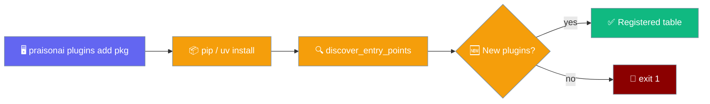
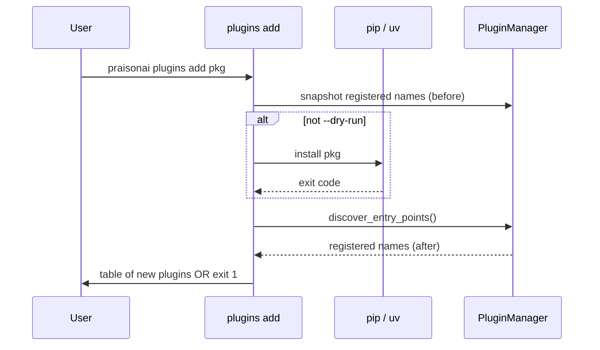
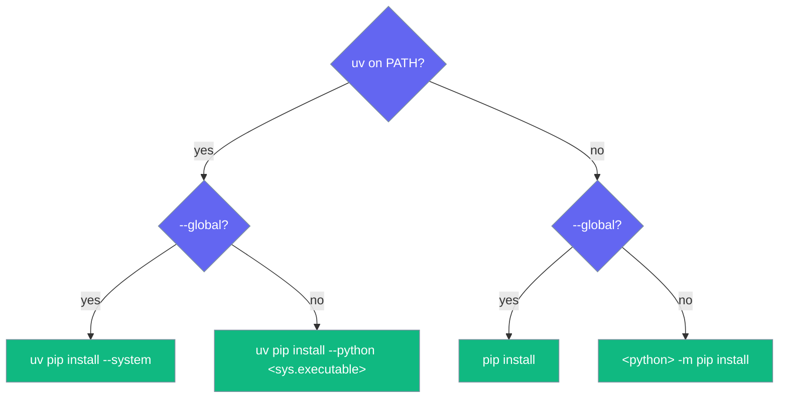

One command installs a plugin package and tells you exactly which plugins registered — or exits non-zero if nothing did.



Previously a package could `pip install` cleanly yet register nothing — a silent failure. `plugins add` turns that into a surfaced non-zero exit.

## Quick Start

<Steps>
<Step title="Install a plugin">

```bash
praisonai plugins add praisonai-my-plugin
```

<Note>`praisonai-my-plugin` is a placeholder — replace it with a real pip requirement spec.</Note>

</Step>

<Step title="Upgrade an installed plugin">

```bash
praisonai plugins add praisonai-my-plugin --upgrade
```

</Step>

<Step title="Verify without installing">

```bash
praisonai plugins add praisonai-my-plugin --dry-run
```

`--dry-run` skips installation and reports whether anything **new** would register from what's already installed.

</Step>
</Steps>

<Tip>
After installing, run `praisonai plugins reload` to pick the plugin up in the current process without a restart — see [Plugins CLI → reload](/cli/plugins#reload-plugins).
</Tip>

---

## How It Works

The command snapshots registered plugins, installs, refreshes discovery, then reports the diff.



| Step | What happens |
|------|--------------|
| **Snapshot** | Records current entry-point plugin names via `get_plugin_manager().list_plugins()` |
| **Install** | Skipped on `--dry-run`; otherwise runs the resolved installer command |
| **Refresh** | `get_plugin_manager().discover_entry_points()` scans the `praisonai.plugins` group |
| **Diff** | `sorted(after − before)` — new names become table rows |

<Note>
**Built-in names can't be taken over.** PraisonAI's registries subclass the base `PluginRegistry`, so since [PR #4176](https://github.com/MervinPraison/PraisonAI/pull/4176) an entry point whose name (case-insensitive) matches a shipped built-in is skipped during discovery — it never appears in the "Registered" diff, and a `DEBUG` line notes the collision. Ship your plugin under a distinct name, or override deliberately with a runtime `register(...)` call. See [Plugin Precedence](/features/plugin-precedence).
</Note>

---

## Options

| Argument / flag | Type | Default | Description |
|-----------------|------|---------|-------------|
| `package` | positional `str` | *(required)* | pip requirement spec — anything `pip install` / `uv pip install` accepts (name, `name==1.2.3`, VCS URL, path, extras) |
| `--dry-run` | flag | `False` | Skip installation; run discovery only. Exits non-zero if nothing new is discovered |
| `--upgrade`, `-U` | flag | `False` | Append `--upgrade` so an already-installed package is upgraded |
| `--global` | flag | `False` | Install into the ambient/system environment instead of the CLI interpreter |

---

## How the Installer Is Chosen

The command pins installation to the interpreter running the CLI so the package lands where discovery will look — not in a nearby `.venv` that `uv` might auto-discover.



`--upgrade` appends `--upgrade` to whichever command runs, then the package spec.

---

## Exit Codes

| Situation | Exit code |
|-----------|-----------|
| At least one new plugin registered | `0` |
| Installer command returned non-zero | `1` |
| Install succeeded but nothing new discovered | `1` |
| `--dry-run` and nothing new discovered | `1` |
| `praisonaiagents` not importable at all | `1` |

---

## Output Shape

A successful run prints a Rich table titled `Registered N plugin(s) from <package>`:

```text
        Registered 1 plugin from praisonai-my-plugin
┏━━━━━━━━━━━━━━━┳━━━━━━━━━━━┳━━━━━━━━━━━━━━━━━━━━━━━━┓
┃ Plugin        ┃ Type      ┃ Hooks                  ┃
┡━━━━━━━━━━━━━━━╇━━━━━━━━━━━╇━━━━━━━━━━━━━━━━━━━━━━━━┩
│ my_plugin     │ plugin    │ before_tool,after_tool │
└───────────────┴───────────┴────────────────────────┘
```

On `--dry-run` the title verb is `Discovered` instead of `Registered`.

---

## Common Patterns

<Tabs>
<Tab title="Default (pin to CLI interpreter)">

```bash
praisonai plugins add praisonai-my-plugin
```

When `uv` is present, the package is pinned to the CLI interpreter so discovery finds it — not a nearby `.venv`.

</Tab>

<Tab title="Global install">

```bash
praisonai plugins add praisonai-my-plugin --global
```

Installs into the ambient/system environment (`uv pip install --system`, or plain `pip install`).

</Tab>

<Tab title="CI verification">

```bash
praisonai plugins add praisonai-my-plugin --dry-run
```

Fails the job (exit 1) if the package no longer registers after another change — a cheap regression guard.

</Tab>
</Tabs>

---

## Best Practices

<AccordionGroup>
<Accordion title="Use --dry-run in CI to catch silent breakage">
A package can install cleanly yet register nothing. `--dry-run` exits non-zero when discovery finds nothing new, turning a silent failure into a failed check.
</Accordion>
<Accordion title="Prefer the default over --global">
The default pins to the CLI interpreter so the plugin is discoverable by the same process. Reach for `--global` only when you deliberately want the system environment.
</Accordion>
<Accordion title="Pin versions for reproducible installs">
Pass a full spec like `praisonai-my-plugin==1.2.3` so the installed version is deterministic across machines.
</Accordion>
<Accordion title="Inspect after installing">
Run `praisonai plugins list` to see everything registered, not just what this command added.
</Accordion>
</AccordionGroup>

---

## Related

<CardGroup cols={2}>
<Card title="Plugins" icon="puzzle-piece" href="/features/plugins">
  Write, load, and configure plugins
</Card>
<Card title="Message-Lifecycle Plugins" icon="webhook" href="/features/plugins#message-lifecycle-plugins">
  Override `before_message`, `after_message`, `message_sent`, and `message_undelivered`
</Card>
<Card title="Plugins CLI" icon="plug" href="/cli/plugins">
  List, enable, disable, reload, and diagnose plugins
</Card>
<Card title="tools add" icon="download" href="/features/tools-add">
  Install a tool package and verify its tools
</Card>
<Card title="Tool Source Registry" icon="puzzle-piece" href="/features/tool-source-registry">
  Plug third-party tool sources via entry points
</Card>
<Card title="Tool Resolver" icon="wrench" href="/features/tool-resolver">
  Single source of truth for loading tools
</Card>
</CardGroup>
