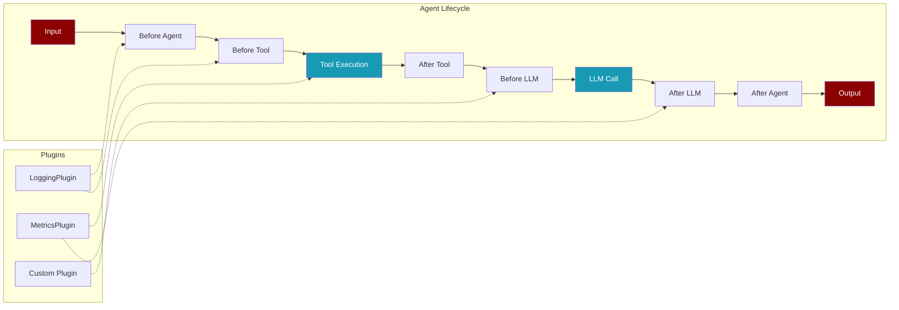

Plugins extend agent functionality by hooking into lifecycle events.



<CardGroup cols={2}>
  <Card title="Built-in Plugins" icon="box" href="#built-in-plugins">
    Ready-to-use logging and metrics plugins
  </Card>
  <Card title="Plugin SDK" icon="code" href="#plugin-sdk">
    Create custom plugins with decorators
  </Card>
  <Card title="Protocol-Driven" icon="shield" href="#protocols">
    Type-safe plugin interfaces
  </Card>
  <Card title="Zero Overhead" icon="bolt" href="#performance">
    Lazy loading, no performance impact
  </Card>
</CardGroup>

## Quick Start

<Tabs>
  <Tab title="Built-in Plugin">
```python
from praisonaiagents.plugins import PluginManager
from praisonaiagents.plugins.builtin import LoggingPlugin, MetricsPlugin

manager = PluginManager()
manager.register(LoggingPlugin())
manager.register(MetricsPlugin())
```
  </Tab>
  <Tab title="Custom Plugin">
```python
from praisonaiagents.plugins import Plugin, PluginInfo, PluginHook

class MyPlugin(Plugin):
    @property
    def info(self):
        return PluginInfo(
            name="my_plugin",
            version="1.0.0",
            hooks=[PluginHook.BEFORE_TOOL]
        )
    
    def before_tool(self, tool_name, args):
        print(f"Calling {tool_name}")
        return args

manager = PluginManager()
manager.register(MyPlugin())
```
  </Tab>
</Tabs>

## Built-in Plugins

<AccordionGroup>
  <Accordion title="LoggingPlugin" icon="file-lines">
    Logs agent lifecycle events for debugging and monitoring.

```python
from praisonaiagents.plugins.builtin import LoggingPlugin
import logging

# Basic usage
plugin = LoggingPlugin()

# With custom configuration
plugin = LoggingPlugin(
    level=logging.DEBUG,
    log_tools=True,
    log_agents=True,
    log_llm=False
)
```

**Options:**
- `level` - Logging level (default: `logging.INFO`)
- `log_tools` - Log tool events (default: `True`)
- `log_agents` - Log agent events (default: `True`)
- `log_llm` - Log LLM events (default: `False`)
  </Accordion>

  <Accordion title="MetricsPlugin" icon="chart-line">
    Collects metrics for performance analysis.

```python
from praisonaiagents.plugins.builtin import MetricsPlugin

plugin = MetricsPlugin()
manager.register(plugin)

# After agent execution
metrics = plugin.get_metrics()
print(metrics)
# {
#   "uptime_seconds": 10.5,
#   "tools": {"search": {"call_count": 3, "avg_duration_ms": 150}},
#   "agent": {"prompt_count": 5, "response_count": 5},
#   "llm": {"call_count": 5, "total_input_tokens": 1000}
# }

# Reset metrics
plugin.reset_metrics()
```
  </Accordion>
</AccordionGroup>

## Plugin SDK

Create plugins using the SDK for simpler development.

<Steps>
  <Step title="Import SDK">
```python
from praisonaiagents.plugins.sdk import Plugin, PluginInfo, PluginHook
```
  </Step>
  <Step title="Define Plugin Class">
```python
class MyPlugin(Plugin):
    @property
    def info(self):
        return PluginInfo(
            name="my_plugin",
            version="1.0.0",
            description="My custom plugin",
            hooks=[PluginHook.BEFORE_TOOL, PluginHook.AFTER_TOOL]
        )
```
  </Step>
  <Step title="Implement Hooks">
```python
    def before_tool(self, tool_name, args):
        # Modify args before tool execution
        args["timestamp"] = time.time()
        return args
    
    def after_tool(self, tool_name, result):
        # Process result after tool execution
        return result
```
  </Step>
  <Step title="Register Plugin">
```python
from praisonaiagents.plugins import PluginManager

manager = PluginManager()
manager.register(MyPlugin())
```
  </Step>
</Steps>

## Protocols

Type-safe plugin interfaces using Python protocols.

```python
from praisonaiagents.plugins import (
    PluginProtocol,
    ToolPluginProtocol,
    HookPluginProtocol,
    AgentPluginProtocol,
    LLMPluginProtocol
)

# Check if object implements protocol
if isinstance(my_plugin, PluginProtocol):
    print("Valid plugin!")

# Implement specific protocol
class MyToolPlugin:
    @property
    def name(self) -> str:
        return "tool_provider"
    
    @property
    def version(self) -> str:
        return "1.0.0"
    
    def on_init(self, context):
        pass
    
    def on_shutdown(self):
        pass
    
    def get_tools(self):
        return [{"name": "my_tool", "description": "Does something"}]

# Type checker validates implementation
assert isinstance(MyToolPlugin(), ToolPluginProtocol)
```

## Available Hooks

| Hook | When Called | Can Modify |
|------|-------------|------------|
| `ON_INIT` | Plugin initialization | Context |
| `ON_SHUTDOWN` | Plugin shutdown | - |
| `BEFORE_AGENT` | Before agent execution | Prompt |
| `AFTER_AGENT` | After agent execution | Response |
| `BEFORE_TOOL` | Before tool call | Arguments |
| `AFTER_TOOL` | After tool call | Result |
| `BEFORE_LLM` | Before LLM call | Messages, Params |
| `AFTER_LLM` | After LLM response | Response |
| `ON_PERMISSION_ASK` | Permission requested | Approval |
| `ON_CONFIG` | Configuration loaded | Config |
| `ON_AUTH` | Authentication needed | Credentials |

## Folder Structure

```
praisonaiagents/plugins/
├── __init__.py           # Public exports
├── protocols.py          # Plugin protocols
├── manager.py            # PluginManager
├── plugin.py             # Plugin base class
├── sdk/                  # Plugin SDK
│   ├── __init__.py
│   └── decorators.py
└── builtin/              # Built-in plugins
    ├── __init__.py
    ├── logging_plugin.py
    └── metrics_plugin.py
```

## Examples

<Tabs>
  <Tab title="Function Plugin">
```python
from praisonaiagents.plugins import PluginManager
from praisonaiagents.plugins.sdk import FunctionPlugin, PluginHook

def log_tool_calls(tool_name, args):
    print(f"Tool: {tool_name}, Args: {args}")
    return args

plugin = FunctionPlugin(
    name="logger",
    hooks={PluginHook.BEFORE_TOOL: log_tool_calls}
)

manager = PluginManager()
manager.register(plugin)
```
  </Tab>
  <Tab title="Directory Loading">
```python
# plugins/my_plugin.py
from praisonaiagents.plugins import Plugin, PluginInfo

class MyPlugin(Plugin):
    @property
    def info(self):
        return PluginInfo(name="my_plugin")

# main.py
manager = PluginManager()
count = manager.load_from_directory("./plugins")
print(f"Loaded {count} plugins")
```
  </Tab>
  <Tab title="Tool Provider">
```python
from praisonaiagents.plugins import Plugin, PluginInfo

class CalculatorPlugin(Plugin):
    @property
    def info(self):
        return PluginInfo(name="calculator")
    
    def get_tools(self):
        return [{
            "name": "calculate",
            "description": "Perform math calculations",
            "function": lambda expr: eval(expr),
            "parameters": {
                "type": "object",
                "properties": {"expr": {"type": "string"}}
            }
        }]

manager = PluginManager()
manager.register(CalculatorPlugin())
tools = manager.get_all_tools()
```
  </Tab>
</Tabs>

## Performance

<Note>
Plugins use lazy loading and have zero overhead when not used. All imports are deferred until the plugin is actually accessed.
</Note>

```python
# This import is instant - no plugins loaded yet
from praisonaiagents.plugins import PluginManager

# Plugins only load when registered
manager = PluginManager()
manager.register(LoggingPlugin())  # LoggingPlugin loads here
```
