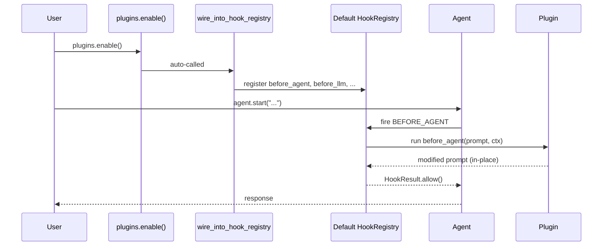
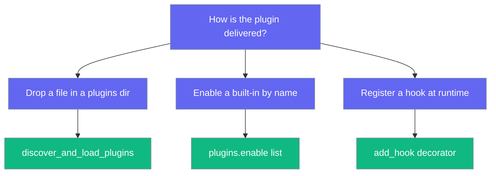
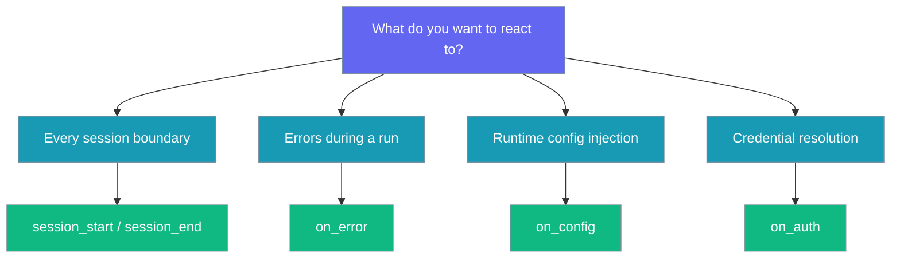
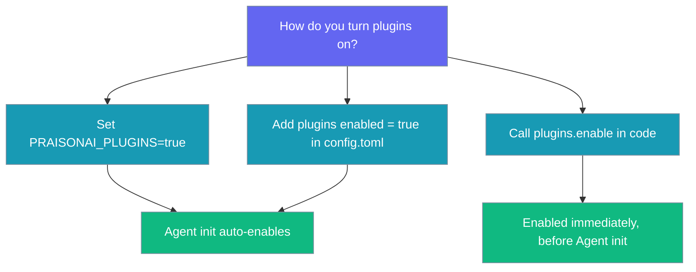

Plugins add tools, hooks, and guardrails to agents — drop a Python file in `~/.praisonai/plugins/` and load it in one line.

```python
from praisonaiagents import Agent, discover_and_load_plugins

discover_and_load_plugins()

agent = Agent(
    name="Assistant",
    instructions="Help users with weather queries.",
    tools=["get_weather"],
)
agent.start("What's the weather in Paris?")
```

The user asks a question; plugins add tools and hooks before the agent answers.


```mermaid
graph LR
    Plugin[🔧 Plugin file] --> Load[discover_and_load_plugins]
    Load --> Agent[🤖 Agent gains tools + hooks]

    classDef input fill:#8B0000,stroke:#7C90A0,color:#fff
    classDef process fill:#189AB4,stroke:#7C90A0,color:#fff
    classDef output fill:#10B981,stroke:#7C90A0,color:#fff
    class Plugin input
    class Load process
    class Agent output
```

## Quick Start

<Steps>
<Step title="Simple Usage">

Create `~/.praisonai/plugins/my_tools.py`:

```python
"""
Plugin Name: My Tools
Description: Custom tools for my agent
Version: 1.0.0
"""

from praisonaiagents import tool

@tool
def get_weather(city: str) -> str:
    """Get weather for a city."""
    return f"Sunny in {city}, 22°C"
```

Load and run:

```python
from praisonaiagents import Agent, discover_and_load_plugins

discover_and_load_plugins()

agent = Agent(
    name="Assistant",
    instructions="Help users",
    tools=["get_weather"],
)
agent.start("What's the weather in Paris?")
```

</Step>

<Step title="With Configuration">

Point the environment (or config file) at plugins and Agent construction wires them for you — no explicit `plugins.enable()` call needed:

```bash
export PRAISONAI_PLUGINS=true
```

```python
from praisonaiagents import Agent

agent = Agent(name="Assistant", instructions="Help users")
agent.start("Hello!")   # entry-point plugins are wired in before this runs
```

Prefer to turn plugins on in code? Call `plugins.enable(...)` before creating the agent:

```python
from praisonaiagents import Agent, plugins

plugins.enable(["logging", "metrics"])

agent = Agent(name="Assistant", instructions="Help users")
agent.start("Hello!")
```

</Step>
</Steps>

<Note>
Place plugins in `~/.praisonai/plugins/` (user-wide) or `./.praisonai/plugins/` (project-specific).
</Note>

<Warning>
`plugins.enable()` auto-discovers filesystem and entry-point plugins only when `PRAISONAI_ALLOW_PLUGIN_DISCOVERY=true` (or `1`/`yes`). Without this env var, `plugins.enable()` still bridges plugins you register manually via `PluginManager.register(...)`, but no directory or entry-point scan runs.
</Warning>

---

## How It Works

`plugins.enable()` auto-calls `wire_into_hook_registry()`, which registers each enabled plugin's lifecycle methods on the default hook registry the agent consults at runtime — and Agent init calls this for you when the env var or config file requests it (see [Auto-Enable from Env or Config](#auto-enable-from-env-or-config)).


```mermaid
sequenceDiagram
    participant User
    participant Enable as plugins.enable()
    participant Bridge as wire_into_hook_registry
    participant Registry as Default HookRegistry
    participant Agent
    participant Plugin

    User->>Enable: plugins.enable()
    Enable->>Bridge: auto-called
    Bridge->>Registry: register before_agent, before_llm, ...
    User->>Agent: agent.start("...")
    Agent->>Registry: fire BEFORE_AGENT
    Registry->>Plugin: run before_agent(prompt, ctx)
    Plugin-->>Registry: modified prompt (in-place)
    Registry-->>Agent: HookResult.allow()
    Agent-->>User: response
```

The hooks fire in this order around each agent run:


```mermaid
graph LR
    INPUT["📥 User Input"] --> BA["🪝 before_agent"]
    BA --> BTD["🪝 before_tool_definitions"]
    BTD --> LLM["🧠 LLM"]
    LLM --> BT["🪝 before_tool"]
    BT --> TOOL["🔧 Tool"]
    TOOL --> AT["🪝 after_tool"]
    AT --> AA["🪝 after_agent"]
    AA --> OUTPUT["📤 Response"]

    classDef input fill:#8B0000,stroke:#7C90A0,color:#fff
    classDef hook fill:#6366F1,stroke:#7C90A0,color:#fff
    classDef process fill:#189AB4,stroke:#7C90A0,color:#fff

    class INPUT,OUTPUT input
    class BA,BTD,BT,AT,AA hook
    class TOOL,LLM process
```

| Plugin type | What it adds |
|-------------|--------------|
| **Tool** | Functions registered via `@tool` |
| **Hook** | Lifecycle callbacks (`before_tool`, `before_tool_definitions`, `after_llm`, …) |
| **Guardrail** | Output validation on `after_agent` |

---

## Choosing How to Load Plugins

Pick the loading method that fits your setup.


```mermaid
graph TB
    Q[How is the plugin delivered?] --> A[Drop a file in a plugins dir]
    Q --> B[Enable a built-in by name]
    Q --> C[Register a hook at runtime]
    A --> R1[discover_and_load_plugins]
    B --> R2[plugins.enable list]
    C --> R3[add_hook decorator]

    classDef decision fill:#6366F1,stroke:#7C90A0,color:#fff
    classDef option fill:#10B981,stroke:#7C90A0,color:#fff
    class Q,A,B,C decision
    class R1,R2,R3 option
```

## Plugin Locations

| Location | Scope |
|----------|-------|
| `~/.praisonai/plugins/` | User-wide |
| `./.praisonai/plugins/` | Project-specific |

---

## Hook Plugin Example

Create `~/.praisonai/plugins/my_logger.py`:

```python
"""
Plugin Name: My Logger
Description: Logs tool calls
Version: 1.0.0
Hooks: before_tool, after_tool
"""

from praisonaiagents.hooks import add_hook

@add_hook("before_tool")
def log_before(data):
    print(f"Calling: {data.tool_name}")

@add_hook("after_tool")
def log_after(data):
    print(f"Done: {data.tool_name}")
```

Create `~/.praisonai/plugins/tool_sandbox.py` to filter advertised tools:

```python
"""
Plugin Name: Tool Sandbox
Description: Filters tool definitions sent to the LLM
Version: 1.0.0
Hooks: before_tool_definitions
"""

from praisonaiagents.hooks import add_hook

BLOCKED = {"delete_file", "shell_exec"}

@add_hook("before_tool_definitions")
def sandbox_tools(data):
    data.tool_definitions[:] = [
        t for t in data.tool_definitions
        if t["function"]["name"] not in BLOCKED
    ]
```

```python
from praisonaiagents import Agent, discover_and_load_plugins

discover_and_load_plugins()
agent = Agent(name="Assistant", instructions="Help users")
agent.start("Search for Python tutorials")
```

---

## Lifecycle-Method Plugins

Subclass `Plugin` and override a lifecycle method to transform prompts, messages, or responses. Call `plugins.enable()` — or set `PRAISONAI_PLUGINS=true` / `[plugins] enabled = true` and let Agent construction wire it — to activate the method at runtime.

Create `~/.praisonai/plugins/pii_redactor.py`:

```python
"""
Plugin Name: PII Redactor
Description: Scrubs SSNs from LLM responses
Version: 1.0.0
"""
import re
from praisonaiagents import Plugin, PluginInfo, PluginHook

class PIIRedactor(Plugin):
    @property
    def info(self):
        return PluginInfo(
            name="pii_redactor",
            version="1.0.0",
            description="Scrubs SSNs from LLM responses",
            hooks=[PluginHook.AFTER_LLM],
        )

    def after_llm(self, response: str, usage: dict) -> str:
        return re.sub(r"\b\d{3}-\d{2}-\d{4}\b", "[SSN]", response)

def create_plugin():
    return PIIRedactor()
```

Load and enable:

```python
from praisonaiagents import Agent, plugins

plugins.enable()   # bridges lifecycle methods into the runtime hook registry

agent = Agent(name="Assistant", instructions="Help users.")
agent.start("My SSN is 123-45-6789")   # response is redacted before the user sees it
```

---

## Session & Error Lifecycle Plugins

Override `session_start`, `session_end`, `on_error`, `on_config`, or `on_auth` to react to session boundaries, errors, config, and credential resolution.

### Choosing a lifecycle event


```mermaid
graph TB
    Q[What do you want to react to?] --> A[Every session boundary]
    Q --> B[Errors during a run]
    Q --> C[Runtime config injection]
    Q --> D[Credential resolution]
    A --> R1[session_start / session_end]
    B --> R2[on_error]
    C --> R3[on_config]
    D --> R4[on_auth]

    classDef decision fill:#6366F1,stroke:#7C90A0,color:#fff
    classDef option fill:#189AB4,stroke:#7C90A0,color:#fff
    classDef result fill:#10B981,stroke:#7C90A0,color:#fff
    class Q decision
    class A,B,C,D option
    class R1,R2,R3,R4 result
```

### Observe sessions

`session_start` and `session_end` observe when a session opens and closes.

```python
from praisonaiagents import Agent, plugins

plugins.enable()

agent = Agent(name="Assistant", instructions="Help users.")
agent.start("Hello!")
```

Create `~/.praisonai/plugins/session_logger.py`:

```python
"""
Plugin Name: Session Logger
Description: Records when sessions start and end
Version: 1.0.0
"""
from praisonaiagents.plugins import Plugin, PluginInfo, PluginHook

class SessionLogger(Plugin):
    @property
    def info(self):
        return PluginInfo(
            name="session_logger",
            hooks=[PluginHook.SESSION_START, PluginHook.SESSION_END],
        )

    def session_start(self, context):
        print(f"session started: {context.get('session_name')}")

    def session_end(self, context):
        print(f"session ended: {context.get('reason')} after {context.get('total_turns')} turns")

def create_plugin():
    return SessionLogger()
```

### Observe errors

`on_error` observes errors during a run — use it to log without changing behavior.

```python
from praisonaiagents import Agent, plugins

plugins.enable()

agent = Agent(name="Assistant", instructions="Help users.")
agent.start("Do something that might fail")
```

Create `~/.praisonai/plugins/error_reporter.py`:

```python
"""
Plugin Name: Error Reporter
Description: Logs errors during agent runs
Version: 1.0.0
"""
from praisonaiagents.plugins import Plugin, PluginInfo, PluginHook

class ErrorReporter(Plugin):
    @property
    def info(self):
        return PluginInfo(
            name="error_reporter",
            hooks=[PluginHook.ON_ERROR],
        )

    def on_error(self, error_type, error_message, context):
        print(f"{error_type}: {error_message}")
        print(context.get("stack_trace"))

def create_plugin():
    return ErrorReporter()
```

### Rewrite config

`on_config` returns a `dict` to rewrite runtime configuration in place.

```python
from praisonaiagents import Agent, plugins

plugins.enable()

agent = Agent(name="Assistant", instructions="Help users.")
agent.start("Hello!")
```

Create `~/.praisonai/plugins/config_defaults.py`:

```python
"""
Plugin Name: Config Defaults
Description: Injects a default temperature into runtime config
Version: 1.0.0
"""
from praisonaiagents.plugins import Plugin, PluginInfo, PluginHook

class ConfigDefaults(Plugin):
    @property
    def info(self):
        return PluginInfo(
            name="config_defaults",
            hooks=[PluginHook.ON_CONFIG],
        )

    def on_config(self, config):
        config.setdefault("temperature", 0.2)
        return config

def create_plugin():
    return ConfigDefaults()
```

### Inject credentials

`on_auth` returns a `dict` of credentials — the bridge writes them back even when `credentials` starts as `None`, so first-time injection works.

```python
from praisonaiagents import Agent, plugins

plugins.enable()

agent = Agent(name="Assistant", instructions="Help users.")
agent.start("Call the authenticated API")
```

Create `~/.praisonai/plugins/token_injector.py`:

```python
"""
Plugin Name: Token Injector
Description: Supplies credentials on first-time auth
Version: 1.0.0
"""
import os
from praisonaiagents.plugins import Plugin, PluginInfo, PluginHook

class TokenInjector(Plugin):
    @property
    def info(self):
        return PluginInfo(
            name="token_injector",
            hooks=[PluginHook.ON_AUTH],
        )

    def on_auth(self, auth_type, credentials):
        return {"token": os.environ["MY_API_TOKEN"]}

def create_plugin():
    return TokenInjector()
```

---

## Auto-Enable from Env or Config

Agent construction auto-enables plugins when the environment or config file requests it — no explicit `plugins.enable()` call needed.

Set the env var, then any `Agent(...)` wires plugins before it runs:

```bash
export PRAISONAI_PLUGINS=true
```

```python
from praisonaiagents import Agent

agent = Agent(name="Assistant", instructions="Help users")
agent.start("Hello!")   # plugins are already active
```

Or turn them on in `.praisonai/config.toml`:

```toml
[plugins]
enabled = true          # or false, or ["logging", "metrics"]
```

Under the hood, Agent init calls `plugins.maybe_enable_from_config()`, which reads the env var and config file, then runs `enable(get_enabled_plugins())` exactly once per process.


```mermaid
graph TB
    Q[How do you turn plugins on?] --> A[Set PRAISONAI_PLUGINS=true]
    Q --> B[Add plugins enabled = true in config.toml]
    Q --> C[Call plugins.enable in code]
    A --> R1[Agent init auto-enables]
    B --> R1
    C --> R2[Enabled immediately, before Agent init]

    classDef decision fill:#6366F1,stroke:#7C90A0,color:#fff
    classDef option fill:#189AB4,stroke:#7C90A0,color:#fff
    classDef result fill:#10B981,stroke:#7C90A0,color:#fff
    class Q decision
    class A,B,C option
    class R1,R2 result
```

Precedence: **explicit `plugins.enable(...)` > `PRAISONAI_PLUGINS` env var > `[plugins]` in `config.toml` > disabled**.

<Note>
`maybe_enable_from_config()` is idempotent and runs at most once per process, so instantiating multiple agents is safe — plugins are wired a single time.
</Note>

<Warning>
Auto-enable does **not** imply discovery. Filesystem and entry-point scanning still require `PRAISONAI_ALLOW_PLUGIN_DISCOVERY=true` (or `1`/`yes`). Without it, only plugins registered manually via `PluginManager.register(...)` are bridged.
</Warning>

<Tip>
Verify auto-enable at runtime — constructing an Agent triggers the wiring:

```python
from praisonaiagents import Agent, plugins

Agent(name="probe", instructions="noop")   # triggers maybe_enable_from_config
print(plugins.is_enabled(), plugins.list_plugins())
```
</Tip>

---

## How the Bridge Works

`plugins.enable()` auto-calls `wire_into_hook_registry()` — no manual step. Only lifecycle methods a plugin actually overrides (or declares in `PluginInfo.hooks`) are bridged, so a plugin with one guardrail never fires on every event. Return a new value and the bridge writes it back onto the payload in place. Errors in a lifecycle method are non-fatal, and `plugins.disable([...])` calls `unwire_from_hook_registry(name)` so the plugin truly stops firing.

| Plugin method | Hook event | In-place mutation |
|---------------|-----------|-------------------|
| `before_agent(prompt, ctx)` | `BEFORE_AGENT` | Return a `str` → rewrites `data.prompt` |
| `after_agent(response, ctx)` | `AFTER_AGENT` | Return a `str` → rewrites `data.response` |
| `before_llm(messages, params)` | `BEFORE_LLM` | Return `(new_messages, ...)` → replaces `data.messages` |
| `after_llm(response, usage)` | `AFTER_LLM` | Return a `str` → rewrites `data.response` |
| `before_tool(name, args)` | `BEFORE_TOOL` | Return a `dict` → replaces `data.tool_input` |
| `after_tool(name, result)` | `AFTER_TOOL` | Observational (no mutation) |
| `before_tool_definitions(defs)` | `BEFORE_TOOL_DEFINITIONS` | Return a `list` → replaces `data.tool_definitions` |
| `before_message(msg)` | `MESSAGE_RECEIVED` | Return `{"content": "..."}` → rewrites `data.content` |
| `after_message(msg)` | `MESSAGE_SENDING` | Return `{"content": "..."}` → rewrites `data.content` |
| `on_permission_ask(target, reason)` | `ON_PERMISSION_ASK` | `True`/`False`/`None` → allow/deny/allow |
| `on_config(config)` | `ON_CONFIG` | Return a `dict` → rewrites `data.config` |
| `on_auth(auth_type, credentials)` | `ON_AUTH` | Return a `dict` → rewrites `data.credentials` (works when starting as `None`) |
| `session_start(context)` | `SESSION_START` | Observational (session `source`, `session_name`, `session_id`) |
| `session_end(context)` | `SESSION_END` | Observational (`reason`, `total_turns`, `total_tokens`, `session_id`) |
| `on_error(error_type, error_message, context)` | `ON_ERROR` | Observational (`stack_trace`, nested `context`, `session_id`) |

`on_config` and `on_auth` write their returned dict back onto the payload even when the target attribute starts as `None` — so a plugin can inject credentials the first time they're requested, not only edit an existing dict.

---

## Ship a Plugin as a pip Package

Register your plugin class in the `praisonai.plugins` entry-point group in `pyproject.toml`:

```toml
[project.entry-points."praisonai.plugins"]
my_plugin = "my_package.plugins:MyPlugin"
```

Agent construction (or `plugins.enable()`) auto-discovers and bridges it — no user code changes needed.

---

## CLI Commands

```bash
praisonai plugins init my_plugin
praisonai plugins list
praisonai plugins scan --verbose
```

---

## Configuration Options

| Field | Required | Description |
|-------|----------|-------------|
| `Plugin Name` | Yes | Display name in plugin header |
| `Description` | Yes | What the plugin does |
| `Version` | Yes | Semantic version |
| `Hooks` | No | Hook events this plugin registers |

---

## Best Practices

<AccordionGroup>
<Accordion title="Keep plugins single-purpose">
One file per concern — weather tools, logging, or guardrails, not all three.
</Accordion>
<Accordion title="Call discover_and_load_plugins() once">
Load before creating the agent so tools and hooks register globally.
</Accordion>
<Accordion title="Reference tools by name">
Pass `tools=["get_weather"]` — the string must match the `@tool` function name.
</Accordion>
<Accordion title="Use plugins.enable for built-ins">
Enable `logging` and `metrics` without writing plugin files.
</Accordion>
<Accordion title="Call plugins.enable() to activate lifecycle methods">
Tools and guardrails work without `plugins.enable()`. But lifecycle-method plugins (subclasses of `Plugin` that override `before_llm`, `after_llm`, and so on) only fire after they are wired into the runtime hook registry. Call `plugins.enable()` explicitly, or set `PRAISONAI_PLUGINS=true` / `[plugins] enabled = true` and Agent construction wires them automatically.
</Accordion>
</AccordionGroup>

---

## Related

<CardGroup cols={2}>
<Card title="Hooks" icon="webhook" href="/docs/features/hooks">
  Hook events and the HookRegistry API
</Card>
<Card title="Toolsets" icon="wrench" href="/docs/features/toolsets">
  Create and register custom agent tools
</Card>
<Card title="Config File" icon="file-code" href="/docs/features/config-file">
  Turn plugins on from `[plugins]` in `config.toml`
</Card>
<Card title="Tool Discovery" icon="list-tree" href="/docs/features/tool-discovery-order">
  How Agent resolves tool names at runtime
</Card>
</CardGroup>
