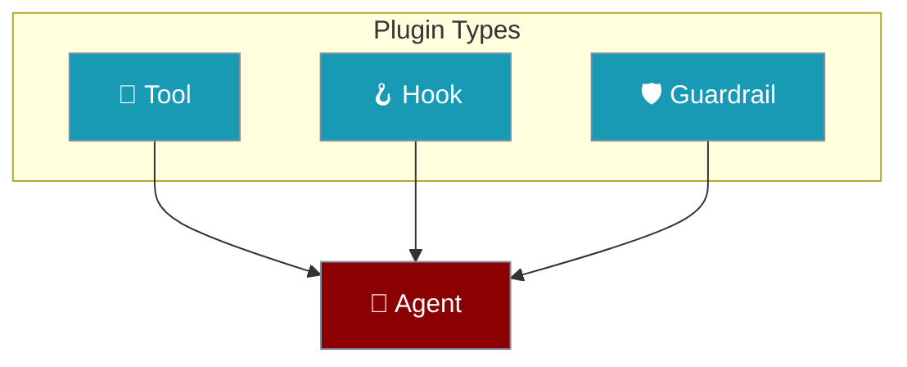
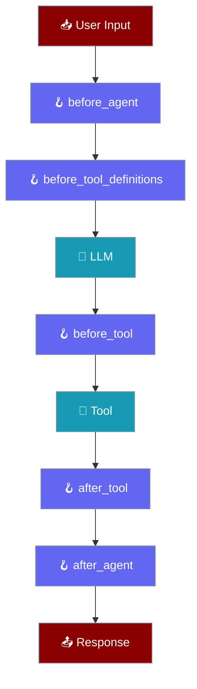

Plugins add tools, hooks, and guardrails to agents — drop a Python file in `~/.praisonai/plugins/` and load it in one line.

```python
from praisonaiagents import Agent, discover_and_load_plugins

discover_and_load_plugins()

agent = Agent(
    name="Assistant",
    instructions="Help users with weather queries.",
    tools=["get_weather"],
)
agent.start("What's the weather in Paris?")
```

The user asks a question; plugins add tools and hooks before the agent answers.



```mermaid
graph TB
    subgraph "Plugin Types"
        TOOL["🔧 Tool"]
        HOOK["🪝 Hook"]
        GUARD["🛡️ Guardrail"]
    end

    TOOL --> CORE["🤖 Agent"]
    HOOK --> CORE
    GUARD --> CORE

    classDef tool fill:#189AB4,stroke:#7C90A0,color:#fff
    classDef agent fill:#8B0000,stroke:#7C90A0,color:#fff

    class TOOL,HOOK,GUARD tool
    class CORE agent
```

## Quick Start

<Steps>
<Step title="Simple Usage">

Create `~/.praisonai/plugins/my_tools.py`:

```python
"""
Plugin Name: My Tools
Description: Custom tools for my agent
Version: 1.0.0
"""

from praisonaiagents import tool

@tool
def get_weather(city: str) -> str:
    """Get weather for a city."""
    return f"Sunny in {city}, 22°C"
```

Load and run:

```python
from praisonaiagents import Agent, discover_and_load_plugins

discover_and_load_plugins()

agent = Agent(
    name="Assistant",
    instructions="Help users",
    tools=["get_weather"],
)
agent.start("What's the weather in Paris?")
```

</Step>

<Step title="With Configuration">

Enable built-in logging and metrics plugins without creating files:

```python
from praisonaiagents import Agent, plugins

plugins.enable(["logging", "metrics"])

agent = Agent(name="Assistant", instructions="Help users")
agent.start("Hello!")
```

</Step>
</Steps>

<Note>
Place plugins in `~/.praisonai/plugins/` (user-wide) or `./.praisonai/plugins/` (project-specific).
</Note>

---

## How It Works


```mermaid
flowchart TB
    INPUT["📥 User Input"] --> BA["🪝 before_agent"]
    BA --> BTD["🪝 before_tool_definitions"]
    BTD --> LLM["🧠 LLM"]
    LLM --> BT["🪝 before_tool"]
    BT --> TOOL["🔧 Tool"]
    TOOL --> AT["🪝 after_tool"]
    AT --> AA["🪝 after_agent"]
    AA --> OUTPUT["📤 Response"]

    classDef agent fill:#8B0000,stroke:#7C90A0,color:#fff
    classDef hook fill:#6366F1,stroke:#7C90A0,color:#fff
    classDef tool fill:#189AB4,stroke:#7C90A0,color:#fff

    class INPUT,OUTPUT agent
    class BA,BTD,BT,AT,AA hook
    class TOOL,LLM tool
```

| Plugin type | What it adds |
|-------------|--------------|
| **Tool** | Functions registered via `@tool` |
| **Hook** | Lifecycle callbacks (`before_tool`, `before_tool_definitions`, `after_llm`, …) |
| **Guardrail** | Output validation on `after_agent` |

---

## Plugin Locations

| Location | Scope |
|----------|-------|
| `~/.praisonai/plugins/` | User-wide |
| `./.praisonai/plugins/` | Project-specific |

---

## Hook Plugin Example

Create `~/.praisonai/plugins/my_logger.py`:

```python
"""
Plugin Name: My Logger
Description: Logs tool calls
Version: 1.0.0
Hooks: before_tool, after_tool
"""

from praisonaiagents.hooks import add_hook

@add_hook("before_tool")
def log_before(data):
    print(f"Calling: {data.tool_name}")

@add_hook("after_tool")
def log_after(data):
    print(f"Done: {data.tool_name}")
```

Create `~/.praisonai/plugins/tool_sandbox.py` to filter advertised tools:

```python
"""
Plugin Name: Tool Sandbox
Description: Filters tool definitions sent to the LLM
Version: 1.0.0
Hooks: before_tool_definitions
"""

from praisonaiagents.hooks import add_hook

BLOCKED = {"delete_file", "shell_exec"}

@add_hook("before_tool_definitions")
def sandbox_tools(data):
    data.tool_definitions[:] = [
        t for t in data.tool_definitions
        if t["function"]["name"] not in BLOCKED
    ]
```

```python
from praisonaiagents import Agent, discover_and_load_plugins

discover_and_load_plugins()
agent = Agent(name="Assistant", instructions="Help users")
agent.start("Search for Python tutorials")
```

---

## CLI Commands

```bash
praisonai plugins init my_plugin
praisonai plugins list
praisonai plugins scan --verbose
```

---

## Configuration Options

| Field | Required | Description |
|-------|----------|-------------|
| `Plugin Name` | Yes | Display name in plugin header |
| `Description` | Yes | What the plugin does |
| `Version` | Yes | Semantic version |
| `Hooks` | No | Hook events this plugin registers |

---

## Best Practices

<AccordionGroup>
<Accordion title="Keep plugins single-purpose">
One file per concern — weather tools, logging, or guardrails, not all three.
</Accordion>
<Accordion title="Call discover_and_load_plugins() once">
Load before creating the agent so tools and hooks register globally.
</Accordion>
<Accordion title="Reference tools by name">
Pass `tools=["get_weather"]` — the string must match the `@tool` function name.
</Accordion>
<Accordion title="Use plugins.enable for built-ins">
Enable `logging` and `metrics` without writing plugin files.
</Accordion>
</AccordionGroup>

---

## Related

<CardGroup cols={2}>
<Card title="Hooks" icon="webhook" href="/docs/features/hooks">
  Hook events and the HookRegistry API
</Card>
<Card title="Toolsets" icon="wrench" href="/docs/features/toolsets">
  Create and register custom agent tools
</Card>
</CardGroup>
