Plugins extend agent functionality by hooking into lifecycle events.

```mermaid
flowchart TB
    subgraph lifecycle["Agent Lifecycle"]
        direction LR
        A[📥 Input] --> B[Before Agent] --> C[Before Tool] --> D[Tool] --> E[After Tool]
        E --> F[Before LLM] --> G[LLM] --> H[After LLM] --> I[After Agent] --> J[📤 Output]
    end
    
    subgraph plugins["Plugins Hook Into Lifecycle"]
        direction LR
        P1[🔧 LoggingPlugin] ~~~ P2[📊 MetricsPlugin] ~~~ P3[🎯 Custom Plugin]
    end
    
    plugins -.-> lifecycle
    
    style A fill:#8B0000,color:#fff
    style J fill:#8B0000,color:#fff
    style D fill:#189AB4,color:#fff
    style G fill:#189AB4,color:#fff
```



<CardGroup cols={2}>
  <Card title="Built-in Plugins" icon="box" href="#built-in-plugins">
    Ready-to-use logging and metrics plugins
  </Card>
  <Card title="Plugin SDK" icon="code" href="#plugin-sdk">
    Create custom plugins with decorators
  </Card>
  <Card title="Protocol-Driven" icon="shield" href="#protocols">
    Type-safe plugin interfaces
  </Card>
  <Card title="Zero Overhead" icon="bolt" href="#performance">
    Lazy loading, no performance impact
  </Card>
</CardGroup>

## Quick Start

```mermaid
flowchart TD
    Start["🚀 Want to extend agents?"] --> Q1{"Need custom tools?"}
    Q1 -->|Yes| SingleFile["📄 Single-File Plugin"]
    Q1 -->|No| Q2{"Need lifecycle hooks?"}
    Q2 -->|Yes| ClassPlugin["🔧 Class-Based Plugin"]
    Q2 -->|No| BuiltIn["📦 Built-in Plugins"]
    
    SingleFile --> Create["praisonai plugins init my_plugin"]
    ClassPlugin --> SDK["Use Plugin SDK"]
    BuiltIn --> Register["Register LoggingPlugin"]
    
    style Start fill:#8B0000,color:#fff
    style SingleFile fill:#189AB4,color:#fff
    style ClassPlugin fill:#189AB4,color:#fff
    style BuiltIn fill:#189AB4,color:#fff
```



<Tabs>
  <Tab title="Single-File (Simplest)">
```python
# ~/.praisonai/plugins/weather.py
"""
Plugin Name: Weather Tools
Description: Get weather for any city
Version: 1.0.0
"""

from praisonaiagents import tool

@tool
def get_weather(city: str) -> str:
    """Get weather for a city."""
    return f"Sunny in {city}, 72°F"
```

```bash
# Or create via CLI
praisonai plugins init weather_tools
```
  </Tab>
  <Tab title="Built-in Plugin">
```python
from praisonaiagents import PluginManager
from praisonaiagents.plugins.builtin import LoggingPlugin, MetricsPlugin

manager = PluginManager()
manager.register(LoggingPlugin())
manager.register(MetricsPlugin())
```
  </Tab>
  <Tab title="Custom Plugin">
```python
from praisonaiagents import Plugin, PluginInfo, PluginHook, PluginManager

class MyPlugin(Plugin):
    @property
    def info(self):
        return PluginInfo(
            name="my_plugin",
            version="1.0.0",
            hooks=[PluginHook.BEFORE_TOOL]
        )
    
    def before_tool(self, tool_name, args):
        print(f"Calling {tool_name}")
        return args

manager = PluginManager()
manager.register(MyPlugin())
```
  </Tab>
</Tabs>

## Built-in Plugins

<AccordionGroup>
  <Accordion title="LoggingPlugin" icon="file-lines">
    Logs agent lifecycle events for debugging and monitoring.

```python
from praisonaiagents.plugins.builtin import LoggingPlugin
import logging

# Basic usage
plugin = LoggingPlugin()

# With custom configuration
plugin = LoggingPlugin(
    level=logging.DEBUG,
    log_tools=True,
    log_agents=True,
    log_llm=False
)
```

**Options:**
- `level` - Logging level (default: `logging.INFO`)
- `log_tools` - Log tool events (default: `True`)
- `log_agents` - Log agent events (default: `True`)
- `log_llm` - Log LLM events (default: `False`)
</Accordion>

  <Accordion title="MetricsPlugin" icon="chart-line">
    Collects metrics for performance analysis.

```python
from praisonaiagents.plugins.builtin import MetricsPlugin

plugin = MetricsPlugin()
manager.register(plugin)

# After agent execution
metrics = plugin.get_metrics()
print(metrics)
# {
#   "uptime_seconds": 10.5,
#   "tools": {"search": {"call_count": 3, "avg_duration_ms": 150}},
#   "agent": {"prompt_count": 5, "response_count": 5},
#   "llm": {"call_count": 5, "total_input_tokens": 1000}
# }

# Reset metrics
plugin.reset_metrics()
```
  </Accordion>
</AccordionGroup>

## Plugin SDK

Create plugins using the SDK for simpler development.

<Steps>
  <Step title="Import SDK">
```python
from praisonaiagents import Plugin, PluginInfo, PluginHook
```
  </Step>
  <Step title="Define Plugin Class">
```python
class MyPlugin(Plugin):
    @property
    def info(self):
        return PluginInfo(
            name="my_plugin",
            version="1.0.0",
            description="My custom plugin",
            hooks=[PluginHook.BEFORE_TOOL, PluginHook.AFTER_TOOL]
        )
```
  </Step>
  <Step title="Implement Hooks">
```python
    def before_tool(self, tool_name, args):
        # Modify args before tool execution
        args["timestamp"] = time.time()
        return args
    
    def after_tool(self, tool_name, result):
        # Process result after tool execution
        return result
```
  </Step>
  <Step title="Register Plugin">
```python
from praisonaiagents import PluginManager

manager = PluginManager()
manager.register(MyPlugin())
```
  </Step>
</Steps>

## Protocols

Type-safe plugin interfaces using Python protocols.

```python
from praisonaiagents import (
    PluginProtocol,
    ToolPluginProtocol,
    HookPluginProtocol,
    AgentPluginProtocol,
    LLMPluginProtocol
)

# Check if object implements protocol
if isinstance(my_plugin, PluginProtocol):
    print("Valid plugin!")

# Implement specific protocol
class MyToolPlugin:
    @property
    def name(self) -> str:
        return "tool_provider"
    
    @property
    def version(self) -> str:
        return "1.0.0"
    
    def on_init(self, context):
        pass
    
    def on_shutdown(self):
        pass
    
    def get_tools(self):
        return [{"name": "my_tool", "description": "Does something"}]

# Type checker validates implementation
assert isinstance(MyToolPlugin(), ToolPluginProtocol)
```

## Available Hooks


### Core Hooks

| Hook | When Called | Can Modify |
|------|-------------|------------|
| `ON_INIT` | Plugin initialization | Context |
| `ON_SHUTDOWN` | Plugin shutdown | - |
| `BEFORE_AGENT` | Before agent execution | Prompt |
| `AFTER_AGENT` | After agent execution | Response |
| `BEFORE_TOOL` | Before tool call | Arguments |
| `AFTER_TOOL` | After tool call | Result |
| `BEFORE_LLM` | Before LLM call | Messages, Params |
| `AFTER_LLM` | After LLM response | Response |
| `ON_PERMISSION_ASK` | Permission requested | Approval |
| `ON_CONFIG` | Configuration loaded | Config |
| `ON_AUTH` | Authentication needed | Credentials |

### Extended Hooks

| Hook | When Called | Can Modify |
|------|-------------|------------|
| `USER_PROMPT_SUBMIT` | User submits prompt | Input |
| `NOTIFICATION` | Notification sent | Message |
| `SUBAGENT_STOP` | Subagent completes | Result |
| `SETUP` | System initialization | Config |
| `BEFORE_MESSAGE` | Before message processed | Message |
| `AFTER_MESSAGE` | After message processed | Message |
| `MESSAGE_RECEIVED` | Message received | Message |
| `MESSAGE_SENDING` | Before message sent | Message |
| `MESSAGE_SENT` | After message sent | - |
| `SESSION_START` | Session begins | Context |
| `SESSION_END` | Session ends | - |
| `BEFORE_COMPACTION` | Before context compaction | Context |
| `AFTER_COMPACTION` | After context compaction | Context |
| `TOOL_RESULT_PERSIST` | Before tool result stored | Result |
| `ON_ERROR` | Error occurred | Error handling |
| `ON_RETRY` | Retry attempted | Retry config |
| `GATEWAY_START` | Gateway starts | Config |
| `GATEWAY_STOP` | Gateway stops | - |

## Single-File Plugins

Create plugins as simple Python files with WordPress-style headers. This is the **simplest** way to create plugins.

```mermaid
flowchart LR
    subgraph SingleFile["Single-File Plugin"]
        A["📄 plugin.py"] --> B["📋 Header"]
        B --> C["🔧 @tool"]
        B --> D["🪝 @add_hook"]
    end
    
    style A fill:#6366F1,stroke:#7C90A0,color:#fff
    style B fill:#F59E0B,stroke:#7C90A0,color:#fff
    style C fill:#10B981,stroke:#7C90A0,color:#fff
    style D fill:#10B981,stroke:#7C90A0,color:#fff
```



### Plugin Header Format

```python
"""
Plugin Name: Weather Tools
Description: Get weather information for any location
Version: 1.0.0
Author: Your Name
Hooks: before_tool, after_tool
Dependencies: requests
"""

from praisonaiagents import tool

@tool
def get_weather(location: str) -> str:
    """Get current weather for a location."""
    return f"Weather for {location}: Sunny, 72°F"
```

### CLI Commands

Manage single-file plugins from the command line:

<Tabs>
  <Tab title="Create Plugin">
```bash
# Create a new plugin with template
praisonai plugins init my_plugin

# With options
praisonai plugins init weather_tools --author "John Doe" --with-hook

# In a specific directory
praisonai plugins init custom --output ./my_plugins/
```
  </Tab>
  <Tab title="List & Scan">
```bash
# List all discovered plugins
praisonai plugins scan

# With details
praisonai plugins scan --verbose

# JSON output
praisonai plugins scan --json
```
  </Tab>
  <Tab title="Load & Discover">
```bash
# Load a specific plugin file
praisonai plugins load ./my_plugin.py

# Discover and load all plugins
praisonai plugins discover --verbose
```
  </Tab>
  <Tab title="Template">
```bash
# Print a plugin template to stdout
praisonai plugins template

# Save to file
praisonai plugins template > my_plugin.py

# With hook example
praisonai plugins template --with-hook
```
  </Tab>
</Tabs>

### Discovery and Loading

```python
from praisonaiagents import (
    discover_plugins,
    load_plugin,
    discover_and_load_plugins,
    get_default_plugin_dirs,
)

# Discover plugins without loading
plugins = discover_plugins()
for p in plugins:
    print(f"{p['name']} v{p['version']}")

# Load a specific plugin
metadata = load_plugin("./plugins/weather.py")
print(f"Loaded: {metadata['name']}")

# Discover and load all plugins at once
all_plugins = discover_and_load_plugins()

# Get default plugin directories
# Returns: ['./.praison/plugins/', '~/.praisonai/plugins/']
dirs = get_default_plugin_dirs()
```

### Plugin Directories

Plugins are discovered from these directories (in precedence order):

| Directory | Scope |
|-----------|-------|
| `./.praison/plugins/` | Project-specific |
| `~/.praisonai/plugins/` | User-wide |

### Generate Plugin Template

```python
from praisonaiagents import get_plugin_template, ensure_plugin_dir

# Generate a plugin template
template = get_plugin_template(
    name="My Plugin",
    description="Does something useful",
    author="Your Name"
)

# Ensure user plugin directory exists
plugin_dir = ensure_plugin_dir()  # Creates ~/.praisonai/plugins/
```

---

## Folder Structure

```
praisonaiagents/plugins/
├── __init__.py           # Public exports
├── protocols.py          # Plugin protocols
├── manager.py            # PluginManager
├── plugin.py             # Plugin base class
├── parser.py             # Single-file header parser
├── discovery.py          # Plugin discovery
├── sdk/                  # Plugin SDK
│   ├── __init__.py
│   └── decorators.py
└── builtin/              # Built-in plugins
    ├── __init__.py
    ├── logging_plugin.py
    └── metrics_plugin.py
```

## Examples

<Tabs>
  <Tab title="Function Plugin">
```python
from praisonaiagents import PluginManager, FunctionPlugin, PluginHook

def log_tool_calls(tool_name, args):
    print(f"Tool: {tool_name}, Args: {args}")
    return args

plugin = FunctionPlugin(
    name="logger",
    hooks={PluginHook.BEFORE_TOOL: log_tool_calls}
)

manager = PluginManager()
manager.register(plugin)
```
  </Tab>
  <Tab title="Directory Loading">
```python
# plugins/my_plugin.py
from praisonaiagents import Plugin, PluginInfo

class MyPlugin(Plugin):
    @property
    def info(self):
        return PluginInfo(name="my_plugin")

# main.py
from praisonaiagents import PluginManager

manager = PluginManager()
count = manager.load_from_directory("./plugins")
print(f"Loaded {count} plugins")
```
  </Tab>
  <Tab title="Tool Provider">
```python
from praisonaiagents import Plugin, PluginInfo, PluginManager

class CalculatorPlugin(Plugin):
    @property
    def info(self):
        return PluginInfo(name="calculator")
    
    def get_tools(self):
        return [{
            "name": "calculate",
            "description": "Perform math calculations",
            "function": lambda expr: eval(expr),
            "parameters": {
                "type": "object",
                "properties": {"expr": {"type": "string"}}
            }
        }]

manager = PluginManager()
manager.register(CalculatorPlugin())
tools = manager.get_all_tools()
```
  </Tab>
</Tabs>

## Performance

<Note>
Plugins use lazy loading and have zero overhead when not used. All imports are deferred until the plugin is actually accessed.
</Note>

```python
# This import is instant - no plugins loaded yet
from praisonaiagents.plugins import PluginManager

# Plugins only load when registered
manager = PluginManager()
manager.register(LoggingPlugin())  # LoggingPlugin loads here
```
